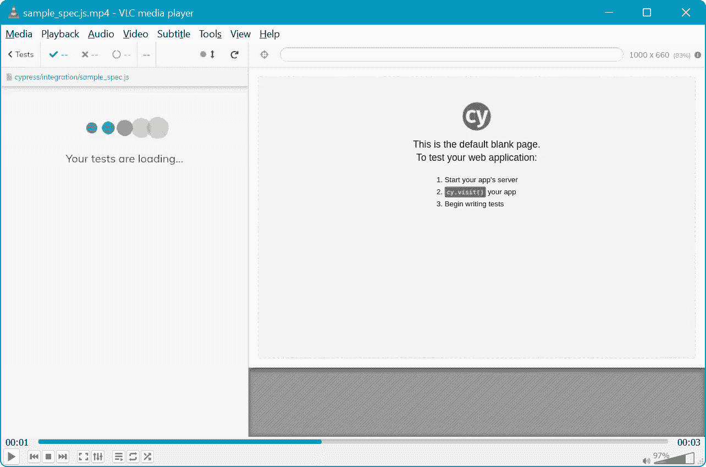
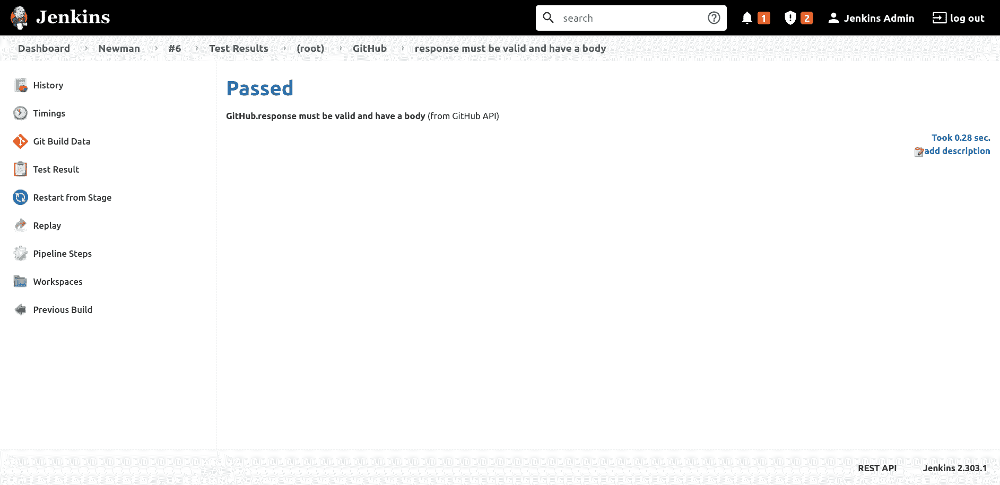

# 在 Jenkins - Octopus 部署中运行端到端测试

> 原文：<https://octopus.com/blog/jenkins-running-endtoend-tests>

端到端(E2E)测试代表了自动化测试的最后阶段。E2E 测试是长期运行的，尤其是与可以在几秒钟内完成数千次检查的单元测试相比。它们通常由外部工具执行，这些外部工具通过公共接口(如网页或 HTTP APIs)与测试中的应用程序进行交互。

在本文中，您将学习如何使用 Cypress 运行 E2E 测试来验证与网页的交互，以及如何使用 Newman(Postman 的命令行测试运行程序)来验证 HTTP APIs。

## 先决条件

要跟进这篇文章，您需要一个 Jenkins 实例。

有关在您选择的环境中安装 Jenkins 的说明，您可以参考我们的指南:

无论是 [Cypress](https://www.cypress.io) 还是 [Newman](https://learning.postman.com/docs/running-collections/using-newman-cli/command-line-integration-with-newman) (邮差命令行测试运行器)都需要你安装 Node.js， [Node.js 网站](https://nodejs.org/en/download/)提供下载，或者提供[安装指导给包管理者](https://nodejs.org/en/download/package-manager/)。

## 如何用 Cypress 运行浏览器测试

Cypress 是一个浏览器自动化工具，它允许你以与最终用户非常相似的方式与网页交互，例如通过点击按钮和链接、填写表格和滚动页面。您还可以验证页面的内容，以确保显示正确的结果。

[Cypress 文档提供了一个第一次测试的例子](https://docs.cypress.io/guides/getting-started/writing-your-first-test)，它已经被保存到[JUnit-Cypress-test GitHub repo](https://github.com/OctopusSamples/junit-cypress-test)中。测试如下所示:

```
describe('My First Test', () => {
  it('Does not do much!', () => {
    expect(true).to.equal(true)
  })
}) 
```

该测试被配置为在`cypress.json`文件中生成一个 JUnit 报告文件:

```
{
  "reporter": "junit",
   "reporterOptions": {
      "mochaFile": "cypress/results/results.xml",
      "toConsole": true
   }
} 
```

Cypress 作为开发依赖项包含在`package.json`文件中:

```
{
  "name": "cypress-test",
  "version": "0.0.1",
  "description": "A simple cypress test",
  "devDependencies": {
    "cypress": "8.6.0"
  }
} 
```

您可以使用下面的管道运行 Cypress 测试:

```
pipeline {
  // This pipeline requires the following plugins:
  // * Git: https://plugins.jenkins.io/git/
  // * Workflow Aggregator: https://plugins.jenkins.io/workflow-aggregator/
  // * JUnit: https://plugins.jenkins.io/junit/
  agent 'any'
  stages {
    stage('Checkout') {
      steps {
        script {
            checkout([$class: 'GitSCM', branches: [[name: '*/master']], userRemoteConfigs: [[url: 'https://github.com/OctopusSamples/junit-cypress-test.git']]])
        }
      }
    }
    stage('Dependencies') {
      steps {
        sh(script: 'npm install')        
      }
    }
    stage('Test') {
      steps {
        sh(script: 'NO_COLOR=1 node_modules/.bin/cypress run || true')          
      }
    }
  }
  post {
    always {
      junit(testResults: 'cypress/results/results.xml', allowEmptyResults : true)
      archiveArtifacts(artifacts: 'cypress/videos/sample_spec.js.mp4', fingerprint: true) 
    }
  }
} 
```

`Dependencies`阶段将 Cypress 下载到项目目录:

```
 stage('Dependencies') {
      steps {
        sh(script: 'npm install')        
      }
    } 
```

`Test`阶段将`NO_COLOR`环境变量设置为`1`,从输出中去除 ANSI 颜色代码，然后运行 Cypress。如果有任何测试失败，Cypress 会返回一个非零的退出代码，但是我们通过追加`|| true`来确保该命令总是返回 true，从而将构建通过或失败的决定推迟到测试处理器。

您可以在 Jenkins 中的[运行单元测试中了解更多关于处理失败测试的信息:](https://octopus.com/blog/jenkins-running-unit-tests)

```
 stage('Test') {
      steps {
        sh(script: 'NO_COLOR=1 node_modules/.bin/cypress run || true')          
      }
    } 
```

`post`阶段处理 JUnit 报告文件，并将生成的测试视频保存为工件:

```
 post {
    always {
      junit(testResults: 'cypress/results/results.xml', allowEmptyResults : true)
      archiveArtifacts(artifacts: 'cypress/videos/sample_spec.js.mp4', fingerprint: true) 
    }
  } 
```

然后，您可以使用公开单元测试的同一个接口深入研究测试结果:

[](#)

视频工件捕获测试输出:

[](#)

## 如何用 Newman 运行 API 测试

Newman 是 Postman 的命令行测试程序。测试脚本从 Postman 导出为 JSON 文件。查询 GitHub API 的示例已保存在[JUnit-Newman-test GitHub Repo](https://github.com/OctopusSamples/junit-newman-test)中:

```
{
  "info": {
    "_postman_id": "f9b1443b-c23d-4738-901d-092cba2fc3d6",
    "name": "GitHub",
    "schema": "https://schema.getpostman.com/json/collection/v2.1.0/collection.json"
  },
  "item": [
    {
      "name": "GitHub API",
      "event": [
        {
          "listen": "test",
          "script": {
            "exec": [
              "pm.test(\"response must be valid and have a body\", ",
              "function () {\n",
              " pm.response.to.be.ok;\n",
              " pm.response.to.be.withBody;\n",
              " pm.response.to.be.json;\n",
              "\n",
              " pm.expect(pm.response.json().quote != \"\").to.be.true;\n",
              "});"
            ],
            "type": "text/javascript"
          }
        }
      ],
      "request": {
        "method": "GET",
        "header": [],
        "url": {
          "raw": "http://api.github.com/repos/OctopusSamples/junit-newman-test/git/trees/main",
          "protocol": "http",
          "host": [
            "api",
            "github",
            "com"
          ],
          "path": [
            "repos",
            "OctopusSamples",
            "junit-newman-test",
            "git",
            "trees",
            "main"
          ]
        }
      },
      "response": []
    }
  ]
} 
```

Newman 作为开发依赖项保存在`package.json`文件中:

```
{
  "devDependencies": {
    "newman": "^5.3.0"
  }
} 
```

您可以使用下面的管道运行 Newman 测试:

```
pipeline {
  // This pipeline requires the following plugins:
  // * Git: https://plugins.jenkins.io/git/
  // * Workflow Aggregator: https://plugins.jenkins.io/workflow-aggregator/
  // * JUnit: https://plugins.jenkins.io/junit/
  agent 'any'
  stages {
    stage('Checkout') {
      steps {
        script {
            checkout([$class: 'GitSCM', branches: [[name: '*/main']], userRemoteConfigs: [[url: 'https://github.com/OctopusSamples/junit-newman-test.git']]])
        }
      }
    }
    stage('Dependencies') {
      steps {
        sh(script: 'npm install')        
      }
    }
    stage('Test') {
      steps {
        sh(script: 'node_modules/.bin/newman run GitHubTree.json --reporters cli,junit --reporter-junit-export results.xml || true')          
      }
    }
  }
  post {
    always {
      junit(testResults: 'results.xml', allowEmptyResults : true)
    }
  }
} 
```

`Dependencies`阶段将纽曼下载到工作目录:

```
 stage('Dependencies') {
      steps {
        sh(script: 'npm install')        
      }
    } 
```

`Test`阶段运行 Newman，使用`--reporters cli,junit`参数启用 JUnit reporter，并使用`--reporter-junit-export results.xml`参数将结果保存为 JUnit 报告文件。

如果任何测试失败，Newman 将返回一个非零的退出代码，因此为了将构建的成功或失败推迟到测试处理器，您需要确保命令总是使用`|| true`返回 true。

您可以在[在 Jenkins 中运行单元测试](https://octopus.com/blog/jenkins-running-unit-tests)中了解更多关于处理失败测试的信息:

```
 stage('Test') {
      steps {
        sh(script: 'node_modules/.bin/newman run GitHubTree.json --reporters cli,junit --reporter-junit-export results.xml || true')          
      }
    } 
```

`post`阶段处理 JUnit 报告文件:

```
 post {
    always {
      junit(testResults: 'results.xml', allowEmptyResults : true)
    }
  } 
```

测试结果将通过 Jenkins web 用户界面提供:

[](#)

## 结论

E2E 测试允许您通过应用程序的公共接口来验证应用程序，作为自动化测试的最后阶段。与单元测试不同，E2E 测试通常由外部工具来编排。例如，Cypress 提供了通过 web 浏览器自动化交互的能力，Newman 提供了用 HTTP APIs 编写脚本和验证交互的能力。

在本文中，您学习了如何:

*   运行基于 Cypress 浏览器的测试
*   运行纽曼 API 测试
*   将结果收集为 JUnit 报告文件
*   处理测试结果

试试我们免费的 Jenkins 管道生成器工具用 Groovy 语法创建一个管道文件。这是您启动管道项目所需的一切。

## 观看我们的詹金斯管道网络研讨会

[https://www.youtube.com/embed/D_7AHTML_xw](https://www.youtube.com/embed/D_7AHTML_xw)

VIDEO

我们定期举办网络研讨会。请参见[网络研讨会第](https://octopus.com/events)页，了解关于即将举办的活动和实时流媒体录制的详细信息。

阅读我们的[持续集成系列](https://octopus.com/blog/tag/CI%20Series)的其余部分。

愉快的部署！