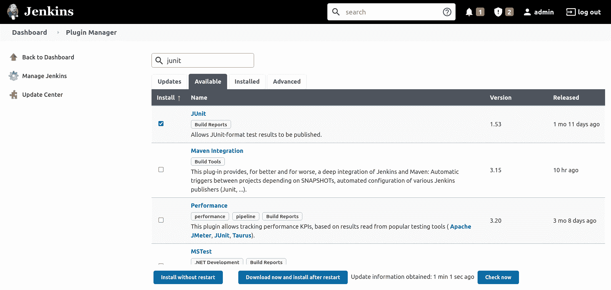
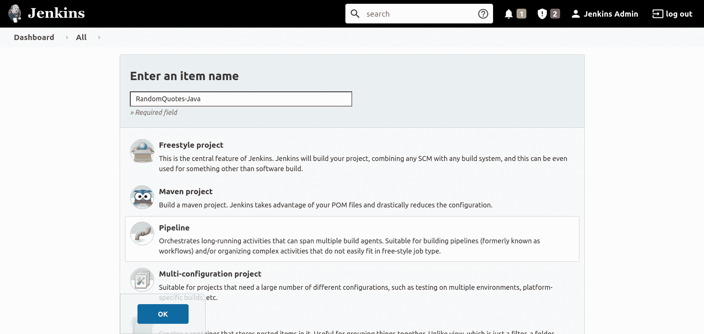
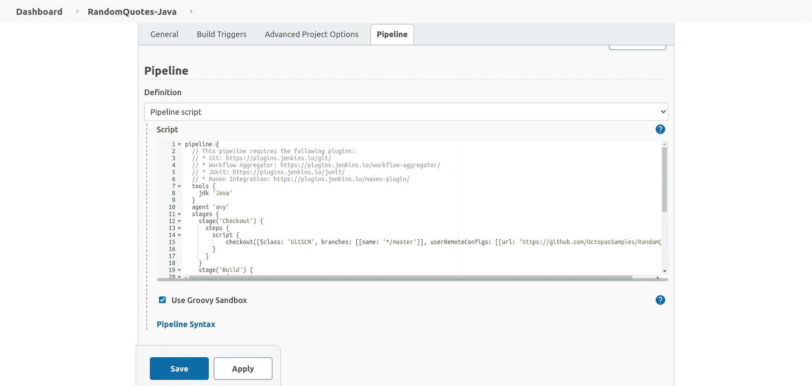
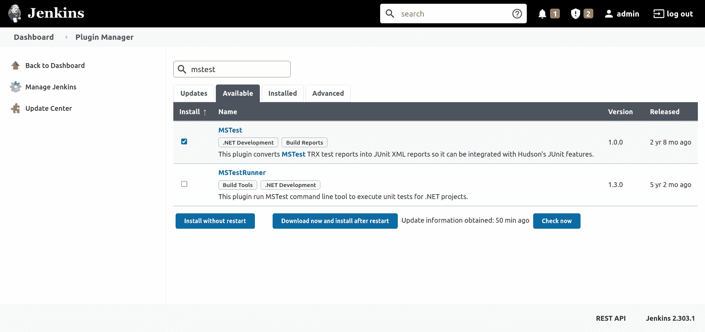
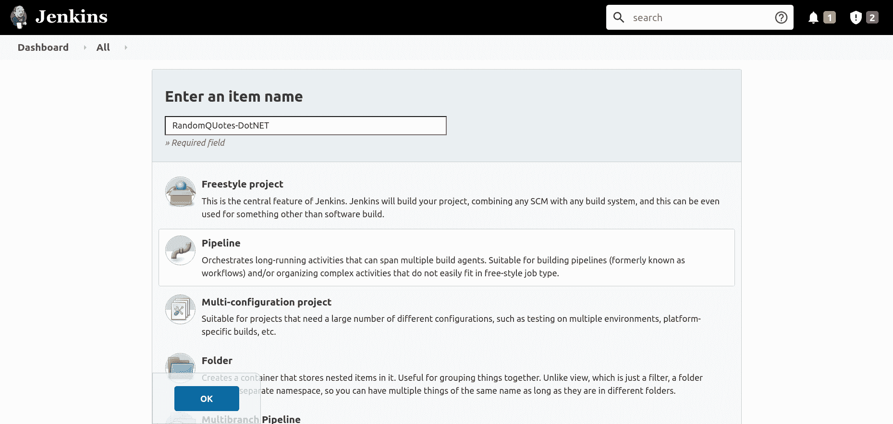
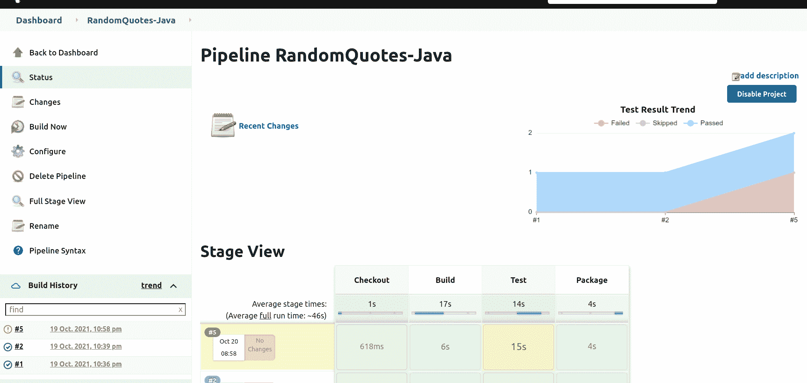
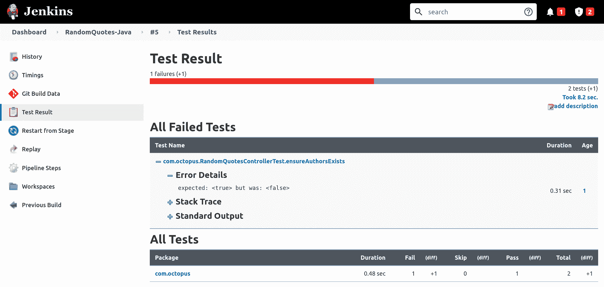
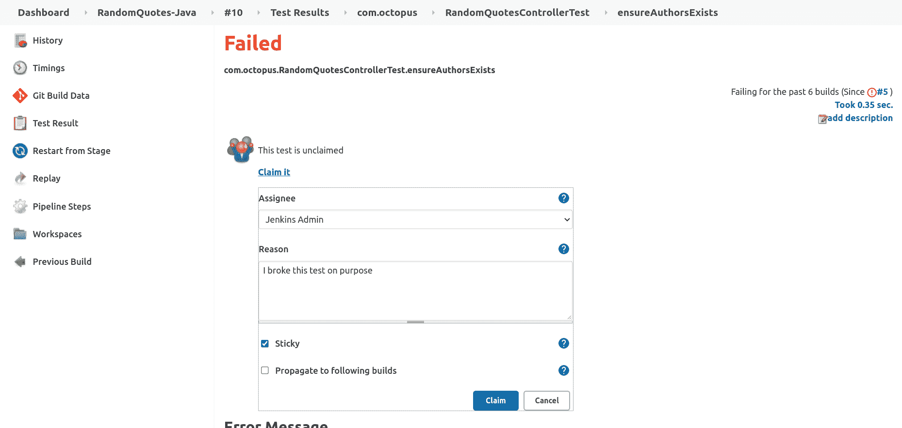
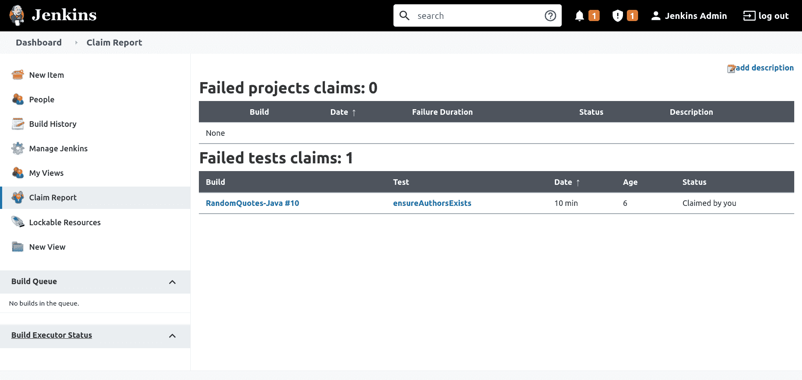

# 在 Jenkins - Octopus 部署中运行单元测试

> 原文：<https://octopus.com/blog/jenkins-running-unit-tests>

在典型的开发工作流中，用单元测试验证代码变更是一个关键的过程。Jenkins 提供了许多插件来收集和处理测试结果，允许开发人员浏览结果，调试失败的测试，忽略一些测试失败，并生成关于测试历史的报告。

在本文中，您将学习如何向 Jenkins 项目添加单元测试，并配置插件来处理结果。

## 先决条件

要跟进这篇文章，您需要一个 Jenkins 实例。[传统詹金斯安装](https://octopus.com/blog/jenkins-install-guide-windows-linux)、[码头工人詹金斯安装](https://octopus.com/blog/jenkins-docker-install-guide)或[赫尔姆詹金斯安装](https://octopus.com/blog/jenkins-helm-install-guide)指南提供了在您选择的环境中安装詹金斯的说明。

您将构建的示例应用程序是用 Java 和 DotNET Core 编写的，因此 Java 开发工具包(JDK)和 DotNET Core SDK 必须安装在执行构建的 Jenkins 控制器或代理上。

你可以从[微软网站](https://dotnet.microsoft.com/download/dotnet/3.1)找到关于安装 DotNET Core SDK 的说明。示例项目是针对 DotNET Core 3.1 编写的。

OpenJDK 项目(及其下游项目)提供了免费的开源发行版，可以用来编译 Java 应用程序。有许多 OpenJDK 发行版可供选择，包括:

我通常使用 Azul Zulu 发行版，尽管任何发行版都可以。

## Java 中的单元测试

Java 有很多单元测试框架，但是最流行的是 [JUnit](https://junit.org) 。

您将使用 [Random Quotes](https://github.com/OctopusSamples/RandomQuotes-Java) 示例应用程序来演示在 Jenkins 项目中运行的 JUnit 测试。

### 安装 Jenkins 插件

您必须安装 [JUnit](https://plugins.jenkins.io/junit/) 插件来处理 JUnit 测试的结果。

要安装插件:

1.  点击**管理詹金斯**，然后**管理插件**，然后**可用**。
2.  在搜索框中输入`junit`。
3.  选择 **JUnit** 选项，点击**不重启安装**:

[](#)

### 在詹金斯创建管道项目

创建新的管道项目，点击**新建项目**，输入项目名称`RandomQuotes-Java`，选择**管道**选项，点击**确定**按钮:

[](#)

将以下管道脚本粘贴到**管道**部分，点击**保存**按钮:

```
pipeline {
  // This pipeline requires the following plugins:
  // * Git: https://plugins.jenkins.io/git/
  // * Workflow Aggregator: https://plugins.jenkins.io/workflow-aggregator/
  // * JUnit: https://plugins.jenkins.io/junit/
  agent 'any'
  stages {
    stage('Checkout') {
      steps {
        script {
            checkout([$class: 'GitSCM', branches: [[name: '*/master']], userRemoteConfigs: [[url: 'https://github.com/OctopusSamples/RandomQuotes-Java.git']]])
        }
      }
    }
    stage('Test') {
      steps {
        sh(script: './mvnw --batch-mode -Dmaven.test.failure.ignore=true test')

      }
    }
    stage('Package') {
      steps {
        sh(script: './mvnw --batch-mode package -DskipTests')
      }
    }
  }
  post {
    always {
      junit(testResults: 'target/surefire-reports/*.xml', allowEmptyResults : true)
    }
  }
} 
```

[](#)

`Test`阶段包含一个运行 maven `test`目标的步骤，通过`--batch-mode`以避免显示每个正在下载的依赖项的不必要的日志记录，通过`-Dmaven.test.failure.ignore=true`以允许该步骤成功通过，即使有失败的测试。

```
sh(script: './mvnw --batch-mode -Dmaven.test.failure.ignore=true test') 
```

`post`部分包含`always`条件块，它用 JUnit 插件处理测试结果:

```
junit(testResults: 'target/surefire-reports/*.xml', allowEmptyResults : true) 
```

`Package`阶段打包应用程序，同时跳过任何带有`-DskipTests`参数的测试，因为测试是在前一阶段处理的:

```
sh(script: './mvnw --batch-mode -Dmaven.test.skip=true clean package', returnStdout: true) 
```

**测试结果趋势**图跟踪项目历史中通过、失败和跳过的测试:

[T31](#)

## DotNET 核心中的单元测试

DotNET Core 有许多流行的单元测试框架，包括 MSTest、NUnit 和 xUnit。您将使用 [RandomQuotes](https://github.com/OctopusSamples/RandomQuotes) 示例应用程序来演示从 Jenkins 管道运行 NUnit 测试。

### 安装 Jenkins 插件

使用 [MSTest](https://plugins.jenkins.io/mstest/) 插件处理 DotNET 核心测试结果。

安装 [MSTest](https://plugins.jenkins.io/mstest/) 插件，处理 NUnit 测试的结果。要安装插件:

1.  单击**管理 Jenkins** ，然后单击**管理插件**，然后单击**可用**。
2.  在搜索框中输入`mstest`。
3.  选择 **MSTest** 选项，点击**不重启安装**:

[](#)

### 在詹金斯创建管道项目

要新建管道项目，点击**新建项目**，输入`RandomQuotes-DotNET`作为项目名称，选择**管道**选项，点击**确定**按钮:

[](#)

将以下管道脚本粘贴到**管道**部分，点击**保存**按钮:

```
pipeline {
  // This pipeline requires the following plugins:
  // * Git: https://plugins.jenkins.io/git/
  // * Workflow Aggregator: https://plugins.jenkins.io/workflow-aggregator/
  // * MSTest: https://plugins.jenkins.io/mstest/
  agent 'any'
  stages {
    stage('Environment') {
      steps {
          echo "PATH = ${PATH}"
      }
    }
    stage('Checkout') {
      steps {

        script {
            checkout([$class: 'GitSCM', branches: [[name: '*/master']], userRemoteConfigs: [[url: 'https://github.com/OctopusSamples/RandomQuotes.git']]])
        }
      }
    }
    stage('Dependencies') {
      steps {
        sh(script: 'dotnet restore')
      }
    }
    stage('Build') {
      steps {
        sh(script: 'dotnet build --configuration Release', returnStdout: true)
      }
    }
    stage('Test') {
      steps {
        sh(script: 'dotnet test -l:trx || true')        
      }
    }
  }
  post {
    always {
      mstest(testResultsFile: '**/*.trx', failOnError: false, keepLongStdio: true)
    }
  }
} 
```

`Test`阶段调用`dotnet test`运行单元测试，通过参数`-l:trx`将测试结果写入 Visual Studio Test Results (TRX)文件。

如果任何测试失败，该命令将返回非零退出代码。为了确保在测试失败的情况下继续处理管道，如果`dotnet test`表示失败，则返回`true`:

```
sh(script: 'dotnet test -l:trx || true') 
```

然后使用`post`部分的 MSTest 插件处理测试结果:

```
mstest(testResultsFile: '**/*.trx', failOnError: false, keepLongStdio: true) 
```

## 如何处理失败的测试

到目前为止，您只运行了具有成功测试的构建。要模拟失败的测试，修改`Checkout`阶段，指向 Java Random Quotes 应用程序的`failing-test`分支:

```
pipeline {
  // This pipeline requires the following plugins:
  // * Git: https://plugins.jenkins.io/git/
  // * Workflow Aggregator: https://plugins.jenkins.io/workflow-aggregator/
  // * JUnit: https://plugins.jenkins.io/junit/
  agent 'any'
  stages {
    stage('Checkout') {
      steps {
        script {
            checkout([$class: 'GitSCM', branches: [[name: '*/failing-test']], userRemoteConfigs: [[url: 'https://github.com/OctopusSamples/RandomQuotes-Java.git']]])
        }
      }
    }
    stage('Test') {
      steps {
        sh(script: './mvnw --batch-mode -Dmaven.test.failure.ignore=true test')
      }
    }
    stage('Package') {
      steps {
        sh(script: './mvnw --batch-mode package -DskipTests')
      }
    }
  }
  post {
    always {
      junit(testResults: 'target/surefire-reports/*.xml', allowEmptyResults : true)
    }
  }
} 
```

这个分支有总是失败的测试。来自该分支的构建被标记为不稳定，并且**测试结果趋势**图显示新的失败测试:

[](#)

要查看测试的详细信息，请单击构建任务并单击**测试结果**链接。在这里，您可以深入每个测试，查看测试结果，并查看日志:

[](#)

### 声称测试失败

上面的示例管道在一定程度上允许在测试失败时构建成功。这确保了即使测试失败，测试结果也能被 JUnit 或 MSTest 插件处理。然而，预计测试失败仍然由工程团队解决。 [Claim](https://plugins.jenkins.io/claim/) 插件为 Jenkins 用户提供了为失败的测试负责的能力。

下面的管道允许声明失败的测试:

```
pipeline {
  // This pipeline requires the following plugins:
  // * Git: https://plugins.jenkins.io/git/
  // * Workflow Aggregator: https://plugins.jenkins.io/workflow-aggregator/
  // * JUnit: https://plugins.jenkins.io/junit/
  // * Claim: https://plugins.jenkins.io/claim/
  agent 'any'
  options{
    // This option allows broken builds to be claimed
    allowBrokenBuildClaiming()
  }
  stages {
    stage('Checkout') {
      steps {
        script {
            checkout([$class: 'GitSCM', branches: [[name: '*/failing-test']], userRemoteConfigs: [[url: 'https://github.com/OctopusSamples/RandomQuotes-Java.git']]])
        }
      }
    }
    stage('Test') {
      steps {
        sh(script: './mvnw --batch-mode -Dmaven.test.failure.ignore=true test')
      }
    }
    stage('Package') {
      steps {
        sh(script: './mvnw --batch-mode package -DskipTests')
      }
    }
  }
  post {
    always {
      // The testDataPublishers argument allows failed tests to be claimed
      junit(testDataPublishers: [[$class: 'ClaimTestDataPublisher']], testResults: 'target/surefire-reports/*.xml', allowEmptyResults : true)
    }
  }
} 
```

失败的测试可以通过**测试结果**屏幕来声明:

[](#)

打开**索赔报告**链接，可以找到所有索赔的全球报告:

[](#)

### 当测试失败时，构建失败

您可能要求构建失败，而不是在测试失败时被标记为不稳定。您通常有两种选择来实现这一点:

*   测试命令失败
*   测试处理失败

#### 测试命令失败

第一个选项允许运行测试的命令失败。如果测试失败，大多数测试运行者会返回一个非零的退出代码，这反过来会导致构建失败。

您可以使用下面的 Maven 命令执行测试，并在失败时返回一个非零的退出代码。没有`-Dmaven.test.failure.ignore=true`参数会将命令恢复为默认行为:

```
sh(script: './mvnw --batch-mode test') 
```

如果任何测试失败，下面的 DotNET Core 命令也会返回非零退出代码。`|| true`命令链的缺失确保了返回`dotnet`退出代码:

```
sh(script: 'dotnet test -l:trx') 
```

#### 测试处理失败

第二个选项允许测试处理器确定构建是否失败。

MSTest 插件提供了`failOnError`参数，用于在任何测试失败时使该步骤失败:

```
mstest(testResultsFile: '**/*.trx', failOnError: true, keepLongStdio: true) 
```

不幸的是，[JUnit 插件不具备基于测试结果](https://issues.jenkins.io/browse/JENKINS-2734?page=com.atlassian.jira.plugin.system.issuetabpanels%3Aall-tabpanel)使构建失败的能力。

另一种方法是使用 [xUnit 插件](https://plugins.jenkins.io/xunit/)，它支持跳过和失败测试的阈值。

下面的示例管道用 xUnit 替换了 JUnit 插件:

```
pipeline {
  // This pipeline requires the following plugins:
  // * Git: https://plugins.jenkins.io/git/
  // * Workflow Aggregator: https://plugins.jenkins.io/workflow-aggregator/
  // * xUnit: https://plugins.jenkins.io/xunit/
  // * Claim: https://plugins.jenkins.io/claim/
  agent 'any'
  options {
    allowBrokenBuildClaiming()
  }
  stages {
    stage('Checkout') {
      steps {
        script {
            checkout([$class: 'GitSCM', branches: [[name: '*/failing-test']], userRemoteConfigs: [[url: 'https://github.com/OctopusSamples/RandomQuotes-Java.git']]])
        }
      }
    }
    stage('Test') {
      steps {
        sh(script: './mvnw --batch-mode -Dmaven.test.failure.ignore=true test')
      }
    }
    stage('Package') {
      steps {
        sh(script: './mvnw --batch-mode package -DskipTests')
      }
    }
  }
  post {
    always {
      xunit (testDataPublishers: [[$class: 'ClaimTestDataPublisher']], thresholds: [ skipped(failureThreshold: '0'), failed(failureThreshold: '0')], tools: [[$class: 'JUnitType', pattern: '**/surefire-reports/*.xml']])
    }
  }
} 
```

下面的示例管道用 xUnit 替换了 MSTest 插件:

```
pipeline {
  // This pipeline requires the following plugins:
  // * Git: https://plugins.jenkins.io/git/
  // * Workflow Aggregator: https://plugins.jenkins.io/workflow-aggregator/
  // * xUnit: https://plugins.jenkins.io/xunit/
  // * Claim: https://plugins.jenkins.io/claim/
  agent 'any'
  options {
    allowBrokenBuildClaiming()
  }
  stages {
    stage('Environment') {
      steps {
          echo "PATH = ${PATH}"
      }
    }
    stage('Checkout') {
      steps {

        script {
            checkout([$class: 'GitSCM', branches: [[name: '*/failing-tests']], userRemoteConfigs: [[url: 'https://github.com/OctopusSamples/RandomQuotes.git']]])
        }
      }
    }
    stage('Dependencies') {
      steps {
        sh(script: 'dotnet restore')
      }
    }
    stage('Build') {
      steps {
        sh(script: 'dotnet build --configuration Release', returnStdout: true)
      }
    }
    stage('Test') {
      steps {
        sh(script: 'dotnet test -l:trx || true')
      }
    }
  }
  post {
    always {
      xunit (testDataPublishers: [[$class: 'ClaimTestDataPublisher']], thresholds: [ skipped(failureThreshold: '0'), failed(failureThreshold: '0')], tools: [[$class: 'MSTestJunitHudsonTestType', pattern: '**/*.trx']])
    }
  }
} 
```

## 结论

单元测试在大多数大型代码库中都很常见。通过在 Jenkins 中执行单元测试，开发团队拥有了一个报告当前和历史测试结果的真实的中心来源。

在这篇文章中，你学到了:

*   如何在 Java 和 DotNET 核心代码库中运行测试
*   如何使用 JUnit、MSTest 和 xUnit 插件收集和处理测试结果
*   如何允许 Jenkins 用户声称测试失败，以表明他们将对这些测试负责
*   当测试失败时，如何使构建失败

[试试我们免费的 Jenkins 管道生成器工具](https://oc.to/JenkinsPipelineGenerator)，用 Groovy 语法创建一个管道文件。这是您启动管道项目所需的一切。

## 观看我们的詹金斯管道网络研讨会

[https://www.youtube.com/embed/D_7AHTML_xw](https://www.youtube.com/embed/D_7AHTML_xw)

VIDEO

我们定期举办网络研讨会。请参见[网络研讨会第](https://octopus.com/events)页，了解有关即将举办的活动和直播录像的详细信息。

阅读我们的[持续集成系列](https://octopus.com/blog/tag/CI%20Series)的其余部分。

愉快的部署！