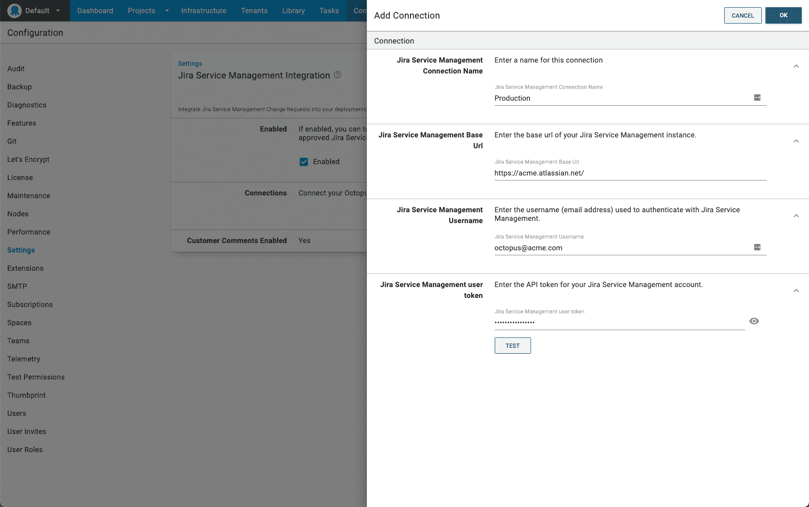
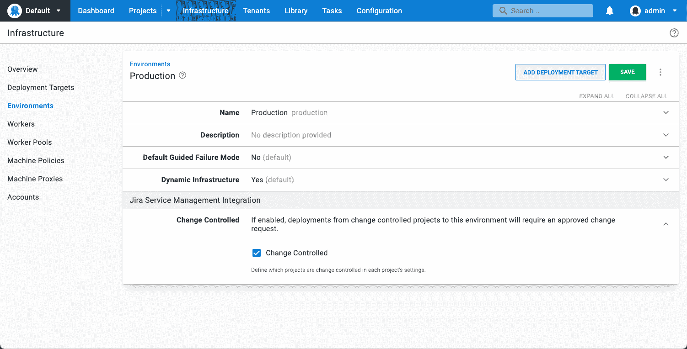
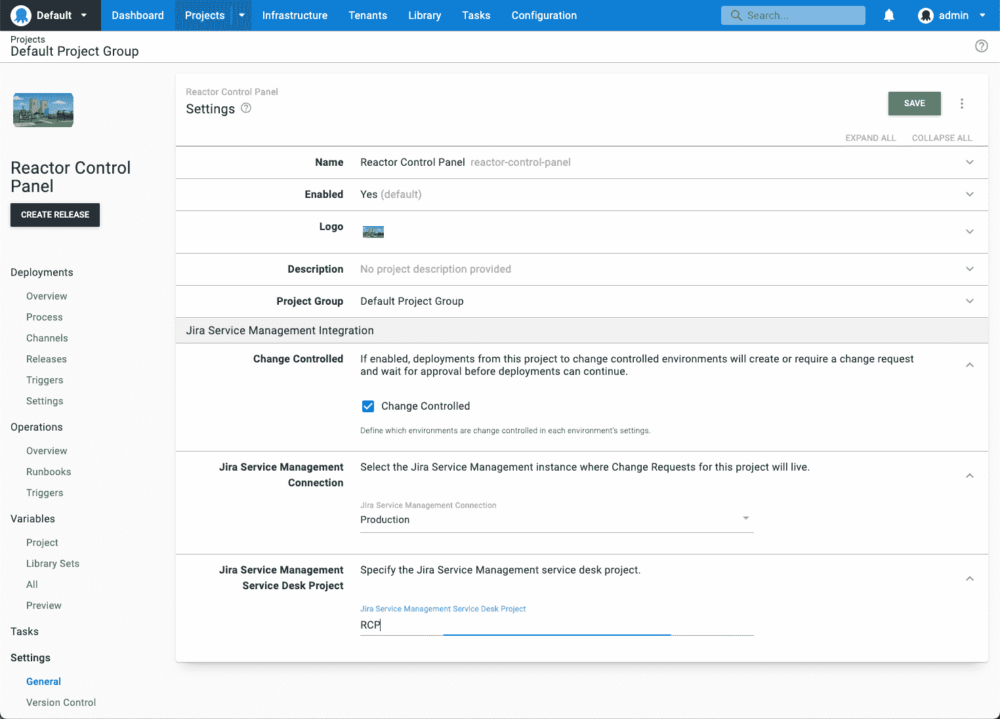
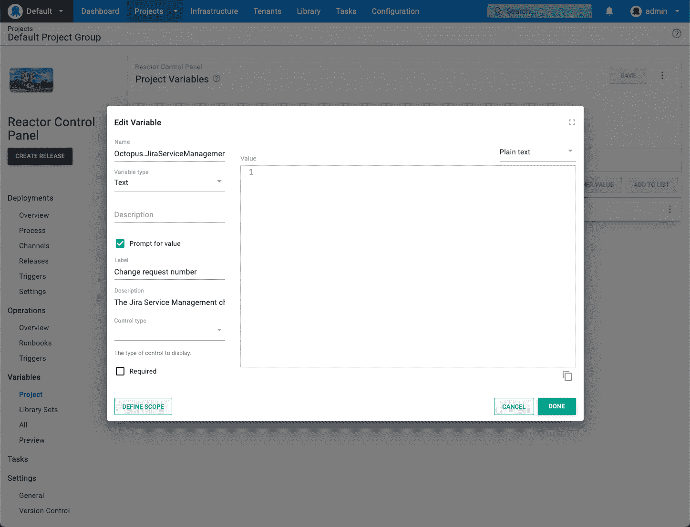
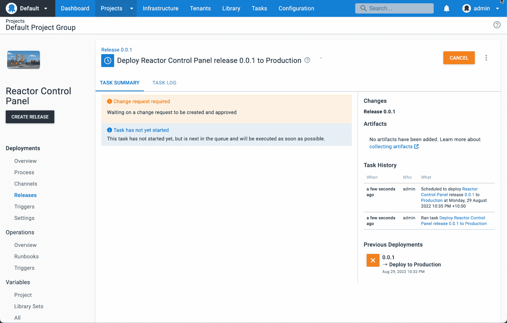
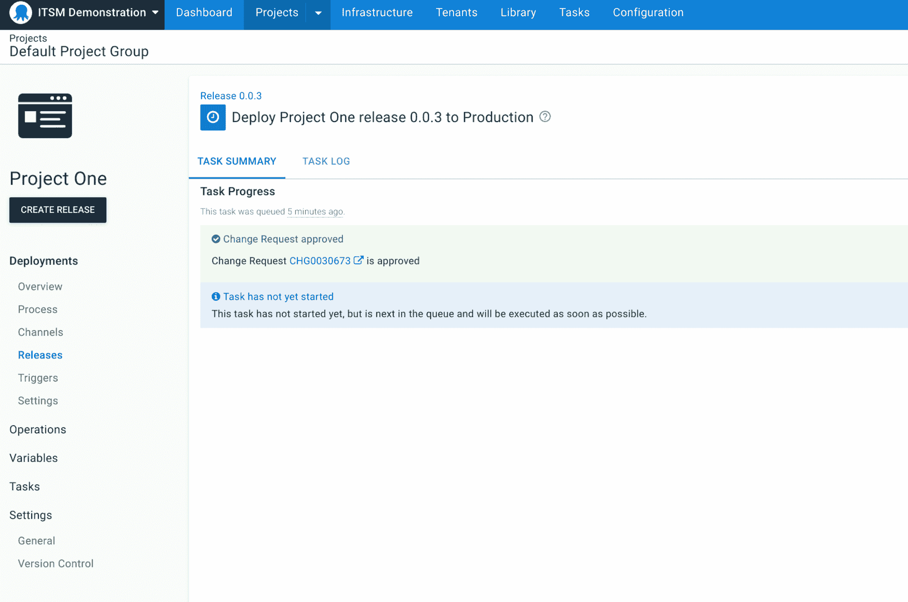
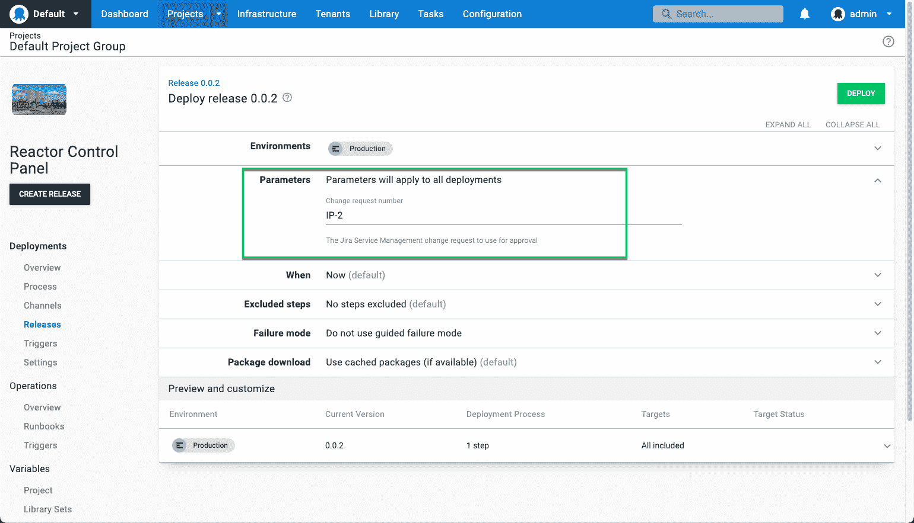

# Octopus 部署的吉拉服务管理集成:早期访问预览- Octopus 部署

> 原文：<https://octopus.com/blog/jira-service-management-eap>

我们的吉拉服务管理集成作为 Octopus 2022 Q3 版本的一部分，以早期访问预览版(EAP)的形式提供。

对于使用[吉拉服务管理进行变更管理](https://www.atlassian.com/software/jira/service-management/product-guide/getting-started/change-management)的团队来说，这种集成将 Octopus 部署与吉拉服务管理中的变更请求联系起来。

您可以为特定的项目和环境启用这种集成，它支持变更请求的自动创建，或者将部署链接到现有的变更请求。

借助吉拉服务管理集成，每个受控部署都有一个更改请求，以便您的部署符合公司政策和法规要求。通过完整的部署审计日志，变更经理还可以确保所有部署都在适当的控制级别下执行。

我们的[吉拉服务管理集成](https://octopus.com/docs/approvals)让您:

*   轻松配置您的工作流程，将 Octopus 与一个或多个吉拉服务管理连接相集成
*   通过提示变量将部署链接到现有的变更请求，以便您可以手动将部署与变更请求相关联
*   通过更改请求标题上的字符串匹配链接手动创建的更改请求
*   在部署时自动创建变更请求
*   查看和导出受控部署的审核日志，以便轻松实现合规性和部署后协调

在本帖中，我将向您介绍我们的吉拉服务管理集成，并向您展示如何开始。

我们的吉拉服务管理集成是早期访问预览。由于我们仍在开发这一功能，我们非常感谢您的反馈。我们还邀请您加入我们的[社区 Slack](https://octopus.com/slack) 的讨论。

## 通过吉拉服务管理和八达通实现更好的变革管理

对于开发运维团队来说，大规模管理部署管道既复杂又耗时，而且在您加入变更管理后会变得更加困难。我们希望为使用吉拉服务管理的用户提供一个更好、更自动化的审批流程，而不是人工干预。

将吉拉服务管理与 Octopus 集成有助于使变更管理更容易，减少摩擦并简化开发团队的工作。

## 吉拉服务管理集成入门

在[注册 EAP](https://oc.to/jsm-eap) 之后，您需要配置一些设置来开始使用吉拉服务管理集成。

导航到**设置**，然后导航到**吉拉服务管理集成**。使用复选框启用集成，并添加一个连接。

您必须提供来自吉拉服务管理的基本 URL、用户名和令牌。有关创建 API 令牌的详细信息，请参见 [Atlassian 文档。](https://support.atlassian.com/atlassian-account/docs/manage-api-tokens-for-your-atlassian-account/)

## 配置您的环境和项目

配置吉拉服务管理集成后，您需要配置您的环境和项目。两者都需要启用吉拉服务管理，以便由吉拉服务管理来管理部署。

### 配置您的环境

要设置您的环境，请转到**基础架构**并选择您想要用于吉拉服务管理的环境。在**吉拉服务管理集成**下拉列表中，选择**变更控制**复选框。

对所有适用的环境重复此操作。

### 配置您的项目

要设置您的项目，请转到**设置-常规**，在副标题**吉拉服务管理集成**下，勾选**变更控制**旁边的复选框。然后选择要使用的连接。您可以使用之前设置的连接，或者如果您有多个不同业务单位的连接，您可以为项目选择正确的连接。

吉拉服务管理项目还需要输入**键**。

## 设置链接到现有变更请求的提示变量

如果要重用更改请求或使用现有的更改请求，则需要为吉拉服务管理更改请求设置提示变量。

如果您不打算重用变更请求，就没有必要设置它。

在您的项目中，在**变量**部分，创建一个名为`Octopus.JiraServiceManagement.ChangeRequest.Number`的提示变量。您可以选择**打开编辑器**来更改标签和描述，这样更容易使用。

## 在部署中创建新的变更请求

要创建新的更改请求，必须首先为吉拉服务管理更改控制配置您的项目。然后，将该项目部署到一个同样被配置为受变更控制的环境中。

如果您为变更请求配置了提示变量，将其留空将导致创建新的变更请求。

单击**部署**后，将出现**任务摘要**屏幕，并显示消息**变更请求等待批准**。将为创建的更改请求显示一个更改请求编号，并带有一个指向吉拉服务管理的链接。

当变更请求进展到执行的**状态时，Octopus 认为变更请求已被批准。**

在变更请求被批准之前，您的部署不会在 Octopus 中运行。在 Octopus 中触发自动批准之前，批准人需要将更改请求移至实施阶段。

变更请求只能处于实施阶段，以便在 Octopus 中运行部署。如果变更请求处于任何其他阶段，任务将不会开始。

要为另一个部署重用变更请求，它需要保持在实现中。

变更请求还必须在部署期间保持实施状态，因为 Octopus 会在整个任务日志中检查变更请求的状态。

## 使用现有的变更请求进行部署

如果您有一个现有的更改请求，您可以将部署链接到它，而不是创建一个新的。

假设您为变更请求编号创建了[提示变量，那么在创建部署时，只需复制变更请求编号并将其粘贴到**参数**部分。](#prompted-variable)

如果更改请求处于实施阶段，Octopus 会自动识别其已获批准。

## 结论

作为 Octopus 2022 Q3 版本的一部分，吉拉服务管理集成作为早期访问预览版(EAP)提供。它有助于自动化您的变更管理流程，从而更容易实现符合您组织的变更管理策略的自动化部署。

我们期待引入新功能，继续支持您的变更管理流程。

我们希望您尝试将这种方式与您的工作流程相结合，并告诉我们如何改进。

[联系我们以访问吉拉服务管理 EAP](https://octopus.com/company/contact)

愉快的部署！