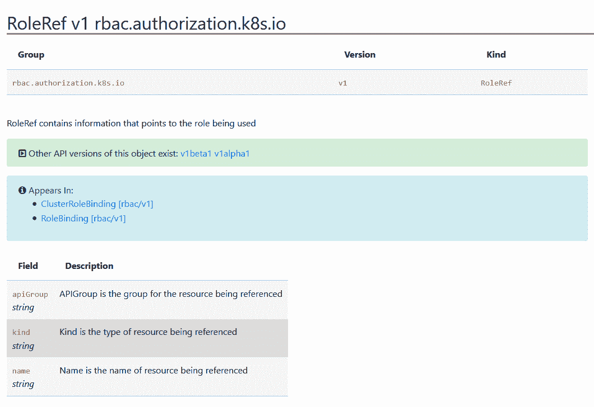

# 混合 Kubernetes 角色、角色绑定、集群角色和集群绑定- Octopus 部署

> 原文：<https://octopus.com/blog/k8s-rbac-roles-and-bindings>

[](#)

在某种程度上，随着您的 Kubernetes 集群变得越来越复杂，基于角色的安全性问题将变得非常重要。通常，这意味着将集群分成多个命名空间，并将对命名空间资源的访问限制在特定的帐户。

为了支持这一点，Kubernetes 包含了许多资源，包括角色、集群角色、角色绑定和集群角色绑定。在高级别上，角色和角色绑定位于特定命名空间内，并授予对特定命名空间的访问权限，而集群角色和集群角色绑定不属于命名空间，并授予对整个集群的访问权限。

然而，混合这两种类型的资源是可能的。例如，当角色绑定将帐户链接到群集角色时会发生什么？本文着眼于其中的一些场景，以便更好地了解 Kubernetes 是如何实现基于角色的安全性的。

免费试用 Octopus，自动部署 Kubernetes。

## 准备集群

首先，我们将创建一些名称空间，并通过 Kubernetes 基于角色的访问控制(RBAC)资源授予访问权限:

```
$ kubectl create namespace test
$ kubectl create namespace test2
$ kubectl create namespace test3
$ kubectl create namespace test4 
```

然后，我们将在`test`名称空间中创建一个服务帐户:

```
apiVersion: v1
kind: ServiceAccount
metadata:
  name: myaccount
  namespace: test 
```

## 场景 1:角色和角色绑定

我们将从一个简单的示例开始，该示例创建一个角色和一个角色绑定来授予服务帐户对`test`名称空间的访问权限:

```
kind: Role
apiVersion: rbac.authorization.k8s.io/v1
metadata:
  namespace: test
  name: testadmin
rules:
- apiGroups: ["*"]
  resources: ["*"]
  verbs: ["*"] 
```

```
kind: RoleBinding
apiVersion: rbac.authorization.k8s.io/v1
metadata:
  name: testadminbinding
  namespace: test
subjects:
- kind: ServiceAccount
  name: myaccount
  apiGroup: ""
roleRef:
  kind: Role
  name: testadmin
  apiGroup: "" 
```

这个例子很好理解。我们所有的资源(服务帐户、角色和角色绑定)都在`test`名称空间中。角色授予对所有资源的访问权限，角色绑定将服务帐户和角色链接在一起。如您所料，服务帐户针对`test`名称空间中的资源发出的请求工作如下:

```
$ kubectl get roles -n test
NAME        CREATED AT
testadmin   2020-08-24T23:24:59Z 
```

## 场景 2:另一个名称空间中的角色和角色绑定

现在让我们在名称空间`test2`中创建新的角色和角色绑定。注意这里的角色绑定链接了来自`test2`的角色和来自`test`的服务帐户:

```
kind: Role
apiVersion: rbac.authorization.k8s.io/v1
metadata:
  namespace: test2
  name: testadmin
rules:
- apiGroups: ["*"]
  resources: ["*"]
  verbs: ["*"] 
```

```
kind: RoleBinding
apiVersion: rbac.authorization.k8s.io/v1
metadata:
  name: testadminbinding
  namespace: test2
subjects:
- kind: ServiceAccount
  name: myaccount
  namespace: test
  apiGroup: ""
roleRef:
  kind: Role
  name: testadmin
  apiGroup: "" 
```

这是可行的，授予服务帐户对创建服务帐户的命名空间之外的资源的访问权限:

```
$ kubectl get roles -n test2
NAME        CREATED AT
testadmin   2020-08-24T23:35:16Z 
```

注意，`roleRef`属性没有`namespace`字段。这是`RoleRef`的 [API 文档](https://kubernetes.io/docs/reference/generated/kubernetes-api/v1.18/#roleref-v1-rbac-authorization-k8s-io):

[](#)

这里的含义是，角色绑定只能引用同一名称空间中的角色。

## 场景 3:集群角色和角色绑定

如前所述，集群角色不属于一个名称空间。这意味着群集角色不会将权限范围扩大到单个命名空间。

但是，当群集角色通过角色绑定链接到服务帐户时，群集角色权限仅适用于已创建角色绑定的命名空间。

这里，我们在名称空间`test3`中创建一个角色绑定，将我们的服务帐户链接到集群角色`clusteradmin`:

```
kind: RoleBinding
apiVersion: rbac.authorization.k8s.io/v1
metadata:
  name: testadminbinding
  namespace: test3
subjects:
- kind: ServiceAccount
  name: myaccount
  namespace: test
  apiGroup: ""
roleRef:
  kind: ClusterRole
  name: cluster-admin
  apiGroup: "" 
```

我们的服务帐户现在可以访问`test3`名称空间中的资源:

```
$ kubectl get rolebindings -n test3
NAME               ROLE                        AGE
testadminbinding   ClusterRole/cluster-admin   21m 
```

但是它不能访问其他名称空间:

```
$ kubectl get roles -n test4
Error from server (Forbidden): roles.rbac.authorization.k8s.io is forbidden: User "system:serviceaccount:test:myaccount" cannot list resource "roles" in API group "rbac.authorization.k8s.io" in the namespace "test4" 
```

## 场景 4: ClusterRole 和 ClusterRoleBinding

在我们的最后一个场景中，我们将创建一个集群角色绑定来将集群角色链接到我们的服务帐户:

```
apiVersion: rbac.authorization.k8s.io/v1
kind: ClusterRoleBinding
metadata:
  name: testadminclusterbinding
subjects:
- kind: ServiceAccount
  name: myaccount
  apiGroup: ""
  namespace: test
roleRef:
  kind: ClusterRole
  name: cluster-admin
  apiGroup: "" 
```

再次注意`roleRef`上缺少一个`namespace`字段。这意味着群集角色绑定不能标识要链接的角色，因为角色属于名称空间，并且群集角色绑定(以及它们引用的群集角色)没有名称空间。

尽管集群角色和集群角色绑定都没有定义任何名称空间，但是我们的服务帐户现在可以访问所有内容:

```
$ kubectl get namespace test4
NAME    STATUS   AGE
test4   Active   26m 
```

## 摘要

从这些示例中，我们可以观察到 RBAC 资源的一些行为和限制:

*   角色和角色绑定必须存在于同一命名空间中。
*   角色绑定可以存在于服务帐户的单独命名空间中。
*   角色绑定可以链接集群角色，但它们只授予对角色绑定的命名空间的访问权限。
*   群集角色绑定将帐户链接到群集角色，并授予对所有资源的访问权限。
*   群集角色绑定不能引用角色。

这里最有趣的含义可能是，当角色绑定引用时，集群角色可以定义在单个名称空间中表示的公共权限。这消除了在许多名称空间中拥有重复角色的需要。

愉快的部署！