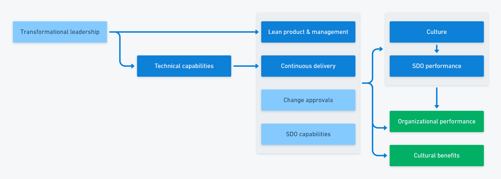

# 现代工作文化的关键假设——八达通部署

> 原文：<https://octopus.com/blog/key-assumption-work-culture>

DevOps 将组织文化的话题牢牢地带到了桌面上。虽然文化一直是敏捷和精益的元素，但对 DevOps 的研究表明，它与更多的技术能力一样重要。

DevOps 结构方程模型有几个与人和文化相关的元素，因此很明显，人的问题是 DevOps 图景的重要部分。模型中的 5 种文化能力是:

*   学习氛围
*   韦斯特伦组织文化
*   心理安全
*   工作满意度
*   身份

文化能力驱动软件交付和运营绩效，这预示着成功的业务成果。

与此同时，在过去几年中，所有行业都出现了几个人力资源热门话题:

*   为规则而工作(安静地退出)
*   大辞职/大改组
*   4 天工作周
*   混合工作

正如艾米丽·弗里曼(《傻瓜的开发计划》的作者)所说:

> 科技面临的最大挑战不是技术，而是人。"

那么，在 DevOps 的背景下理解文化，应该从哪里开始呢？

## 基本假设

1960 年，道格拉斯·麦格雷戈出版了一本名为《企业人性的一面》的书。在书中，他描述了关于人类行为的基本假设如何导致不同的管理风格。

你要么相信:

*   理论 X:人不想工作，需要奖惩激励
*   理论 Y:人们有做好工作的内在动机

工作场所中的许多决策都涉及权衡，但这些基本假设是相互排斥的。

如果你相信 X 理论，你:

*   集中决策
*   跟踪个人绩效
*   用奖励和惩罚来激励员工

使用 Y 理论，您可以:

*   专注于设定明确的目标
*   让人们引导他们自己的努力

当你遵循 Y 理论时，员工成为组织最有价值的资产。

当你使用外部奖励时，你经常会获得短期收益。这种策略最终失败了，因为它降低了内在动力。阿尔菲·科恩查阅了数百份研究报告，得出结论认为，激励会导致暂时的服从，但会对动机造成持久的伤害。

丹·平克在他著名的关于动机的书《驱动力》中对道格拉斯·麦格雷戈和阿尔菲·科恩的工作进行了扩展，该书描述了人们是如何需要环境、自主和目标来达到高绩效水平的。

麦格雷戈认为 X 理论和 Y 理论是经理在评估工作场所后会选择的两种理论。你会回顾工作和人，并决定你是否需要一个独裁的风格或一个更不干涉的方法。从那以后，我们通过对系统失败的研究了解到，高度信任和低责备的文化比官僚或病态文化更安全。

Y 理论是精益、敏捷和 DevOps 的基础，也是生殖文化的潜在假设。

## 任务指挥部

尽管军事组织传统上被视为 X 理论文化，现代军事单位使用*任务指挥部*运作。任务指挥模式通过提供明确的目标来分散决策。地面部队可以随着事件的发展做出动态反应，而不是等待命令。这是 Y 理论文化的应用。

这个项目的民间版本叫做[工作场所授权](https://en.wikipedia.org/wiki/Empowerment#In_workplace_management)，它要求:

*   你与每个人分享信息
*   你通过界限创造自治
*   你用自我导向的团队取代了等级制度

工作场所授权结合了集中的意图和分散的执行。在软件交付中，这通常包括由跨职能、自组织团队实现的共同愿景。

## 文化预测安全

当你觉得说出来很安全，没有人会受到责备时，侥幸逃脱和小错误会促进学习。无论是制造业、核电厂、航空业还是软件交付业，每一次事故都会带来积极的行动，使工作场所更加安全。

如果你对报告侥幸脱险感到不安全，潜在的风险就会累积，直到灾难发生。

你不一定要在安全至关重要的行业才能从这种关系中受益。预测安全性的相同文化特征也与沟通、协作、创新和解决问题有关。文化影响着信息的流动，这对所有这些活动都是至关重要的。

> 2022 年，我们发现组织的应用程序开发安全实践的最大预测因素是文化，而不是技术:注重性能的高信任、低责备的文化更有可能采用新兴的安全实践。"2022 年 DevOps 报告的加速状态

理论 X 管理限制了信息的流动，限制了谁可以采取行动。经理们收集信息并向下传递决策。

Y 理论领导导致强大的信息流和迅速的反应行动。信息自由流动，决策制定与工作密切相关。

## 变化的文化

改变团队和组织文化是软件交付中最艰难的挑战之一。即使是部署管道中最复杂的自动化任务也无法与之媲美。你需要对你未来的状态有一个清晰的愿景，这需要快速、坚定、定期地推进，以确保目标保持清晰。

你需要领导者和管理者明白，他们的角色是让自组织团队发挥每个成员的才能。您需要从集中信息和决策的系统转移到与分散责任一致的系统。

例如，假设您使用集中式工具来组织任务并将其分配给人员。在这种情况下，您需要转移到一个系统，该系统与设置一个明确的任务相一致，而不去除团队自组织和响应动态情况的能力。您可能需要完全更换工具，或者以新的方式使用工具。你的甘特图可能不得不消失，但是如果团队可以改变它的用途，你的任务跟踪应用可以保留下来。

文化变革中的领导角色是:

*   坚持不懈地推动期望的最终状态
*   强化领导者和管理者作为推动者的角色
*   确保团队变得自组织

一种健康的文化还应该清楚信息流动的重要性，并且必须为交流方式设定一个标准。

在 Octopus，我们遵循彻底坦诚的方法。这让我们可以直接交流，但要在一个我们都互相关心的框架内。彻底的坦诚让个人表现出勇气，挑战其他人，否则他们可能会保持沉默。这最终意味着我们都可以在没有有害或有毒行为的情况下做得更好。

如果没有明确、有力和持续的推动，你就不会在文化上有所建树。你必须克服惰性，对抗组织免疫反应。尽管困难重重，但这项研究的结论是，文化对高绩效至关重要。

## 结论

当人们在 DevOps 的背景下谈论文化时，他们指的是 Westrum 的生成文化，它基于 McGregor 的 Y 理论假设。简而言之，你应该致力于一个明确的、共同的任务，并结合分散决策。

所有现代软件交付方法都以不同的方式提到了授权团队的概念。

我们称之为*现代工作场所文化*，然而这种观念已经有 100 多年的历史了。使命命令可以追溯到 19 世纪，X 理论和 Y 理论在 1960 年的一本书中得到了解释，韦斯特勒姆的组织文化类型学是在 20 世纪 80 年代设计的。

你会发现文化是 DevOps 中最难啃的骨头。依靠研究和统计数据来证明生殖文化是很诱人的。然而，现实情况是，文化变革取决于引人注目的故事讲述和创建一个引人注目的组织转型后的愿景。

你可以在我们的 DevOps 工程师手册中了解更多关于 DevOps 文化

## 进一步阅读

相关信息:

DevOps 中的文化:

*   傻瓜的 DevOps 艾米丽·弗里曼

管理和激励:

*   企业人性的一面——道格拉斯·麦格雷戈
*   受到奖励的惩罚-阿尔菲·科恩
*   彻底的坦白——金·斯科特
*   驱动-丹粉红

文化和失败:

*   理解系统故障
*   黑箱思维-马修·塞德

愉快的部署！