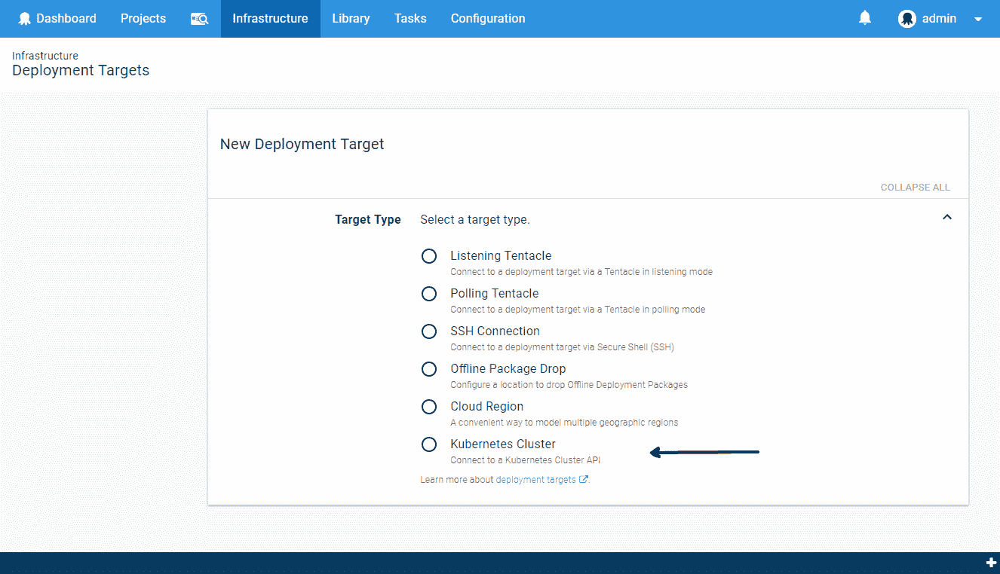
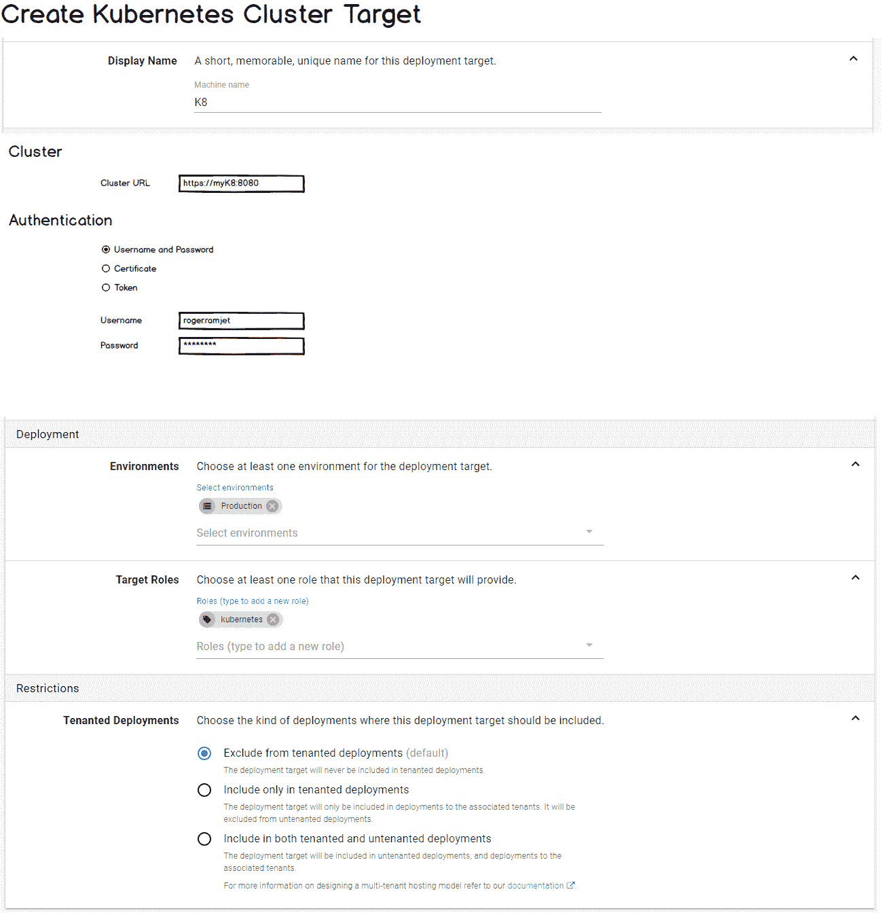
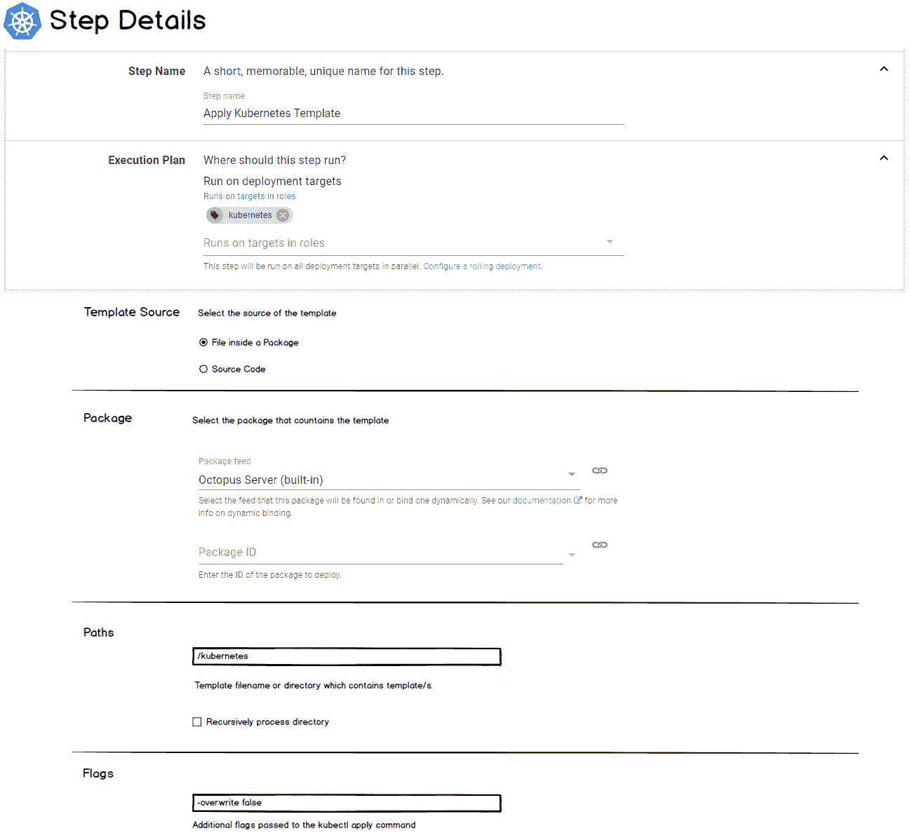
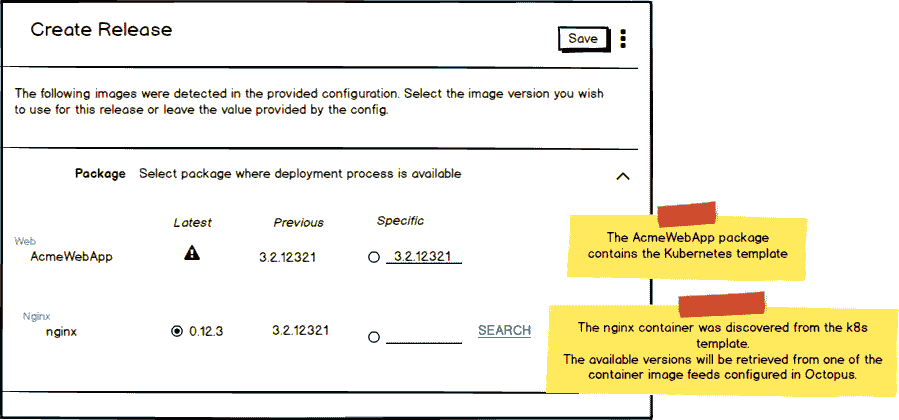
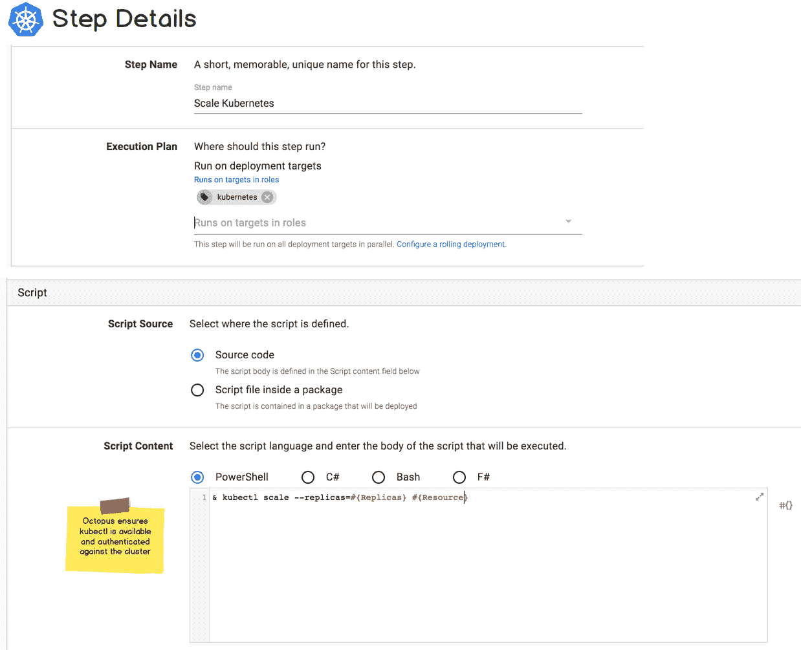

# Kubernetes RFC - Octopus 部署

> 原文：<https://octopus.com/blog/kubernetes-rfc>

[](#)

Kubernetes 赢得了容器编排之战(至少在本周)。也许不出所料， [Kubernetes 在我们的顶级用户声音建议列表中飙升至第 7 位](https://octopusdeploy.uservoice.com/forums/170787-general/suggestions/17930755-support-for-kubernetes)。

我们一直在思考 Kubernetes 在 Octopus 中的支持可能会是什么样子，我们很想听听你的想法。通常当我们在设计功能时，我们想知道一个典型的用户是什么样子，我们只需要照照镜子。对于 Kubernetes，情况并非如此。我们目前没有在内部使用 k8s(虽然随着我们构建托管产品，这种情况可能会改变)，所以我们肯定需要你的帮助。

我们目前的想法是 Kubernetes 的支持将采取以下形式:

## Kubernetes 集群目标

我们将引入一个新的 *Kubernetes 集群*目标类型，来表示新的 Kubernetes 步骤将执行的集群。

[](#)

该目标将允许您配置 Kubernetes 集群的 URL 和身份验证细节。

我们可能会支持以下认证方法:

*   用户名+密码
*   证书
*   API 令牌

[](#)

## 忽必烈应用步骤

Kubernetes 支持对象管理的声明性和命令性模式。

对于 Octopus 来说，支持声明性方法似乎是一种自然的选择。这是通过 [Kubernetes 应用命令](https://kubernetes.io/docs/reference/generated/kubectl/kubectl-commands#apply)实现的。我们将通过专门的 *Kubernetes 应用*步骤来揭示这一点。

【T2 

Apply 命令接受一个模板(JSON 或 YAML)。这在概念上类似于 Octopus 中的 [AWS CloudFormation](https://octopus.com/docs/deployments/aws/cloudformation) 或 [Azure Resource Group](https://octopus.com/docs/runbooks/runbook-examples/azure/resource-groups) 步骤的工作方式。k8s 模板可以来自一个包，也可以直接在 Octopus UI 中配置。

### 容器图像

k8s 模板指定容器图像。例如，下面的模板指定了 nginx 映像的版本 1.7.9。

```
apiVersion: apps/v1beta1
kind: Deployment
metadata:
  name: nginx-deployment
spec:
  minReadySeconds: 5
  template:
    metadata:
      labels:
        app: nginx
    spec:
      containers:
      - name: nginx
        image: nginx:1.7.9
        ports:
        - containerPort: 80 
```

当创建一个包含 Kubernetes 应用步骤的项目发布时，我们将允许您指定您希望使用的容器映像的版本。

当您部署该版本时，我们会在将它发送到 Kubernetes 集群之前，将容器映像的正确版本替换到您的模板中。

这是章鱼特制酱。它允许您对容器映像版本的特定组合进行快照，并在您的环境中进行处理。

[](#)

您可以在上面的 UI 模型中看到，您选择了两个版本:

*   包含 Kubernetes 模板的包的版本(上面例子中的`AcmeWebApp`)。
*   模板中容器图像*的版本(在本例中为`nginx`)。*

### 变量替换

我们将在 Kubernetes 模板上执行[变量替换](https://octopus.com/docs/projects/variables/variable-substitutions)。所以你可以直接在里面使用章鱼变量，它们会被替换掉。

不幸的是，Kubernetes 不支持模板的参数文件(例如 [CloudFormation](https://docs.aws.amazon.com/AWSCloudFormation/latest/UserGuide/parameters-section-structure.html) 和 [Azure RM](https://docs.microsoft.com/en-us/azure/azure-resource-manager/resource-manager-templates-parameters) 模板支持)。这很不幸，因为参数文件似乎是模板作者告诉 Octopus 这样的工具哪些值应该作为参数提供的理想方式。

您希望如何向 Kubernetes Apply 命令提供变量？

一些选项可能是:

1.  **直接在模板**上替换变量:例如，您可以在模板中包含`#{Octopus.Environment}`，它在部署时会被适当的值替换。这与像 [helm](https://helm.sh/) 这样的工具的方法是一致的，但是也有不利的一面，你的模板在 Octopus 之外是无效的(甚至可能是无效的 JSON 或 YAML)。

2.  **转换文件**:与 [Microsoft web.config 转换](https://msdn.microsoft.com/library/dd465326.aspx)类似，您可以在模板旁边放置一个转换文件。然后，转换文件可以包含被替换的 Octopus 变量，然后转换将被应用到模板。这种方法的优点是您的模板可以保持有效，并且您的转换可以存在于您的模板旁边(例如，在您的 git repo 中)。对于 JSON 模板，有[现有的实现](https://github.com/Microsoft/json-document-transforms/wiki)。对于 YAML，我们找不到太多...

3.  **显式配置的替换**:我们还可以允许在步骤 UI 中提供键值对，这将指定模板中的属性被替换。我们可以支持嵌套属性(见下面的例子)。这样做的缺点是，如果您的模板结构发生变化，您必须更新 Octopus 中的部署步骤。

| 钥匙 | 价值 | 评论 |
| --- | --- | --- |
| `foo` | `#{Foo}` | 顶级属性`foo`将被替换为#的值。 |
| `foo::bar` | `#{AnotherVariable}` | 嵌套属性`foo.bar`将被替换。 |

如前所述，我们肯定会实现选项#1(如果你的模板中没有任何 Octopus 变量占位符，那么它不会做任何事情)。但是如果你更喜欢其他提供变量的方法(包括上面没有提到的)，请留下你的评论。

## kubectl 脚本步骤

除了`apply`之外，还有许多其他的 [Kubernetes 命令](https://kubernetes.io/docs/reference/generated/kubectl/kubectl-commands)你可能希望执行。比如:[删除资源](https://kubernetes.io/docs/reference/generated/kubectl/kubectl-commands#delete)、[缩放](https://kubernetes.io/docs/reference/generated/kubectl/kubectl-commands#scale)等。

我们将通过添加一个新的 Run a Script 步骤来实现这些功能: *Run a kubectl Script* 。

这一步将允许您编写自己的脚本，我们确保`kubectl`命令行是可用的，并且针对该步骤所针对的 Kubernetes 集群进行了验证。这在概念上类似于我们的[运行 AWS CLI 脚本](https://octopus.com/docs/deployments/custom-scripts/aws-cli-scripts)或[运行 Azure PowerShell 脚本](https://octopus.com/docs/deployments/azure/running-azure-powershell)步骤，它们分别针对 AWS 和 Azure 进行身份验证并提供 SDK。

[](#)

## 我们需要你的帮助

我们认为这将很好地符合现有的 Octopus 概念和架构，但我们需要你告诉我们这是否符合你期望与 Kubernetes 交互的方式。

如果您目前正在使用 Kubernetes(或者正计划使用),我们很想听听您的情况。帮我们把 k8s 带到 o5s。