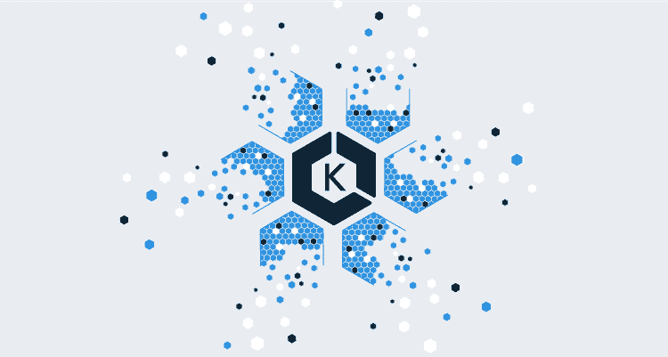
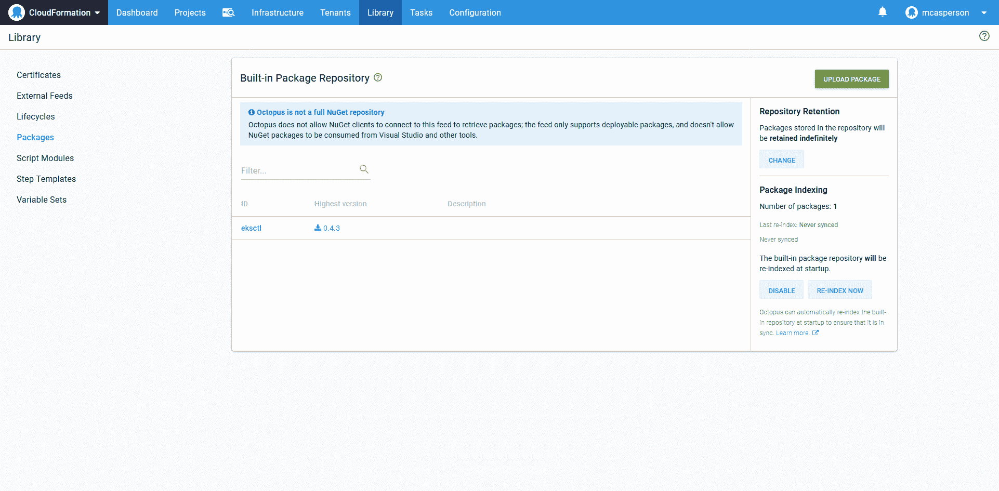
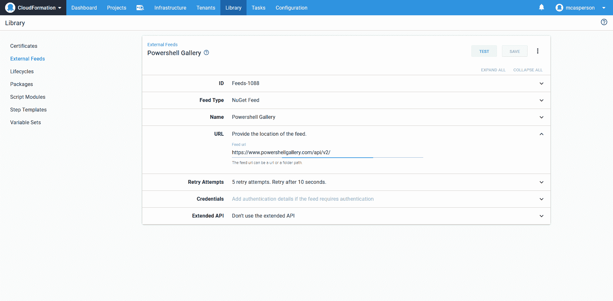
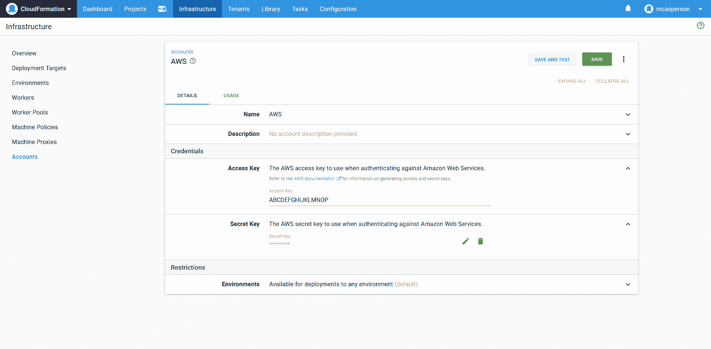
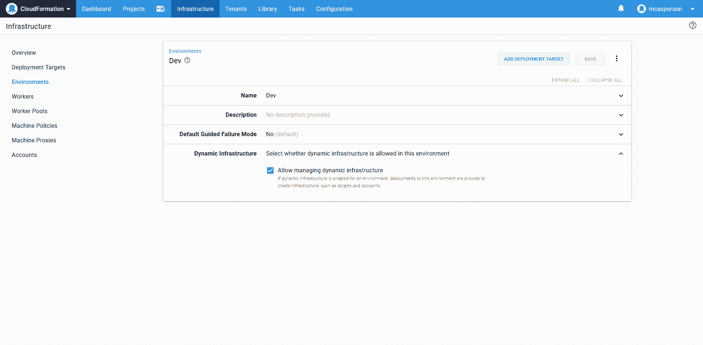
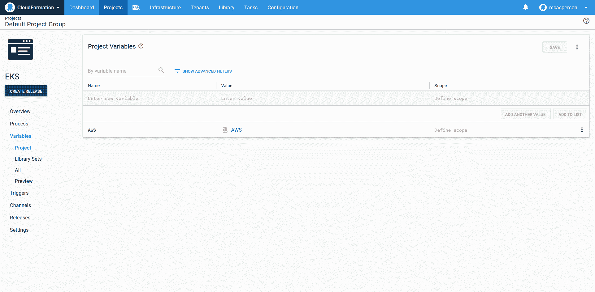
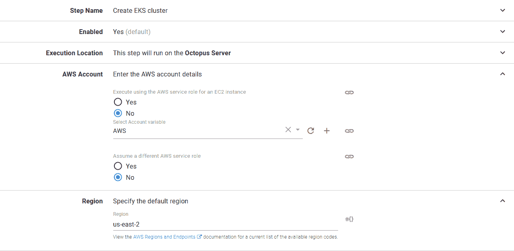
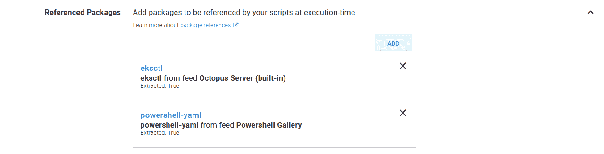
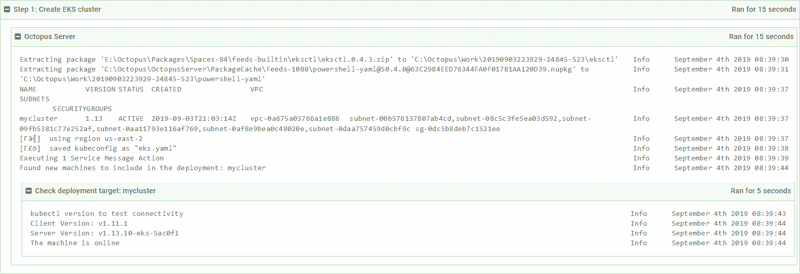
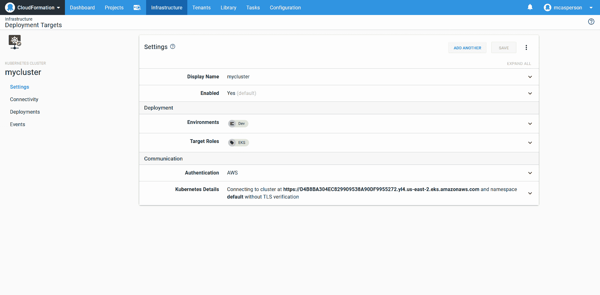

# 使用 eksctl - Octopus Deploy 创建 EKS 集群

> 原文：<https://octopus.com/blog/kubernetes-with-eksctl>

[](#)

EKS 是由 AWS 提供的托管 Kubernetes 服务。在高层次上，EKS 由两个组件组成:被管理的 EKS 控制平面和工作节点。EKS 控制平面是 AWS 中的专用资源，具有云形成类型 [AWS EKS 集群](https://docs.aws.amazon.com/AWSCloudFormation/latest/UserGuide/aws-resource-eks-cluster.html)。另一方面，worker 节点只是 EC2 实例，它们在部署过程中被配置为加入 Kubernetes 集群。

以前，创建所有这些资源是您自己的责任，这不是一项简单的任务。您负责创建 VPC、子网、互联网网关、自动扩展组、IAM 角色、EC2 实例等等。

幸运的是，今天我们有了 [eksctl](https://eksctl.io) ，这是一个命令行工具，展示了一个熟悉的动词/名词参数结构，用于创建和管理 EKS 集群。

在这篇博文中，我们将看看如何使用`eksctl`将一个简单的 EKS 集群部署并集成到 Octopus 中。

## 准备 Octopus 服务器

专门对 Octopus 使用 Kubernetes 集群和 EKS 意味着在 Octopus 服务器上有可用的`kubectl`和`aws-iam-authenticator`二进制文件。

关于安装`kubectl`的信息可以在 [Kubernetes 文档](https://kubernetes.io/docs/tasks/tools/install-kubectl/#install-kubectl-on-windows)中找到，你可以从 [AWS 文档](https://g.octopushq.com/AWSEKSKubectl)中找到关于`aws-iam-authenticator`的更多信息。

## 准备章鱼图书馆

对于这个例子，我们将使用直接来自 Octopus 的`eksctl`。为了让`eksctl`在我们的脚本中可用，我们首先需要从 [eksctl GitHub releases](https://github.com/weaveworks/eksctl/releases) 页面下载二进制文件。

你下载的文件会被叫做类似`eksctl_Windows_amd64.zip`的东西。将此重命名为`eksctl.0.4.3.zip`(用您下载的`eksctl`版本替换`0.4.3`)。新文件名嵌入了版本，这种格式是 Octopus 所要求的。重命名后，文件可以上传到 Octopus 内置的提要中。

【T2 

*eks CTL 包上传到内置 feed。*

我们还需要检查 YAML 的文件来提取他们的价值。PowerShell 本身不支持 YAML 解析，这意味着我们需要使用第三方库。

使用 PowerShell 模块的一个简单方法是将 PowerShell Gallery 添加到 Octopus。提要的 URL 是 https://www.powershellgallery.com/api/v2/的。

[](#)

*PowerShell Gallery Nuget feed。*

## 准备凭据

EKS 集群使用 AWS 凭据进行身份验证。AWS 账户在 Octopus 中作为专用账户类型公开。您可以在他们的[文档](https://docs.aws.amazon.com/IAM/latest/UserGuide/id_credentials_access-keys.html#Using_CreateAccessKey)中找到关于生成 AWS 访问键的更多信息。

[](#)

*AWS 账户。*

## 准备环境

我们将利用动态创建的基础设施来创建指向新 EKS 集群的新 Kubernetes 目标。

为了使动态基础设施能够作为部署的一部分被创建，环境需要启用`Dynamic Infrastructure`选项。

[](#)

允许创建动态基础设施的环境。

## 章鱼项目

在我们的 Octopus 项目中，我们需要设置的第一件事是变量。我们之前创建的 AWS 帐户被项目中的一个`AWS Account`变量类型引用。

[](#)

*项目变量，定义指向 AWS 账户的单个变量。*

现在我们可以添加一个`Run an AWS CLI Script`步骤来调用`eksctl`来创建 EKS 集群，然后创建 Octopus Kubernetes 目标。

该步骤引用了我们之前设置的 AWS account 变量来执行登录。该步骤还定义了将在其中进行部署的 AWS 区域。

[](#)

*AWS CLI 脚本步骤使用的凭据和区域。*

我们的脚本将引用另外两个包:包含`eksctl`可执行文件的包，以及来自 PowerShell Gallery 提要的`powershell-yaml`模块。这两个附加包都被设置为提取。

这里，我们利用引用的包以两种不同的方式丰富了部署。

`eksctl`包是一个使用参考包为我们的脚本提供额外的二进制工具的例子。特别是 AWS 生态系统有丰富的第一和第三方 CLI 工具(例如， [SAM CLI](https://docs.aws.amazon.com/serverless-application-model/latest/developerguide/serverless-sam-cli-install.html) 、 [S3cmd](https://github.com/s3tools/s3cmd) 、 [eksctl](https://eksctl.io) 、 [Beanstalk CLI](https://docs.aws.amazon.com/elasticbeanstalk/latest/dg/eb-cli3-getting-started.html) 和 [ECS CLI](https://docs.aws.amazon.com/AmazonECS/latest/developerguide/ECS_CLI.html) )，可以通过这种方式捆绑在一起。

`powershell-yaml`包是利用 PowerShell Gallery 向我们的 PowerShell 脚本公开模块的一个例子。这样就不需要让这些模块在全球范围内可用，或者将它们与定制脚本捆绑在一起。

[](#)

*引用的包，将在部署过程中下载和提取。*

最后，我们有剧本本身。以下是完整的代码:

```
Import-Module -Name .\powershell-yaml

$clusterName = "mycluster"

# Check to see if the cluster exists
eksctl\eksctl get cluster --name $clusterName 2>&1

# If the cluster does not exist, create it. Otherwise get the kubeconfig file
if ($LASTEXITCODE -ne 0) {
    eksctl\eksctl create cluster --name $clusterName --kubeconfig eks.yaml
} else {
    eksctl\eksctl utils write-kubeconfig --name $clusterName --kubeconfig eks.yaml
}

# Convert the kubeconfig from YAML
$kubeConfig = Get-Content -Path eks.yaml -Raw
$kubeConfigObject = ConvertFrom-Yaml $kubeConfig
# Extract the cluster URL
$clusterUrl = $kubeConfigObject.clusters[0].cluster.server

# Create an Octopus target
New-OctopusKubernetesTarget `
    -name $clusterName `
    -octopusRoles "EKS" `
    -clusterUrl $clusterUrl `
    -octopusAccountIdOrName $AWS `
    -clusterName $clusterName `
    -namespace "default" `
    -updateIfExisting `
    -skipTlsVerification True 
```

让我们来分解这个代码。

我们从导入来自 PowerShell Gallery Nuget 提要的`powershell-yaml`模块开始。这将使我们稍后能够访问像`ConvertFrom-Yaml`这样的功能:

```
Import-Module -Name .\powershell-yaml 
```

EKS 集群的名称是在一个变量中定义的，因为它将在脚本中多次使用:

```
$clusterName = "mycluster" 
```

然后我们通过调用`eksctl`来检查 EKS 集群是否已经存在。

Octopus 步骤应该被设计成幂等的，这意味着不管任何外部系统的状态如何，它们都可以运行多次。不幸的是，`eksclt`没有公开幂等命令，这意味着如果您试图创建一个已经存在的集群，您将会收到一个错误。通过检查集群是否已经存在，我们可以实现自己的*创建或更新*逻辑。

注意，`eksctl`可执行文件已经被提取到了`eksctl`目录，因此我们调用了`eksctl\eksctl`:

```
# Check to see if the cluster exists
eksctl\eksctl get cluster --name $clusterName 2>&1 
```

如果集群不存在(我们从调用`eksctl get cluster`的返回代码中确定)，我们就创建它。`--name`参数定义了 EKS 集群的名称，而`--kubeconfig`参数定义了保存客户端连接到集群所需的详细信息的文件名:

```
# If the cluster does not exist, create it. Otherwise get the kubeconfig file
if ($LASTEXITCODE -ne 0) {
    eksctl\eksctl create cluster --name $clusterName --kubeconfig eks.yaml
} 
```

如果集群已经存在，我们将保存 kubeconfig 详细信息:

```
else {
 eksctl\eksctl utils write-kubeconfig --name $clusterName --kubeconfig eks.yaml
} 
```

此时，不管 EKS 集群是新创建的还是已经存在的，我们都有一个名为`eks.yaml`的文件，其中包含了客户端连接到集群所需的详细信息。通常这个配置文件会被`kubectl`命令行工具直接使用，但是在这个例子中，我们想要获取该文件的细节，并使用它们来创建一个 Octopus Kubernetes 目标。

为了提取文件的细节，我们使用作为`powershell-yaml`库的一部分导入的`ConvertFrom-Yaml`函数将其从原始 YAML 转换为 PowerShell 对象:

```
# Convert the kubeconfig from YAML
$kubeConfig = Get-Content -Path eks.yaml -Raw
$kubeConfigObject = ConvertFrom-Yaml $kubeConfig 
```

然后，我们提取 EKS 集群的 URL:

```
# Extract the cluster URL
$clusterUrl = $kubeConfigObject.clusters[0].cluster.server 
```

最后一步是使用`New-OctopusKubernetesTarget`函数在 Octopus 中创建新的 Kubernetes 目标。此功能记录在[这里](https://octopus.com/docs/infrastructure/deployment-targets/dynamic-infrastructure/kubernetes-target)。

请注意，`$AWS`变量是由 Octopus 提供的，它被设置为 AWS 帐户的 ID:

```
# Create an Octopus target
New-OctopusKubernetesTarget `
    -name $clusterName `
    -octopusRoles "EKS" `
    -clusterUrl $clusterUrl `
    -octopusAccountIdOrName $AWS `
    -clusterName $clusterName `
    -namespace "default" `
    -updateIfExisting `
    -skipTlsVerification True 
```

部署这个项目将导致创建 EKS 集群(如果它还不存在的话)，生成`eks.yaml`文件，以及新创建或更新的 Octopus Kubernetes 目标。

【T2 

*部署日志。*

然后，我们可以在基础设施页面上看到新的 Kubernetes 目标。

[](#)

*通过调用 New-octopus kubernetastarget 创建的 Kubernetes 目标。*

## 结论

以前，创建 EKS 集群是一个复杂的过程，需要多个步骤来配置控制平面、工作节点以及所有相关的网络和安全性。

如今，使用`eksctl`工具，创建一个完整的 EKS 集群只需一个命令。在本文中，我们看到了如何在 Octopus 中编写执行`eksctl`的脚本来创建 EKS 集群和 Octopus Kubernetes 目标。