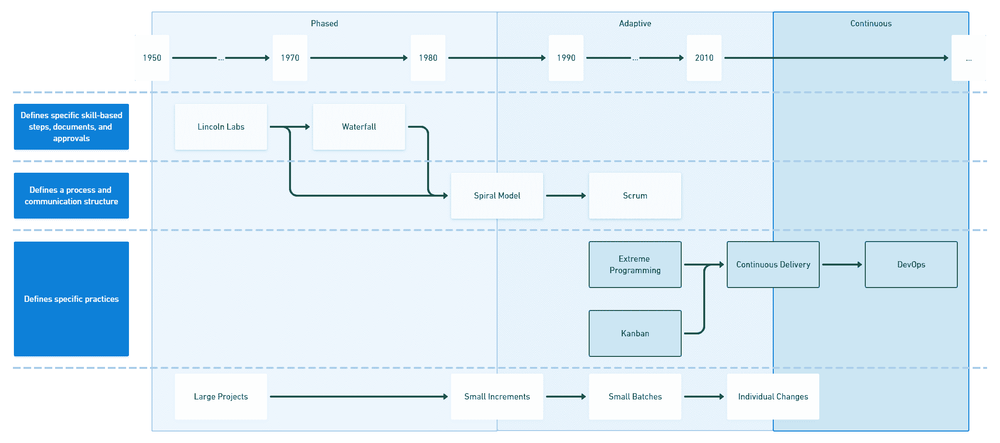

# 比较精益、敏捷和持续交付——Octopus 部署

> 原文：<https://octopus.com/blog/lean-agile-continuous-delivery>

随着 DevOps 和持续交付的发展，精益和敏捷背后的原则还适用吗？它们与 5 个持续交付原则相比如何，任何差异对于软件开发团队意味着什么？

## 轻量级软件交付的开端

在整个 20 世纪 90 年代，软件开发行业正在酝酿一场革命。早期的分阶段模型将交付过程分为基于技能的步骤，设计和文档用于运行批准过程来控制项目。

交付软件的过程是沉重而缓慢的，几乎没有迹象表明开销降低了他们试图减轻的风险。

出现了一组轻量级方法，旨在生成快速反馈，并基于新信息迭代地调整计划。开发人员使用小批量来管理风险，并提供频繁的机会来改变方向，而不是控制和批准。

敏捷宣言在 2001 年从这个适应性的轻量级方法社区中出现，精益软件开发在几年后出现。

敏捷和精益为软件开发提供了基于*价值观和原则*的方法。您可以通过一组定义每种方法哲学的核心语句来测试一种方法是敏捷的还是精益的。

连续交付出现在精益和敏捷社区中，提供了最具体的实践和能力来实现频繁和安全的软件交付。除了极限编程，大多数软件开发方法都处理需求管理和通信结构。持续交付承担了价值流的其余部分，并提供了一条高效可靠的交付渠道。

InfoQ 发布了一份关于软件开发文化和方法的年度报告。他们仿照杰弗里·摩尔的*跨越鸿沟*概念设计了这份报告。众所周知，Moore 将技术采用生命周期形象化为跨越 3 个标准差的钟形曲线。

该图表分为对新技术持不同态度的 5 组:

*   创新者(-3)
*   早期采用者(-2)
*   早期多数(-1)
*   后期多数(+1)
*   落后者(+3)

早期多数和晚期多数代表了采用生命周期的三分之二。尽管如此，新技术(或者，在 InfoQ 的案例中，一个新想法)要成为主流，它必须跨越从早期采用者到主流多数的鸿沟。

 来源: [InfoQ 软件开发文化与方法 2022](https://www.infoq.com/articles/culture-trends-2022/)

虽然软件交付的自适应模式被嵌入到后期的大多数中，但是持续交付模式所需的能力仍然在跨越鸿沟。一些实践(比如 DevSecOps)已经取得了飞跃，而其他关键元素，比如团队拓扑和授权团队，仍然处于早期采用阶段。

因此，随着 DevOps 和持续交付越来越受欢迎，这是将持续交付的 5 个原则与 12 个敏捷原则和 7 个精益原则进行比较的好时机。

## 比较敏捷、精益和持续交付原则

敏捷、精益和持续交付都提供了一套原则。这有助于我们比较它们的基本结构。

在精益和持续交付中还有其他的技术和能力，在敏捷中没有类似的元素。敏捷宣言旨在成为对其他特定方法的敏捷性的一个广泛的试金石，例如极限编程、Scrum 和有纪律的敏捷，所以它没有定义进一步的细节。

精益通过描述涵盖整个软件开发过程的技术，以及关于计划、设计、测试和维护的建议，扩展了它的原则。

连续交付使用部署管道来集中精力改进变更流程，从代码提交到产品中运行的软件。详细描述了具体的技术能力，以使*能够尽早且持续地交付有价值的软件*。

这些原则是这三种方法中唯一可直接比较的要素。

### 持续交付原则

连续交货有 5 个原则:

1.  将质量建立在
2.  小批量工作
3.  计算机执行重复的任务，而人解决问题
4.  坚持不懈地追求持续改进
5.  每个人都有责任

这些原则可以安排成一种强化关系，其中前 3 项原则作为持续改进的驱动力，每个相关人员都有责任。

### 敏捷原则比较

总的来说，持续交付原则与敏捷宣言是一致的。

例如，小批量工作被广泛认为有助于实现几个敏捷原则:

*   我们最优先考虑的是通过早期和持续交付有价值的软件来满足客户。
*   欢迎不断变化的需求，即使是在开发的后期。敏捷流程利用变化为客户带来竞争优势。
*   频繁地交付工作软件，从几个星期到几个月，优先选择较短的时间尺度。
*   工作软件是进步的主要衡量标准。
*   敏捷过程促进可持续发展。发起人、开发人员和用户应该能够无限期地保持恒定的步调。
*   简单——最大化未完成工作量的艺术——至关重要。

“小批量工作”原则的措辞简明扼要，在实践中易于遵循。这种持续交付原则有助于实现一半的敏捷原则。

当你把这五个原则结合起来时，还有一个放大效应。为了“频繁地交付工作软件”，你需要小批量地工作，增加自动化，并在。

连续交付不包括两个敏捷原则:

*   业务人员和开发人员必须在整个项目中每天一起工作。
*   向开发团队传达信息的最有效的方法是面对面的交谈。

连续交付以交付管道为中心，这意味着识别、开始和启动的过程不是连续交付的直接关注点。此外，在*连续交付*书的前页，作者强调这本书是根据它所包含的思想创作的。贡献者和编辑使用不同的工具在不同的地方工作。他们使用版本控制和自动化构建来形成这本书的交付渠道。他们没有每天一起工作，也没有面对面地交流信息。

作为一个行业，许多没有尝试远程工作的组织现在准备尝试分布式工作。随着异步通信变得越来越普遍和熟悉，这将进一步挑战实时面对面协调的需求。

关于字数，持续交付原则用 21 个字来表达，而不是敏捷原则的 180 个字。后见之明和敏锐编辑的结合给了我们一个指南针来检查我们的方向，在持续交付的具体实践中提供了细节。

> 很容易陷入实施持续交付的细节中——工具、架构、实践、政治——如果你发现自己迷失了，尝试重温这些原则，你可能会发现它帮助你重新关注什么是重要的。”——[Jez Humble](https://continuousdelivery.com/principles/)

你不必扔掉敏捷宣言就能前进；这是持续交付和开发运维所基于的地理位置的一部分。业界将继续发现新的更好的软件开发方法。越来越明显的是，技术实践和文化能力至关重要。

### 精益原则比较

精益原则已经很简单且可行。精益和持续交付之间完全一致，没有未映射的区域。

有了敏捷，持续交付为 10 个敏捷原则提供了简明的替代方案。在精益的情况下，持续交付完全符合这些原则。每种方法都提供了适用于不同组织部门的不同视角。

在一个完全采用精益和持续交付的组织中，各自的原则对不同的团队都有帮助。精益原则和技术是领导工具，而持续交付提供了一种特定于个人贡献者交付努力的方法。

例如，对于消除浪费、快速交付，以及通过持续交付将完整性构建到系统中，自动化是一个实用的攻击媒介。

## 结论

持续交付提供了一套简明的原则，与 12 条敏捷原则中的 10 条相一致，并补充了精益，提供了实现类似目标的不同视角。

所有这三套原则都与现代管理哲学相一致，并且提供了不同的方法来回顾和重新关注你的软件交付工作。

您可以使用持续交付原则来指导您的软件交付工作，并参考敏捷和精益原则来为您的改进工作找到进一步的灵感。

## 了解更多信息

愉快的部署！