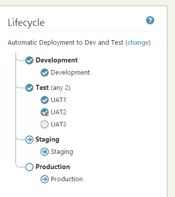
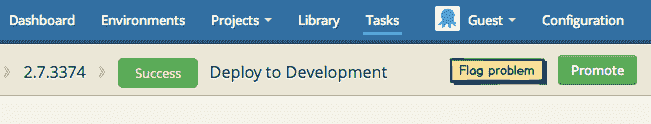

# RFC:生命周期- Octopus 部署

> 原文：<https://octopus.com/blog/lifecycles-rfc>

生命周期是 Octopus 中的一个新概念，它将允许我们处理许多我们一直渴望解决的与[相关的建议](https://octopusdeploy.uservoice.com/forums/170787-general/suggestions/5730624-triggers-gates-and-bad-releases):

*   在环境之间自动升级(触发器)
*   将一个版本标记为坏的(因此它不能再被部署)
*   在测试部署完成之前阻止生产部署(门)

## 生命周期和阶段

生命周期由许多阶段组成，每个阶段都指定了有关升级的触发器和规则。最简单的生命周期，即开箱即用且默认的生命周期，就是:

**Phase 1: Anything Goes**

*   允许手动部署到:*所有环境*

换句话说，这个生命周期简单地说“发布可以以任何顺序部署到任何环境中”。完全混乱了！

自定义生命周期可能会将世界分为预生产和生产阶段:

**Phase 1: Pre-Production**

*   自动部署到:**开发**
*   允许手动部署到: **UAT1、UAT2、UAT3、Staging**
*   提升前的最低环境: **3**

**Phase 2: Production**

*   自动部署到:
*   允许手动部署到:**生产**
*   提升前的最低环境:

最后，一个更加结构化的生命周期可能是这样的:

**Phase 1: Development**

*   自动部署到:**开发**
*   允许手动部署到:
*   提升前的最低环境: **1**

**Phase 2: Test**

*   自动部署到:
*   允许手动部署到: **UAT1、UAT2、UAT3**
*   提升前的最低环境: **2**

**Phase 3: Staging**

*   自动部署到:
*   允许手动部署到:**暂存**
*   提升前的最低环境: **1**

**Phase 4: Production**

*   自动部署到:
*   允许手动部署到:**生产**
*   提升前的最低环境: **1**

请注意，测试阶段解锁了 3 个不同的测试环境，在发布进入阶段之前，用户必须部署到其中的至少两个环境中。

## 假设

为了简单起见，我们对这个特性做了一些假设。

首先，阶段的进展总是线性的——你从阶段 1 开始，然后到阶段 2，然后是阶段 3，等等。你不能跳过一个阶段，也没有分支。

第二，随着生命周期的深入，可以部署的环境是累积的。例如，在上面的第三个例子中，如果发布处于阶段 3 (Staging ),您可以部署到开发、UAT1/2/3 或 Staging，而不是生产。

## 自动升级

由于每个阶段都可以配置为部署到一个或多个环境，因此您可以使用此选项来自动在环境之间进行升级。例如，在成功部署到开发环境之后，您可能会自动升级到测试环境。

请记住，您可以将此功能与现有的[手动干预步骤](http://docs.octopusdeploy.com/display/OD/Manual+intervention+and+approvals)系统混合使用，以便在部署之前/之后和升级之前暂停审批。

## 自动发布创建

当您将一个生命周期分配给一个项目时，您还可以配置该项目，以便在检测到一个新的 NuGet 包时立即创建发布。

目前，我认为这将仅限于我们内置的 NuGet 存储库(不适用于外部提要中的包)。

当与上述特性相结合时，这是非常令人兴奋的——从 NuGet 包的推送中，我们可以创建和部署没有外部集成的版本。

## 标记一个问题

通常，我们假设如果一个版本被成功部署，它就可以被提升了。就像现在，您可以使用[手动步骤](http://docs.octopusdeploy.com/display/OD/Manual+intervention+and+approvals)来强制审查/批准，作为部署结束时的一个明确步骤。

然而，有时部署看起来很好并获得批准，只是到后来您才发现问题——可能是删除客户数据的可怕错误。如果发生这种情况，您可以标记部署的问题:

当一个问题被标记时，部署在整个生命周期中并不计入进度——如果我们标记了一个与试运行部署相关的问题，我们将不能升级到生产，即使试运行是成功的。

## 启用场景

> 我想通过推送一个 NuGet 包，从开发一直到生产，自动提升部署

1.  使用“自动创建发布”选项
2.  在管道的每个阶段，设置“自动部署到”环境，以便发布自动通过管道进行

> 除非您已经部署到暂存，否则禁止生产部署

简单地将它们放在不同的阶段，除非有成功的试运行部署，否则不要解锁生产环境。

> 即使试运行成功，如果我们后来发现应用程序有问题，也要阻止生产部署

在生命周期中，使用“标记一个问题”特性来防止发布进展到下一个阶段，或者将它恢复到前一个阶段。

## 生命周期将消耗项目组

目前，Octopus 中的项目组用于组织项目集合，限制它们可以部署到的环境，并设置保留策略。

当引入生命周期时，您将通过生命周期来控制项目可以部署到哪些环境，以及要应用的保留策略。项目组只是被留下来组织项目集合，仅此而已。

你觉得怎么样？这个特性会对你有用吗？你的生命周期会是什么样的？