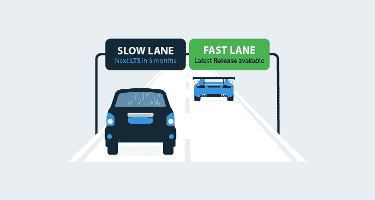

# 推出对 Octopus 服务器的长期支持- Octopus Deploy

> 原文：<https://octopus.com/blog/long-term-support>

**注意:LTS 计划于 2019 年 1 月启动。了解更多关于[LTS 项目如何影响你](https://octopus.com/docs/administration/upgrading/long-term-support)。**

我们计划在 2018 年第四季度发布我们的第一个含**长期支持(LTS)** 的 Octopus 服务器版本。这篇文章解释了我们在 LTS 世界的八达通服务器计划，以及你将如何受益。我们还探索了这个决定的一些背景，以及我们将在幕后使用的一些机制。

我们认为许多自托管客户将希望主要使用 Octopus 服务器版本并获得长期支持，但如果您使用自托管并希望及时了解我们正在做的一切，您也可以继续享用这块蛋糕！

## 介绍八达通服务器 LTS 计划

我们将在**三个月的周期**上发布一个新版本的 Octopus 服务器，提供**六个月的长期支持**。这意味着在任何时间点都会有**两个当前的 LTS 版本**。

每一个 LTS 版本都将包含我们在这三个月中稳定下来的所有特性和错误修复。提供长期支持的 Octopus 服务器版本将:

*   获得长达六个月的关键错误修复和安全补丁。
*   没有新的特性，小的改进，或者小的错误修复——这些将会在下一个 LTS 版本中出现。

### 修补

在决定补丁包含或排除的内容时，我们将使用以下经验法则:

> 安装补丁应该比不安装补丁更安全。

当你决定是否在你的八达通服务器上安装补丁时，你应该使用同样的经验法则。

### 公告

我们将在一篇带有`LTS`标签的博客文章中宣布 Octopus Server 的每个新 LTS 版本，明确说明哪些版本仍在长期支持范围内，哪些版本的长期支持已经过期。

Octopus Server 的每个版本都会在[下载页面](https://octopus.com/downloads)和产品本身内部清楚地表明它是否是 LTS 版本。

## 选择的权力

我们意识到不是每个顾客都是一样的。我们想让任何人都能轻松回答这个问题:*安装 Octopus 服务器的最佳版本是什么？*

我们想给你选择的权力，以及简单的指导来帮助你做出明智的选择。

### 介绍快速车道和慢速车道

在幕后，我们计划继续以过去几年的方式工作:发布错误修复和小的改进，快速周转，并与我们的客户密切合作，设计和测试新功能。我们添加的是一个特殊的发布节奏，该版本基于当时最稳定的版本，具有一些额外的质量保证，并提供六个月的长期支持。

在内部，我们认为这是两条“释放通道”:

*   这条**快车道**正是我们今天所做的。我们通常每 4-6 周发布一次新特性，每隔几天发布一次错误修复和小的增强补丁。
*   **慢车道**是我们将稳定和发布长期支持版本的地方，以及任何包含关键错误修复和安全补丁的补丁，最长六个月。

#### 章鱼云在快车道上

[章鱼云](https://octopus.com/cloud)客户将使用快车道上发布的产品:我们为您做出选择。一旦它们准备好，你将获得最新的和最好的特性，以及最快的错误修复和小的增强。

#### 自主:选择的力量

自主接待的客户可以自己决定。我们建议选择一条车道并坚持下去，但你可以在适合你的情况时[换车道](#switching-lanes)。

如果这听起来像您的场景，请选择**长期支持的慢车道版本**:

*   “比起拥有最新的功能，我们更喜欢稳定性。”
*   “我们大约每三个月升级一次 Octopus。”
*   “在升级我们的生产设备之前，我们在测试环境中评估 Octopus。”

如果这听起来像你的场景，你应该选择**快车道发布**:

*   "我们希望最新和最大的功能和小的改进和错误修复真正快速周转."
*   “我们希望与 Octopus 团队紧密合作，这样我们就可以帮助他们构建世界上最好的自动化工具！”

## 问与答(Question and Answer)

我已经介绍了我们长期支持计划的广泛细节，我将在这里回答一些常见问题。如果你有任何问题，请在评论中提问！

### 你如何选择在 LTS 补丁中包含什么？

我们将使用这个经验法则:**安装一个补丁应该比不安装那个补丁更安全。**我们将在 LTS 补丁中包含某些内容，例如:

*   我们发现了一个安全漏洞，这将导致我们提出 CVE 报告。
*   我们发现了一个无法解决的问题。
*   我们发现了一个仅在当前 LTS 版本中存在的问题。
*   我们发现了一些对修补有商业意义的东西。

我们不会:

*   船舶数百 LTS 补丁-我们希望稳定和高信噪比。
*   在 LTS 补丁中提供新功能。
*   LTS 板块的拆船变化。

### 我们能在慢车道和快车道之间移动吗？

是的，你可以有控制地变换车道。“加速”到一个快车道发布会导致你运行一个更高版本的 Octopus 服务器——这只是一个正常的升级。如果您想“减速”回到长期支持的慢车道版本，只需等到下一个 LTS 版本发布并升级到该版本。

### 你会保持每月发布快车道的节奏吗？

我们目前大约每月发布一次版本。我们认为可预测的节奏对于使用长期支持的慢车道版本的客户来说更重要——这将有助于他们计划升级。

*   在**慢车道**中，我们的目标是严格按照三个月的节奏发布 LTS 版本。
*   在**快车道**中，我们的目标是每月发布一次新版本，但是，有时我们可能会决定更早发布一个快车道版本，或者在发布之前花一些额外的时间来强化一个快车道版本。

如果您喜欢更可预测的节奏，请选择具有长期支持的慢车道版本。

### 你会改变你的版本策略吗？

不完全是。我们将为 Octopus 服务器的每个版本选择下一个版本号[,就像我们今天做的一样](/blog/version-change-2018),但有一些额外的上下文:

*   我们将把`LTS`添加到长期支持版本的某个部分。

## 包扎

我们正在引入对八达通的长期支持(LTS ),你可以放心。

如果你有任何担心或问题，请在下面的评论中联系我们！