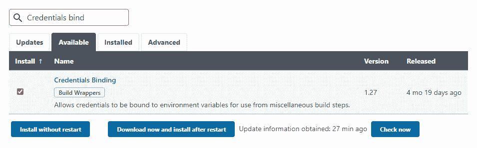
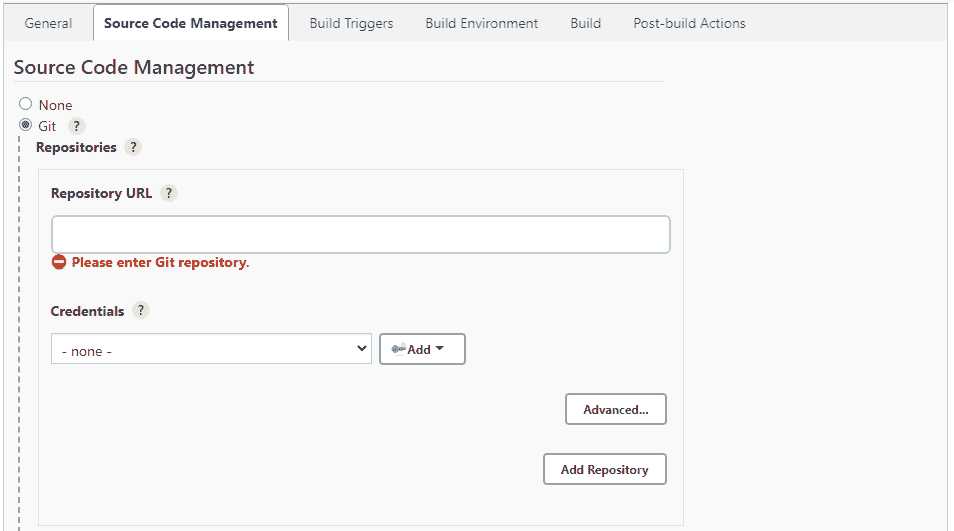
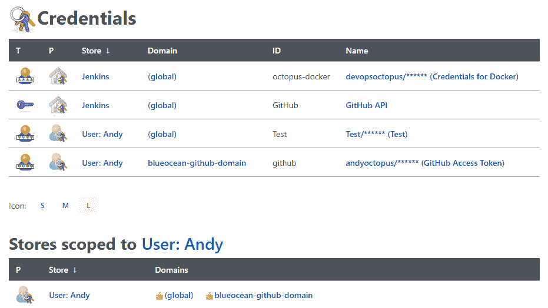

# 在 Jenkins - Octopus 部署中管理凭据

> 原文：<https://octopus.com/blog/managing-jenkins-credentials>

像八达通一样，詹金斯只是你管道中的一步，补充其他系统和服务。

您可以将 Jenkins 连接到大多数行业工具，安全地存储他们的凭证、秘密和 API 密钥。通过存储这些登录方法，Jenkins 可以在自动化过程中无缝连接到其他服务。

Jenkins 的文档推荐使用[凭证绑定插件](https://plugins.jenkins.io/credentials-binding/)。这是 Jenkins 安装过程中安装者推荐的插件之一，所以可能你已经安装了它(并使用了它)而没有意识到。

在这篇文章中，我将带你了解如何安装这个插件以及它的不同用法。

## 如何安装凭证绑定插件

如果您没有安装凭证绑定插件，很容易添加:

1.  从菜单中点击**管理詹金斯**。
2.  点击**管理插件**。
3.  点击**可用的**选项卡，开始在**过滤器**字段中输入`Credentials Binding`。插件应该出现在预测的搜索结果中。
4.  勾选插件左侧的复选框，然后点击**安装而不重启**。

Jenkins 安装插件和所有依赖项，包括其他插件和扩展。

凭证绑定插件以两种不同的方式存储您的身份验证方法:

我们来看看区别。

## 全局凭据

全局凭据是手动输入的登录方法，存储在 Jenkins 中。任何具有访问权限的人都可以使用凭据连接到其他服务。这些可以包括:

*   代码回购，如 GitHub 或 BitBucket
*   打包服务，比如 Docker 注册表或 TeamCity feed
*   部署工具，如 Octopus

### 如何在 Jenkins 中添加凭证

要在 Jenkins 中添加凭据:

1.  从菜单中点击**管理詹金斯**。
2.  向下滚动到**安全**标题，点击**管理凭证**。
3.  点击詹金斯标题下**商店范围内的**詹金斯**。**
4.  点击**系统**标题下的**全球凭证(无限制)**。
5.  如果没有凭证，可以点击**添加一些凭证怎么样？**链接，否则点击左边的**添加凭证**。
6.  从**种类**字段的下拉框中选择您想要存储的凭证类型，填写字段并点击**确定**。您可以添加以下类型的凭据:
    *   用户名和密码
    *   SSH 用户名和私钥
    *   秘密文件
    *   秘密文本
    *   证书

无论您选择哪个选项，都要输入有意义的 **ID** 和**描述**。

### 在 Jenkins 中使用全局凭据

添加凭证后，可以调用它们连接到管道中的其他工具，无论是通过 UI、插件还是 Jenkinsfile。

可以选择全局凭据的一个很好的例子是在创建管道时:

1.  点击左侧菜单中的**新项目**。
2.  输入项目名称，选择**自由式项目**，点击**确定**。
3.  检查**源代码管理**标题下的 Git 单选按钮。将您的回购地址粘贴到**存储库 URL** 字段，并从**凭证**下拉框中选择您的凭证。
4.  设置好你的物品后点击**保存**。

Jenkinsfiles 是代码库中的文本文件，它定义了管道做什么以及它连接到什么。Jenkinsfiles 是 Jenkins Pipeline 的一部分——Jenkins 推荐的用于持续集成和持续交付(CI/CD)的插件的集合。

这意味着您可以通过 Jenkinsfile 从存储在 Jenkins 中的凭据连接到服务。

如果您使用的是 Blue Ocean 插件，它会在您建立管道时为您创建一个 Jenkinsfile，那么您可能根本不需要使用 Jenkins file。

更多信息请参见 Jenkins 网站上的[使用 Jenkinsfile 页面](https://www.jenkins.io/doc/book/pipeline/jenkinsfile/)。

## Jenkins 中的用户绑定凭据

根据您将 Jenkins 连接到的设备或您使用的插件，Jenkins 将一些凭证与登录的用户联系起来。Jenkins 只在您第一次将它与另一个服务连接时存储这些凭据。您不能在初始设置之外使用这些凭据，其他用户帐户也不能访问它们。

例如，当在[蓝海](https://plugins.jenkins.io/blueocean/)(一个简化 Jenkins 用户界面的插件)中创建你的第一个管道时，Jenkins 连接到你的代码库。如果连接到 GitHub，您使用 GitHub 个人访问令牌(在您的 GitHub 帐户的开发者设置中创建)来允许 Jenkins 连接到 repo。Jenkins 只将登录用户的令牌存储在他们自己的凭据“域”中。

在 Jenkins 中，您可以在不同于全局凭证的位置找到这些凭证，尽管它们的屏幕工作方式类似。

要查看您的用户绑定凭证，请单击顶部菜单中您用户名旁边的箭头，然后单击**凭证**。

顶部显示您有权访问的所有凭据，包括用户和全局。向下滚动时，您会看到所有凭据存储的标题。在我的例子中，范围为用户:Andy 的**商店是只有我可以使用的凭证。**

## 下一步是什么？

更多信息参见 [Jenkins 的证书文档](https://www.jenkins.io/doc/book/using/using-credentials/)。

查看我们关于配置 Jenkins 的其他帖子:

[试试我们免费的 Jenkins 管道生成器工具](https://oc.to/JenkinsPipelineGenerator)用 Groovy 语法创建一个管道文件。这是您启动管道项目所需的一切。

## 观看我们的詹金斯管道网络研讨会

[https://www.youtube.com/embed/D_7AHTML_xw](https://www.youtube.com/embed/D_7AHTML_xw)

VIDEO

我们定期举办网络研讨会。请参见[网络研讨会第](https://octopus.com/events)页，了解有关即将举办的活动和实时流录制的详细信息。

阅读我们的[持续集成系列](https://octopus.com/blog/tag/CI%20Series)的其余部分。

愉快的部署！