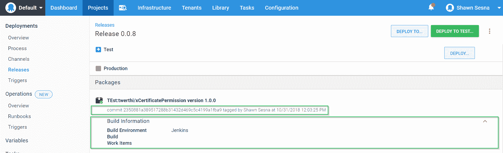

# 手动将构建信息推送到 Octopus - Octopus 部署

> 原文：<https://octopus.com/blog/manually-push-build-information-to-octopus>

[](#)

Octopus Deploy 集成了流行的构建服务器，如 Azure DevOps、Jenkins 和 TeamCity，可用的插件使打包工件和将这些工件推送到 Octopus、创建发布和启动部署变得容易。您还可以在构建中包含发行说明和提交信息，称为`build information`。

不幸的是，并不是每种类型的构建技术都有插件，但是因为 Octopus 是 API 优先构建的，所以我们可以使用 API 以编程方式提交构建信息。

## 开源代码库

让我们以 GitHub 为例，当没有构建服务器时，使用 API 提交构建信息。我的 [`xCertificatePermission`](https://github.com/twerthi/xCertificatePermission) 回购有一个版本为 1.0.0 的发行版。因为没有构建服务器参与创建这个版本，所以没有插件可以让我将构建信息从 GitHub 推送到 Octopus Deploy。

### 使用 API

如前所述，Octopus Deploy 是 API 优先编写的，所以我可以使用`/api/build-information` API 将构建信息推入 Octopus Deploy。在系统变量文档页面上，有一个专门用于构建信息的[部分，它显示了 API 调用可以包含的基本信息。此外，Swagger 文档显示了返回的 JSON，它为我们提供了关于有效载荷应该是什么样子的更多信息:](https://octopus.com/docs/projects/variables/system-variables#release-package-build-information)

```
{
  "Id": "string",
  "PackageId": "string",
  "Version": "string",
  "BuildEnvironment": "string",
  "BuildNumber": "string",
  "BuildUrl": "string",
  "Branch": "string",
  "VcsType": "string",
  "VcsRoot": "string",
  "VcsCommitNumber": "string",
  "VcsCommitUrl": "string",
  "IssueTrackerName": "string",
  "WorkItems": [
    {
      "Id": "string",
      "LinkUrl": "string",
      "Source": "string",
      "Description": "string"
    }
  ],
  "Commits": [
    {
      "Id": "string",
      "LinkUrl": "string",
      "Comment": "string"
    }
  ],
  "IncompleteDataWarning": "string",
  "Created": "2020-02-20T05:28:07.028Z",
  "LastModifiedOn": "2020-02-20T05:28:07.028Z",
  "LastModifiedBy": "string",
  "Links": {
    "additionalProp1": "string",
    "additionalProp2": "string",
    "additionalProp3": "string"
  }
} 
```

不幸的是，这两个资源都没有描绘出如何为 API 调用设置有效负载的全貌。

### JSON 示例

示例中缺少的是封装了有效负载的一些其他属性的`OctopusBuildInformation`散列表。对于我的`xCertificatePermission`示例，下面是有效载荷的样子:

```
$jsonBody = @{
    PackageId = "twerthi/xCertificatePermission"
    Version = "1.0.0"
    OctopusBuildInformation =
        @{
            BuildEnvironment = "Jenkins"
            VcsCommitNumber = "2350881a389517288b31432d469c5c4199a1fba9"
            VcsType = "Git"
            VcsRoot = "https://github.com/twerthi/xCertificatePermission.git"
        }

   } | ConvertTo-Json -Depth 10 
```

如您所见，BuildEnvironment、VcsCommitNumber、VcsType 和 VcsRoot 元素实际上嵌入在 OctopusBuildInformation 中。使用格式良好的 JSON，我们可以调用 API:

```
$OctopusServerUrl = "https://YourServerUrl"
$ApiKey = "API-XXXXXXXXXXXXXXXXXXXXXXXXXX"

$Headers = @{"X-Octopus-ApiKey"="$ApiKey"}

Invoke-RestMethod -Method Post -Uri "$OctopusServerUrl/api/build-information" -Headers $Headers -Body $jsonBody 
```

随着构建信息被推送到 Octopus Deploy，它现在与提交散列一起出现在发布中。

【T2 

## 解决纷争

插件确切地知道需要传递什么才能让一切正常工作。这有时会掩盖自己尝试编写时遇到的问题。下面是客户在尝试构建构建信息时遇到的一些常见问题。

### 提交未显示的链接

如果您的提交链接不显示或不起作用，请确保您已经将 VcsType 设置为`Git`或`TFSVC`。如果它是未知的，Octous Deploy 将不知道如何正确设置它。

### 工作项目不工作

Octopus Deploy 通过使用已配置的问题跟踪器集成，动态地确定哪些工作项与构建和/或提交相关联。上面的 Swagger 引用显示了 POST 返回中的工作项数组，然而，工作项数组是 POST 有效负载的**而不是**部分。即使它是作为有效载荷的一部分提供的，Octopus 也会忽略它。

## 结论

在这篇文章中，我向您展示了如何使用 API 向 Octopus Deploy 提交构建信息。