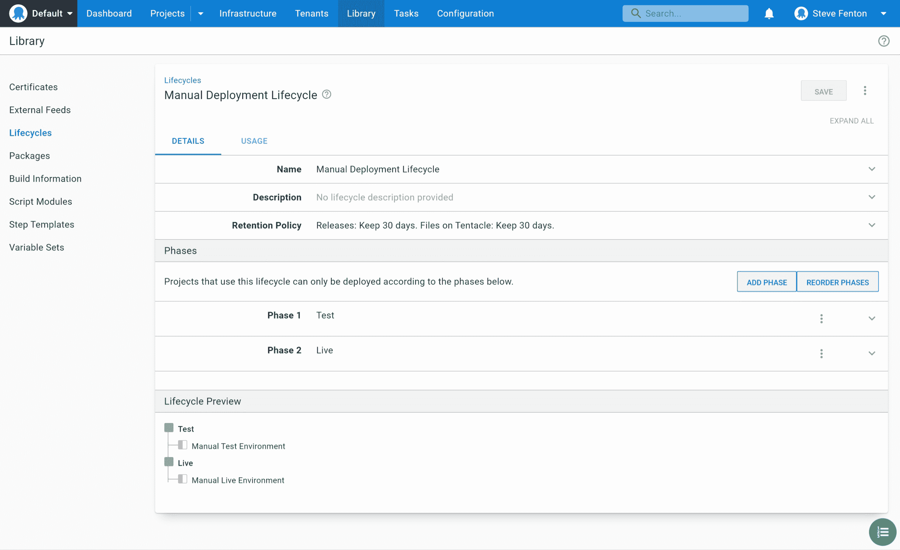
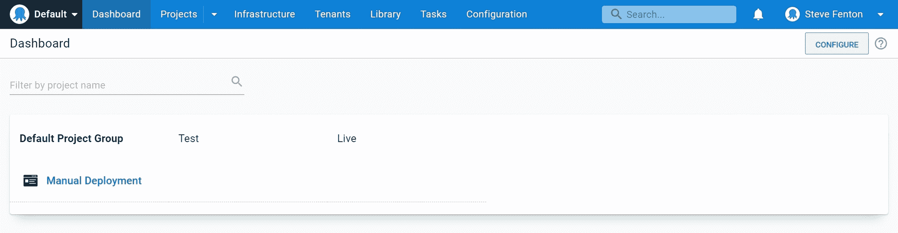
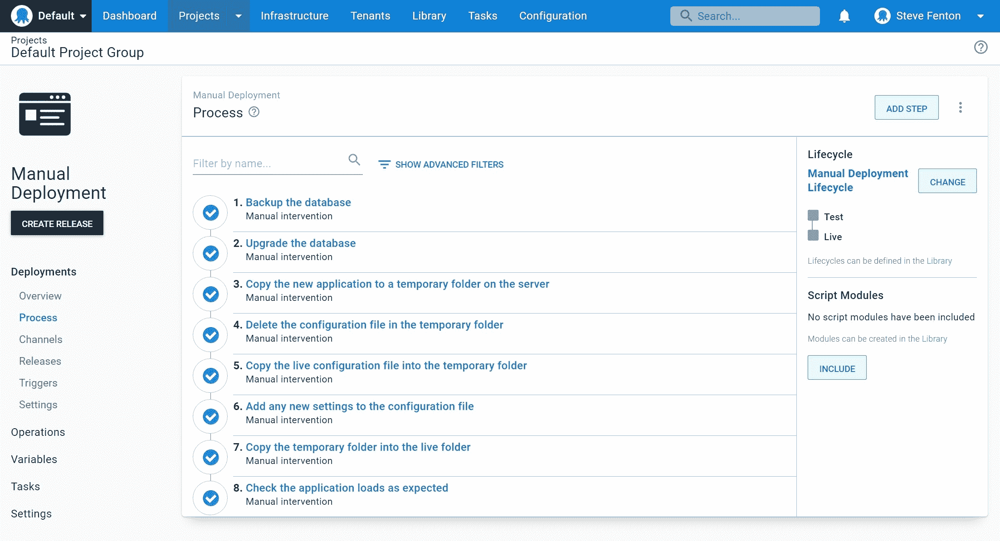
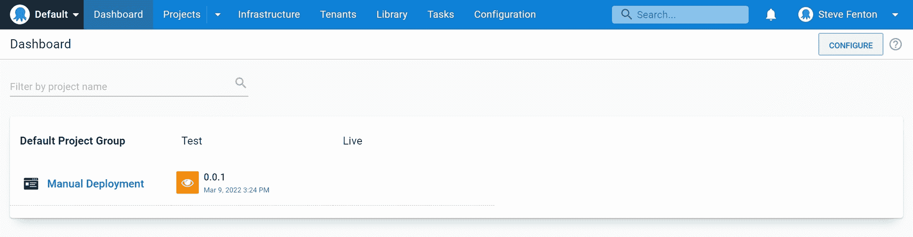

# 使用 Octopus Deploy 映射手动部署- Octopus Deploy

> 原文：<https://octopus.com/blog/mapping-manual-deployments>

虽然 Octopus Deploy 使复杂的部署自动化变得简单，但您可能仍在运行手动部署。我们与拥有遗留应用程序的客户交谈过，这些遗留应用程序在发布过程中需要特殊的步骤，或者拥有深奥的技术，使得很难确定从哪里开始自动化之旅。

在这篇文章中，我解释了如何使用手动干预步骤对您的手动部署进行建模，以及这给您的发布过程带来的好处。

如果您是 Octopus 的新手，您可能会发现这是从您当前的部署过程向完全自动化推进的一种实用方法。现有客户可能会发现这种技术带来了他们已经从自动部署到手动发布中获得的熟悉的好处。

## 使用 Octopus 进行手动部署的优势

使用 Octopus 进行手动部署有很多好处。这些超出了您从任务管理应用程序中可能获得的好处。您可以:

*   使用生命周期来跟踪跨多个环境的部署
*   提供完成每个步骤的说明
*   确保授权团队成员完成每个步骤
*   提高部署的可靠性和可追溯性
*   用更少的努力满足审计要求

为了进一步的好处，您还可以自动执行手动部署中的一些步骤。

## 为您的手动部署建模

您需要完成 4 个步骤来模拟您的手动部署:

1.  创建清单
2.  为您的团队建模
3.  定义生命周期
4.  将您的清单转变为部署流程

第一步是帮助设计您稍后将使用的流程的书面练习。其他步骤在 Octopus 中完成，以便根据您在设计阶段发现的步骤对您的部署进行建模。

### 创建清单

当您有一个手动发布过程时，现有的文档或清单通常描述了安装软件的步骤。您当前的文档可能还会详细说明谁可以执行每个操作。在用 Octopus 重新创建之前，有必要花一些时间来细化这些阶段，以确定谁做什么，以什么顺序做。

如果你的文档很长，试着用提供自然任务列表的标题来分割它。

您最终应该会看到类似于以下清单的内容:

| 步骤 | 标题 | 谁 |
| --- | --- | --- |
| 一 | 备份数据库 | 工商管理学博士(Doctor of Business Administration) |
| 2 | 升级数据库 | 工商管理学博士(Doctor of Business Administration) |
| 3 | 将新应用程序复制到服务器上的临时文件夹中 | 工作 |
| 四 | 删除临时文件夹中的配置文件 | 工作 |
| 5 | 将实时配置文件复制到临时文件夹中 | 工作 |
| 6 | 将任何新设置添加到配置文件中 | 工作 |
| 七 | 将临时文件夹复制到活动文件夹中 | 工作 |
| 8 | 按照预期检查应用程序负载 | 试验 |

如果您没有现成的核对表，您可能会发现创建和使用核对表可以确保所有步骤都按正确的顺序进行，从而提高部署的可靠性。

现在，您可以将它转移到 Octopus 中，以获得工作流管理和跟踪的好处。

### 为您的团队建模

示例清单包括负责部署的*列中的 3 个团队:DBA、Ops 和 Test。当您在 Octopus 中创建流程时，您可以将每个步骤分配给一个负责团队*。**

按照以下步骤在 Octopus 中创建每个团队:

1.  导航至**配置**然后**团队**并选择**添加团队**。
2.  输入**新团队名称**，例如`DBA Team`，选择**保存**。
3.  打开**用户角色**选项卡，选择**包含用户角色**。
4.  从列表中选择**项目部署者**，选择**定义范围**。
5.  在**选择项目组**下选择**默认项目组**，点击**应用**，最后**保存**。

**项目部署者**角色授予用户所有项目贡献者权限，此外还有:部署版本和执行操作手册。

您可以通过选择**添加成员**选项来添加团队成员。

[T38](#)

### 定义生命周期

[生命周期](https://octopus.com/docs/releases/lifecycles)让你控制你的软件版本在你的环境之间升级的方式。对于手动部署，您可以使用生命周期来控制升级的顺序，例如，如果某个版本的软件没有首先部署到*测试*环境中，就可以防止它被部署到*生产*环境中。

您需要首先定义环境，然后使用生命周期来设置发布在环境中流动的顺序。

您可以通过以下步骤添加环境:

1.  导航至**基础设施**然后**环境**并选择**添加环境**。
2.  输入一个**新环境名**，例如`Test`，点击**保存**。

您通常将部署目标添加到新环境中，但是您可以跳过这一步，直到您需要执行某种形式的自动化。

添加环境后，您可以创建一个生命周期，并将环境添加为*阶段*:

1.  导航到**库**然后**生命周期**并选择**添加生命周期**。
2.  输入生命周期的**名称**，例如`Manual Deployment Lifecycle`。
3.  在**阶段**下，选择**添加阶段**添加每个环境。
4.  添加完阶段后，选择**保存**。

您的完整生命周期应该包含每个环境的一个阶段，如下所示。

[](#)

### 将您的清单转变为部署流程

现在您的团队、环境和生命周期已经配置好了，您可以使用它们来定义您的手动部署过程。该流程存储在 Octopus Deploy 中的一个*项目*中，因此下一步是创建一个新项目。为此，请按照下列步骤操作:

1.  导航到**项目**并选择**添加项目**。
2.  添加一个**新项目名称**，如`Manual Deployment`。
3.  选择要添加新项目的**项目组**，例如“默认项目组”。
4.  选择**生命周期**，例如您之前创建的“手动部署生命周期”，点击**保存**。

您现在可以看到您的项目列在**默认项目组**下。您还可以在仪表板上看到该项目。

[](#)

您现在已经准备好添加步骤的所有资源，所以导航到**项目**，然后**手动部署**，然后**流程**开始。

您可以为每个清单项目添加一个步骤，以创建一个驱动您的手动部署的流程。对列表中的每项任务重复以下过程。

1.  点击**添加步骤**，使用搜索词`Manual Intervention`过滤步骤模板。
2.  在**需要手动干预的**步骤上点击**添加**，并将你的检查表中的标题输入**步骤名称**，例如`Backup the database`。
3.  如果你有这个步骤的文档，你可以把它添加到**指令**字段，它使用 markdown 格式。
4.  使用**责任团队**下的列表选择正确的团队，例如“DBA 团队”并点击**保存**完成步骤配置。

您可能希望调整阻止部署的默认选项，以防止同时发布。在**阻止部署**设置下，选择**防止其他部署等待干预**。

在您添加您的步骤之后，导航到**项目**、**手工部署**，然后**流程**并查看流程概述，它应该看起来像这个例子。

[](#)

## 使用流程跟踪发布

虽然您没有要部署的包，但是您仍然可以使用 Octopus 中的一个发行版来跟踪部署。

1.  导航到**项目**，然后**手动部署**，然后**流程**并选择**创建发布**。
2.  输入一个**版本**，您可以输入您正在部署的应用的版本或内部版本号，然后点击**保存**。

现在，您可以跟踪每个环境的手动部署。如果按照您之前配置的生命周期的控制，发布首先被部署到*测试*环境中，那么发布只能进行到*活动*环境中。

1.  从新版本的发布屏幕中，选择**部署以测试**。
2.  将出现确认屏幕，查看信息并选择**部署**。

为发布创建了部署，并且第一个手动干预步骤**备份数据库**，已经准备好由 DBA 团队的成员来执行。发布有一个手动干预图标，向您显示它正在等待一个团队成员来拾取它。

[【](#)

只有 DBA 团队的成员可以给自己分配**备份数据库**任务。他们通过点击仪表板上的发布并选择**分配给我**来完成此操作。

手动部署的每个步骤的流程是:

1.  在步骤上选择**分配给我**。
2.  使用任务摘要中的步骤说明来完成该步骤。
3.  在**注释**字段中输入任何注释、日志或手动步骤的输出。
4.  选择**继续**完成该步骤。

团队成员完成一个步骤后，下一个步骤就可供相关团队成员使用。

任务日志记录了步骤完成的日期和时间、完成者以及他们输入的任何注释。

```
 |   == Success: Step 1: Backup the database ==
15:13:26   Verbose  |     Backup the database completed
13:21:28   Verbose  |     Resuming after completion
13:21:28   Info     |     Submitted by: Sarah (DBA) at 2022-03-03T13:21:24.3250260+00:00
...

...
                    |   == Success: Step 8: Check the application loads as expected ==
13:25:53   Verbose  |     Check the application loads as expected completed
13:27:33   Verbose  |     Resuming after completion
13:27:33   Info     |     Submitted by: Tina (Test) at 2022-03-03T13:27:25.7892278+00:00
13:27:33   Info     |     Notes: 42 passed
                    |     0 failed
                    |     PASS 
```

第一次部署后，您可能会决定调整流程。当您创建一个版本时，会对该流程进行快照，以确保该流程在所有部署中保持一致。如果您对流程进行了任何更改，要运行新流程，请创建新版本。

## 寻找自动化的机会

当您第一次开始规划您的手动部署过程时，自动化可能不是您的目标。然而，您现在有了自动化的起点，并且可以回顾这些步骤，看看您是否可以通过这些成熟度级别来推进它们:

1.  手动步骤
2.  可以手动运行的脚本
3.  自动运行并手动检查的脚本化步骤
4.  自动运行的脚本化步骤

例如，数据库备份当前是手动执行的，但是您可以更新此步骤的指令，以包括运行备份的脚本。尽管脚本仍将手动运行，但每次备份更有可能以相同的方式完成。

在手动执行脚本指令后，您可以将该脚本移动到新的自动化步骤中。现有的手动干预步骤可以成为自动化按预期工作的“检查”,当您对自动化有信心时，您可以完全删除手动步骤。

您可能会发现现有的步骤模板将有助于您的自动化；例如，有用于在 AWS、Azure 和 SQL Server 上备份 SQL 数据库的步骤模板。导航到**库**、**步骤模板**、**浏览库**可以找到步骤模板。

## 结论

现在，您可以在 Octopus Deploy 中映射手动部署，并了解这样做的一些好处。您可以使用 Octopus 的流程控制和跟踪来引入或改进实用部署的十大支柱中的几个，因为您的部署将更加可重复、可见、可审计、标准化和协调。

愉快的部署！