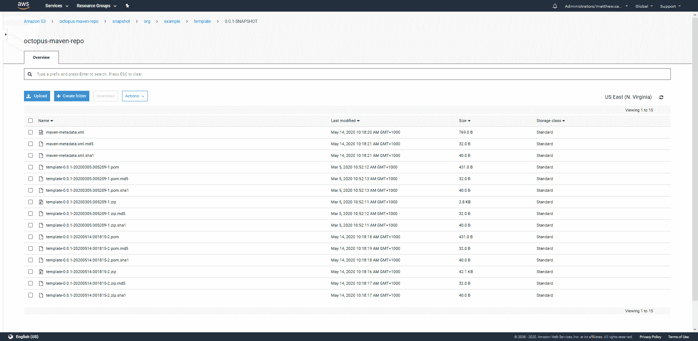

# Maven 知识库解释——Octopus 部署

> 原文：<https://octopus.com/blog/maven-repos-explained>

[](#)

Maven 为 Java 开发人员提供了许多特性。作为一个构建工具，Maven 提供了良好支持的项目格式和大量构建工具插件，可以创建几乎任何种类的 Java(或 JVM)应用程序。虽然 Maven 仍然很受欢迎，但这个领域也存在其他构建工具，如 Gradle。

Maven 还定义了一个几乎被 Java 开发人员普遍使用的标准包存储库。Maven 存储库相当简单，因为它是使用静态文件实现的。除了 HTTP 服务器之外，没有任何 API 和服务器来托管文件。这使得检查 Maven 存储库的内容和访问其中包含的文件变得很容易。

在这篇博文中，我将研究文件如何托管在 Maven 存储库中，并学习如何访问工件。

## Maven Central 与 Maven 搜索门户

Maven Central 是一个免费的公开的开源库和应用程序库。Maven Central 有很多镜像，但是主存储库可以在[https://repo1.maven.org/maven2/](https://repo1.maven.org/maven2/)找到。

正如简介中提到的，Maven 存储库只不过是保存在特定格式的层次结构中的静态文件。你可以在网络浏览器中打开[https://repo1.maven.org/maven2/](https://repo1.maven.org/maven2/)并自己浏览目录结构，无需其他工具。

然而，能够快速搜索这些存储库是非常方便的，像[https://search.maven.org/](https://search.maven.org/)这样的网站维护存储库中工件的索引，并通过搜索公开它们。

重要的是要意识到，与公开具有搜索功能的 API 的其他工件存储库不同，Maven 存储库是独立于任何搜索服务的实体。像[https://search.maven.org/](https://search.maven.org/)这样的网站不是 Maven 知识库，也不被 Maven 客户使用；它只提供了一个方便的界面来搜索 Maven 知识库。

## 浏览 Maven 资源库

Maven 工件由组 ID、工件 ID 和版本标识。这三个点通常被组合成一个坐标，称为 GAV(组、工件和版本)。

Octopus 发布了一个示例 Java 应用程序，其组 ID 为`com.octopus`，工件 ID 为`randomquotes`。

组 id 通常是一个反向 DNS 名称。然而，这只是一个惯例，而不是一个要求。

组和工件 id 用于构建保存 Maven 工件的目录结构。如果你打开[https://repo1.maven.org/maven2/com/octopus/randomquotes/](https://repo1.maven.org/maven2/com/octopus/randomquotes/)，你会发现许多子目录包含了版本和描述它们的元数据文件。

在发布 maven 工件时，会创建位于[https://repo 1 . Maven . org/Maven 2/com/octopus/random quotes/Maven-metadata . XML](https://repo1.maven.org/maven2/com/octopus/randomquotes/maven-metadata.xml)的文件。它列出了关于已经发布的工件的各种细节，比如版本号和工件最后更新的日期。

## Maven 工件文件

浏览到特定的 Maven 工件版本，如[https://repo 1 . Maven . org/Maven 2/com/octopus/random quotes/0 . 1 . 7/](https://repo1.maven.org/maven2/com/octopus/randomquotes/0.1.7/)显示了组成一个发布的文件。

我们再次发现 Maven 和其他包存储库之间的一些差异，特别是 Maven 工件的给定版本可以包含许多单独的文件。在下面的截图中，您可以看到这个 Maven 工件的文件包含 JavaDocs、应用程序源代码和应用程序本身，作为一个 WAR 文件:

[](#)

*构成 Maven 版本的文件。*

Maven 通过使用嵌入在工件文件名中的分类器来支持这一点。例如，文件`randomquotes-0.1.7-javadoc.jar`与该目录中的其他文件共享`com.octopus:randomquotes:0.1.7`的 GAV，但是通过分类器`javadoc`来区分。同样，文件`randomquotes-0.1.7-sources.jar`具有分类器`sources`。

文件`randomquotes-0.1.7.war`没有分类器，通常被认为是默认的工件，并且很可能是您将在自己的项目中作为依赖项部署或消费的工件。

Maven 还支持不同类型的多个文件。例如，我们可能在同一个目录中有一个名为`randomquotes-0.1.7.zip`的文件。文件扩展名被称为打包。

## 下载 Maven 文件

虽然我们可以愉快地使用 web 浏览器或 Curl 之类的工具来下载 Maven 工件，但这确实需要我们确切地知道如何构造 url。我们可以使用 Maven CLI 工具根据文件的 GAV、分类器和打包来下载文件，并让它来处理寻找正确文件的工作。

下面的命令将尝试将默认的 JAR 包下载到本地`/tmp`目录:

```
mvn org.apache.maven.plugins:maven-dependency-plugin:2.8:copy -DrepoUrl=http://central.maven.org/maven2/ -Dartifact=com.octopus:randomquotes:0.1.7 -DoutputDirectory=/tmp 
```

如果我们运行这个，我们会收到一个错误消息`Could not find artifact com.octopus:randomquotes:jar:0.1.7`。生成此错误是因为此特定工件没有可用的未分类 JAR 文件；它只包含一个 WAR 文件。我们可以将这种打包类型附加到 GAV 以下载 WAR 文件:

```
mvn org.apache.maven.plugins:maven-dependency-plugin:2.8:copy -DrepoUrl=http://central.maven.org/maven2/ -Dartifact=com.octopus:randomquotes:0.1.7:war -DoutputDirectory=/tmp 
```

为了下载与这个工件相关的源代码，我们可以定义源代码包的打包类型和分类器:

```
mvn org.apache.maven.plugins:maven-dependency-plugin:2.8:copy -DrepoUrl=http://central.maven.org/maven2/ -Dartifact=com.octopus:randomquotes:0.1.7:jar:sources -DoutputDirectory=/tmp 
```

这些命令强调了 Maven 默认下载未分类的 JAR 文件，但是如果需要的话，它可以专门下载某种类型和分类器的包。

## 快照版本

Maven 有快照版本的概念。快照工件版本通常在开发过程中使用，以便不断地重新发布相同的版本。

在下面的截图中，你可以看到来自 AWS S3 托管的 Maven 仓库的文件，这些文件是为工件`org.example:template:0.0.1-SNAPSHOT`准备的。有多个 ZIP 文件，其名称如下:

*   `template-0.0.1-20200305.005209-1.zip`
*   `template-0.0.1-20200514.001815-2.zip`

这两个文件都代表推送到存储库的快照版本:

[](#)

*组成快照发布的文件。*

终端用户通常不需要担心下载特定的快照版本。Maven 客户端将检查位于[https://octopus-maven-repo . S3 . amazonaws . com/SNAPSHOT/org/example/template/0 . 0 . 1-SNAPSHOT/maven-metadata . XML](https://octopus-maven-repo.s3.amazonaws.com/snapshot/org/example/template/0.0.1-SNAPSHOT/maven-metadata.xml)的文件，读取每个文件的更新时间，并自动下载最新的文件。

注意，只有快照版本包含第二个`maven-metadata.xml`文件。非快照版本预计只发布一次并保持不变，因此组成非快照版本的文件可以根据 GAV、打包类型和分类器来确定，从而消除了对第二个`maven-metadata.xml`文件的需要。

## 结论

因为它们只是静态文件，所以与 Maven 仓库交互相对简单。如果您知道 url 是如何构造的，Web 浏览器和 Curl 之类的工具可以直接下载工件。

快照版本可能有点棘手，因为文件名包含必须从`maven-metadata.xml`文件中读取的唯一时间戳。

使用 Maven 命令行工具`mvn`避免了这些问题，并允许您下载只知道组 ID、工件 ID 和版本，以及可选的分类器和打包类型的文件。