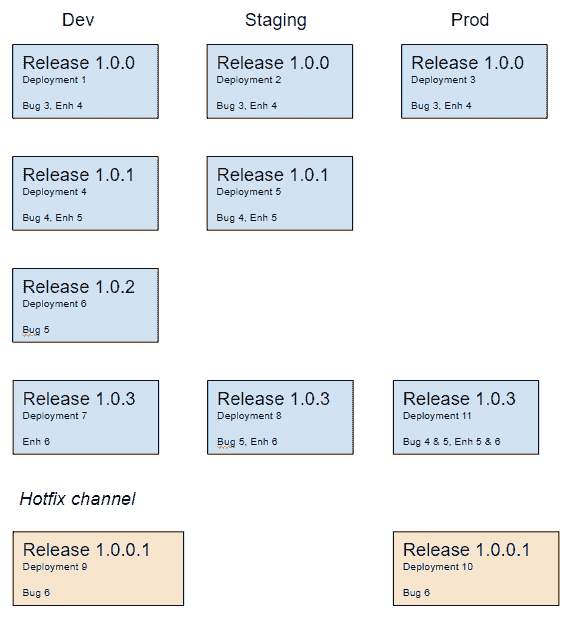
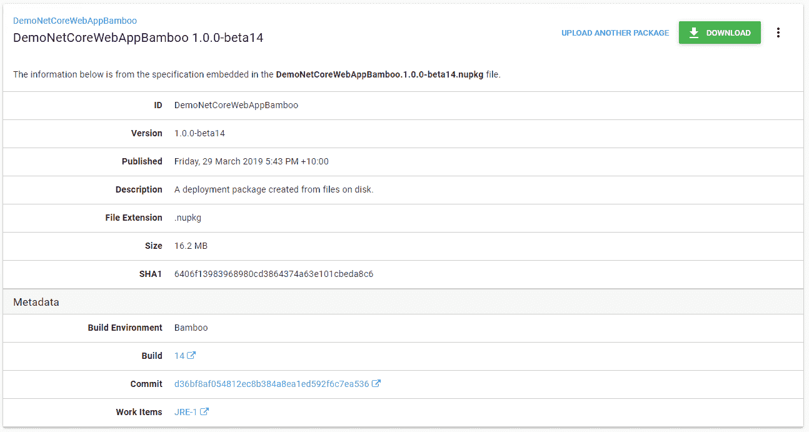
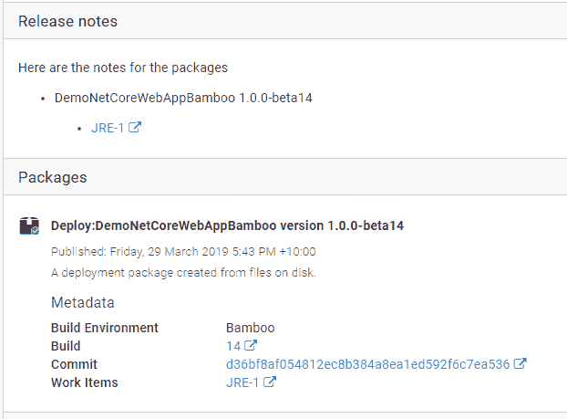
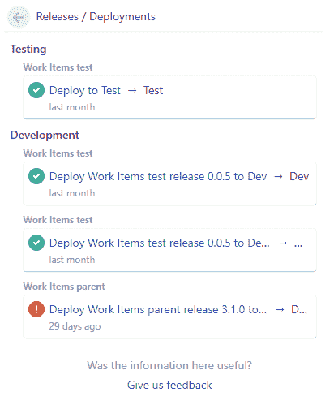

# 从代码到部署跟踪您的工作- Octopus Deploy

> 原文：<https://octopus.com/blog/metadata-and-work-items>

在本帖中，我们很高兴地宣布 Octopus Deploy 2019.4 中的一些新功能，这些功能专注于收紧您的 CI/CD 渠道中的反馈循环。这些特性通过传递更多关于构建的信息，加强了构建服务器和 Octopus 之间的集成。

八达通 2019.4 包括:

*   构建信息和工作项跟踪
*   发行说明模板和发行说明自动生成
*   八达通与吉拉整合

我们将在另一篇文章中介绍[发行说明模板](/blog/release-notes-templates)，现在让我们来看看其余的特性。

## 构建信息和工作项跟踪

构建软件的固有思想是，随着时间的推移，产品是已经构建、发布和部署的特性、问题和错误的积累。

接下来，我们希望跟踪软件的每个版本中添加了哪些特性、问题和缺陷，以及哪些正在部署。我们使用广义的术语**工作项**来指代一个特性、问题或者 bug。换句话说，Octopus 可以跟踪从代码到构建到部署的工作项目，这可以更深入地了解软件的任何给定版本中包含的内容。

在发行版之间交流变更的最常见方式是使用发行说明，工作项的引入并没有改变 Octopus 处理发行说明的方式，但是我们添加了构建信息和工作项作为单独的附加信息。我们所做的一个改变是部署现在也有了发布说明，或者更确切地说，我们称之为**发布变更**。这些是根据部署中的版本自动收集的，因此您不需要手动输入它们。

“等等，”我听到你说。“在部署中释放 **s** ？难道我们不部署**一个**版本吗？”是的，但是请记住，构建软件是一个累积的过程，因此我们部署的是自上次部署到该环境/租户以来发生的所有版本的集合。

好了，这有点拗口，让我们来看一个例子。

此图描述了随着时间的推移而发生的多个发布和部署，以及每个部署的工作项详细信息。在这个场景中，每个版本都被立即部署到开发环境中，这是最简单的情况，因为只涉及到一个版本。

`1.0.3`的部署展示了一个更复杂的工作项汇总。当`1.0.3`被部署到登台环境中时，它包含了来自版本`1.0.2`和`1.0.3`的工作项。类似地，当它被部署到 Prod 环境中时，它也包含了来自`1.0.1`的工作项。

## 它是如何工作的？

为了完成这项工作，我们更新了构建服务器插件，增加了一个新的`Octopus Metadata`步骤。这一步收集关于构建和提交的元数据，并将所有这些包含在对 Octopus 的调用中。这类似于推送包，需要元数据描述的包的 packageID 和版本。

这个包本身不一定是你推给八达通的。这是一个重要的部分，Octopus 正在接收给定 packageID 和版本的元数据，并存储这些元数据以供创建发布和部署时使用。包本身可以是任何格式，来自任何提要，包括来自容器库中的容器图像。

元数据包括指向创建包的版本的链接，以及包中包含的任何工作项。

对于确实被推送到 Octopus 的包，当您在库中查看它们时，您将会看到元数据。

此元数据也会出现在“发布”、“部署预览”和“任务”页面上。对于来自外部提要的包，发布是在 Octopus 门户中看到包的元数据的第一个点。

## 部署变量

正如我们上面提到的，部署已经扩展到包括“发布变更”重要的一点是**部署总是将来自**版本的发布说明聚集到发布变更中，即使没有元数据和工作项。

我们将在另一篇文章中对此进行更多讨论。

## 部署发布步骤

什么时候包裹不是包裹？当它是一个*中的子项目时，部署一个发布*步骤。这种情况也包括在内。元数据和工作项不仅会在子项目的发布/部署中进行计算，而且还会在“父”项目的发布/部署中进行汇总。

## 构建服务器

在最初的版本中，我们的 Bamboo 和 TeamCity 插件已经更新，包含了新的元数据步骤。

我们仍在为 Azure DevOps 插件更新，应该很快就可以使用。

詹金斯的支持也将到来，但我们现在没有一个时间表。

## 吉拉

到目前为止，我们谈论的一切都是以服务器和 Octopus 为中心构建的，这对任何使用 Octopus 的人都适用。让我们看看如果你使用托管吉拉你还能得到什么。

Octopus 中新的吉拉问题跟踪器扩展与吉拉的[部署仪表板](https://confluence.atlassian.com/bamboo/viewing-bamboo-activity-in-jira-applications-399377384.html)功能相结合，因此您可以获得部署反馈，就像使用 BitBucket 管道一样。

当您在 Octopus 中进行部署时，它会将信息实时反馈给吉拉，您将看到部署出现在吉拉。

吉拉集成特性的一个子集也可用于那些具有本地实例的用户，请参见我们的[文档](https://g.octopushq.com/JiraIssueTracker)了解更多详细信息。

## 包裹

CI/CD 管道中主要部分之间更紧密的集成有助于简化信息流。这些与吉拉的新集成特性就是一个很好的例子，所以如果你正在使用吉拉和八达通，现在是时候集成了！