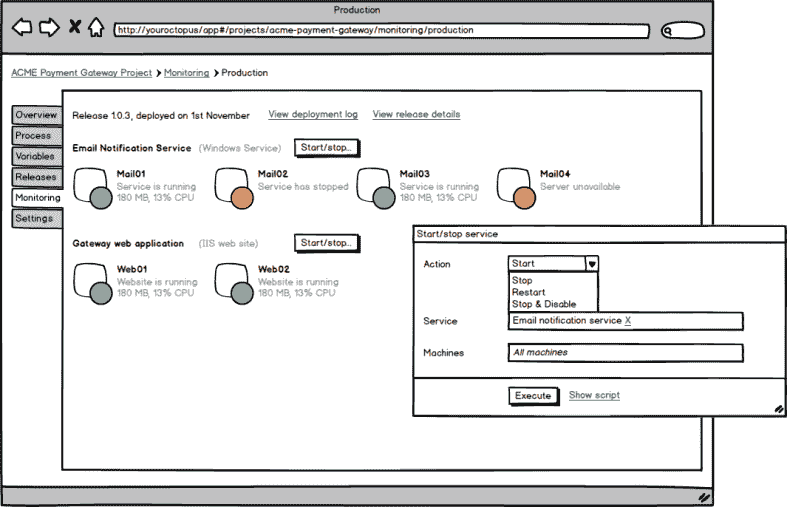

# RFC:监控和服务管理- Octopus 部署

> 原文：<https://octopus.com/blog/monitoring-and-ops-rfc>

作为一个自动化部署工具，Octopus 正好位于 DevOps 连续体的中间。构建服务器知道您正在构建的应用程序，但不知道它们部署在哪里。监控服务可能知道您已经部署的端点，但不知道它们在逻辑上如何联系在一起。章鱼对这两者都很了解。假设你在使用内置的约定和触须，Octopus 已经知道:

*   你有什么样的环境
*   您的应用程序由哪些 Windows 服务和 IIS 网站组成
*   您在哪些机器上部署了这些服务和 IIS 应用程序

此外，它在每台机器上都有一个智能代理服务，能够做许多有趣的事情。

鉴于我们拥有所有这些信息，难道我们不应该更多地利用它们吗？Octopus 仪表板显示您的最后一次生产部署是否成功。如果它还向您显示您部署的内容是否仍在运行，那会怎么样？

这里有一个大概的说明:

在本例中，我们部署了一个系统，该系统由一个 IIS web 应用程序(运行在两个服务器上)和一个 Windows 服务(运行在四个服务上)组成。

如果启用了监控，触手代理将会密切关注它在部署过程中配置的任何服务或网站。如果状态发生变化，它会将此信息发送回 Octopus。

不过，它不仅仅局限于监视状态:您还可以启动/停止这些服务。您昨天部署到 30 台机器上的 Windows 服务在其中 7 台机器上突然崩溃了吗？没问题，只需点击按钮，选择你想重启的 7，点击执行按钮。肯定胜过使用远程桌面！另外，会有很好的审计记录。

请注意，我们并不想成为一个 [Pingdom](https://www.pingdom.com/) 或 [Nagios](http://www.nagios.org/) 。但是，如果您正在部署十几个小型 NServiceBus Windows 服务，并且没有很多监控或操作系统，这可能是一个方便的小工具。

这只是我们在 2014 年考虑的众多重要功能之一，我甚至不知道我们是否会实际构建它。**我希望得到您的反馈**。这样的功能对您或您的运营团队有用吗？你还会用它来监视什么？会有什么帮助？