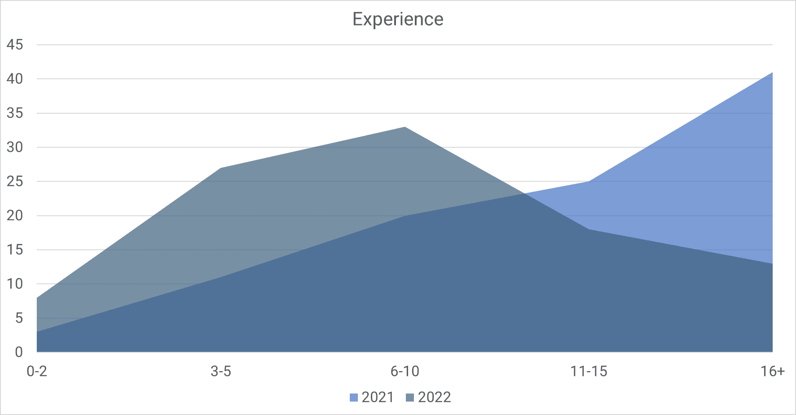
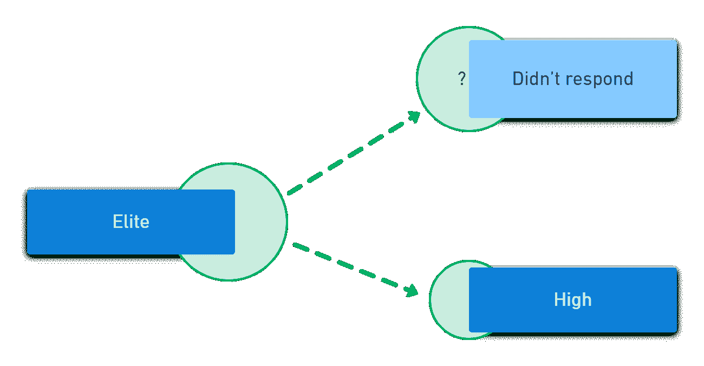
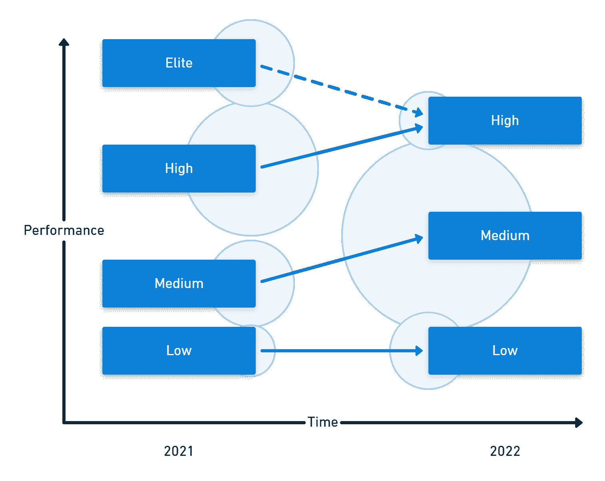

# 新的 DevOps 性能集群- Octopus 部署

> 原文：<https://octopus.com/blog/new-devops-performance-clusters>

2022 年，DevOps 的加速状态报告包含一些惊喜。一个是对传统性能集群的改变。该报告还介绍了一种使用额外维度对组织进行分组的新方法。

这篇文章向您介绍了最初的性能集群，解释了其中的变化，并描述了如何使用新的集群。

## 以前的更改

这不是第一次发生变化了。在过去的 8 年里，随着研究人员发现新的联系或探索新的方向，情况发生了变化。过去的一些变化对新的聚类技术有直接的影响。

在过去的 DevOps 报告中，DORA (DevOps 研究和评估)研究人员使用 4 个关键指标根据绩效将组织分为几组:

1.  部署频率
2.  变革的准备时间

3.  变更失败率
4.  平均恢复时间

2018 年，DORA 增加了一个新的指标*可用性*来衡量一个组织的运营绩效。他们后来把这个改成了*可靠性*。

您可以使用最初的 4 个度量标准(通常称为 4 个关键)来度量软件交付性能，但是使用所有 5 个度量标准可以让您度量软件交付*和操作*性能，通常简称为 *SDO 性能*。

在所有 5 项衡量指标上表现良好将推动组织绩效。当团队在这些指标上表现出色时，您的组织更有可能实现其目标。您的操作性能支持软件交付性能和组织成果之间的关系。

## 簇

分类是一组数据，其成员彼此之间的相似程度高于与另一组中的项目的相似程度。这在 DevOps 报告的状态中是有用的，因为它允许许多组织被有条不紊地安排用于比较。

研究团队使用层次聚类来发现 DevOps 报告状态中的性能组。这种技术没有预先定义聚类，而是让它们从数据中显现出来。

研究人员使用聚类测试假设。例如，通过根据部署频率对组织进行分组，他们可以看到部署频率越高的组织越有可能实现他们的目标。每次研究人员在不同的样本上重复分析，他们可以测试假设的有效性。这种科学方法是研究人员如何增加他们对推动绩效的实践的信心。

## 软件交付性能集群

如果您已经关注 DevOps 报告有一段时间了，您将会对软件交付性能集群很熟悉。根据吞吐量和稳定性指标，每个组代表不同的性能级别。这通常会导致 4 个集群。

| 性能水准 | 研制周期 | 部署频率 | 变更失败率 | 平均解决时间 |
| --- | --- | --- | --- | --- |
| 精英 | 不到 1 小时 | 每天多次 | 0-15% | 不到 1 小时 |
| 高的 | 1 天- 1 周 | 每周到每月 | 16-30% | 不到 1 天 |
| 中等 | 1-6 个月 | 每月一次到每半年一次 | 16-30% | 1 day - 1 week |
| Low | > 6 个月 | 少于每 6 个月一次 | 16-30% | 超过 6 个月 |

组织可以根据吞吐量和稳定性指标将他们的软件交付性能与集群进行比较，并确定潜在的改进领域。

### 软件交付集群在 2022 年如何变化

2022 年软件交付集群最明显的变化是只有 3 个组，而不是 4 个。elite performance 组的删除将在后面进行更详细的描述，但是让我们首先考虑对其他集群的更改，因为它们同样令人惊讶。

#### 低绩效群体

您会发现最低集群的性能在 3 个指标上都有所提高，交付时间和部署频率与 2021 年的中等性能集群相当。解决问题的平均时间也缩短了 6 倍以上。但是，变更失败率增加了。

| 性能水准 | 研制周期 | 部署频率 | 变更失败率 | 平均解决时间 |
| --- | --- | --- | --- | --- |
| 2021 中等 | **1-6 个月** | **每月一次到每半年一次** | 16-30% | 1 天- 1 周 |
| 2021 年低点 | 超过 6 个月 | 少于每 6 个月一次 | 16-30% | 超过 6 个月 |
| 低(新) | 1-6 个月 | 每月一次到每半年一次 | **46-60%** | **1 周- 1 个月** |

#### 中等表现群体

中等性能组在交付时间和部署频率方面有所改进，在这些指标上与 2021 的高性能组相当。他们还减少了解决问题的平均时间，并保持了相同的变更失败率。

| 性能水准 | 研制周期 | 部署频率 | 变更失败率 | 平均解决时间 |
| --- | --- | --- | --- | --- |
| 2021 年高 | 1 天- 1 周 | **每周到每月** | **16-30%** | 不到 1 天 |
| 2021 中等 | 1-6 个月 | 每月一次到每半年一次 | **16-30%** | **1 天- 1 周** |
| 中等(新) | **每周到每月** | 每周到每月 | 16-30% | 1 天- 1 周 |

#### 高绩效团队

高性能组融合了 2021 的高性能和精英集群的性能。

| 性能水准 | 研制周期 | 部署频率 | 变更失败率 | 平均解决时间 |
| --- | --- | --- | --- | --- |
| 2021 精英 | < 1 hour | **每天多次** | **0-15%** | 不到 1 小时 |
| 2021 年高 | **1 天- 1 周** | 每周到每月 | 16-30% | **< 1 天** |
| 高(新) | 1 天- 1 周 | 每天多次 | 0-15% | 不到 1 天 |

#### 精英表演团

2022 年只有 3 个集群出现，所以 2022 年没有精英表演组。对此有两种解释:

1.  2022 年的精英受访者被吸收到改进的高性能集群中。
2.  与前几年相比，2022 年的人口特征有所不同

在前几年，许多回答者已经从事软件交付超过 10 年。2022 年，拥有十年以上工作经验的受访者比例下降了一半。这一变化似乎并不令人惊讶，因为大多数受访者的经验比往年回答调查的人少。

虽然您可以看到人口统计方面的明显变化，但不知道这是否使样本更多或更少地代表了软件开发行业。在回顾您团队的绩效水平时，您可以将您团队的经验与调查受访者进行比较，看看您是否有机会接触到经验丰富的开发人员，他们可以产生很大的影响。

人口结构的变化和随后精英群体的消失表明，经验驱动绩效。然而，具体能力和结果之间的联系每年都保持一致。

去除精英性能类别并不意味着这些组织放弃了软件开发。每年都有不同的人对调查做出回应，这次受访者的类型有了不同寻常的转变。今年的受访者总体经验较少，因此他们在吞吐量和稳定性指标上表现不佳也就不足为奇了。

调查对象的人口结构变化没有打乱 DevOps 的年度研究，而是提供了一个发现新探索方向的独特机会。

### 软件交付绩效总结

在下面的图表中，你会看到 2021 年和 2022 年的对比。每个集群的垂直位置表示性能水平，圆圈表示每个组的大小。

性能和分布的变化意味着您可以将它们视为 3 个新的性能集群，而不是以前集群的发展。需要进一步的研究来了解这些变化，但这可能与受访者的人口统计变化有关。

## SDO 性能集群

除了软件交付组的变化之外，DORA 还增加了一个新的分解，将操作性能考虑在内。针对 SDO 性能的新集群使用吞吐量、稳定性和运营性能的所有 5 项指标:

1.  部署频率
2.  变革的准备时间

3.  变更失败率
4.  平均恢复时间

*   运算性能

    5.  可靠性

可靠性度量捕获团队实现其可靠性目标的频率。

分配给组的标签暗示了一个场景，在这个场景中，您可能期望与指标相关联的性能。例如,“起始”集群展示了在产品或功能开发的早期阶段，您对团队的期望。这一组在每个维度上都表现平平。在早期阶段，团队可能更关注创新而不是可靠性。

以下是 SDO 性能集群，突出显示了低性能:

| 串 | 研制周期 | 部署频率 | 故障率 | MTTR | 可靠性 |
| --- | --- | --- | --- | --- | --- |
| 开始 | 1 周- 1 个月 | 每周或每月 | **31-45%** | 1-7 天 | **有时** |
| 流动的 | < 1 day | On demand | 0-15% | 不到 1 小时 | 通常 |
| 放慢 | 1 周- 1 个月 | 每周或每月 | 0-15% | 不到 1 天 | 通常 |
| 退休 | **1-6 月** | **每月一次或每半年一次** | **46-60%** | **1-6 个月** | 通常 |

这些组比软件交付性能集群更具描述性。组织可以采取更平衡的方法，而不是在所有产品和团队中追求高绩效。您可以为开发核心产品的团队和开发新产品的团队制定不同的绩效水平。

这种方法并非没有危险。许多团队永久地停留在初始组中，从来没有解决可靠性问题，这将释放软件交付性能对组织范围的成就的积极影响。您可能已经在类似退休集群的团队中工作过，尽管正在积极开发软件产品。退出集群的性能特征将出现在官僚组织中，其中操作团队充当看门人，防止更改在系统中移动以保持稳定。

您可以将集群名称视为有意选择性能的最佳解释。例如，当开发一个新的想法时，你可能选择放弃一些可靠性来鼓励冒险和创新。如果你没有做出有意的选择，你就冒着编造一个故事来解释糟糕表现的风险。未来的研究可能会测试这些聚类名称的准确性。

新集群最实际的应用是使用它们将您的精力集中在核心软件系统上。您销售的系统和给您带来竞争优势的业务线应用程序是最先进入流动状态的。永远不要把这些系统归类为*变慢*，只有当你有一个退出或替换的有效计划时，才指定一个系统为*退役*。

处于流动状态的团队更普遍地使用 DevOps 结构方程模型的功能，例如:

你可以在 [DevOps 工程师手册](https://octopus.com/devops/)中阅读更多关于[连续交付能力](https://octopus.com/devops/continuous-delivery/#continuous-delivery-capabilities)的信息。

虽然一些组织在没有达到 SDO 性能的流动状态的情况下实现了足够的性能，但是他们以更高的成本做到了这一点，增加了倦怠、更多未计划的工作和更低的变更率。

## 结论

最初的软件交付性能集群在您的组织中的性能评估中仍然是关键的。运营绩效释放高绩效的优势，将其影响扩展到组织层面。新的 SDO 性能集群试图证明可靠性对软件交付的重要性，但由于试图分配非判断性标签，可能会产生误导。

精英表演集群的消失很可能与人口结构的变化有关。此外，这可能让我们发现团队需要有经验的开发人员来实现最高的性能水平。

您必须将这些行业范围的见解与本地的衡量策略结合起来，以确保您的持续改进工作是由它们对您的组织的实际影响来引导的。DevOps 报告的状态是你对你的软件交付过程进行具体的和可测量的变更的灵感来源。

## 进一步阅读

愉快的部署！