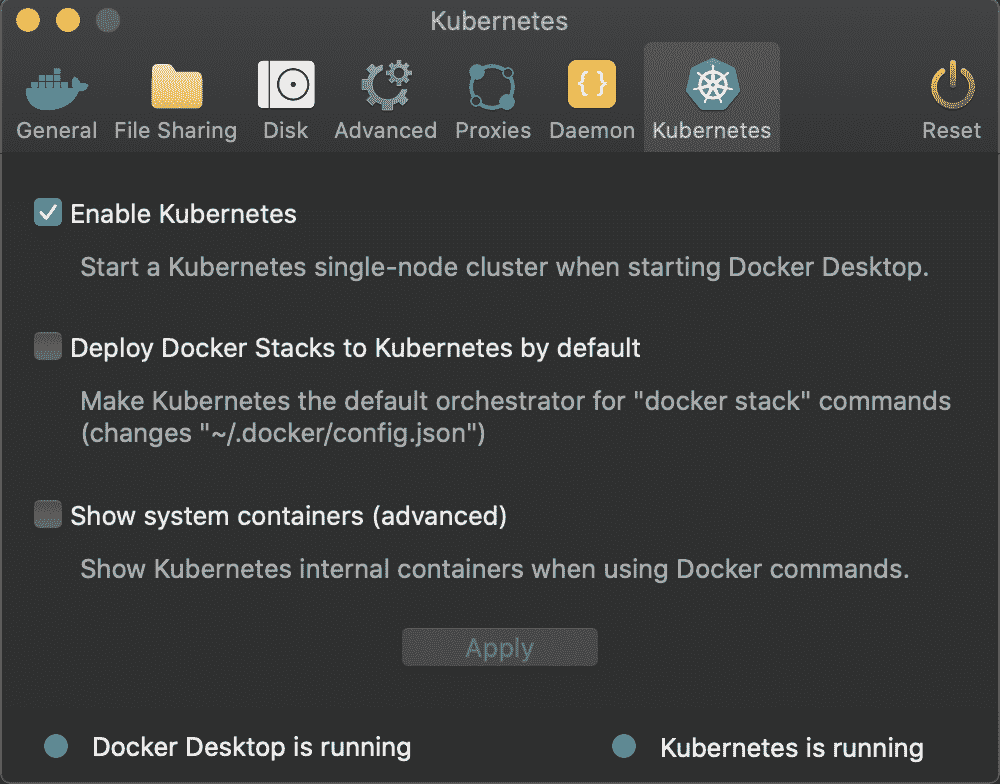

# 看看新的 NGINX 虚拟服务器和虚拟服务器路由资源——Octopus Deploy

> 原文：<https://octopus.com/blog/nginx-ingress-crds>

[](#)

Kubernetes `Ingress`资源提供了一种配置传入 HTTP 流量的方式，并使得通过单个公共 IP 地址公开多个服务变得容易。

NGINX 长期以来一直提供最受欢迎的入口控制器之一，但任何超过概念部署证明的东西都不可避免地意味着定制超越由`Ingress`资源公开的标准属性的路由规则。

直到最近，解决方案还是通过注释或在 configmaps 中提供配置块来定义这些附加设置。但是在 1.5 版本中，NGINX 入口控制器提供了两个自定义资源定义(CRD)，定义了比基线`Ingress`资源更复杂的网络规则。

在本帖中，我们将探索由`VirtualServer`和`VirtualServerRoute`CRD 提供的一些新功能。

## Kubernetes 星团样本

对于这篇博客，我使用了与 Docker 桌面捆绑在一起的 Kubernetes 发行版:

[](#)

然后，我部署了为 [Istio 博客系列](https://octopus.com/blog/istio/the-sample-application)创建的示例应用程序，它可以安装在:

```
kubectl apply -f https://raw.githubusercontent.com/mcasperson/NodejsProxy/master/kubernetes/example.yaml 
```

生成的群集如下所示:

[](#)

我用 Helm 安装了 NGINX，但是并没有想象中那么容易。GitHub 文档会把你带到 https://helm.nginx.com/edge T2 的 Helm repo，这个对我来说是失败的。来自 https://kubernetes-charts.storage.googleapis.com/[官方舵手库的图表不包括 CRDs。](https://kubernetes-charts.storage.googleapis.com/)

解决方案是克隆 NGINX Git repo 并从本地文件安装 Helm chart。这些命令适用于 Helm 3:

```
git clone https://github.com/nginxinc/kubernetes-ingress/
cd kubernetes-ingress/deployments/helm-chart
helm install nginx-release . 
```

## 一个基本的 NGINX 虚拟服务器

我们将从一个基本的`VirtualServer`资源开始来公开代理。

```
apiVersion: k8s.nginx.org/v1
kind: VirtualServer
metadata:
  name: virtualserver
spec:
  host: localhost
  upstreams:
  - name: proxy
    service: proxy
    port: 80
  routes:
  - path: /
    action:
      pass: proxy 
```

`upstreams`属性定义了流量可以发送到的服务。在这个例子中，我们将流量定向到`proxy`服务。

`routes`匹配传入的请求并执行相应的动作。通常情况下，操作是将流量定向到上游服务器，我们已经用`action.pass: proxy`配置做到了这一点。

这个`VirtualServer`复制了我们在`Ingress`资源中定义的功能，一旦部署到集群，我们就可以打开 http://localhost/whatever/you/want 查看代理 web 应用程序。

## 自定义操作

当我们开始挖掘`VirtualServer`公开的新功能时，事情变得有趣了。

`VirtualServer`可以将客户端重定向到一个新的 URL，而不是将请求传递给上游服务。在这里，我们将流量引导回 NGINX 主页:

```
apiVersion: k8s.nginx.org/v1
kind: VirtualServer
metadata:
  name: virtualserver
spec:
  host: localhost
  routes:
  - path: /
    action:
      redirect:
        url: http://www.nginx.com
        code: 301 
```

在这个例子中，我们定义了在`VirtualServer`资源中直接返回的内容。这对测试来说非常好:

```
apiVersion: k8s.nginx.org/v1
kind: VirtualServer
metadata:
  name: virtualserver
spec:
  host: localhost
  routes:
  - path: /
    action:
      return:
        code: 200
        type: text/plain
        body: "Hello World\n" 
```

## 流量分流

通过将一定比例的流量定向到新服务，流量分割可用于 canary 部署。这里我们配置`VirtualServer`将流量传递给 web 服务器服务，在`webserverv1`和`webserverv2`之间分流流量。

```
apiVersion: k8s.nginx.org/v1
kind: VirtualServer
metadata:
  name: virtualserver
spec:
  host: localhost
  upstreams:
  - name: webserverv1
    service: webserverv1
    port: 80
  - name: webserverv2
    service: webserverv2
    port: 80
  routes:
  - path: /
    splits:
    - weight: 80
      action:
        pass: webserverv1
    - weight: 20
      action:
        pass: webserverv2 
```

## 负载平衡

在 [iptables 代理模式](https://kubernetes.io/docs/concepts/services-networking/service/#proxy-mode-iptables)中，服务可用的端点是随机选择的。如果您查看上面的图表，`webserver`服务将流量同时定向到`webserverv1`和`webserverv2`部署，因此`webserver`服务的流量将在所有 pod 之间随机分配。

NGINX 允许我们指定用于将流量导向上游服务的[负载平衡规则](https://docs.nginx.com/nginx/admin-guide/load-balancer/http-load-balancer/#choosing-a-load-balancing-method)。在下面的例子中，我们将`lb-method`属性设置为`ip_hash`负载平衡算法，确保客户端总是被发送到同一个后端 pod:

```
apiVersion: k8s.nginx.org/v1
kind: VirtualServer
metadata:
  name: virtualserver
spec:
  host: localhost
  upstreams:
  - name: webserver
    service: webserver
    port: 80
    lb-method: ip_hash
  routes:
  - path: /
    action:
      pass: webserver 
```

## 超时、重试和保持活动

连接超时、重试和保持活动等低级配置细节过去被定义为`Ingress`资源上的注释。有了`VirtualServer`资源，这些设置现在被公开为一级属性:

```
apiVersion: k8s.nginx.org/v1
kind: VirtualServer
metadata:
  name: virtualserver
spec:
  host: localhost
  upstreams:
  - name: webserver
    service: webserver
    port: 80
    fail-timeout: 10s
    max-fails: 1
    max-conns: 32
    keepalive: 32
    connect-timeout: 30s
    read-timeout: 30s
    send-timeout: 30s
    next-upstream: "error timeout non_idempotent"
    next-upstream-timeout: 5s
    next-upstream-tries: 10
    client-max-body-size: 2m
  routes:
  - path: /
    action:
      pass: webserver 
```

## 添加虚拟服务器路由

`VirtualServer`资源可以将请求委托给`VirtualServerRoute`。这允许主`VirtualServer`资源配置顶级流量规则，而`VirtualServerRoute`资源处理更具体的路由规则。

在下面的例子中，请求被发送到一个`VirtualServerRoute`资源，它根据路径从三个可能的上游服务中选择一个:

```
apiVersion: k8s.nginx.org/v1
kind: VirtualServer
metadata:
  name: virtualserver
spec:
  host: localhost
  routes:
  - path: /
    route: virtualserverroute
---
apiVersion: k8s.nginx.org/v1
kind: VirtualServerRoute
metadata:
  name: virtualserverroute
spec:
  host: localhost
  upstreams:
  - name: proxy
    service: proxy
    port: 80
  - name: webserverv1
    service: webserverv1
    port: 80
  - name: webserverv2
    service: webserverv2
    port: 80
  subroutes:
  - path: /webserverv1
    action:
      pass: webserverv1
  - path: /webserverv2
    action:
      pass: webserverv2
  - path: /
    action:
      pass: proxy 
```

## 结论

入口控制器最初是 Kubernetes 生态系统中的一个家庭手工业，但随着每个提供商通过新的配置选项和功能在竞争中脱颖而出，添加到`Ingress`资源的注释使它们变得笨重和不可移植。

通过实现 CRDs，NGINX 公开了具有可验证属性的高级功能。我希望这些 CRD 会随着更多的常见用例的确定而进一步丰富。