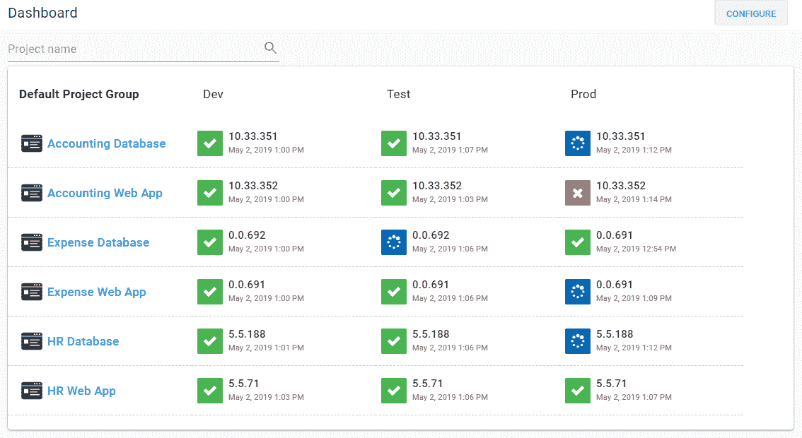
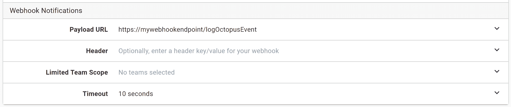
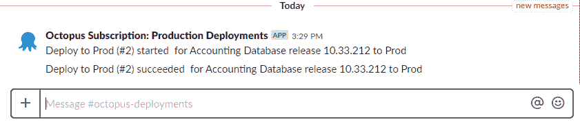
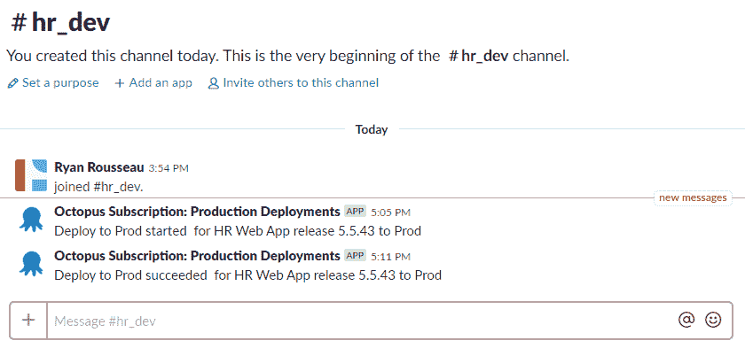
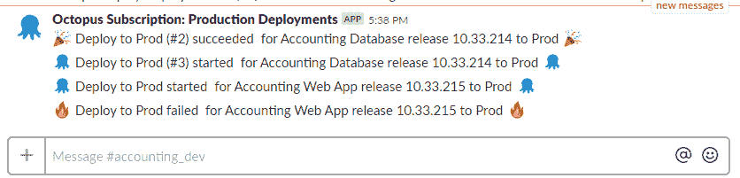
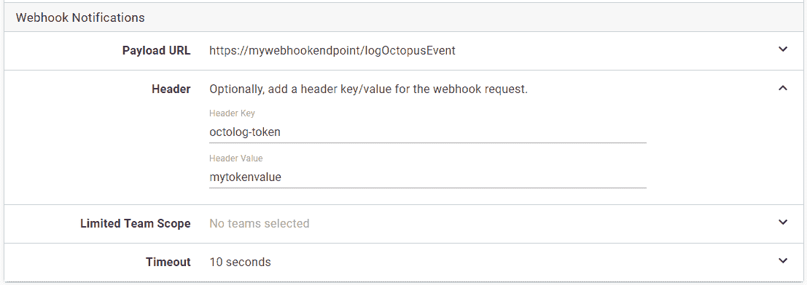

# 为每个生产部署添加通知- Octopus Deploy

> 原文：<https://octopus.com/blog/notifications-with-subscriptions-and-webhooks>

## 介绍

你好。在最近一集的[问章鱼](https://www.youtube.com/watch?v=rKwYkDN_IPU&t=22s)中，我谈到了如何使用章鱼[订阅](https://octopus.com/docs/administration/managing-infrastructure/subscriptions)和自定义 webhooks 来解决许多问题。我展示了为每个生产部署发送松弛通知的用例。我想更详细地探索这个想法，这促使我写了这篇文章。因此，让我们开始为我们所有的生产部署设置延迟通知。

## 设置

我有六个现有的项目，它们的流程中没有内置任何通知。项目的数量在这里并不重要。无论您有一个项目还是数百个项目，同样的方法都适用。

[](#)

## Webhook

出于两个原因，我将从配置 webhook 开始。第一个原因是我需要一个 webhook URL 来配置订阅。第二，我想使用 webhook 来检查有效负载，这样我就知道会出现什么数据。我将从一个简单的函数开始，它接受 web 请求并记录请求的主体。在这个演示中，我使用 Firebase 云函数作为我的端点。

```
exports.logOctopusEvent = functions.https.onRequest((req, res) => {
    console.log(JSON.stringify(req.body));

    return res.status(200).end();
}); 
```

## 签署

我们已经有了一个基本的 webhook，所以让我们设置订阅并运行部署。

我选择了三个应该发送到 webhook 进行处理的事件类别:部署开始、部署成功和部署失败。我还将环境过滤器设置为仅生产。当您第一次配置 webhook 时，您可能会选择在构建逻辑时首先将其限制在开发或测试环境中。

我还将有效负载 URL 设置为我的 webhook 的 URL。

[](#)

[](#)

## 有效载荷

在运行一个部署之后，我从函数日志中提取了有效负载体。这里有很多信息，包括触发请求的订阅的详细信息。

我们最感兴趣的信息在有效载荷中。活动部分。特别是，我们将使用类别、消息和相关文档 id。

```
{
    "Timestamp": "2019-04-26T18:37:44.1581725+00:00",
    "EventType": "SubscriptionPayload",
    "Payload": {
        "ServerUri": "https://myoctopusurl",
        "ServerAuditUri": "https://myoctopusurl/#/configuration/audit?environments=Environments-246&eventCategories=DeploymentFailed&eventCategories=DeploymentStarted&eventCategories=DeploymentSucceeded&from=2019-04-26T18%3a37%3a12.%2b00%3a00&to=2019-04-26T18%3a37%3a42.%2b00%3a00",
        "BatchProcessingDate": "2019-04-26T18:37:42.7832114+00:00",
        "Subscription": {
            "Id": "Subscriptions-161",
            "Name": "Production Deployments",
            "Type": 0,
            "IsDisabled": false,
            "EventNotificationSubscription": {
                "Filter": {
                    "Users": [],
                    "Projects": [],
                    "Environments": [
                        "Environments-246"
                    ],
                    "EventGroups": [],
                    "EventCategories": [
                        "DeploymentFailed",
                        "DeploymentStarted",
                        "DeploymentSucceeded"
                    ],
                    "EventAgents": [],
                    "Tenants": [],
                    "Tags": [],
                    "DocumentTypes": []
                },
                "EmailTeams": [],
                "EmailFrequencyPeriod": "01:00:00",
                "EmailPriority": 0,
                "EmailDigestLastProcessed": null,
                "EmailDigestLastProcessedEventAutoId": null,
                "EmailShowDatesInTimeZoneId": "UTC",
                "WebhookURI": "https://mywebhookurl/logOctopusEvent",
                "WebhookTeams": [],
                "WebhookTimeout": "00:00:10",
                "WebhookHeaderKey": null,
                "WebhookHeaderValue": null,
                "WebhookLastProcessed": "2019-04-26T18:37:12.4560433+00:00",
                "WebhookLastProcessedEventAutoId": 187275
            },
            "SpaceId": "Spaces-83",
            "Links": {
                "Self": {}
            }
        },
        "Event": {
            "Id": "Events-189579",
            "RelatedDocumentIds": [
                "Deployments-15970",
                "Projects-670",
                "Releases-6856",
                "Environments-246",
                "ServerTasks-318123",
                "Channels-690",
                "ProjectGroups-302"
            ],
            "Category": "DeploymentStarted",
            "UserId": "users-system",
            "Username": "system",
            "IsService": false,
            "IdentityEstablishedWith": "",
            "UserAgent": "Server",
            "Occurred": "2019-04-26T18:37:34.3616214+00:00",
            "Message": "Deploy to Prod (#3) started  for Accounting Database release 10.33.210 to Prod",
            "MessageHtml": "<a href='#/deployments/Deployments-15970'>Deploy to Prod (#3)</a> started  for <a href='#/projects/Projects-670'>Accounting Database</a> release <a href='#/releases/Releases-6856'>10.33.210</a> to <a href='#/environments/Environments-246'>Prod</a>",
            "MessageReferences": [
                {
                    "ReferencedDocumentId": "Deployments-15970",
                    "StartIndex": 0,
                    "Length": 19
                },
                {
                    "ReferencedDocumentId": "Projects-670",
                    "StartIndex": 33,
                    "Length": 19
                },
                {
                    "ReferencedDocumentId": "Releases-6856",
                    "StartIndex": 61,
                    "Length": 9
                },
                {
                    "ReferencedDocumentId": "Environments-246",
                    "StartIndex": 74,
                    "Length": 4
                }
            ],
            "Comments": null,
            "Details": null,
            "SpaceId": "Spaces-83",
            "Links": {
                "Self": {}
            }
        },
        "BatchId": "e6df5aae-a42a-4bd8-8b0d-43065f82d5f0",
        "TotalEventsInBatch": 1,
        "EventNumberInBatch": 1
    }
} 
```

## Webhook 重访

初始 webhook 已配置。订阅正在向它发送事件。让我们给函数添加一些真正的逻辑。

首先，我们检查是否有有效载荷。如果我们没有，我们会发回一个错误的请求响应。

然后，我们提取订阅名称和消息，并使用它来创建一个 Slack 消息。

```
exports.logOctopusEvent = functions.https.onRequest((req, res) => {
    const payload = req.body.Payload;

    if (payload) {
        return sendSlackMessage({
            "text": payload.Event.Message,
            "username": `Octopus Subscription: ${payload.Subscription.Name}`
        }).then(() => {
            return res.status(200).send();
        });
    }
    else {
        console.warn('No payload provided');
        return res.status(400).send('No payload provided');
    }
}); 
```

在推动该变更并触发另一个部署后，我们会收到一些渠道通知！

[](#)

## 路由和样式消息

默认情况下，我们的 Slack webhook 向#octopus-deployments 通道发送消息。但是，如果我们想根据项目向不同的通道发送通知，该怎么办呢？

我们可以从相关的文档 ID 中提取项目 ID。

```
const projectId = payload.Event.RelatedDocumentIds.find(id => id.startsWith('Projects-')); 
```

我们可以创建一个从项目 ID 到应该使用的通道的映射。

```
const projectToChannel = {
    "Projects-670": "#accounting_dev",
    "Projects-665": "#accounting_dev",
    "Projects-668": "#expense_dev",
    "Projects-667": "#expense_dev",
    "Projects-669": "#hr_dev",
    "Projects-666": "#hr_dev"
}; 
```

然后为我们松弛函数提供通道。

```
return sendSlackMessage({
    "channel": projectToChannel[projectId],
    "text": payload.Event.Message,
    "username": `Octopus Subscription: ${payload.Subscription.Name}`
}).then(() => {
    return res.status(200).send();
}); 
```

[](#)

太好了！现在，让我们使用类别为我们的消息添加一些特色。与我们设置频道映射的方式相同，我们可以设置从类别到表情符号的映射。

```
const categoryToEmoji = {
    "DeploymentStarted": ":octopusdeploy:",
    "DeploymentFailed": ":fire:",
    "DeploymentSucceeded": ":tada:"
} 
```

然后使用该映射来选择表情符号并将其添加到我们的信息中。

```
const projectId = payload.Event.RelatedDocumentIds.find(id => id.startsWith('Projects-'));
const channel = projectToChannel[projectId];
const emoji = categoryToEmoji[payload.Event.Category];

return sendSlackMessage({
    "channel": channel,
    "text": `${emoji} ${payload.Event.Message} ${emoji}`,
    "username": `Octopus Subscription: ${payload.Subscription.Name}`
}).then(() => {
    return res.status(200).send();
}); 
```

[](#)

您甚至可能想要获取 DeploymentFailed 类别，并向用户发送一些直接消息或发送一条文本消息或电子邮件。我们将把那个实验留到改天。

## 整理

我将映射存储在数据库中，并在函数运行时获取它们。代码开始变得相当繁忙，所以让我们开始将这些函数分开，并在管道中调用它们。

```
function getPayload([req, res]) {
    const payload = req.body.Payload;

    if (payload) {
        return Promise.resolve(payload);
    }

    return Promise.reject({
        code: 400,
        message: 'No payload provided'
    });
}

function loadMappings(payload) {
    if (categoryToEmojiMapping && projectToChannelMapping) {
        return Promise.resolve([payload, categoryToEmojiMapping, projectToChannelMapping]);
    }

    const collection = db.collection("mappings");
    const categoryToEmojiPromise = collection.doc('categoryToEmoji').get();
    const projectToChannelPromise = collection.doc('projectToChannel').get();

    return Promise.all([categoryToEmojiPromise, projectToChannelPromise])
        .then(([categoryToEmojiDoc, projectToChannelDoc]) => {
            categoryToEmojiMapping = categoryToEmojiDoc.data();
            projectToChannelMapping = projectToChannelDoc.data();

            return [payload, categoryToEmojiMapping, projectToChannelMapping];
        });
}

function createSlackOptions([payload, categoryToEmoji, projectToChannel]) {
    const projectId = payload.Event.RelatedDocumentIds.find(id => id.startsWith('Projects-'));
    const channel = projectToChannel[projectId];
    const emoji = categoryToEmoji[payload.Event.Category];

    return {
        "channel": channel,
        "text": `${emoji} ${payload.Event.Message} ${emoji}`,
        "username": `Octopus Subscription: ${payload.Subscription.Name}`
    };
}

function sendSlackMessage(options) {
    const slackUri = functions.config().slack.uri;

    const requestOptions = {
        method: 'POST',
        uri: slackUri,
        body: {
            "channel": options.channel,
            "username": options.username,
            "icon_emoji": ":octopusdeploy:",
            "text": options.text
        },
        json: true
    }

    return rp(requestOptions);
}

exports.logOctopusEvent = functions.https.onRequest((req, res) => {
    return getPayload([req, res])
        .then(loadMappings)
        .then(createSlackOptions)
        .then(sendSlackMessage)
        .then(() => { return res.status(200).send(); });
}); 
```

完美！这段代码看起来好多了。

## 批准

我们还没有解决 webhook 的授权问题。目前，任何人都可以发送与我们期望的结构相匹配的请求。那是因为我用的是公共 Firebase 云功能。如果你使用的是内部服务或托管服务，但访问被锁定，你可能不会太担心这部分。

我们可以通过在请求中添加一个包含我们在 webhook 端信任的授权令牌的头来解决这个问题。

我把我的头命名为 octolog-token，但是你可以随意命名。您甚至可以选择使用像 Authorization 这样的标准头名称。这里还需要注意的是，头值是以纯文本形式存储的。在决定使用什么标题值以及授予什么团队对订阅的访问权限时，您需要记住这一点。

[](#)

让我们添加一个函数来处理授权，并将其插入到我们的管道中。

```
function authorizeRequest(req, res) {
    const providedToken = req.get('octolog-token');
    const token = functions.config().octolog.authtoken;

    if (!providedToken || providedToken !== token) {
        return Promise.reject({
            code: 401,
            message: 'Missing or invalid token'
        });
    }

    return Promise.resolve([req, res]);
}

exports.logOctopusEvent = functions.https.onRequest((req, res) => {
    return authorizeRequest(req, res)
        .then(getPayload)
        .then(loadMappings)
        .then(createSlackOptions)
        .then(sendSlackMessage)
        .then(() => { return res.status(200).send(); });
}); 
```

现在，没有报头或带有无效令牌的请求将被拒绝。

## 一个事件只处理一次

我想从我们的订阅文档中调出这个提示。

*虽然我们尽一切努力确保事件只发送一次到给定的电子邮件或 webhook 订阅，但我们不能提供任何保证，并建议您在设计消费 API 时牢记这一点。*

在这种情况下，重复的时差通知会造成混乱。但是，没有理由忽视 doco 中的指导！让我们添加一些逻辑来确保每个事件只处理一次。Firestore 数据库支持事务，因此我们将使用它来确保我们不会处理数据库中已经存在的任何事件。

```
function checkForDuplicate(payload) {
    return db.runTransaction((transaction) => {
        const eventReference = db.collection("deployments").doc(payload.Event.Id);

        return transaction.get(eventReference).then((eventDoc) => {
            if (eventDoc.exists) {
                return Promise.reject({
                    code: 200,
                    message: `Event ${payload.Event.Id} has already been processed.`
                });
            }

            transaction.set(eventReference, payload);
            console.log("Document written with ID: ", payload.Event.Id);

            return payload;
        });
    });
}

exports.logOctopusEvent = functions.https.onRequest((req, res) => {
    return authorizeRequest(req, res)
        .then(getPayload)
        .then(checkForDuplicate)
        .then(loadMappings)
        .then(createSlackOptions)
        .then(sendSlackMessage)
        .then(() => { return res.status(200).send(); });
}); 
```

## 处理拒绝

您可能已经注意到在函数中出现了一些对 Promise.reject 的调用。你可能也注意到了，我们在任何地方都不处理这些拒绝。

在我们的拒绝中，我们发送回一个带有代码和消息的对象。我们可以在处理拒绝时检查该格式。如果匹配，我们将使用该代码和消息。如果没有，我们将发回一个普通的错误请求响应。

```
function handleRejection(res, reason) {
    if (reason.message) {
        console.warn(reason.message);
        return res.status(reason.code).send(reason.message);
    }

    console.warn(reason);
    return res.status(400).send();
}

exports.logOctopusEvent = functions.https.onRequest((req, res) => {
    const sendOkResponse = () => { return res.status(200).send(); };
    const callHandleRejection = (reason) => {
        return handleRejection(res, reason);
    }

    return authorizeRequest(req, res)
        .then(getPayload)
        .then(checkForDuplicate)
        .then(loadMappings)
        .then(createSlackOptions)
        .then(sendSlackMessage)
        .then(sendOkResponse)
        .catch(callHandleRejection);
}); 
```

## 包裹

就是这样！我们从零开始，构建了一个 webhook 函数，它不仅为所有生产部署发送 Slack 通知，还将它们路由到适当的通道。

我希望这对你有帮助。我已经将示例负载和函数文件保存在了 Github 的中。

请在评论中留下您的反馈或问题。如果你在订阅和网页挂钩方面取得了成功，请与我们分享你的故事！