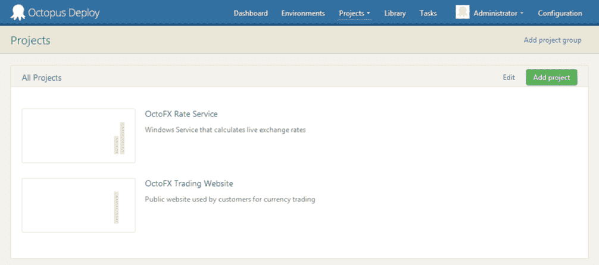
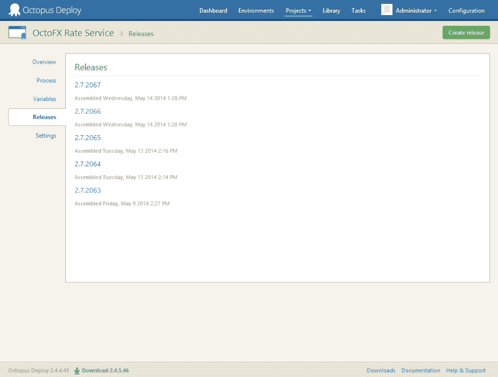
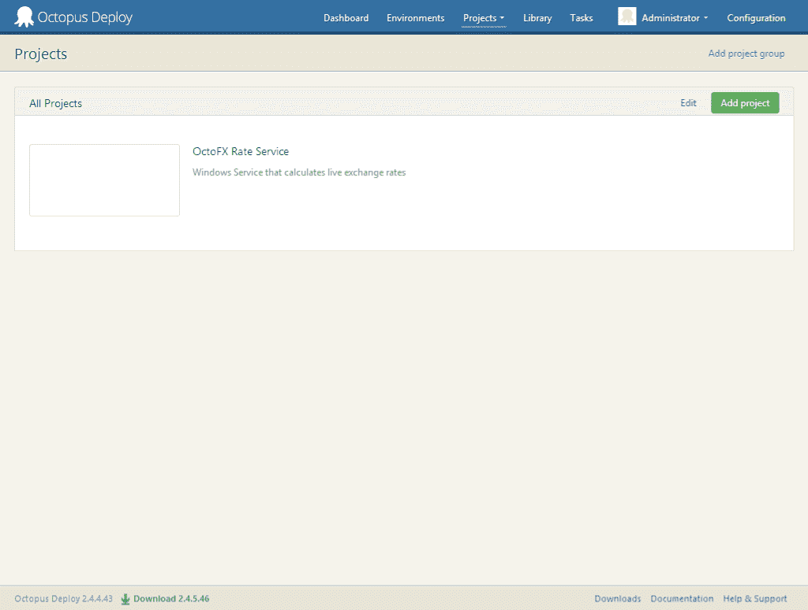
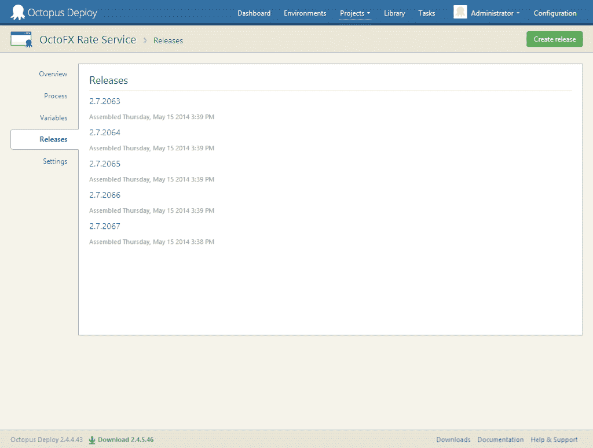

# 使用 Octo.exe-八达通部署的进出口项目和发布

> 原文：<https://octopus.com/blog/octo-exe-import-export>

**Octo.exe**，自动化 Octopus 部署的命令行工具，现在有两个新命令:`export`和`import`

这些命令可以用于在不同位置部署多个 Octopus 服务器的场景。例如，一台 Octopus 服务器用于设置和测试新项目，然后在位于完全不同的隔离网络上的另一台生产服务器上创建项目。以前，如果您想要同步两台服务器，您必须手动重新创建您已经在测试服务器上创建的项目和发布。

目前我们支持导出和导入:

*   项目和任何依赖项
*   项目的一个版本或一系列版本

## 出口

[命令用法](http://docs.octopusdeploy.com/display/OD/Export)

#### 导出项目

让我们假设您在测试 Octopus Deploy 服务器上设置和部署了以下项目，并且您想要将 Octopus FX Rate 服务项目复制到您的生产 Octopus Deploy 服务器上。



要导出 OctoFX 利率服务项目，您可以在命令提示符下执行以下命令:

```
octo export --server=http://octopusserver/ --apiKey=API-EXPORTERAPIKEY --type=project --name="OctoFX Rate Service" --filePath="C:\path\to\export\file.json" 
```

该命令将连接到 Octopus 服务器，获取所有信息，并将其写入 JSON 文件。你可以在文档中了解更多关于文件[的内容。](http://docs.octopusdeploy.com/display/OD/Export)

#### 导出项目的一个版本或一系列版本



要导出 OctoFX 利率服务项目的版本，您可以在命令提示符下执行以下命令:

```
octo export --server=http://octopusserver/ --apiKey=API-EXPORTERAPIKEY --type=release --project="OctoFX Rate Service" --releaseVersion=2.7.2067 --filePath="C:\path\to\export\file.json" 
```

或者对于一系列版本:

```
octo export --server=http://octopusserver/ --apiKey=API-EXPORTERAPIKEY --type=release --project="OctoFX Rate Service" --releaseVersion=2.7.2063-2.7.2067 --filePath="C:\path\to\export\file.json" 
```

该命令将连接到 Octopus 服务器，获取发行版，并将其写入 JSON 文件。你可以在文档中了解更多关于文件[的内容。](http://docs.octopusdeploy.com/display/OD/Export)

## 进口

[命令用法](http://docs.octopusdeploy.com/display/OD/Import)

#### 导入项目

当将项目导入另一个 Octopus Deploy 服务器时，要导入的 Octopus Deploy 服务器中必须已经存在以下内容:

*   项目使用的项目组
*   项目中使用的环境
*   项目中使用的机器
*   项目中使用的 NuGet 提要
*   项目中使用的库变量集(如果有)

一旦满足了这些先决条件，要导入我们在上一个示例中导出的 OctoFX Rate 服务，您需要在命令提示符下执行以下命令:

```
octo import --server=http://octopusserver --apiKey=API-IMPORTERAPIKEY --type=project --filePath="C:\path\to\export\file.json" 
```

如果缺少一个先决条件，输出应该类似于[项目导入输出当缺少先决条件时](http://docs.octopusdeploy.com/display/OD/Import#ImportingOctopusDeployObjects-projectimportoutputmissingprerequisite)

否则，输出应该类似于[项目导入输出](http://docs.octopusdeploy.com/display/OD/Importing+Octopus+Deploy+Objects#ImportingOctopusDeployObjects-projectimportoutput)

如果项目中有标记为`Sensitive`(即密码)的变量，您将在输出中收到一条警告，通知您必须通过 UI 更新该值才能使用，因为我们不导出敏感变量的值。

在 Octopus Deploy 中，您现在应该可以看到您导入的项目。



#### 导入版本/版本范围

当导入一个版本或一系列版本时，项目必须存在于运行导入的 Octopus Deploy 上。

要为项目导入一个版本或一系列版本，您可以运行以下命令:

```
octo import --server=http://octopusserver/ --apiKey=API-IMPORTERAPIKEY --type=release --project=projectname --filePath=C:\path\to\export\file.json 
```

输出应该类似于[发布导入输出](http://docs.octopusdeploy.com/display/OD/Import#ImportingOctopusDeployObjects-releaseimportoutput)

如果您现在转到项目页面上的 Release 选项卡，您应该会看到刚刚导入的新版本。



## 摘要

希望您会发现这是一个在 Octopus 服务器之间迁移项目/发布的有用工具。虽然这个工具可以用于许多场景，但是您的场景很可能会有所不同。请记住[Octo.exe 是开源的](https://github.com/OctopusDeploy/Octopus-Tools)——可以随意使用它作为起点，并定制和扩展它以满足您的需求。