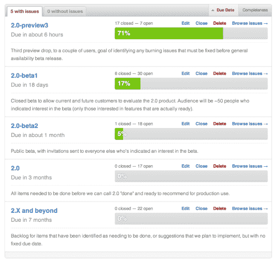
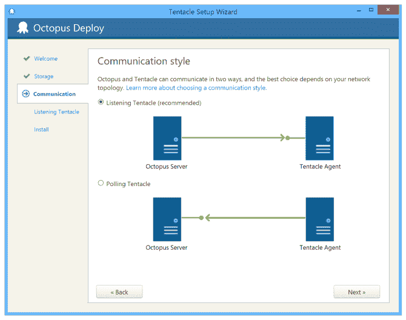

# 八达通 2.0 进度更新-八达通部署

> 原文：<https://octopus.com/blog/octopus-2.0-progress>

Octopus 2.0 不仅仅是几个新功能；这实际上是一次彻底的重写。目前，我们的大部分功能都运行良好，但仍有一些缺失部分(主要围绕安装/配置)和可用性问题，因此我们一直在向一些用户发布“手持”预览版本，以开始获得反馈。

展望未来，2.0 的推广计划如下所示:

现在，我们正在整理一些错误，以做最后的实际操作预览版。然后，我们将继续完成私有测试版(beta 1)所需的所有项目。

Beta 2 将是第一个公开发布的版本，到那时我们希望有一些东西可以用于日常使用，即使有一些小错误，没有迁移工具。我们会给它一些时间来适应和成熟，并从 1。在我们宣布它“生产就绪”之前。

我将给你留下一个新的触手设置向导的截图:

