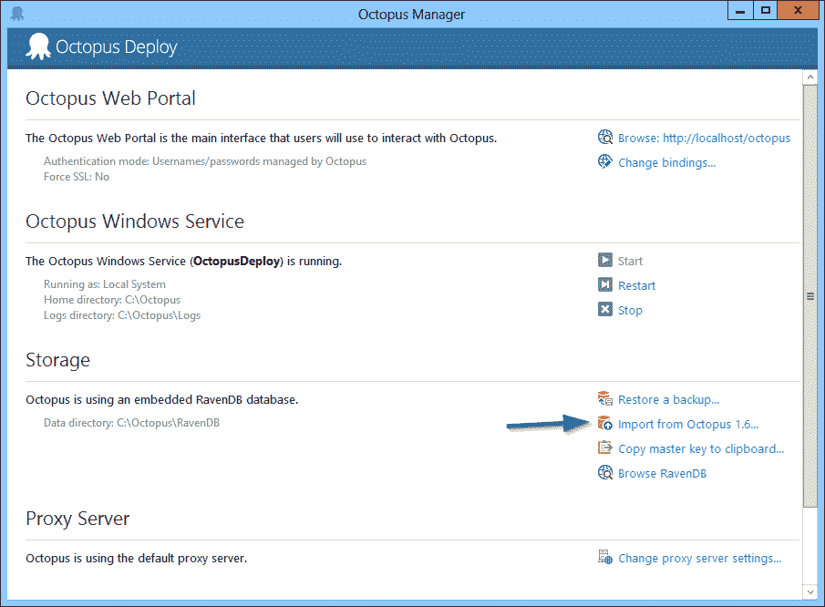

# 八达通 2.0 RC -八达通部署

> 原文：<https://octopus.com/blog/octopus-2.0-rc>

今天，我很兴奋地宣布我们发布了 Octopus Deploy 2.0.5.933，我们称之为 **Octopus Deploy 2.0 候选版本(RC)** 。你可以[从下载页面](http://octopusdeploy.com/downloads)下载这些位！

自从上一次公开测试以来，我们已经修复了一些错误，并添加了一个迁移工具来从 Octopus 1.6 实例中导入数据。

为什么我们称之为发布候选？因为我们认为它基本上是章鱼部署 2.0 T1，没有一些最后的润色。事实上，在我们的 2.0 列表中已经没有多少 T2 问题了。它们大多只是与润色和负载测试有关。

## 这个可以生产了吗？

**是的！**

我们有信心，虽然可能有一些边缘情况的错误，章鱼 2.0 钢筋混凝土已准备好严重的生产部署。此外，让我们面对它，章鱼 1.6 也有自己的 bug 和性能问题，其中大部分在 2.0 中得到修复。我们一直在使用这个版本的 Octopus 来测试和部署 Octopus 本身，以及 OctopusDeploy.com 网站和一些测试项目。

请注意**从现在开始 1.6 分支**将不再有任何维护版本。

## 更多文档

文档也在本周得到了彻底的修改，我很自豪地说，它比 Octopus 1.6 文档要广泛得多。我们现在使用 Confluence 来托管文档，这是一个很好的体验。 **[查看 Octopus Deploy 2.0](http://docs.octopusdeploy.com/display/OD/Home)** 的更新文档

## 新网站

OctopusDeploy.com 网站本周也得到了一些人的喜爱，我们通过布伦特里而不是 FastSpring 接受订单。如果您发现任何断开的链接或页面，请告诉我们！

## 下一步是什么？

我们将在一月份完成 Octopus 2.0 的最后一个任务，这个任务将使这个版本脱离 RC 状态，进入 RTW 状态，目标是在一月底发布 Octopus 2.0。

愉快的部署！