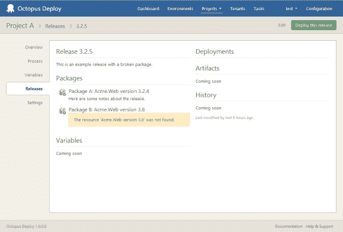
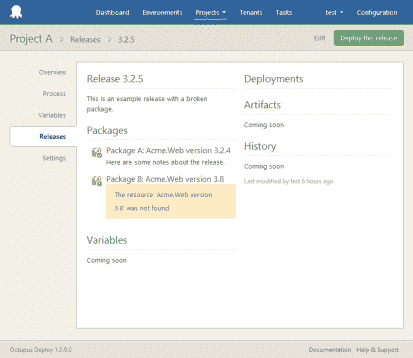
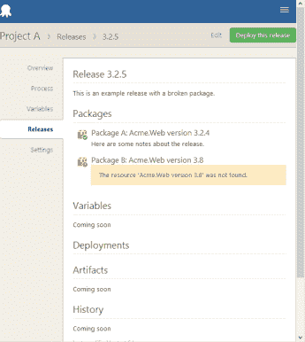
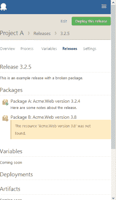
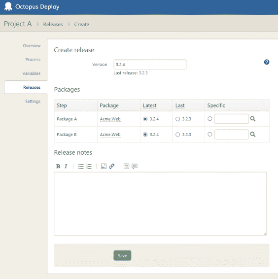
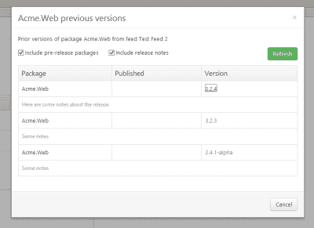

# Octopus 2.0 UI:角度、咕噜声和响应性- Octopus 部署

> 原文：<https://octopus.com/blog/octopus-2.0-ui-release-creation-angular-grunt-responsiveness>

既然做出了大胆的决定，首先使用 API，我们就有了一个选择。我们可以重构旧的 Razor/C# HTML UI 来使用新的 API。或者，我们可以拥抱新的 API，在它的基础上为 Octopus 重新构建整个 UI，坦率地说，使用看起来更适合这项工作的工具。

对于 UI 堆栈，我们使用:

*   Angular.js
*   Twitter 引导和 Angular UI 引导
*   强调
*   jQuery

事实上，在过去的一周里，我几乎没有去过 Visual Studio 我在 [WebStorm](http://www.jetbrains.com/webstorm/) 中编写所有代码，并使用 [Grunt](http://gruntjs.com/) 构建应用程序。Grunt 在 Node 下运行，类似于 MSBuild。它:

*   将所有的 Angular HTML 模板编译成 JavaScript ( [Html2JS](https://github.com/karlgoldstein/grunt-html2js) )
*   将所有的 JavaScript 文件连接并缩小成一个文件([中性](https://github.com/trek/grunt-neuter)和[丑陋](https://github.com/gruntjs/grunt-contrib-uglify)任务)
*   合并和缩小 CSS 文件( [CssMin](https://github.com/gruntjs/grunt-contrib-cssmin) )

最终结果是我得到了一个 HTML、CSS 和 JavaScript 文件，这就是 Octopus 应用程序。它指向一个 Octopus 2.0 服务器(Octopus 为 [CORS](http://en.wikipedia.org/wiki/Cross-origin_resource_sharing) 启用)。这带来了非常好的开发体验，也意味着我没有作弊——我必须像其他人一样使用公共 API 来构建 UI。

不管怎样，下面是一些截图。

下面是迄今为止在发布细节页面上取得的进展。你可以看到有些部分还没有出现。然而，一个改进是更清楚地显示是否可以找到 NuGet 包:

我一直在确保应用程序能随时响应。以下是同一屏幕不同尺寸的一些图像。

当创建发行版时，您现在可以选择使用在以前的发行版中使用的 NuGet 包。我还添加了一个基于 [MarkItUp](http://markitup.jaysalvat.com/) 的 markdown 编辑器:

当搜索旧包时，您现在可以通过预发行标签进行过滤，并包括发行说明:

随着章鱼 2.0 界面的发展，我会贴更多的截图，如果你有任何建议，请写在下面的框里:)