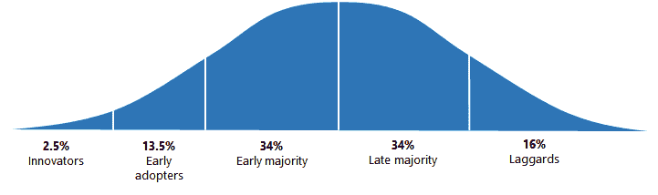
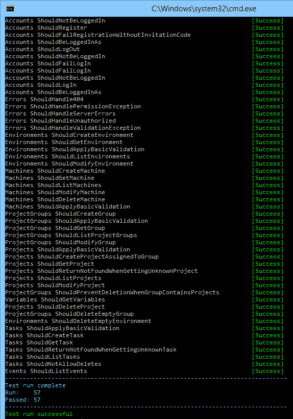

# 规划八达通 2.0 -八达通部署

> 原文：<https://octopus.com/blog/octopus-2.0-vision>

当一种产品或技术被引入时，它开始会给人以新鲜和创新的感觉。随着时间的推移，它找到了市场并开始传播。最终你认识的人都在用。然后，最终，它开始消失。[创新扩散](http://en.wikipedia.org/wiki/Diffusion_of_innovations)理论提供了一种理解这一过程的方式，它通常被描述为一条钟形曲线:

在我们的行业中，整个生命周期可能只需要几年。现在，Octopus Deploy 正在这些创新者和早期采用者中寻找市场。事实上，我们最近被添加到评估类别的 [ThoughtWorks 技术雷达](http://thoughtworks.fileburst.com/assets/technology-radar-may-2013.pdf)中:

> 像 Chef 和 Puppet 这样的工具正在增加它们的支持，但是也有像 Octopus 这样的 Windows 专用解决方案正在开发中。Octopus 允许自动部署您的 ASP.NET 应用程序和 Windows 服务，并减少对 PowerShell 的依赖。它可以与使用 Octopak 的 NuGet 和 TeamCity 一起使用，以创建完整的构建、打包和部署管道。

当 Octopus Deploy 1.0 首次发布时，我们有一个非常基本的功能集——我们可以下载一个 NuGet 包，并将其推送到远程代理，并在一些非常基本的配置支持下运行 PowerShell 脚本。从那时起，我们增加了:

当我们第一次发布的时候，我期望 Octopus Deploy 被一些项目的客户使用，将它们部署到十几台机器上。我认为银行和财富 500 强不会靠近它。事实上，我们有客户使用 Octopus 将 200 多个项目部署到 300 多台机器上，并且被一些非常知名的品牌所使用。人们不只是在尝试，而是在认真地投入。

我们也学到了很多关于我们当前架构的权衡和限制以及可以改进的方法。有些功能是我们想添加的，但如果不重新访问应用程序的大部分，这些功能是不可能添加的。

## 什么是 2.0？

在这一点上，有一种诱惑就是坚持使用当前的架构。它可能不是完美的，但它的工作。我们可以在这里或那里添加一些小功能，称之为 2.0 版，而不用做任何太重要或太冒险的事情。然后我们会转向营销模式，希望创新扩散模式顺其自然，我们不用做太多工作就能成长。最终，别人会拿出更好的产品，而我们会逐渐消失。

我认为我们可以做得更好。

我们不会走得太远，以至于完全重写所有的东西，因为那是个坏主意。但与此同时，2.0 将成为*不一样的*。1.0 是一个很好的方式来学习更多我们试图用 Octopus 解决的问题，2.0 是我们应用这些经验的地方。Octopus 2.0 将是其他人已经开发的产品。

然而，落入[第二系统效应](http://c2.com/cgi/wiki?SecondSystemEffect)陷阱的诱惑也是一样的:

> 当他设计第一件作品时，他想到了一个又一个的装饰和修饰。这些被储存起来以备“下次”使用第一个系统迟早会完成，而架构师带着坚定的信心和对该类系统的熟练掌握，准备构建第二个系统...总的趋势是过度设计第二个系统，使用所有在第一个系统中谨慎偏离的想法和装饰。

当然是在建造章鱼 1 的时候。有很多“如果我们只做了*这个*不同的事情，*那个*事情会更容易添加”的时刻。我希望我们能够解决其中一些问题，但不要走得太远。

## 2.0 的巨大变化

到目前为止，我们在 2.0 中所做的最大改变是 HTTP API 优先。服务器能做的一切都将通过 REST API 公开，web 用户界面将由 JavaScript 构建。还会有一个 C#客户端库，您可以使用它在 REST API 上提供友好的包装。

事实上，现在，Octopus 2.0 根本没有什么 UI；我通过最近在我的个人博客上写的[自动化 API 测试套件](http://paulstovell.com/blog/convention-based-rest-api-with-documentation)完成了大部分工作。

由于 web 堆栈正在被重新访问，我们甚至重新评估了运行在 IIS 上的 ASP.NET MVC 的 Octopus 1.0 选择是否仍然有效。但事实并非如此。相反，Octopus 2.0 使用 [Nancy](http://nancyfx.org/) ，自托管。当你安装 Octopus 2.0 时，只会有一个 Windows 服务；不会有 IIS 应用程序，你也不再需要在 Octopus 服务器上安装 IIS。这也为我们省去一大堆支持问题。

我们也在以不同的方式做其他事情。我们正在拥抱[最终的一致性](http://octopusdeploy.com/blog/designing-for-eventual-consistency)，所以一切都感觉*真的*快。我们正在设计新的用户界面，以便更好地为大量的项目、环境和机器服务。

我们也在做一些概念上的改变。这些不仅仅是新功能，而是思考世界的不同方式:

*   项目没有步骤列表，而是有一个[部署过程](http://octopusdeploy.com/blog/rfc-deployment-process-changes),它提供了更多关于失败时做什么的控制。
*   我们正在引入对多租户部署的支持
*   您将能够创建全局变量、环境变量和项目组变量，所有这些都有多个作用域选项
*   我们将以完全不同的方式处理变量/步长快照

随着我们对构建 Octopus 2.0 的深入，以及我们对这些变化有了更好的理解，我会在博客上发布更多关于这些变化的细节。

## 什么时候？！

什么时候发货？一旦我们在 UI 上取得了更多的进展(REST API 现在看起来相当完整)，我们将尝试为想要尝试的人提供测试版下载。我希望我们能在八月底或九月底发布一些东西，但是当我们接近测试版的时候我们会知道更多。