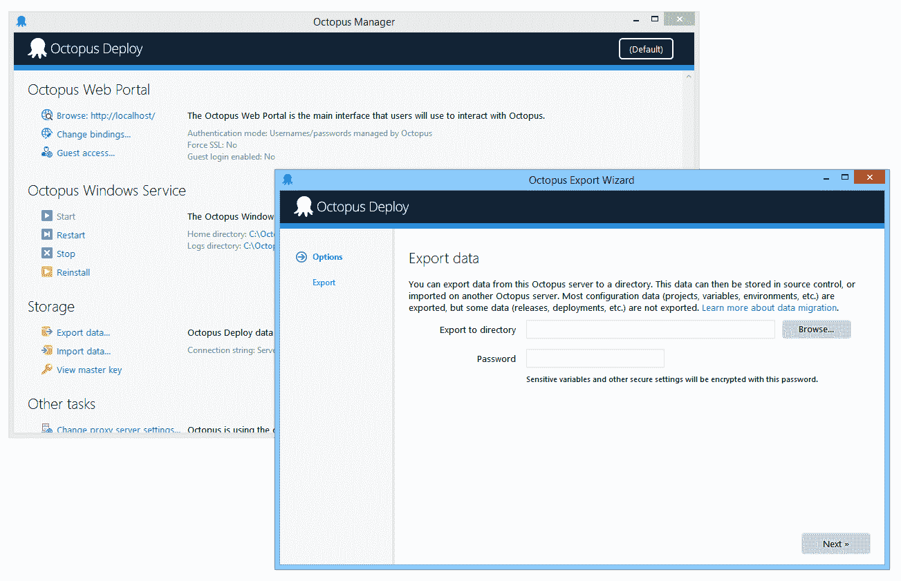
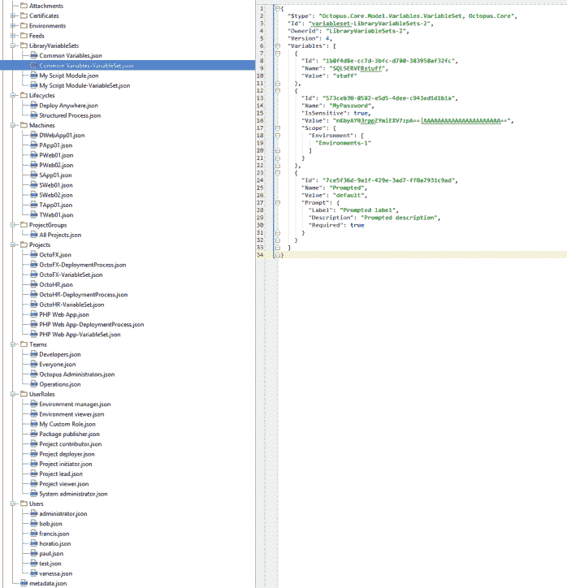
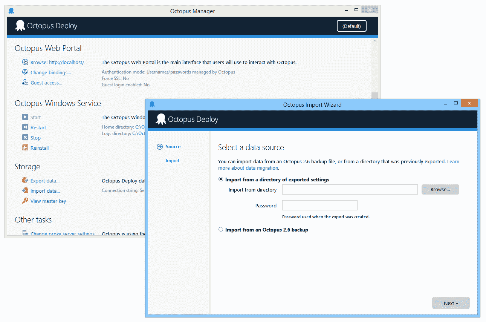

# Octopus 3.0:迁移器 RFC - Octopus 部署

> 原文：<https://octopus.com/blog/octopus-3.0-migrator-rfc>

章鱼 2.6 使用 RavenDB，而[章鱼 3.0 使用 SQL Server](https://octopusdeploy.com/blog/3.0-switching-to-sql) 。当然，这意味着我们需要某种方法来帮助您将数据从 2.6 迁移到 3.0。既然我们在数据迁移上投入了如此多的精力，我们不妨让它成为一个特色:它也将成为一个**通用章鱼 3.0 出口者和入口者**。

迁移工具将支持以下四种情况:

*   将数据从 2.6 版导入 3.0 版服务器
*   从 3.0 服务器导出数据，并将其导入回 3.0 服务器
*   将 3.0 服务器中的数据拆分为两个或更多
*   将多个 3.0 服务器中的数据合并为一个

我们将导入和导出的数据限于“配置”风格的数据(例如，项目、环境、机器、部署过程、变量集、团队、NuGet 提要等等)。我们不打算支持导出历史数据(即发布、部署和审核事件)，但我们最终会从 2.6 备份中导入历史数据。

## 出口

exporter 工具将数据导出为目录中的 JSON 文件。

你能用这个出口做什么？

*   **提交到 Git 库**
    我们尽可能地让 JSON 变得友好和可预测，这样如果您提交多个导出，唯一会出现的差异是已经做出的实际更改，比较这些更改将是显而易见的。
*   **将其转移到新的 Octopus 服务器**
    您可以删除不想导入的文件(例如，如果您正在转移一个项目，只删除除该项目的文件之外的所有文件)，然后使用导入器将其导入。

虽然 JSON 文件包含 ID，但是在导入时，我们实际上使用名称来确定某些内容是否已经存在。这意味着您可以从多个 Octopus 服务器导出，将它们组合在一起，然后导入到单个 Octopus 服务器。

如果您使用敏感变量，这些变量将使用密码在 JSON 中加密(注意，敏感变量通常存储在使用您的主密钥加密的 SQL 中；导出器将解密它们，然后用这个新密码加密它们)。假设您在两次导出之间使用相同的密码，您将获得相同的输出，因此它们不会在您的 diff 工具中显示为已更改。

## 进口

导入工具可以获取导出的目录和用于导出它的密码，或者 Octopus 2.6 备份文件(`.octobak`)和 Octopus 主密钥。然后它将导入数据。

您将有机会先预览这些更改，并且您可以告诉该工具:

*   如果目标中已经存在文档，则覆盖它们(例如，如果已经存在同名项目，则覆盖它)
*   如果目标中已经存在文档，则跳过这些文档(例如，如果已经存在同名项目，则不执行任何操作)

导入器将所有数据更改包装在一个 SQL 事务中；如果在导入过程中发现任何问题，事务将被回滚，不会导入任何内容。

## 历史重要吗？

正如我提到的，我们目前在即将到来的 3.0 公开测试版中遗漏的一个特性是导出和导入部署历史(甚至从 2.6 开始)——也就是说，发布、部署、任务、工件和审计事件将不会被导出或导入。这些要复杂得多，所以我们计划按原样发布这个工具，以后再添加历史。

我们肯定会在 3.0 发布之前扩展导入器，从 2.6 备份中导入历史。我们不确定的是，在 3.0 中导入和导出历史是否重要——我们发现绝大多数人只关心项目配置数据，而不关心历史。我们希望听到一些 3.0 历史导入可能有用的场景。

PS:喜欢新的管理工具外观吗？