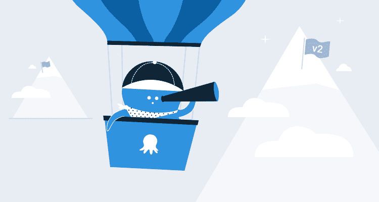
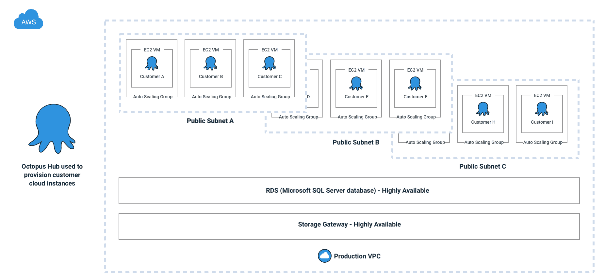
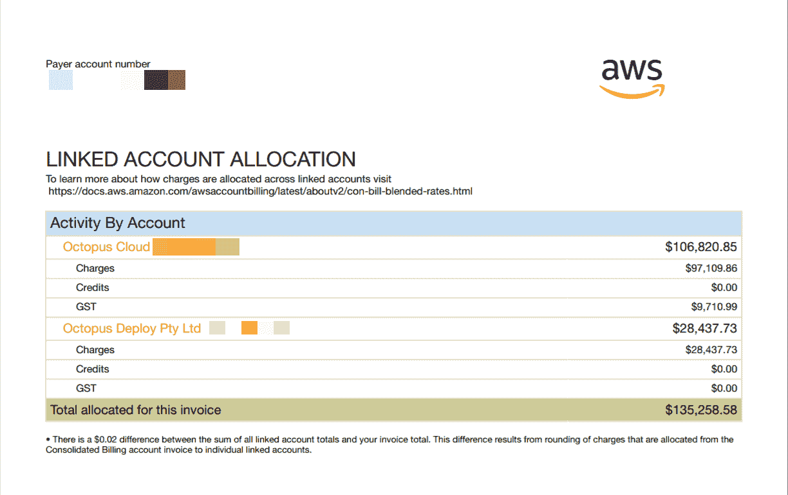

# MVP 和 10 万美元 AWS 账单:对推出 Octopus Cloud 1.0 - Octopus Deploy 的思考

> 原文：<https://octopus.com/blog/octopus-cloud-1.0-reflections>

我们将发布一系列关于章鱼云的工程之旅。这是我们在 AWS 上推出 Octopus Cloud v2 的故事，我们每月 10 万美元的 AWS 账单，MVP 和测试客户需求，花了 6 个月的工程努力，然后亏本运营服务，又花了 9 个月从头开始重建它，以及我们在重建 Octopus Cloud v2 时所做的所有考虑，包括从 AWS 切换到 Azure，在 Kubernetes 上全押等等。

在这个系列的第一篇文章中，我们将看看我们在 v1 中所做的设计选择，为什么花费这么多，以及为什么我们决定重新开始。

* * *

大约一年前[,我们推出了 Octopus 的 SaaS 版本 Octopus Cloud](https://octopus.com/blog/announcing-octopus-cloud) ,作为一项实验，看看它是否能为我们的客户带来重大价值并简化他们的部署。我们希望让开发人员专注于他们的部署需求，将管理基础设施的工作交给我们，但我们不知道实施起来有多困难，也不知道启动和运行需要花费多少时间和金钱。

总的来说，我们认为这是一个巨大的成功；足够我们去年投资几乎整个平台从头开始重建。我是发布当前版本 Octopus Cloud 的团队的一员，我想花一些时间来庆祝我们的一些胜利，并反思我们学到的教训，这些教训塑造了我们的重新设计。

## 有人会使用它吗？

在这个实验中，我们知道有人对云解决方案感兴趣，但是有很多事情我们不知道:

*   有多少客户会真正使用它？
*   这一切要花多少钱？
*   我们应该收取多少费用？它能支付基础设施成本吗？

我们可以猜测其中的大部分，但知道答案是不可能的。工程时间也是非常昂贵的，是我们可以花时间向我们的自托管产品添加功能的时候了。如果没有需求，我们不想花费数年时间来设计一个完美优化的云原生产品。

我们决定根据我们的最佳估计来打造一款 [MVP](https://en.wikipedia.org/wiki/Minimum_viable_product) ，并以这种方式测试市场。目标是在 6 个月内推出产品，并测试需求是否存在；如果不是，我们就浪费了 6 个月。我们选择优化以快速上市，而不是担心成本。

需求是存在的。在最初的几天里，我们进行了 500 多次新的云测试。当客户来到我们的网站并决定是试用 Octopus 自托管还是 Octopus 云时，大约有一半的人选择在云中试用 Octopus。

## V1 建筑

为了将章鱼云快速推向市场，我们做了最简单的事情；我们将自己托管的 Octopus 服务器产品捆绑到每个注册客户的 EC2 实例中。我们必须对产品进行修改，但主要是在权限方面。

我们实际上已经在一两个月内准备好了章鱼云 v1 的内部 alpha 版本；我记得团队做了 bug bashes 来测试我们的安全性。花费更长时间的是制造我们乐于让客户使用的产品所需的所有步骤:强化安全性、测试、恢复计划等。

为了确保一个用户的数据不会与另一个用户的数据混杂在一起，每个云实例都有自己专用的虚拟机、数据库和大量的安全配置，以防止任何不正当的交易。这是一张图表，展示了这一切的样子。请注意，我们实际上使用 Octopus Deploy 来供应和部署每个 Octopus Cloud v1 客户:

【T2 

## 服务限制

你知道那种感觉吗？当你开车的时候，你似乎碰到了每一个红灯？这有点像推出章鱼云的感觉；只有红灯是 AWS 服务限制！我们很快了解到 AWS 中的所有东西都有某种服务限制，我们达到了所有的限制。客户会注册，我们会达到一个极限，我们会要求亚马逊增加它，我们会搭载更多的客户，我们会达到另一个极限。每次我们认为我们是安全的，我们就会达到另一个我们不知道的服务极限。

这在我们扩展时造成了一些问题，在某一点上，我们不得不暂停新的注册，同时我们试图提供更多的扩展空间。

## 云产品可能非常昂贵

每个客户都有一个 EC2 实例，由于我们的数据库是由 Amazon RDS 支持的，所以每个 RDS 实例只能有 30 个数据库。添加存储、网络等。我们每月花费 100 多美元来保持单个章鱼云实例在线。

Octopus Cloud 的客户可以开始 30 天的免费试用，这意味着每月数百个试用注册，每个注册的费用为 100 美元，很快就会增加。

我们的定价也不太合适。我们最初推出的 Octopus Cloud 的起始价格为每月 10 美元，与我们目前使用的定价模式不同。不幸的是，这是我们学到的最痛苦的教训之一，因为我们收费和支出之间的赤字被使用章鱼云的人数放大了；持续增长将进一步加剧这一问题。

两个月后，我们开始认真讨论我们每月 10 万美元的 AWS 支出，以及我们几乎没有收入来抵消这笔支出的事实:

我们应该解释一下， [Octopus Deploy 作为一家公司](https://octopus.com/company)并没有公开上市，也没有风投资金。自 Octopus 1.0 以来，我们一直在自豪地引导和盈利，我们一直在保守和可持续地经营这项业务。我们突然发现自己有了一项新业务，它正以惊人的速度耗费我们的资金。

我们决定吸取我们正在学习的教训，开始一项庞大的工作，我们称之为**云 v2**；章鱼云的重新想象，可持续发展。

即使在我们构建 v1 时，团队也知道它不是理想的架构。在 v1 推出之前，我们的 Slack 中有很多关于我们是否应该将 Octopus 移植到 Linux 并在 Kubernetes 上运行它，或者看看我们是否可以在 Kubernetes 的 Windows 上运行它，或者使用 Hashicorp 的 Nomad？而这一切都要追溯到 2018 年初，当时一切都在翻腾，没有今天这么成熟。所以单位成本并不令人惊讶。

令人惊讶的是需求。如果每个月只有几个客户注册，我们可以轻松地承担成本(说实话，我们仍然可以，八达通自助有很大的利润！).但是有这么多客户报名，事情就变得紧急多了。每月 10 万美元以上，一年下来就是 120 万美元以上，这足以证明花费工程努力来降低它是合理的。

## 重新开始

我们探索了各种降低成本的方案，最初的计划是迭代 v1 架构并寻求成本节约，我们确实在这方面取得了一些进展，但最终，我们得出结论，大幅降低成本(不牺牲客户性能)的最佳方式涉及一些实质性的架构变化，本质上是从零开始。

在本系列的其余部分中，我们将深入研究我们在为 v2 重新设计 Octopus Cloud 时所做的每个决定。其中包括:

*   从 AWS 切换到 Azure。
*   将 Octopus 服务器移植到 Linux。
*   在容器中运行章鱼和使用 Kubernetes。

借助 Octopus Cloud v2，我们还支持自己学习和使用大量处于托管和编排前沿的技术。 [Terraform](https://github.com/OctopusDeploy/terraform-provider-octopusdeploy) 、 [containers](https://hub.docker.com/r/octopusdeploy/octopusdeploy) 、 [Kubernetes](https://docs.microsoft.com/en-us/azure/aks/) 和 [Azure Functions](https://docs.microsoft.com/en-us/azure/azure-functions/) 只是我们目前工作的几个领域。这种方法带来了自己的挑战，但它也将注入到下一代 Octopus 工具中，我们可以用我们在这个过程中获得的专业知识来构建这些工具。[喝我们自己的香槟](https://en.wikipedia.org/wiki/Eating_your_own_dog_food)已经大大提高了 Octopus 的功能，因为我们已经成为自己最大的客户之一。

## 结论

决定从头开始重建是残酷的，它会让你觉得你之前的尝试是在浪费时间和精力，而那项工作正在被抛弃。明知是一个“MVP”项目也很容易，但是随后却对它产生依恋，假设它将是最终的架构。我们需要认识到，第二步是可能的，因为已经迈出了第一步，在这一过程中吸取的每一个教训都是重要的投入。

构建 Octopus Cloud v2 与 v1 有很大不同，之前我们都是猜测和盲目飞行，这一次我们有真实的数据可以分析，以回答我们的一些问题:我们知道用户将花费什么，我们知道什么东西将花费什么，我们知道预计会消耗什么样的资源，在这些事情之间，我们知道如何创建一个真正可扩展的平台。