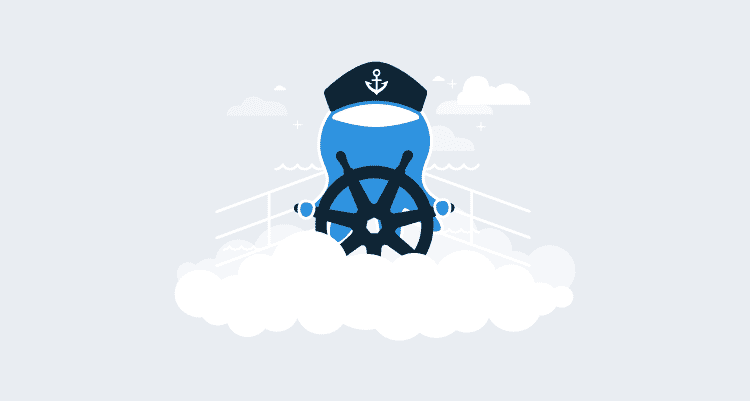
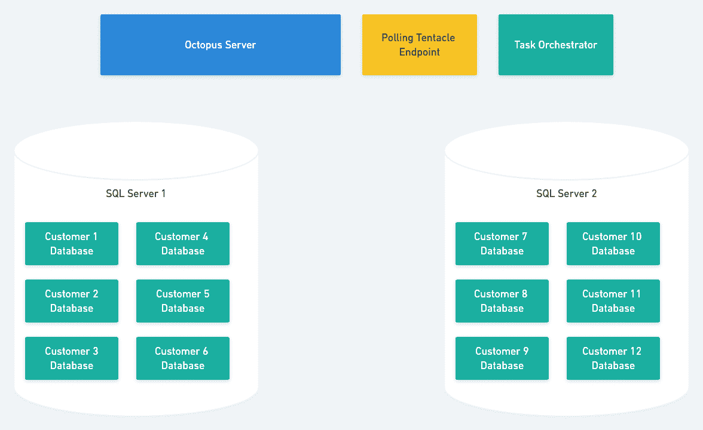
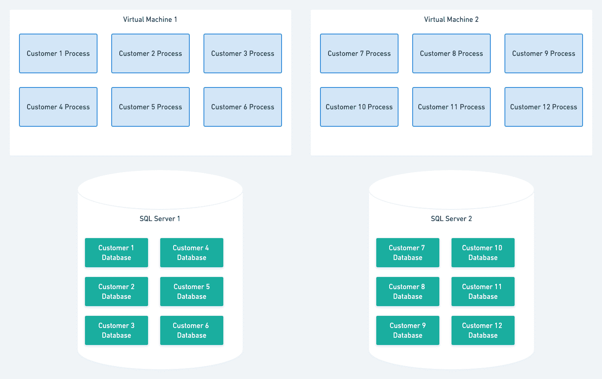
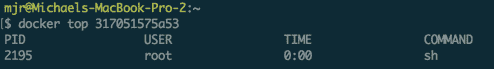
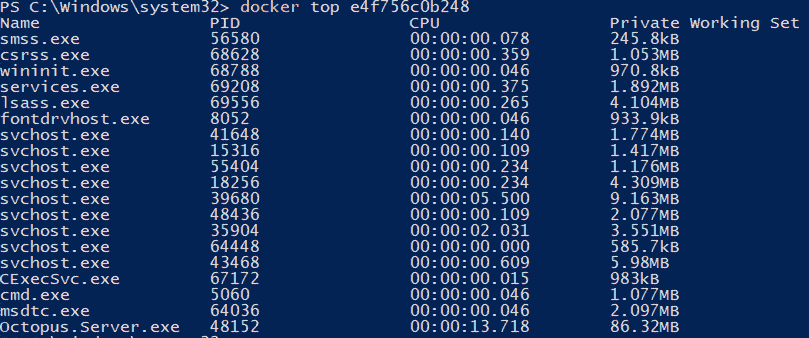
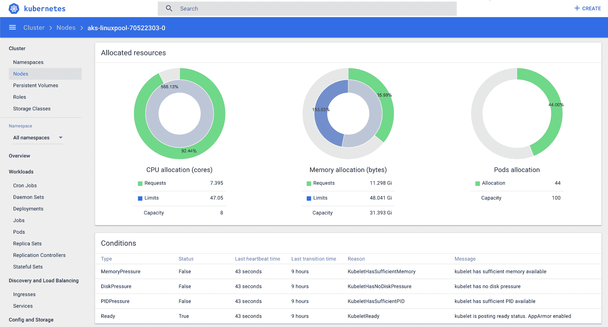

# 为什么我们选择 Kubernetes，Linux 和。章鱼云的网络核心-章鱼部署

> 原文：<https://octopus.com/blog/octopus-cloud-v2-why-kubernetes>

我们将发布一系列关于章鱼云的工程之旅。这是我们在 AWS 上推出 Octopus Cloud v2 的故事，我们每月 10 万美元的 AWS 账单，MVP 和测试客户需求，花了 6 个月的工程努力，然后亏本运营服务，又花了 9 个月从头开始重建它，以及我们在重建 Octopus Cloud v2 时所做的所有考虑，包括从 AWS 切换到 Azure，在 Kubernetes 上全押等等。

在本帖中，我们将探讨可用于降低成本、提高性能的计算选项，以及我们最终如何决定迁移到 Kubernetes、Linux 和。网芯。

此系列中的帖子:

* * *

章鱼云于 2018 年 7 月作为 MVP 推出，以测试客户需求，我们在推出后获得了一些很好的见解。我们发现自己有以下问题:

*   需求强劲的基于云的 SaaS 产品。
*   一种定价模式，在这种模式下，每名客户的收入无法覆盖 AWS 的托管成本。
*   为每个客户分配专用虚拟机的非优化架构。

Octopus 一直被设计为托管在用户自己的硬件上，而不是作为多租户共同托管的解决方案。因此，在设计 Octopus Cloud v1 时，有许多不同的途径可供选择。根据最优秀的工程传统，我们从最简单的可能有效的方法开始，在这个例子中，在一个专用的虚拟机上托管每个客户。这是一个巨大的成功，它消除了许多未知因素，留给我们两个明确的问题来关注...

*   **降低成本:**特别是对于使用率低或休眠的实例
*   **提高性能:**缩短供应时间，为高利用率的实例提供更多选项

每个章鱼云 v1 客户的运营成本是多少？

每个 v1 客户的托管成本的主要组成部分是(大约以美元计):

*   数据库: **$9**
*   文件存储: **$23**
*   计算机(虚拟机): **$50**

这使得每个客户的总托管成本大约为**82**美元。真正的问题是计算成本无法降低，所以即使是一个休眠的试验，其成本也与一个活跃使用的实例相同。

我们的目标是在低使用率的情况下，将每个客户的成本降低到 10 美元以下。

这里值得一提的是，Octopus 是作为一个完整的框架实现的。NET 应用，需要 Windows，HTTP 服务器作为自托管 [NancyFX](http://nancyfx.org/) app 运行，我们从一开始的目标的一部分就是:*不要叉章鱼*。我们非常希望为我们的自托管和云产品维护一个单一的代码库。此外，在我们希望降低成本的同时，我们还希望提高性能和可用性。我们的客户期望快速响应的体验，我们不想对此产生负面影响。

## 选项

我们将在以后的文章中更多地讨论数据库和文件存储组件。今天，我们将重点讨论计算成本。

每个选项都摆在桌面上，但事后看来，它们可以归纳为几个一般方法:

1.  [单个多租户服务器](#single-multi-tenant-server)。
2.  [每个客户的 Windows 流程](#windows-process-per-customer)。
3.  [Azure App 服务](#azure-app-services)。
4.  库伯内特斯.

在我们审查这些选项时，请记住，这些是我们根据当时的情况和限制形成的意见。这些发现可能是不正确的(或者最多只对我们特定的输入集是正确的)，如果我们在不同的时间处理这个问题，我们的决定可能会有所不同。认为你被否认了。

### 选项 1:单个多租户服务器

我们提出了一个假设的问题:

如果我们今天从零开始构建 Octopus，作为云托管的 SaaS 产品，它会是什么样子？

我们几乎肯定会将其构建为多租户解决方案；换句话说，一个可以为所有客户服务的 web 应用程序。

这种方法的主要优势是使服务器托管非常简单，因为它只是一个常规的 web 应用程序。

不幸的是，Octopus 不仅仅是一个网络服务器:它还是一个任务运行器。

我们可以很容易地想象将 Octopus HTTP 服务器修改为多租户。我们仍然可以为每个客户创建一个数据库，并确定用于每个请求的连接字符串。任务编排组件可能更复杂，但并非不可能；然而，这将需要大规模翻新。

投票触角将是一个复杂的问题。我们不会在这篇文章中深入探讨细节，但知道除了翻新之外，我们还必须拆除几堵墙(并添加一个浴室)来支持这种架构的轮询触角就足够了。

当我们继续定期发布产品更新时，这些革新必须发生。这会让我们在以下两者之间做出残酷的选择:

*   保持托管架构在一个独立的长期分支上重构，然后面对合并一个长期分支和主要架构变更的挑战。
*   定期合并，可能会破坏我们自主托管客户的稳定。

如果没有其他选择，我们可能会走这条路，有一天我们仍然会走这条路。但是我们觉得我们可以鱼与熊掌兼得。我们相信，我们可以大幅降低我们的托管成本，同时将核心 Octopus Deploy 产品的风险降至最低。

### 选项 2:每个客户的 Windows 流程

通过这种方法，我们可以将每个客户作为一个专用进程在 Windows 虚拟机上运行。该进程将托管 Octopus 服务器 API 和任务运行器组件，每个客户仍将拥有自己的数据库。

这里最大的优点是只需要对 Octopus 产品做很少的改动。它还将为我们提供大量灵活的托管选项(AWS、Azure、自托管等)。).

这种方法的最大缺点是我们需要自己编排这些过程。使用此解决方案，我们需要回答的一些问题是:

*当新客户到来时，我们如何决定在哪个虚拟机上执行他们的流程？*

我们会使用一个静态数字吗，比如每个虚拟机 10 个实例？我们会考虑 CPU 和内存的使用吗？

*我们如何处理吵闹的邻居问题？*

如果客户使用的资源比预期的多，并且影响到了同一台机器上的其他用户，我们会重新部署他们吗？如果会，部署到哪里？

当客户离开时，我们会填补这些空缺吗？

很多人用云章鱼做试验，后来都放弃了。如果我们不重新分配，这将导致虚拟机数量稀少，随着时间的推移，这将降低项目的效益。

当然，所有这些问题都可以回答，但是它们需要编写和维护编排代码，这不是我们核心业务的一部分。这种编排代码不太可能是与云无关的，这让我们只能依赖于特定的供应商。

### 选项 3: Azure 应用服务

争论的最佳服务器数量是多少？零！

我们可以作为 Azure web 应用程序托管每个客户。

这种方法的巨大优势是不需要管理虚拟机。

这种方法的缺点…嗯，有几个。类似于*每个客户处理*选项，我们仍然需要在服务计划之间协调分配用户。类似于*多租户*选项，我们仍然需要重新设计任务编排和轮询触手部分。

哦，当然，我们仍然在 AWS 上，而不是 Azure(未来帖子的剧透警告:这即将改变)。

也有人担心我们会任由 Azure gods 摆布，以及可怕的供应商锁定。尽管看起来不太可能，但如果 Azure 弃用应用服务会怎样？如果定价模式发生重大变化会怎样？如果你运行一些 Azure 网络应用程序，而价格飙升，那就是糟糕的一天。如果你运行成千上万个…

我们放弃了这个选择。

### 选项 4: Kubernetes

作为部署工具行业的一员，我们饶有兴趣地关注着这一领域的新技术。在过去的几年里，我们看到 Kubernetes 从一个除了 devops 之外很少有人听说过的有趣项目，发展成为我们最受欢迎的功能请求之一。因此，在我们自己的托管平台上做出这个决定的背景下，Octopus 内部的一个小团队正忙于在产品中实现对 Kubernetes 的[支持。当然，将集成构建到产品中涉及到大量的探索、评估和对 Kubernetes 的广泛使用，因此一个令人愉快的副作用是，我们在 Kubernetes 内部获得了一些经验，并提倡考虑它来满足我们自己的需求。](https://octopus.com/blog/kubernetes-containers-update)

但是有一个重要的障碍:Octopus 在 Windows 上运行。

k8s 对 Windows 节点的支持是以测试版的形式提供的，这实际上意味着它是没有文档记录的，并且可能曾经在某个人的机器上工作过，该人在另一个监视器上打开了 Kubernetes 源代码。一个令人难以置信的持久性壮举导致概念验证团队让 Octopus 在 Kubernetes 集群中的 Windows 上运行。可以说，我们并不觉得我们在走一条老路，更像是在丛林中开辟道路，永远不确定我们在向哪个方向行进。此外，Windows 节点被证明是不稳定的，定期意外死亡。

我们排除了 Kubernetes + Windows 作为一种还不够成熟的技术来下注。

我们也排除了一般窗口上的容器。作为评估 k8s 的一部分，我们还评估了在 Windows 上运行容器化的 Octopus。Linux 上的容器是优雅的，在 Linux 上运行容器只会导致容器化的进程在主机上执行。相比之下，在 Windows 中运行容器会导致许多系统服务也在运行。

Linux 上单个容器的运行进程:

Windows 上单个容器的运行进程:

这些服务带来了它们自己的资源开销，而且通常有点令人讨厌。

真正的障碍是，当我们进行这些实验时，我们不可避免地要探索互联网，寻找问题的解决方案，其他人的经验，等等。太多时候，我们只找到风滚草。我们只是没有意识到，有足够多的人在 Windows 容器上运行生产工作负载，以获得足够多的经验。

Linux 是一个不同的故事；在这一点上，Linux 上的容器是一条很好的道路，有很好的文档和工具。我们有证据表明，我们的许多客户在 Kubernetes 上运行生产工作负载，但是(这是一个相当大的但是)这需要将 Octopus 服务器移植到。NET 核心并在 Linux 上运行它。

## 决定

剩下的两个竞争者是:

*   每位客户的 Windows 流程。
*   Kubernetes (Linux 和。网芯)。

两者都需要巨大的努力。一个关键的区别是努力的方向。

对于*Windows Process Per Customer*选项，工作主要是构建编排基础设施来分配和监控 Octopus 服务器进程。

对于 *Kubernetes (Linux 和。NET Core)* 选项，工作主要是将 Octopus 移植到。NET 核心，并确保它可以在基于 Linux 的容器中运行。

我们没有花太多时间来比较这两种方法所付出的努力。首先，因为我们和其他人一样不擅长评估工作。更重要的是，随着时间的推移，实施成本的差异将被摊销掉。我们还剩下什么？

**八爪鱼会被造出来对付。NET Core，运行在 Linux 上，由 Kubernetes 进行容器化和编排。**

我们决定努力把章鱼移植到。NET Core 是我们*想要花费*的努力。事实上，我们已经开始了港口，独立于这个决定。

我们可以推出自己的编排解决方案，但 Kubernetes 是为我们试图解决的问题而构建的。我们一直鼓吹使用 Octopus，而不是尝试推出自己的部署自动化，因此您可以将节省下来的时间用于改进核心软件。这是一个听取我们自己意见的机会。

这也是一个令人兴奋的机会，再次喝我们自己的香槟。我们可以利用大规模内置到 Octopus 中的 Kubernetes 支持。

## 结论

在撰写本文时，这些决定是在一年多前做出的，但在过去的一周左右，所有新的 Octopus Cloud 实例都被提供为 Linux 容器，运行在 AKS (Azure 的托管 Kubernetes)上！

【T2 

在撰写本报告时:

*   有 0 次设置失败。
*   绝大多数实例在不到 30 秒的时间内就完成了资源调配。

现在评估成本降低还为时过早，因为我们很谨慎，最初过度配置了节点。即使考虑到这一点，每个客户的成本也已经降低了 50%以上。

这种变化也带来了一些巨大的性能改进。过去，配置一个新的 Octopus 实例需要 10 多分钟，但现在已经减少到不到 30 秒。我们还通过 Octopus Cloud 实例获得了其他一些性能提升，我们将在以后的文章中讨论，在本系列的以后文章中，我们将详细了解。NET 核心端口，考虑选择哪个云提供商(AWS，Azure，Google 等。)，并评估项目的整体成功情况。

我们希望你喜欢这个幕后的窥视。敬请关注。