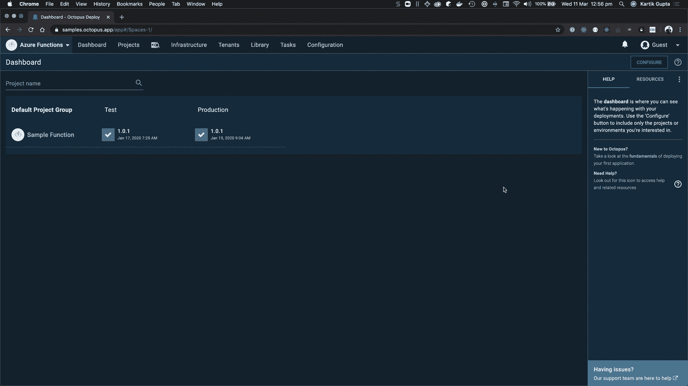
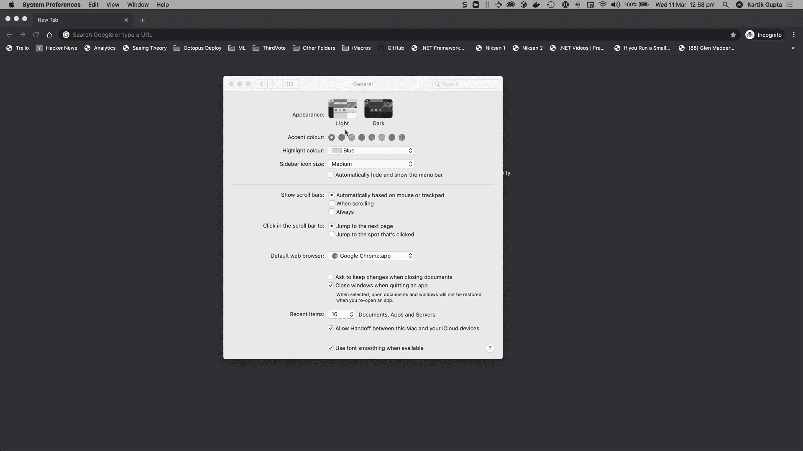
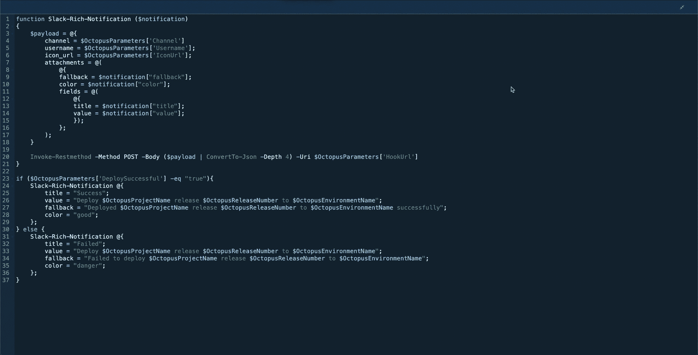
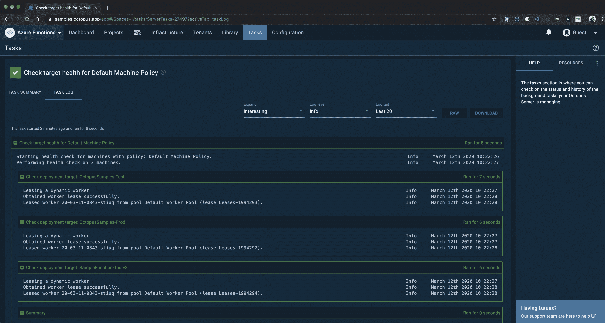
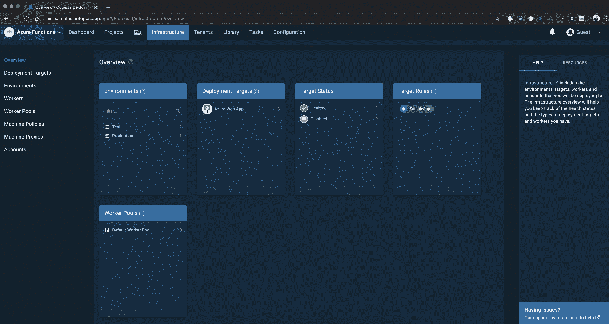

# 介绍黑暗模式-章鱼部署

> 原文：<https://octopus.com/blog/octopus-dark-mode>

[https://www.youtube.com/embed/ZMM8BowrUjQ](https://www.youtube.com/embed/ZMM8BowrUjQ)

VIDEO

Octopus 2020.1 将 Octopus 带到了黑暗面，在这篇文章中，我们来看看为什么我们加入了黑暗模式，它看起来如何，我们如何实现它，以及在这个过程中吸取的一些教训。

根据研究公司尼尔森的数据，2018 年，成年人每天花十一个小时与带屏幕的设备互动。我们认为，对于开发者来说，这个数字可能会高得多。

我们创建了 Octopus Deploy，以便我们的客户可以随时随地进行部署，包括周五下午 5 点甚至更晚的时候。从 Octopus 2020.1，你可以通过点击屏幕右上角的配置文件菜单切换到黑暗模式，并将开关切换到 on。或者，如果你已经是黑暗模式的粉丝，并且在你的操作系统上启用了黑暗主题或夜间模式，当你登录时，八达通会自动加载黑暗主题。

## 我们为什么建造它

Octopus 被世界各地的开发人员和运营人员大量使用，他们倾向于喜欢黑暗模式。我们团队的大多数人在他们的笔记本电脑和手机上使用黑暗模式。

除此之外，Octopus Deploy 区别于其竞争对手的一点是拥有用户界面。保持界面的更新、响应和现代化是我们在过去一年投资 UI 专家的原因。我们希望我们的用户喜欢 Octopus UI。我们不希望部署你的应用程序成为一件苦差事，而是一项你期待的任务。黑暗模式对眼睛来说更容易，开发人员喜欢它，所以我们很自然地将它内置到 Octopus 中。

## 视觉游览

开发一个黑暗的主题对我们来说是一个很好的机会来回顾我们在 Octopus 是如何进行设计的。我们希望 Octopus 成为世界级的产品，我们认为世界级的产品应该是漂亮的和精心设计的。在开发黑暗主题的时候，我们开始增加一些改进来迎合可访问性。尽管我们小心翼翼地确保大多数颜色符合 AA 标准，但这不是一个易访问性主题，但它给了我们一个坚实的基础。

从配置文件菜单无缝切换黑暗模式的开/关:

如果你的操作系统有黑暗模式，八达通将自动检测到这一点，并设置你的主题:

Octopus 中的代码编辑器已经更新，无论您使用 PowerShell、Bash、Python、F#还是 C#，在黑暗模式下看起来都令人惊叹:

任务日志页面已经更新，在黑暗主题中看起来很醒目:

查看新的基础架构概述页面:

## 我们如何建造它

我们利用 CSS 自定义属性在 Octopus 中创建主题。CSS 变量是一个被广泛支持的特性，它使得 CSS 变量在运行时可用。我们没有使用 Material UI 的内置主题，因为我们的一些组件使用旧版本的 Material UI。我们使用 React Context 将颜色变量作为道具传递给组件，并在 SVG 图像中使用 CSS 变量来切换颜色，而不必维护多组图像。我们还利用 CSS 媒体特性`prefers-color-scheme`来检测系统使用的是暗主题还是亮主题。

我们确实遇到了 IE11 的问题，IE11 是唯一不支持 CSS 变量的浏览器。2019 年 11 月，我们的工程主管迈克尔·诺南写了一篇关于[的文章，反对从 2020.1](https://octopus.com/blog/raising-minimum-requirements-for-octopus-server) 开始支持 IE11。尽管我们正在移除对 IE11 的支持，但我们不想完全破坏 IE11 上的 Octopus，所以我们利用了一个[pony fill](https://jhildenbiddle.github.io/css-vars-ponyfill/#/)([pony fill vs . Polly fill](https://ponyfoo.com/articles/polyfills-or-ponyfills))来启用 IE11 上的 CSS 变量，并确保至少 light 主题在 IE11 上工作。

## 结论

通过黑暗模式，我们希望将章鱼带入一个新的世界，一个你可以日夜部署而不会疲劳眼睛的世界！我们希望您喜欢黑暗模式，如果您有任何反馈，请填写[反馈表](https://octopusdeploy.typeform.com/to/jVl7gN)！

## 相关职位