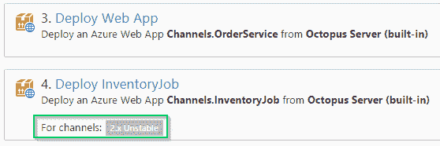

# 八达通部署 3.2 -八达通部署

> 原文：<https://octopus.com/blog/octopus-deploy-3.2>

***Octopus Deploy 3.2 于 2015 年 11 月 3 日发布，在[此处](/downloads)可用。***

# 特征

Octopus Deploy 3.2 完全是关于[通道](#channels)的，这是我们给最初在我们的 [RFC 分支](/blog/rfc-branching)中讨论的特性起的名字。

> 构建服务器构建。章鱼展开。

我们认为区分源代码分支、[哪些构建服务器关心](/why)和部署是很重要的，部署是渠道的来源。

## 频道

在一个软件项目中，您可能希望对某些版本进行不同的处理，Octopus Deploy 中的通道使这一点易于管理。每个渠道都有不同的生命周期、不同的变量和不同的部署流程。我们设计了一些渠道，使实施、管理和发展更复杂的部署场景变得更加容易。

虽然在 Octopus Deploy 中可以在没有通道的情况下模拟复杂的部署场景，但它通常涉及克隆项目，这会带来一系列复杂的问题。

我们认为开始使用 Octopus Deploy 中的通道的最佳方式是探索我们遇到的一些部署场景，以及通道如何在每个场景中提供帮助:

### 场景 1:更安全的标准发布推广

> Matthew 正在改进和修复他公司最新发布的旗舰产品的缺陷。他希望推动他的代码更改，并让它们自动部署到一个**开发**环境中，然后让他的测试团队通过一个**测试**环境来促进发布，最后在准备就绪时将发布部署到**生产**。他还想构建预发布包，但想防止这些包被意外部署到**生产**。

这是一个非常典型的场景，Octopus Deploy 已经支持这个场景，不需要通道，除了通过添加一个简单的版本规则，您可以防止预发布意外地部署到生产中。

**注意:**版本规则将在您遵循 **[语义版本化(SemVer)](http://semver.org)** 的版本化策略时发挥最佳作用。

### 场景 2:支持多个版本(不断发展的部署设计)

> 版本 1.x 刚刚发布，Andrew 正在着手 2.x 的工作。作为 2.x 的一部分，Andrew 需要引入一个新的服务，该服务需要一些新的步骤和一些新的变量。他希望尽快开始发布预发布版本。与此同时，Stephanie 正在增强和修复 1.x 版本的错误，并希望 1.x 的部署能够像以前一样正常工作。

在这种情况下，Andrew 可以创建一个名为`2.x Unstable`的新通道，并将新步骤和变量限定在该通道的范围内，以便它们只包含在 2.x 的部署中。他还可以配置版本规则，以便更容易、更安全地创建 1.x 或 2.x 版本，确保使用正确的包和部署步骤。

由于 Andrew 花时间创建了`2.x Unstable`通道，Stephanie 可以继续部署 1.x 版本，确信部署过程仍将工作，不会意外地错误包含任何 2.x 包。

### 场景 3:热修复部署

> Stephanie 刚刚收到一个警告，由于与第三方集成的问题，1.x 版本中的检验流程在**生产**中失败。补救措施是对**订单处理器**服务进行简单的代码更改，她希望毫不延迟地为**生产**部署紧急修补程序版本。

谢天谢地，在这种情况下，斯蒂芬妮已经提前计划，并创建了一个使用`Hotfix`生命周期的`1.x Hotfix`频道。现在，她可以在`Hotfix`渠道创建修补程序版本，并将其直接部署到**生产**中，然后将该版本回填到**开发**和**测试**中。

### 场景 4:早期访问计划

> Andrew 已经准备好开始与特定的可信测试客户群共享 2.x 的早期构建。他希望将特定的预发布版本部署到测试环境中，并将新的预发布版本通知给这些客户。

在这种情况下，Andrew 可以配置一个新的`Beta`环境、`Beta`生命周期和`2.x Beta`通道。现在，他可以将发布直接部署到新的`Beta`环境中，并防止它们被提升到其他环境中。他还可以配置一个新的步骤，作用于`Beta`通道，向所有早期访问的客户发送一封电子邮件，其中包含新测试版的 URL。

### 场景 5:特性分支部署

> Sarah 正在为 2.x 版本开发一个名为多租户的新功能，她希望确保人们可以尽快测试她的工作，而不会中断 1.x 和 2.x 版本中正在进行的其他工作。

在这种情况下，莎拉可以创建一个名为`2.x Feature Branch`的通道，该通道范围内的一些步骤将自动在公共云中提供一个环境，该环境由基于发布版本的**标签**部分的约定命名。她甚至可以使用脚本模板将新特性分支部署的细节发布到他们的团队聊天中。

既然 Sarah 花时间创建了`2.x Feature Branch`频道:

*   当她团队中的任何人推出一个新的特性分支时，他们会在几分钟后收到一个通知，其中包含他们刚刚配置和部署的特性的测试环境的 URL
*   当任何人向现有的特性分支推送新代码时，新代码将被部署到他们特定特性的现有测试环境中
*   他们可以随时删除托管环境，并通过部署一个版本来重新配置它

### 演练

我们已经创建了实现这些场景的演练。你可以看视频或者[自己做演练](/blog/channels-walkthrough)。

## 向后兼容性

我们将这一特性设计成不引人注目且向后兼容的。如果这些场景都不适合您，或者您已经有了自己的管理方法，您可以假装通道不存在，并像以前一样使用 Octopus Deploy。

## 概括起来

既然渠道已经完成，看看我们的[路线图](/roadmap)看看接下来会发生什么！不要忘了看看我们关于[Octopus Reactions-Integration Toolkit](/blog/rcf-octopus-reactions-integration-toolkit)的 RFC，并参与设计 Octopus Deploy 的未来。

愉快的部署！