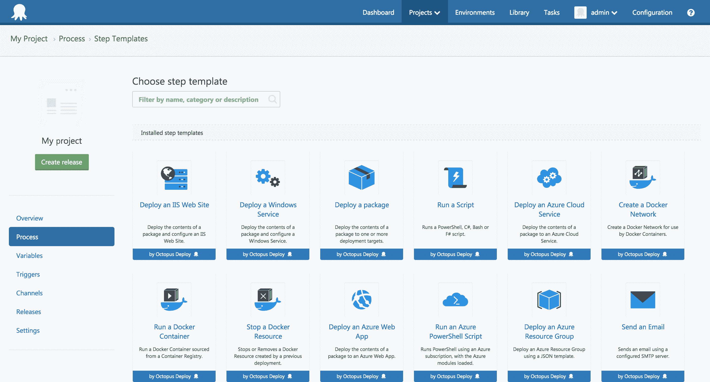
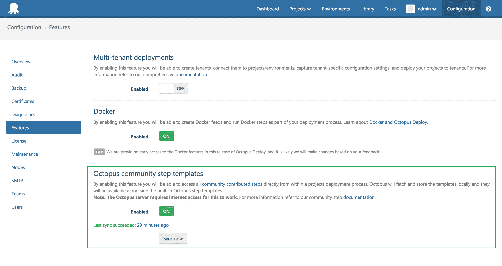
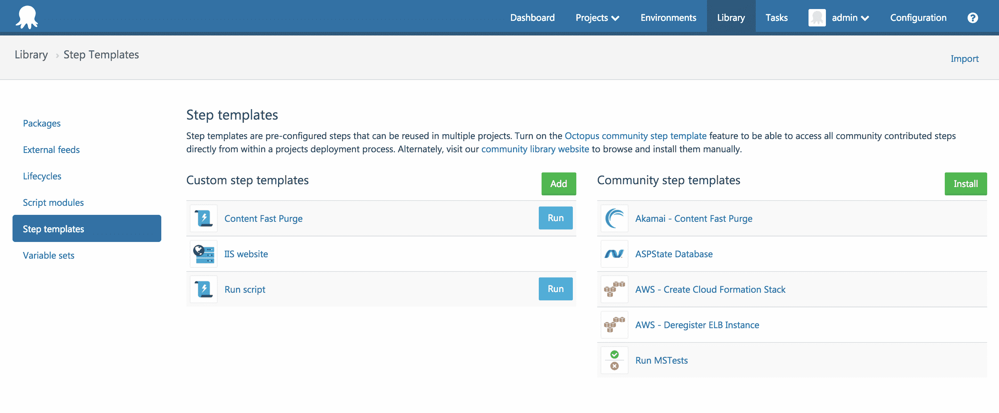

# Octopus Deploy 3.7:轻松步骤模板- Octopus Deploy

> 原文：<https://octopus.com/blog/octopus-deploy-3.7-effortless-step-templates>

* * *

## TL；速度三角形定位法(dead reckoning)

Octopus Deploy 的新版本更上一层楼，它改进了添加步骤模板的 UI，提供了从项目部署过程直接访问社区步骤模板的功能，并改进了库中步骤模板的管理。

## 向部署流程添加步骤模板

如果您有许多步骤模板，那么您就会理解旧的添加步骤模式的局限性。用于添加步骤模板的新 UI 现在有足够的空间来显示 Octopus 内置步骤模板、自定义步骤模板和社区库中的步骤模板。为了帮助浏览 200 多个社区步骤模板，有一个快速搜索工具。

更多信息，参见[添加步骤文档](http://docs.octopusdeploy.com/display/OD/Adding+steps)。

3.7 中引入的另一个特性是社区库集成。这种集成允许用户直接从项目的部署过程中安装和添加社区步骤模板，并从步骤模板库中管理更新。

社区库是共享 step 模板的好方法，可以节省大量的工作时间。社区步骤模板可以是自定义步骤模板的起点，因为它们可以保存为副本并进行编辑。或者它们可以按原样使用，并从作者那里接收更新。请记住，如果社区步骤模板保存为自定义步骤模板，它将不再接收作者的更新。

默认情况下，社区库功能是打开的，可以禁用。如果禁用，用户将无法利用 step 模板更新或受益于 200 多个社区 step 模板。库每天自动同步，如果失败，任务日志中会有一个摘要，可以手动同步。

如果您想访问社区步骤模板并利用更新，但该功能被禁用，请与您的 Octopus 管理员聊天。或者，[社区库](http://library.octopusdeploy.com/listing)仍然在线可用，step 模板可以导入 Octopus。

有关更多信息，请参见[社区步骤模板集成文档](http://docs.octopusdeploy.com/display/OD/Octopus+community+step+templates+integration)。

**A note to BlueFin users upgrading to Octopus 3.7**

因为社区库现在已经集成到 Octopus Deploy 中，所以 BlueFin 用户需要禁用

[**Integrated library step template importer**](http://bluefin.teapotcoder.com/)

特色。

## 步骤模板库

步骤模板库 UI 进行了一些更新，以改进步骤模板管理。在这里，您可以创建自定义步骤模板并上传您自己的徽标，安装社区步骤模板并运行步骤。

当您更新到 3.7 时，Octopus 将检查现有步骤模板的匹配参数，并将步骤链接到社区步骤模板。这将允许您访问更新。所以我们不会破坏任何东西，只有当所有东西都匹配时，才会创建一个链接。[这个规则在 Octopus 3.7.2](http://docs.octopusdeploy.com/display/OD/Step+Templates#StepTemplates-Linkingcustomsteptemplatestocommunitysteptemplates) 中略有放宽。成功链接的步骤模板将出现在社区步骤模板列中。

更多信息，参见[步骤模板文档](http://docs.octopusdeploy.com/display/OD/Step+Templates)。

我们最初提到的[这个版本将包含一个特性，将](https://github.com/OctopusDeploy/Issues/issues/2698)[步骤和动作](http://docs.octopusdeploy.com/display/OD/Deployment+Processes)更新到它们所基于的步骤模板的最新版本。不幸的是，有一个错误可能会破坏部署，我们认为最好不要发布它，直到我们有一个可靠的解决方案。该功能将在不久的将来得到修复和发布。更多信息请见我们的 [GitHub 问题](https://github.com/OctopusDeploy/Issues/issues/2954)。

## 运行步骤模板

如果您曾经想测试一个步骤模板或运行一个可重用的脚本，现在您可以了！库中新的运行功能允许用户提供参数，并在独立于项目部署过程的情况下运行脚本步骤模板。此功能仅适用于管理员用户，并且有一些限制，因此请阅读[运行步骤模板文档](http://docs.octopusdeploy.com/display/OD/Step+Templates)。

[下载 Octopus Deploy](https://octopus.com/downloads) 的最新版本，让我们知道你的想法。我们希望您和我们一样喜欢新的添加步骤模板体验。

愉快的部署！