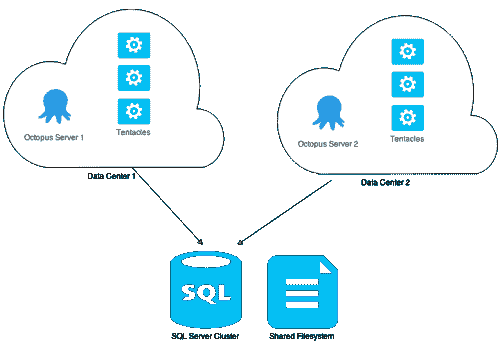
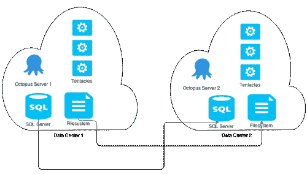
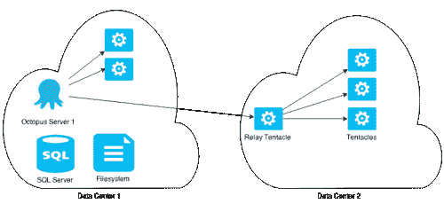

# 八达通部署高可用性-八达通部署

> 原文：<https://octopus.com/blog/octopus-deploy-high-availability>

在不久的将来(3.0 以后)，我们将发布一个高可用性版本的 Octopus Deploy。我们的客户使用我们的产品为数百名开发人员在数百台机器上自动部署应用程序。对于这些客户来说，Octopus Deploy 是他们开发基础设施的一个关键部分，停机时间会产生巨大的成本。

目前，对于 Octopus Deploy 的架构，我们没有一个好的高可用性方案。默认情况下，我们提供了一个嵌入式 RavenDB，并且在文件系统上有很多消息持久性的依赖项。我们确实支持迁移到外部 RavenDB 集群，但是我们的网络和消息堆栈意味着拥有多个 Octopus 服务器是行不通的。

在 3.0 中，我们对 SQL Server 的支持意味着我们可以支持 SQL Server 群集。对于许多已经在集群环境中拥有 SQL Server 基础设施和支持的人来说，这是一个好消息。然而，我们正在做额外的工作，使 Octopus 部署服务器集群意识到它的通信和任务管理。

在高可用性场景中，我们有各种不同的拓扑支持请求，所以在这篇文章中，我将讨论我们计划支持和不支持什么，以及我们将来可能支持什么。

所以现在开始。

我们想要支持的主要场景是一个高可用性和负载平衡的配置，在一个负载平衡器后面有一个 SQL Server 集群和多个 Octopus 服务器。

这将为您提供 Octopus 服务器级别的容错能力，负载均衡器健康检查将检测出故障的机器，所有流量将被路由到其他节点。SQL Server 可用性将通过 SQL Server 和 Windows 群集服务来处理。

您会注意到，除了 SQL Server 基础设施，Octopus 还需要一个用于包、工件和日志文件的文件共享。

## 对我们来说没有意义的场景。

我们有一些客户希望将数据中心分开，或者出于安全原因将他们的生产和开发环境分开，或者有多个区域并希望节省带宽或延迟。

我们认为实现这一点的最易管理的方法是通过 Octopus 到触手的通信，必要时通过 VPN 路由。这个场景是安全的(所谓安全，我的意思是任何系统都是安全的，因为它是最薄弱的环节，我们用于触手通信的 TLS 安全性在几乎所有场景中都不是最薄弱的环节)，并且从延迟的角度来看性能良好。

对于在不同地区拥有多个数据中心的客户，他们关心大型 Nuget 包到多个 tentacle 的数据传输，我们建议将您的 Nuget 服务器复制或代理到每个地区，并通过 DNS 别名让 tentacle 从地理上本地的包存储库中获取包。或者，比这更简单的解决方案是拥有两个独立但相同的 Nuget 存储库，并将提要 ID 作为变量。

我们不打算支持的一些请求配置有:

*在这种情况下，不同数据中心的 Octopus 服务器共享一个公共数据库和文件共享。*

*独立的 Octopus 服务器和环境，具有复制的本地 SQL 服务器和文件共享。*

这两者都无法正常工作，因为每个 Octopus Deploy 服务器都无法看到远程环境中的触角，这意味着健康检查和部署任务将会失败。此外，我们认为，远程 SQL Server 通信和复制或共享文件系统的延迟将导致性能不如这些环境中 Octopus 到触手通信的性能。这些配置也不能满足客户对环境间可见性的任何安全顾虑。

## 一些替代解决方案

虽然不是严格意义上的高可用性解决方案，但对于那些真正希望拥有隔离环境的客户，我们确实有两个可能适合他们的选项。

### 迁移工具

对于 3.0，我们需要构建一种将 2.6 版本的 RavenDB 数据库迁移到 3.0 版本的方法。最初的数据库工具正在转变为通用的 Octopus 部署迁移和数据复制功能。这样就有可能将项目配置和发布转移到上游的 Octopus 服务器。

### 中继触角

这不是我们现在拥有的，但在 3.1 或 3.2 中可能会出现。触手的概念，它可以充当专用网络上其他触手的中继、网关或代理。

它看起来会像这样:

当您将一台机器添加到一个环境中时，您将能够指定 Octopus 服务器如何路由到它，并且任何任务(部署和健康检查)都将通过这个中继进行。

## 一些结束语

Octopus Deploy 高可用性并非适用于所有版本。这是我们将作为新的许可层级和价位发布和销售的产品。为了确保我们可以在这个版本上支持客户，我们很可能会提供一些咨询和解决方案架构，以确保它在受支持的配置中运行，从而向我们和我们的客户保证他们的 Octopus Deploy 基础架构保持高度可用。