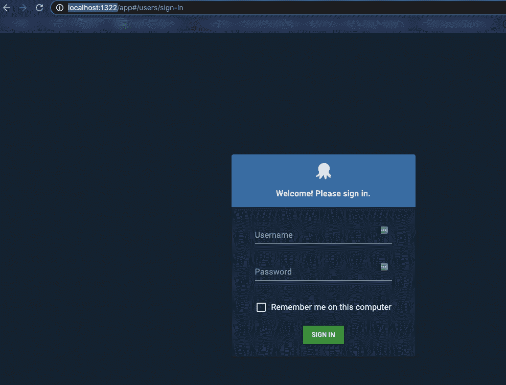

# Octopus 部署在 Docker quickstart 上- Octopus 部署

> 原文：<https://octopus.com/blog/octopus-deploy-on-docker>

[](#)

您可以在内部运行 Octopus，使用 Octopus 云实例，甚至在 Docker 中运行 Octopus。您可以在 Docker 容器中为测试和生产环境运行 Octopus Deploy。

在这篇博文中，您将了解如何在五分钟内在本地机器上启动并运行 Docker 容器。

## 先决条件

要跟进这篇博文，您需要以下内容:

*   八达通部署知识
*   运行 Windows 或 MacOS 的计算机
*   Docker [桌面](https://www.docker.com/products/docker-desktop)。
*   像 VS Code 这样的代码编辑器

## 配置您的环境

创建本地容器化 Octopus 部署环境的第一步是建立一个`.env`配置文件。`.env`允许您为 Docker Compose 配置的某些值保存环境变量。这样，您可以设置变量而不是硬编码值。

1.  打开文本编辑器，创建一个名为`.env`的新文件
2.  将以下代码添加到`.env`文件中。

这种容器化的环境应该仅用于测试/开发目的，这就是为什么您会在`.env`配置文件中看到密码。对于基于生产的部署，不建议这样做。

```
SA_PASSWORD=P@ssw0rd!
OCTOPUS_ADMIN_USERNAME=admin
OCTOPUS_ADMIN_PASSWORD=SecreTP@assw0rd 
```

将值添加到`.env`文件后，您可以创建 Docker 合成文件。

## 配置 Docker Compose 来运行 Octopus 容器

下一步是创建一个 Docker 合成文件，它存储两个容器的配置。Docker Compose 文件为 Octopus 部署环境创建一个运行容器，以便在本地机器上运行。合成文件包含两种配置:

*   用于 Octopus 部署后端的 SQL Docker 映像
*   Octopus 部署 Docker 图像

1.  创建一个名为`docker-compose.yml`的新文件。确保它保存在与`.env`配置文件相同的目录中。这告诉 Docker 您正在使用一个合成文件来创建一个环境。
2.  Docker Compose 文件的第一部分为数据库设置配置。数据库配置使用 Linux SQL 映像，接受 EULA 并提供 SA 密码。之后，指定要使用的端口，并进行健康检查以确认数据库成功启动:

```
version: '3'
services:
   db:
    image: mcr.microsoft.com/mssql/server
    environment:
      SA_PASSWORD: ${SA_PASSWORD}
      ACCEPT_EULA: 'Y'
    ports:
      - 1401:1433
    healthcheck:
      test: [ "CMD", "/opt/mssql-tools/bin/sqlcmd", "-U", "sa", "-P", "${SA_PASSWORD}", "-Q", "select 1"]
      interval: 10s
      retries: 10 
```

3.  Docker 合成文件的第二部分配置 Octopus Deploy。它使用官方的 Octopus Deploy 映像，环境设置为接受 EULA，配置 Octopus Deploy 用户名、密码和到之前配置的 SQL DB 容器的数据库连接字符串。然后为 Octopus Deploy 指定端口，并且有一个`depends_on`开关来确保在 Octopus Deploy 容器运行之前配置好数据库。条件是确保数据库服务正常运行:

```
octopus:
    image: octopusdeploy/octopusdeploy:latest
    environment:
       ACCEPT_EULA: "Y"
       OctopusAdminUsername: "${OCTOPUS_ADMIN_USERNAME}"
       OctopusAdminPassword: "${OCTOPUS_ADMIN_PASSWORD}"
       DB_CONNECTION_STRING: "Server=db,1433;Initial Catalog=Octopus;Persist Security Info=False;User=sa;Password=${SA_PASSWORD};MultipleActiveResultSets=False;Connection Timeout=30;"
    ports:
    - 1322:8080
    - 10943:10943
    depends_on:
      db:
        condition: service_healthy
    stdin_open: true 
```

整个`docker-compose.yml`文件应该如下所示:

```
version: '3'
services:
   db:
    image: mcr.microsoft.com/mssql/server
    environment:
      SA_PASSWORD: ${SA_PASSWORD}
      ACCEPT_EULA: 'Y'
    ports:
      - 1401:1433
    healthcheck:
      test: [ "CMD", "/opt/mssql-tools/bin/sqlcmd", "-U", "sa", "-P", "${SA_PASSWORD}", "-Q", "select 1"]
      interval: 10s
      retries: 10

   octopus:
    image: octopusdeploy/octopusdeploy:latest
    environment:
       ACCEPT_EULA: "Y"
       ADMIN_USERNAME: "${OCTOPUS_ADMIN_USERNAME"
       ADMIN_PASSWORD: "${OCTOPUS_ADMIN_PASSWORD}"
       DB_CONNECTION_STRING: "Server=db,1433;Initial Catalog=Octopus;Persist Security Info=False;User=sa;Password=${SA_PASSWORD};MultipleActiveResultSets=False;Connection Timeout=30;"
    ports:
    - 1322:8080
    - 10943:10943
    depends_on:
      db:
        condition: service_healthy
    stdin_open: true 
```

## 运行 Docker 合成文件

既然 Docker Compose 和环境配置已经设置好了，现在是运行 Docker Compose 文件的时候了。

从`.env`和`docker-compose.yml`文件所在的目录中，运行以下命令来创建 Octopus Deploy 和 SQL 容器:

```
docker-compose up 
```

您将看到 Docker 合成文件正在运行。

现在，打开一个 web 浏览器，转到下面的 URL 来访问本地 Octopus Deploy 实例。

```
http://localhost:1322/ 
```

您将看到 Octopus Deploy 登录页面:

[](#)

使用`.env`配置文件中指定的 Octopus deploy 用户名和密码登录。

您现在已成功登录 Octopus Deploy，可以开始使用它了。

如果您想更进一步，您可以使用 Matthew Casperson 的[博客来学习如何在 Kubernetes 上运行 Octopus Deploy Linux 容器。](https://octopus.com/blog/introducing-linux-docker-image)

这篇文章中的代码可以在 [GitHub](https://github.com/OctopusSamples/OctopusDeploy-Local-Docker-Env) 中找到