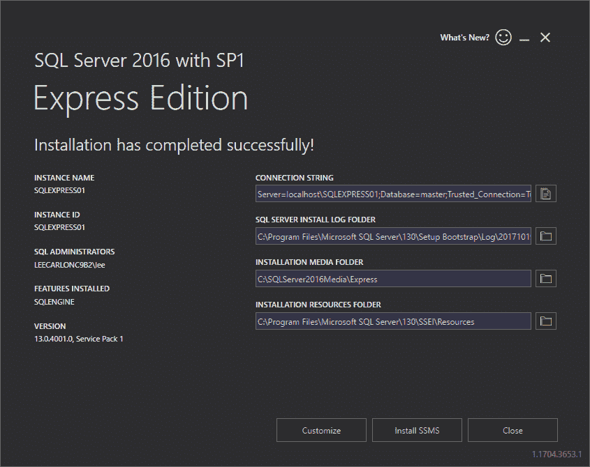
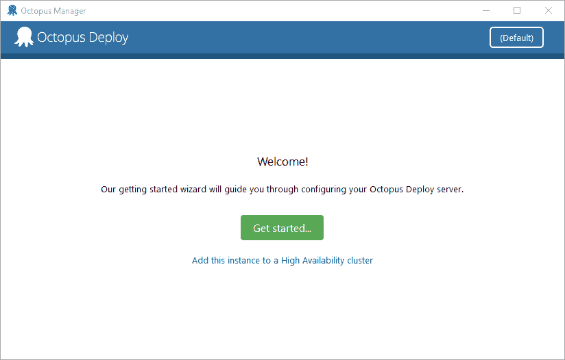
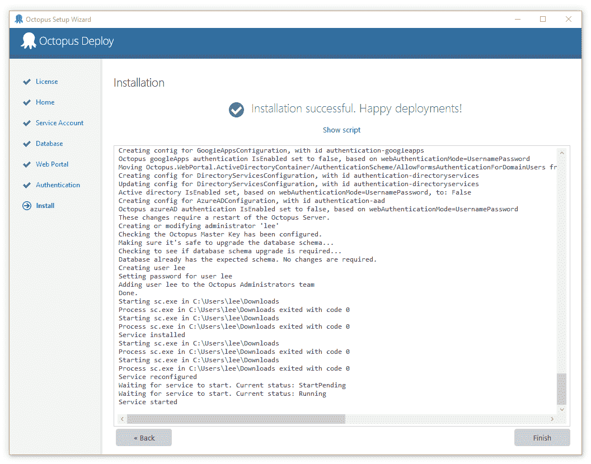
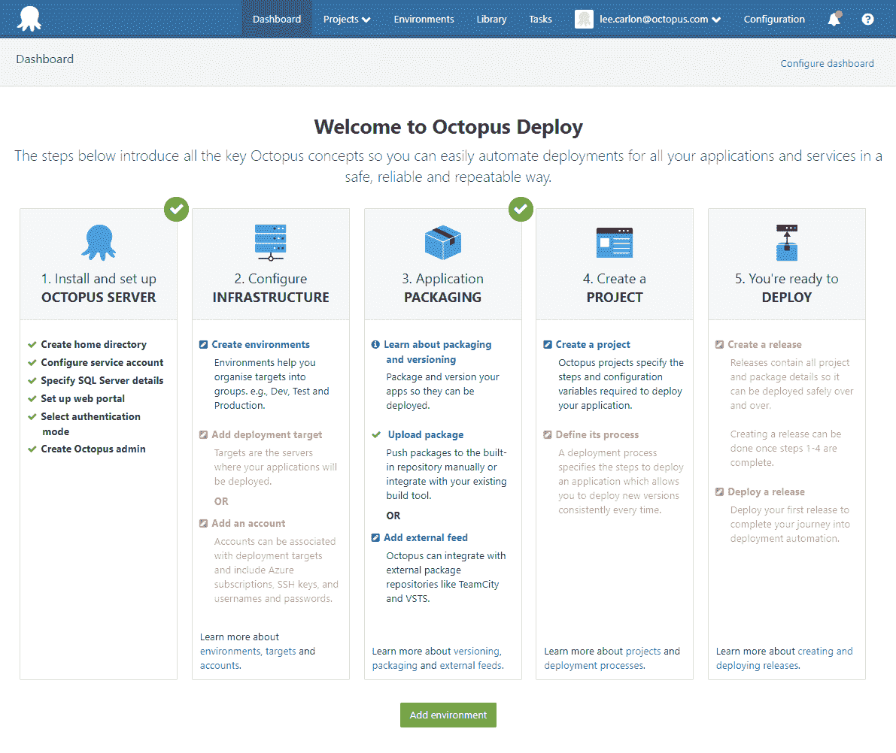

# 在本地设置 Octopus 部署试验- Octopus 部署

> 原文：<https://octopus.com/blog/octopus-deploy-trial>

Octopus 提供免费试用，让您有机会评估该软件，并确保它满足您的应用程序部署需求。如果你曾经想过自己做一个章鱼，踢它的触角(请不要踢任何触角)，这篇博客文章将帮助你建立一个本地评估实例，这样你就可以运行自动化部署的过程，而不用将它连接到任何关键的基础设施。在这篇文章中，我将在运行 Windows 10 的单个虚拟机中设置一切。

## 下载

接下来，您需要下载 Octopus 服务器 MSI、Octopus 触手 MSI 和 SQL Server 数据库:

出于这个博客的目的，我们使用 SQL server express。

## 安装 SQL Server

首先，我们将安装 SQL Server 数据库。选择基本安装，接受许可和默认值，然后单击安装。

下一步我们将让 Octopus 配置数据库。

## 安装八达通

启动 Octopus 服务器安装程序，接受许可和默认值。安装完成后，点击“完成”启动 Octopus Manager，然后点击**开始...**。

输入您的姓名、组织和电子邮件地址以激活许可证。接受默认存储位置或选择您自己的位置。

当您进入**数据库**屏幕时，单击**服务器名称**旁边的下拉菜单，以检测您之前安装的 SQL Server。填充服务器名称后，保留默认的 **Windows 身份验证**的**身份验证**选项，并在**数据库**字段中输入数据库名称。

比如，**章鱼 DB** ，点击**下一个**。

接受 web 门户的默认端口。向身份验证屏幕添加用户名、电子邮件和密码。您将使用这些来登录门户网站。

web 门户是您配置基础设施、定义发布流程、管理项目和部署应用程序的地方。

点击**在浏览器**中打开，使用您在安装过程中创建的用户名和密码登录 Octopus 门户网站。

## 基础设施

Octopus 将机器(无论是部署到物理服务器还是 Microsoft Azure)组织到环境中。按照以下步骤创建一个环境。

1.  从 **Octopus Web Portal 仪表板**中，选择基础设施➜添加环境，然后点击**添加环境**。
2.  给环境一个名字；我们将使用“测试”。
3.  选择溢出菜单，点击**添加部署目标**。我们要设置一个监听触手，所以选择**监听触手**。
4.  复制指纹，即屏幕下方的长字母数字字符串。把它粘贴到你能看到的地方。你很快就会需要它。
5.  添加主机名。我用的是本地主机。

接下来，我们需要一些基础设施来部署。我们将在与章鱼服务器相同的机器上配置一个触手。Tentacles 是作为 Windows 服务运行的轻量级部署代理服务。您将它们安装在计划部署软件的机器上。

启动章鱼触手安装程序。接受许可和默认值。点击**完成**启动**触手管理器**。点击**开始使用**并接受默认存储选项。

选择**监听触手**，在下一个屏幕上粘贴你之前复制的指纹，点击下一个**，然后**安装**。**

返回门户的部署目标页面，单击**发现**。接下来，我们给部署目标命名，我将使用**测试服务器**。选择您之前设置的环境，并添加一个角色，我正在使用**网络服务器**，现在保存设置。

如果您点击**基础架构**选项卡，您可以看到:

*   环境
*   部署目标
*   目标状态
*   目标角色

如果您的部署目标显示任何警告，请选择该目标，然后在下一个屏幕上单击溢出菜单并选择健康检查。我选择了升级鱿鱼，并让章鱼运行升级。升级后，目标状态显示为健康。

你可以走了。

这为您提供了一个 Octopus 的工作实例，尽管在配置中，您可以评估 Octopus 的外观和感觉，并在引擎盖下进行窥视，但这不是许多人将用来部署真实世界软件的配置。

根据你想要部署什么，你可以查看[文档](https://octopus.com/docs/getting-started)来了解[打包](https://octopus.com/docs/packaging-applications)和[部署](https://octopus.com/docs/deploying-applications)你的应用，观看我们的视频，或者浏览博客。