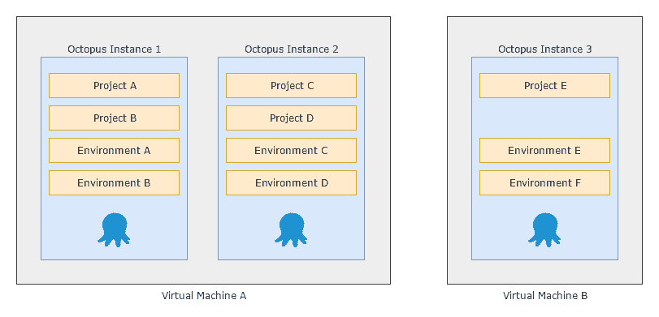
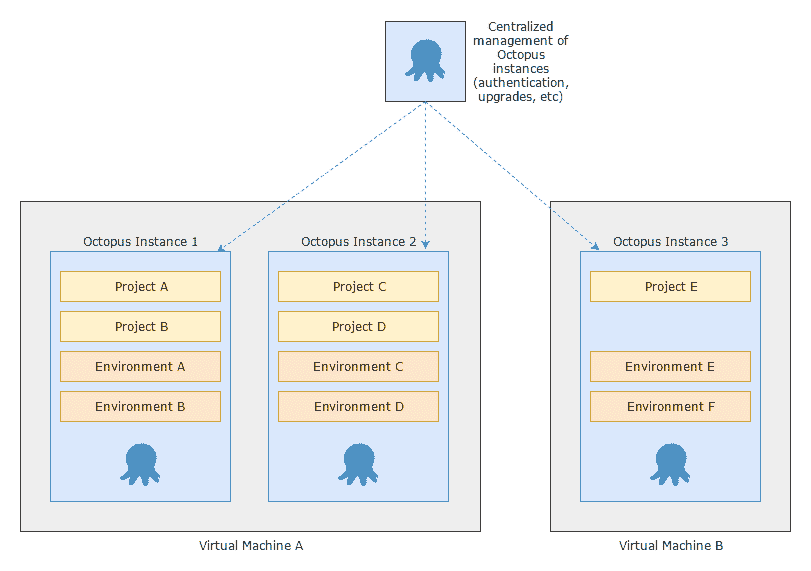
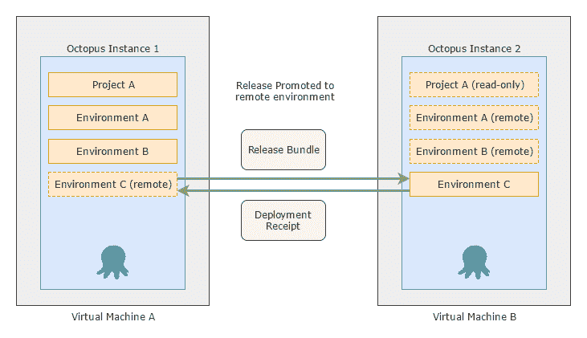

# 章鱼-章鱼部署

> 原文：<https://octopus.com/blog/octopuses>

当我们第一次构建 Octopus 时，我们设想它将被小团队用来将应用程序部署到十几台机器上。随着时间的推移，我们已经[看到客户将 Octopus 扩展到数千台机器](https://octopus.com/blog/octostats)，部署了数百个不同的项目。在这种规模下，客户需要他们的 Octopus 服务器始终在线，因此我们支持在多节点、高可用性集群上运行单个 [Octopus 服务器。](https://octopus.com/high-availability)

一个巨大的章鱼服务器并不总是一个好主意。

你可能有很多没有共同之处的团队。埃森哲就是这种情况，该公司在整个组织内对 Octopus 进行了标准化，并在少数超大型 Octopus 服务器上部署了数百个团队。对于他们的场景，将大的 Octopus 服务器分成许多小的更有意义，有效地给每个团队或几个团队他们自己的小的、隔离的 Octopus 服务器。

或者，也许您的组织符合 [PCI 标准](https://octopus.com/docs/reference/pci-compliance-and-octopus-deploy)，并且需要在您的开发和生产环境之间进行严格的分离。这种情况下的客户通常[在每个安全区域](https://octopus.com/docs/installation/isolated-octopus-deploy-servers)管理一个 Octopus 服务器，并在两个安全区域之间同步项目。

我们想得越多，就越意识到有几个令人信服的理由可以解释为什么你可能会拆分你的 Octopus 服务器:

1.  **独立团队:**你的组织，像埃森哲一样，有多个独立工作的团队。目前 Octopus 有许多项目间共享的实体(例如生命周期、变量集、步骤模板等)。单独的章鱼服务器确保你的豌豆和胡萝卜留在自己的盘子里。

2.  **规模:**机器的资源是有限的。虽然一个[高可用性集群](https://octopus.com/high-availability)允许您跨多个服务器扩展工作，但在很多情况下，拥有大量实体(环境、机器、项目等)会影响性能和可用性。

3.  **安全环境:**出于安全或合规性原因，您的组织需要将开发和生产环境严格分开。许多客户通过在每个安全区域安装一个 Octopus 服务器来解决这个问题。

4.  **分布式环境:**许多组织跨多个地理区域部署环境。通过在每个位置托管一个 Octopus 服务器，部署性能(尤其是包传输)可以显著提高。

## 你现在可以用章鱼做这些，但是很疼

所有这些都是真实情况，我们的客户目前正在处理这些情况。在每一种情况下，我们都找到了完成工作的方法，但感觉我们并没有以“一流”的方式解决所有这些问题。

让我们来看一些例子。

### 跨多个 Octopus 服务器横向扩展

*独立团队*和*规模*场景通常通过将许多 Octopus 服务器分布在一台或多台机器上来处理，通常在组合中的某处使用[高可用性集群](https://octopus.com/docs/administration/high-availability)。

好了，现在您已经决定跨多个服务器进行分片；你已经解决了一些问题，但是你用其他问题代替了它们:

*   你如何管理你的八达通服务器的身份和访问控制？
*   你如何管理服务器之间的 Octopus 升级？
*   如果您希望共享一些东西，如[步骤模板](https://octopus.com/docs/octopus-rest-api/examples/step-templates)、[变量集](https://octopus.com/docs/projects/variables/library-variable-sets)，甚至[部署目标](https://octopus.com/docs/infrastructure/deployment-targets)，该怎么办？

为了解决身份和访问控制问题，您可以使用我们的一个联合身份验证提供商来实现单点登录(SSO ),但是管理每个用户在您的每个 Octopus 服务器上被授予的权限可能会很痛苦。

您可以使用[数据迁移](https://octopus.com/docs/administration/data-migration)在 Octopus 服务器之间共享数据，但是这很复杂，并且没有处理冲突的好方法。

*安全环境*和*分布式环境*场景类似于*独立团队*和*规模*，但有所不同。

通常所希望的是一种促进 Octopus 服务器之间的释放的方法。理想情况下，保留 Octopus 的所有优点，如在仪表板上查看进度，部署就像单击按钮一样简单。

如今，这通常通过几种方法来解决:

这些都管用；每天都有很多客户在使用。但是它们都有缺点:

*   离线部署必须在每台目标机器上手动执行，并且不允许您查看部署结果或任务日志。
*   Migrator 实用程序从来不是为在不同环境之间升级单一版本而设计的。
*   孤立的 Octopus 服务器会遇到我们前面提到的所有管理难题。

简而言之，它们没有以我们满意的方式解决根本问题。

## 八达通部署 4.0

你能想象有一种工具能让你管理整个章鱼服务器群的身份、访问控制、升级和信息共享吗？我们可以！

你能想象从一个 Octopus 服务器向另一个服务器发布版本，并看到部署结果流回，即使服务器完全断开连接？我们也可以想象！

在 Octopus 总部，我们一直在考虑 Octopus Deploy 的下一个主要版本:版本 4.0

这个版本的主要焦点将是解决上面介绍的场景，我们将在未来几周的帖子中深入探讨更多细节。

敬请关注。