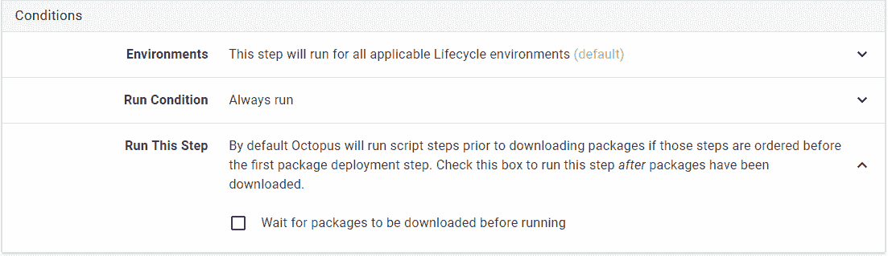
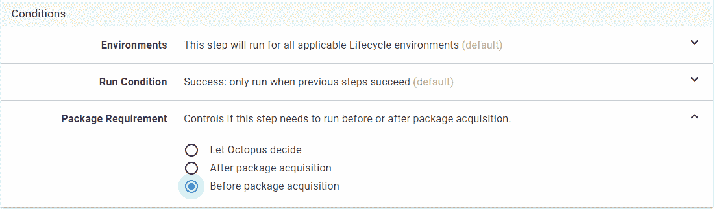

# 八达通 1 月版 2018.1 -八达通部署

> 原文：<https://octopus.com/blog/octopus-release-2018.1>

Octopus Deploy 的一月份发布主要是由 [Octopus Cloud](https://octopus.com/cloud) 驱动的安全发布，也将使我们在内部运行 Octopus Deploy 的每个客户受益。我们强烈建议升级。

您还会注意到我们新的版本控制策略:通常被称为章鱼的东西实际上是 T1。阅读更多关于[为什么我们要改变](/blog/version-change-2018)的信息。

## 在这篇文章中

## 章鱼云

我们今年的一大驱动力是将我们的托管章鱼产品推向市场，名为 **[章鱼云](https://octopus.com/cloud)** 。我们将在接下来的几天里启动一个封闭的 Alpha 程序——感谢所有注册的人！

下一次开始使用章鱼云的机会将是在 2018 年 3 月我们的开放测试计划期间。今天就可以[注册你对章鱼云的兴趣](https://octopus.com/cloud)！

在公开测试之后，我们将正式推出章鱼云，今年晚些时候，我们将推出我们的[数据中心](https://octopus.com/cloud)版本。

了解更多[章鱼云](https://octopus.com/cloud)。

## 我们已经改变了我们的版本策略

阅读更多关于[我们为什么改变](/blog/version-change-2018)的信息，这也是我们作为软件产品公司持续发展的一部分。

## 安全增强措施

为了准备[章鱼云](https://octopus.com/cloud)，我们已经进行了渗透测试和安全审计。没有发现大的问题，但是发现了一些我们想要修复的小问题。您可能已经在最近的补丁中看到了几个安全修复。这次发布的特性包含了所有的补丁，以及一些额外的增强功能，可以让你的 Octopus 服务器比以前更加安全。

### 新的内置角色和权限

Octopus 附带了几个内置的[团队和用户角色](https://octopus.com/docs/administration/managing-users-and-teams)，其中之一是`Octopus Administrators`团队，其角色`System Administrator`授予在 Octopus 安装中做任何事情的权利。

在 Octopus `2018.1`中，我们有效地将`Octopus Administrators`团队和它的`System Administrator`用户角色分成了两部分:

*   我们保留了现有的`Octopus Administrators`团队和`System Administrator`角色，它们的行为与今天完全相同
*   我们添加了一个新的`Octopus Managers`团队和`System Manager`角色，他们可以做任何事情，除了为系统管理员保留的某些系统级功能

这对[章鱼云](https://octopus.com/cloud)来说很有意义:

*   我们的团队需要配置如何托管您的 Octopus 服务器——我们将成为`Octopus Administrators`团队的成员。
*   我们不希望你因为改变主机配置而无意中破坏了你的 Octopus 服务器——你将被添加到`Octopus Managers`团队中。

这种新的划分对于 Octopus 的大型安装来说是有意义的，在这种情况下，你希望在团队和他们的职责之间有更清晰的区分。

#### 新权限

这些变化的基础是一些新的权限，您可以在自己的 Octopus 安装中使用:

*   添加`UserEdit`是为了填补我们现有的直接编辑用户的权限结构中的空白——这以前需要`AdministerSystem`权限
*   `ConfigureServer`用于配置认证、SMTP 和 HTTP 安全头

#### 升级体验

当你升级现有的八达通服务器，或开始全新安装八达通服务器时:

*   `System Administrator`用户角色将被自动授予新的权限(这与我们过去添加新权限时使用的过程相同)
*   团队`Octopus Managers`和`System Manager`角色将被自动创建并被授予适当的权限

### 积极防止特权升级(CVE-2018-5706)

[CVE-2018-5706](https://cve.mitre.org/cgi-bin/cvename.cgi?name=CVE-2018-5706)

内置用户角色对于大多数常见场景来说已经足够了。在 Octopus 的大规模安装中，人们倾向于定制这些用户角色，或者从头开始创建他们自己的用户角色。Octopus 中的权限系统非常强大，但是强大的功能也带来了额外的复杂性...和巨大的责任。在 Octopus 的早期版本中，如果您错误地配置了这些角色，您可能会意外地授予一个团队提升他们自己权限的能力。

Octopus `2018.1`有一个额外的安全层，可以主动防止任何用户提升自己或其他用户的权限，使其超出当前权限范围。

进一步了解[本期](https://github.com/OctopusDeploy/Issues/issues/4167)。

## 分步包装要求

默认情况下，Octopus 在需要包的部署的第一步之前立即执行包获取。现在可以将步骤配置为在包获取之前或之后运行。步骤条件`Run this step`已被替换为`Package requirement`:

上一篇: 

新增: 

新的`Package requirement`允许更明确地配置关于包获取的步骤何时运行。有三个选项可供选择:

*   `Let Octopus Decide`(默认):可以在该步骤运行之前或之后获取包- Octopus 将确定最佳时间
*   `After package acquisition`:该步骤运行前将获取包
*   `Before package acquisition`:该步骤运行后将获取包

此选项在没有意义时隐藏，例如，当脚本步骤被配置为在包步骤之后运行时(此时必须获取包)。

这些选项在配置复杂的并行部署过程时提供了更大的灵活性，以确保在期望的时间获得包。您现在可以配置一个生成包的并行步骤块，并使用选项`Before package acquisition`来确保这些包可以被后续的包步骤使用。

## 重大变化

我们对 Octopus 做了两个行为上的改变，这可能会影响某些客户。

## 升级

像往常一样，升级 Octopus Deploy 的步骤[适用。更多信息请参见](https://octopus.com/docs/administration/upgrading)[发行说明](https://octopus.com/downloads/compare?to=2018.1.0)。

## 包裹

这个月到此为止。我们希望你有一个美妙的节日，并找到有用的新功能。欢迎给我们留下评论，让我们知道你的想法！前进并展开！