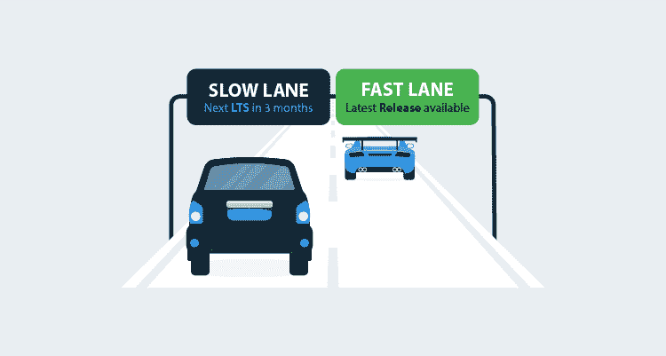

# 介绍我们的第一个长期支持版本-Octopus Server 2018.10 LTS-Octopus Deploy

> 原文：<https://octopus.com/blog/octopus-release-2018.10-lts>

章鱼服务器`2018.10 LTS`是我们[长期支持项目](/blog/long-term-support) (LTS)的第一个版本。它提供六个月的长期支持，我们向大多数自主托管客户推荐此版本。

现在就可以[下载章鱼服务器 2018.10 LTS](https://octopus.com/downloads) ！

我们的 LTS 版本将与每三个月一个新的 LTS 版本一起处于慢车道，所有版本都有六个月的支持。我们还将继续大约每月发布一次新版本，LTS 版本之间的版本将是我们包含最新功能的快车道版本。

使用 Octopus Cloud 的客户始终处于快速通道中，我们会代表您进行升级，您可以提前获得最新的功能。

在我们的[上一篇博文](/blog/long-term-support)中了解更多关于我们 LTS 项目的信息。这篇文章有一个 [Q & A 部分](/blog/long-term-support#qa)来帮助你理解我们的发布如何最适合你的情况。

## 2018.10 LTS 有哪些特点？

章鱼服务器`2018.10 LTS`和`2018.9`本质上是一样的。它配备了[工人和工人池](/blog/octopus-release-2018.7)、 [Kubernetes 支持](/blog/octopus-release-2018.9)，以及我们到目前为止所做的一切，包括少量的性能和安全工作。

## 重大变化

我们没有引入任何突破性的变化，但是`2018.10 LTS`将是最后一个支持从旧版本升级的版本。了解如何升级旧版本的章鱼。

## 我应该什么时候安装 2018.10 LTS？

没有比现在更好的时机了！你现在可以升级到八达通服务器`2018.10 LTS`。我们已经有成千上万的客户顺利升级到了`2018.9`，升级到`2018.10 LTS`也是从相同的代码中截取的。

现在就可以[下载章鱼服务器 2018.10 LTS](https://octopus.com/downloads) ！

## 我应该避免升级，继续使用当前版本吗？

请升级！为了你我双方的利益，我们希望你能更新你的八达通服务器。您将受益于最高质量、最佳性能、最安全的 Octopus 服务器，而我们将受益于支持的 Octopus 服务器版本的减少。这是双赢的局面！

*   如果您正在使用八达通云，我们会为您更新，您将始终处于快速通道中，可以提前获得最新功能。
*   如果您使用自托管 Octopus 服务器，我们建议您使用 LTS 版本。
    *   当我们发布补丁时，像`2018.10.1 LTS`，你应该修补你的八达通服务器——升级比不修补你的八达通服务器风险更小。
    *   当我们与 LTS 一起发布新版本时，只要您的当前版本仍在我们的 LTS 计划范围内，您就可以选择继续使用它，但是我们建议尽可能与当前版本保持一致。
*   如果您正在使用自托管章鱼服务器，但决定留在快车道上，我们强烈建议像章鱼云一样保持最新。这给了我们支持你的最好机会。我们正在寻找使升级比以往任何时候都更容易的选项-联系我们的支持团队，获得自动化升级的帮助。如果你不想和章鱼云保持同步，也许 LTS 版本对你来说是个更好的选择。

## 当你发布像 2018.10.1 LTS 这样的补丁时，我应该安装它吗？

当然，是的！我们将使用这个经验法则来决定在 LTS 版本的补丁中包含什么:**安装一个补丁应该比不安装更安全。**我们将在 LTS 补丁中包含某些内容，例如:

*   我们发现了一个安全漏洞，这将导致我们提出 CVE 报告。
*   我们发现了一个无法解决的问题。
*   我们发现了一个仅在当前 LTS 版本中存在的问题。
*   我们发现了一些对修补有商业意义的东西。

当我们发现这样的情况时，我们会为 LTS 仍然覆盖的任何版本发布一个补丁。

我们不会:

*   船舶数百 LTS 补丁-我们希望稳定和高信噪比。
*   在 LTS 补丁中提供新功能。
*   LTS 板块的拆船变化。

## 我是不是应该留在快车道，而不是安装 2018.10 LTS，转入慢车道？

通过引入 LTS 计划，我们给你权利选择在[快车道还是慢车道](/blog/long-term-support#fast-and-slow-lanes)升级。这是您必须根据您的情况做出的决定。了解[换道](/blog/long-term-support#switching-lanes)。

我们通常建议自托管客户选择 LTS 版本，通过安装`2018.10 LTS`，您将切换到慢车道。

如果这听起来像你的场景，你应该选择 LTS 的**慢车道版本**:

*   “比起拥有最新的功能，我们更喜欢稳定性。”
*   “我们大约每三个月升级一次 Octopus。”
*   “在升级我们的生产设备之前，我们在测试环境中评估 Octopus。”

如果这听起来像你的场景，你应该选择**快车道发布**:

*   "我们希望最新和最大的功能和小的改进和错误修复真正快速周转."
*   “我们希望与 Octopus 团队紧密合作，这样我们就可以帮助他们构建世界上最好的自动化工具！”

## 就算我不升级你还会支持我吗？

当然，是的！与 Octopus 服务器版本保持同步是互利的，但是我们将尽我们最大的能力支持所有 Octopus 用户，不管你运行的是哪个版本。如果我们代表你修复了一个 bug，无论如何你都需要升级来修复这个 bug。保持现状符合每个人的最佳利益！

## 包扎

八达通服务器的 LTS 已经到来，你可以放心。长期部署愉快！

## 了解更多信息