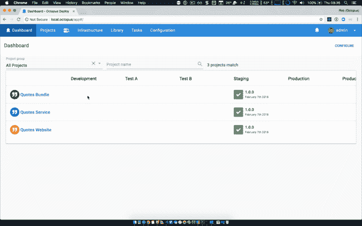

# 八达通 2018 年 2 月发布-八达通部署

> 原文：<https://octopus.com/blog/octopus-release-2018.2>

Octopus 2018.2 带来了许多令人兴奋的新功能，包括部署发布版本的[步骤，部署 AWS CloudFormation 模板、删除现有 CloudFormation 堆栈以及使用 AWS CLI 运行脚本的能力。](https://octopusdeploy.uservoice.com/forums/170787-general/suggestions/9811932-allow-project-dependencies-so-deploying-one-proj)

## 在这篇文章中

## 发布之旅

[https://www.youtube.com/embed/W2FMvpe3NyA](https://www.youtube.com/embed/W2FMvpe3NyA)

VIDEO

## AWS 支持

此版本引入了与 AWS 相关的 3 个新步骤。

第一个允许针对 AWS CLI 运行自定义脚本。Octopus 提供了 AWS 凭证和 AWS CLI 本身，使得作为部署的一部分与 AWS 资源进行交互变得容易。

另外两个步骤允许您部署 CloudFormation 模板和删除现有的 CloudFormation 堆栈。Octopus 负责参数和输出，并允许您部署直接在步骤中输入的或来自外部包的 CloudFormation 模板。

## 协调项目与部署发布步骤

一段时间以来，我们最受欢迎的用户之声建议之一是协调多个 Octopus 项目的能力，让一个项目触发另一个项目的部署。

在这个版本中，我们自豪地介绍了[部署发布步骤](/blog/deploy-release-step/deploy-release-step)。

我们希望这将支持许多强大的多项目场景。

## 外来工人

到目前为止，运行在服务器上的步骤的脚本是作为 Octopus 服务器的子进程运行的，并且在它的安全上下文中。上个月，我们发布了[改变运行这些脚本的用户账户](https://octopus.com/docs/administration/security/built-in-worker)的功能。

这个月，我们引入了第二种选择，[外来人员](https://octopus.com/docs/administration/workers)。这个特性允许您安装一个触手(或使用一个现有的触手)来运行所有涉及用户脚本或包的运行在服务器上的步骤。一旦配置完成，Octopus 服务器运行脚本的能力将被禁用，所有用户提供的脚本和包都将在该触手上运行。

这是我们正在进行的[工人](https://github.com/OctopusDeploy/Specs/blob/master/Workers/index.md)功能工作的一部分。管道中的下一个部分是工人与服务器的捆绑。这将作为默认的工人(又名内置工人)，并允许我们删除所有运行在服务器上的脚本执行代码。

## 大型仪表板的改进

我们还想强调一个小但重要的变化，这是对大型 Octopus 实例的一个很好的补充。如果您有大量的环境或租户，您的控制面板很难阅读，通常需要水平滚动才能看到更多内容。好消息是，我们已经用固定的第一列和标题更新了仪表板，因此它们更容易阅读和使用。

## 审计日志的改进

当被其他资源引用的资源被删除时，我们现在将记录它们是如何以及为什么改变的，其中一个关键是对项目变量的改变。还有一些其他资源类型现在正在接受审计和/或更详细的审计。

## 重大变化

如果您使用旧版本的`Octopus.Client.dll`来访问`/api/feeds/all`，那么现在将会出错。你将需要更新到 [Octopus 的> = 4.30.7。客户端](https://www.nuget.org/packages/Octopus.Client)。原因是我们为 Octopus 项目的发布添加了一个新的 feed 类型，以支持新的[部署发布步骤](/blog/deploy-release-step/deploy-release-step)。

### 改进我们的软件包 API

在对一些即将到来的新提要类型的预期中，我们不得不重新审视我们如何为外部提要公开软件包 API，以及我们如何为部署存储缓存的软件包。除非您直接点击 Octopus API 来搜索外部提要，或者依赖于缓存包的特定命名，否则对您几乎没有影响。更改包缓存名称的一个副作用是，服务器和 tentacles 上的当前包缓存将不再被检查，因此新的部署将使用新的包名称。有关这些变化的更多详细信息，请参见 GitHub tickets[“Packages API 不符合我们扩展提要类型# 4114”](https://github.com/OctopusDeploy/Issues/issues/4114)和[“修改缓存命名格式以允许新提要格式# 4211”](https://github.com/OctopusDeploy/Issues/issues/4211)。

## 升级

像往常一样[升级章鱼部署的步骤](https://octopus.com/docs/administration/upgrading)适用。更多信息请参见[发行说明](https://octopus.com/downloads/compare?to=2018.2.0)。

## 包裹

这个月到此为止。欢迎给我们留下评论，让我们知道你的想法！前进并展开！