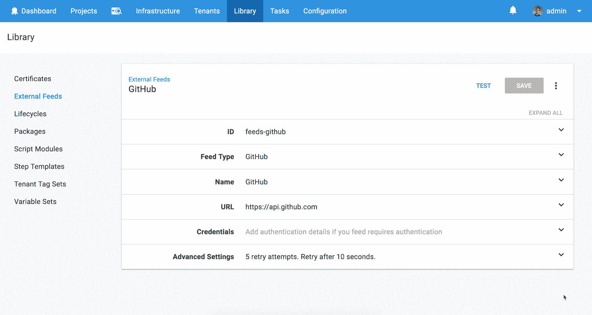
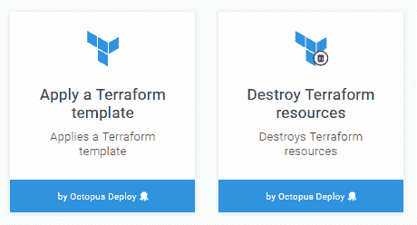
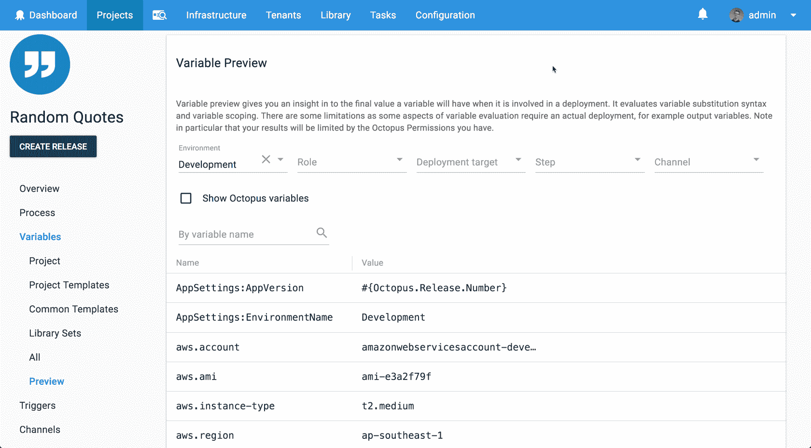
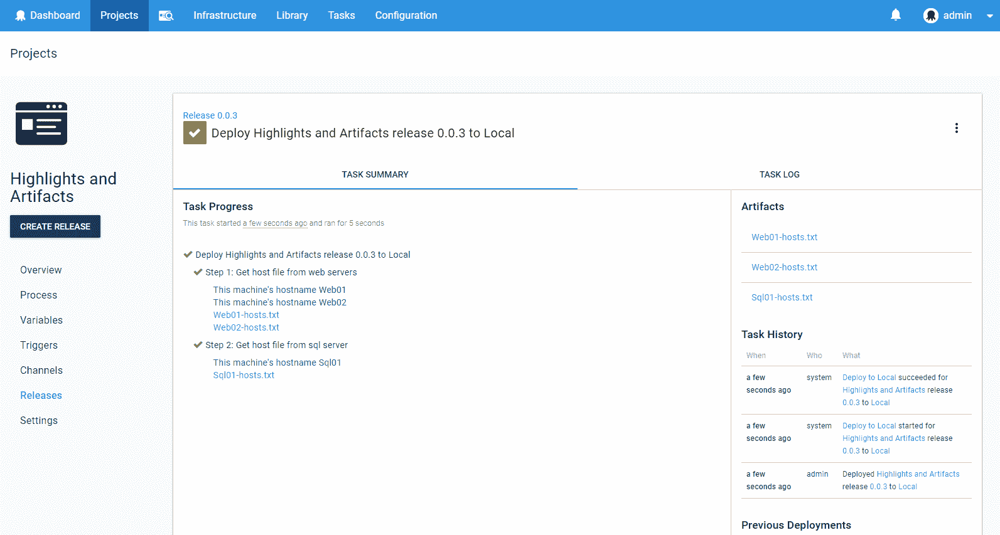

# 八达通 2018 年 3 月发布-八达通部署

> 原文：<https://octopus.com/blog/octopus-release-2018.3>

这个月，我们大大改进了对代码为的*基础设施的支持，释放了一些难以置信的部署自动化和基础设施自动化场景。Octopus `2018.3`引入了对 GitHub 库的支持，如 feeds 和一流的 Terraform 支持，以及一些令人敬畏的小功能，如部署变量预览和突出显示消息/工件。请继续阅读所有激动人心的细节！*

## 在这篇文章中

## 发布之旅

[https://www.youtube.com/embed/D2ZclLWko18](https://www.youtube.com/embed/D2ZclLWko18)

VIDEO

非常感谢[杰里米·凯德](https://github.com/JeremyCade)分享他的 Terraform 脚本来帮助我们发布巡回视频。

## GitHub 存储库提要类型

添加 GitHub 存储库作为 feed 类型意味着您现在可以部署外部资源，而不需要专门的预构建步骤。通过使用标记来表示版本，运行直接从源代码控制中提取的脚本、模板或简单应用程序。在我们的 [Git Hub Feed 文档](https://octopus.com/docs/packaging-applications/package-repositories/github-feeds)中阅读更多内容，了解更多关于使用这种新的 Feed 类型的信息。

## 地形支撑

此版本包括两个新步骤:应用 Terraform 模板和销毁 Terraform 资源。这些步骤允许 Terraform 模板作为 Octopus 部署项目的一部分执行，并集成了对变量替换和输出变量捕获的支持。有关这些新步骤的更多信息，请参考[文档](https://octopus.com/docs/deployments/terraform)。

## 部署变量预览

项目现在支持预览在部署过程中为特定部署上下文(包括环境、部署目标、步骤等)提供的变量值。

这是 Octopus 社区[高度要求的功能](https://octopusdeploy.uservoice.com/forums/170787/suggestions/6169634)的一部分，我们很高兴能发布它。

## 突出显示消息和工件

现在，您可以编写出现在“任务”页面的“任务摘要”选项卡上的日志消息。这些消息现在也会在任务日志中以蓝色和粗体显示，而不会隐藏在`<n> additional lines not shown`文件夹下。我们增加了助手来记录这个级别(`highlight`)。参考[文档](https://octopus.com/docs/deployments/custom-scripts/logging-messages-in-scripts)了解脚本中使用的语法。

添加了另一个日志级别`wait`，以指示部署正在等待什么(例如执行互斥)。这些消息在日志中也以不同的颜色显示。它主要由 Octopus 在内部使用，但是您也可以在这个级别登录。将来，我们计划添加一个时间线视图，它将使用这个级别的日志消息来显示部署暂停的时间。

附件现在也将出现在收集它们的步骤下，但与消息不同，它们只在步骤完成后出现，因为工件收集只在步骤结束时出现。

## 升级

像往常一样，升级 Octopus Deploy 的步骤[适用。更多信息请参见](https://octopus.com/docs/administration/upgrading)[发行说明](https://octopus.com/downloads/compare?to=2018.3.0)。

## 包裹

这个月到此为止。欢迎给我们留下评论，让我们知道你的想法！前进并展开！

## 从属库和扩展

下表列出了可用于此版本 Octopus 的库和扩展的版本。

Bamboo 用户必须更新由 Bamboo 插件执行的 Octopus CLI 工具。更多细节参见[文档](https://octopus.com/docs/packaging-applications/build-servers/bamboo)。

| 库名 | 版本 |
| --- | --- |
| 章鱼。客户 | 4.31.1 |
| 团队城市扩展 | 4.31.1 |
| Team Foundation Server | 2.0.98 |