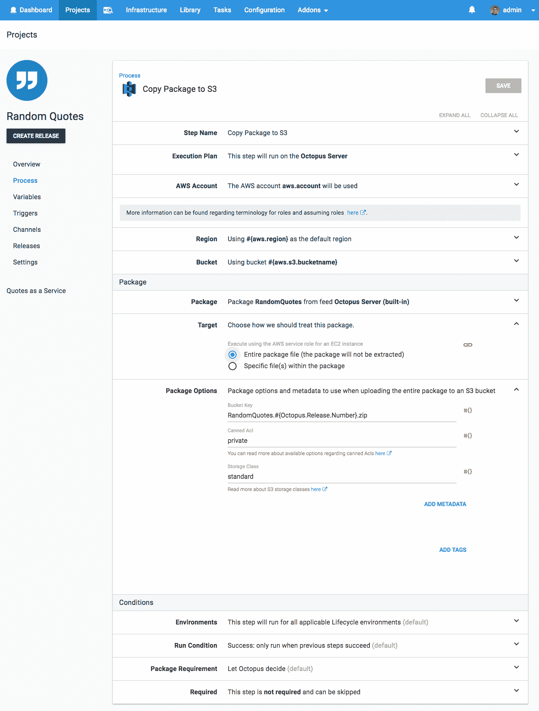
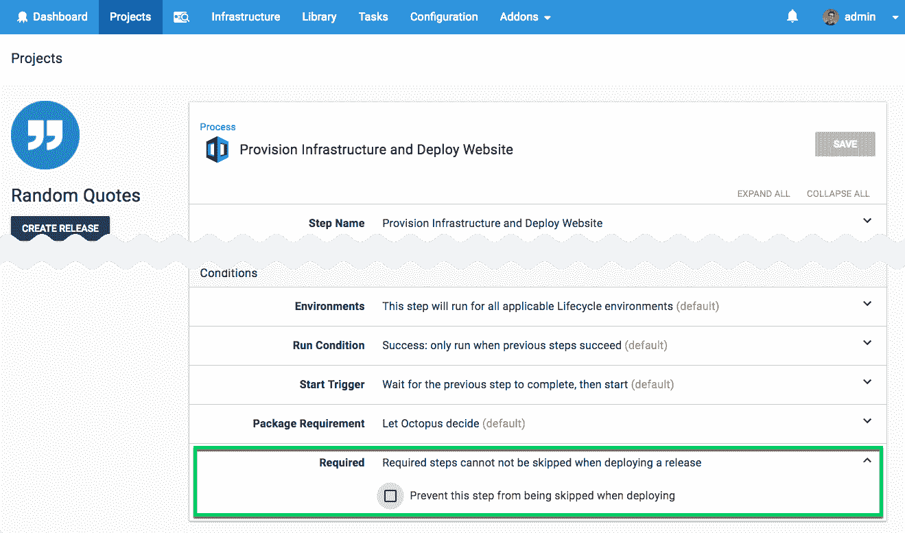

# 八达通 2018 年 4 月发布-八达通部署

> 原文：<https://octopus.com/blog/octopus-release-2018.4>

这个月，我们的头条功能是*定期计划部署*，这是我们[最受欢迎的功能之一](https://octopusdeploy.uservoice.com/forums/170787-general/suggestions/6599104-recurring-scheduled-deployments)，我们很高兴能够发布它。我们还发布了一个新的一流的 AWS S3 步骤，使使用亚马逊 Web 服务更容易，我们还添加了根据需要设置步骤的功能，因此它不能被跳过。

## 在这篇文章中

## 发布之旅

[https://www.youtube.com/embed/AR45wMd1_8o](https://www.youtube.com/embed/AR45wMd1_8o)

VIDEO

## 定期计划部署

Octopus 长期以来一直支持调度部署。您可以简单地指定何时执行一个部署，但是这只能工作一次。我们新的定期计划部署功能让您可以随时触发部署。这可能是将一个版本部署到您的测试或 QA 环境中进行日常测试，每周五下午 5 点部署您的最新稳定版本，甚至是在不使用虚拟基础架构时按计划启动和拆除虚拟基础架构以节省资金...比如晚上和周末。

当我们按照时间表交付以运营为中心的维护流程时，这将变得更加强大。请关注这篇博客，了解更多关于即将推出的功能的信息。

## 一流的亚马逊网络服务 S3 支持

我们正在通过添加一个[一级 S3 步骤](https://octopus.com/docs/deployments/aws/aws-s3-create-bucket)来继续改进我们的亚马逊网络服务(AWS)支持。这极大地简化了将包/文件放入 S3 桶以及在 AWS 生态系统中使用它们的过程。

## 必需的步骤

部署过程步骤可以在部署时跳过。这非常方便，但是有时您可能希望避免跳过特定的步骤。手动干预步骤是一个明显的例子(如果责任被限制到指定的团队，它们实际上已经不能被跳过)。其他示例可能是发送通知或运行验证流程的步骤。
对于 2018.4，您可以根据需要[标记一个步骤](https://octopus.com/docs/projects/steps/conditions#required)，它将没有资格被跳过。

这解决了以下用户语音请求:

## 重大变化

自动发布创建(ARC)现在会在选择包时强制实施通道约束。因为渠道可以约束包来排除预发布包，所以我们将使用渠道规则来防范预发布包，并在默认情况下启用预发布包选择。这意味着自动发布创建可以开始为在没有渠道规则的渠道中创建的发布选择预发布包，这不同于现有的行为，是一个突破性的变化。

要继续只选择稳定的包进行自动发布创建，请设置创建自动发布的通道，以将包限制为没有预发布标签的包(预发布标签为`^$`)。

## 升级

升级 Octopus Deploy 的[步骤照常适用。更多信息请参见](https://octopus.com/docs/administration/upgrading)[发行说明](https://octopus.com/downloads/compare?to=2018.4.0)。

## 包裹

这个月到此为止。欢迎给我们留下评论，让我们知道你的想法！前进并展开！