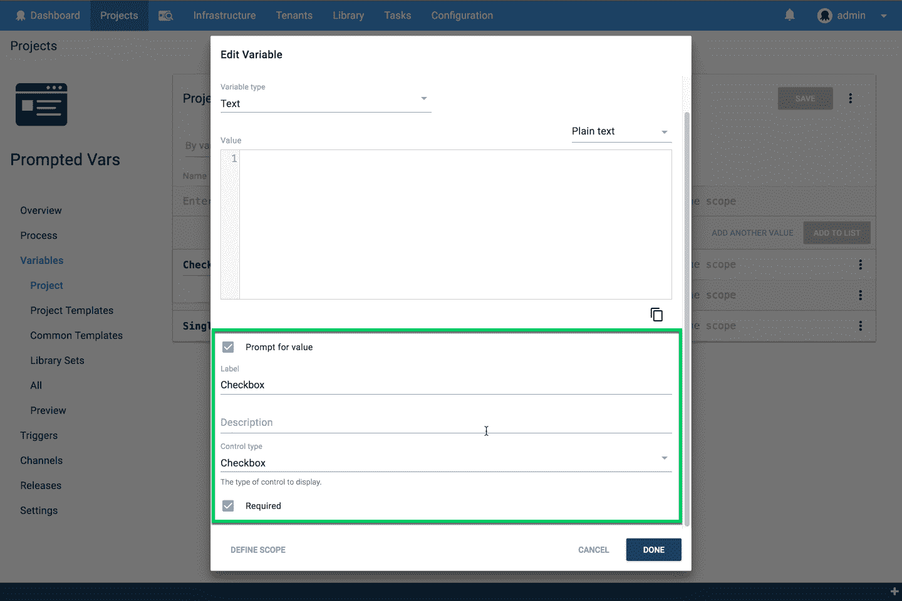
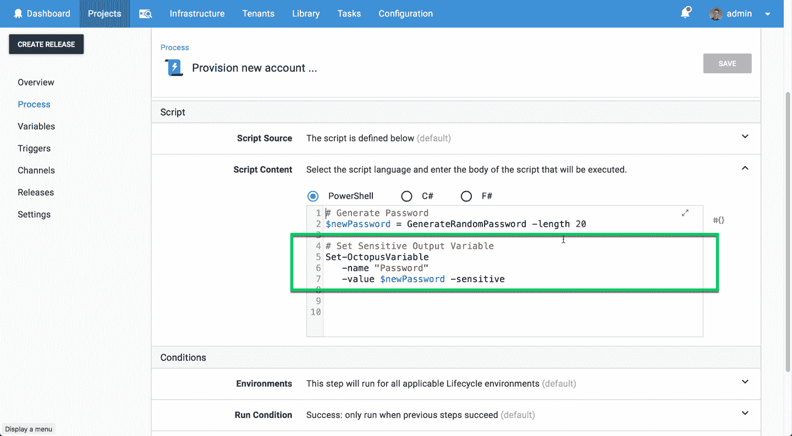
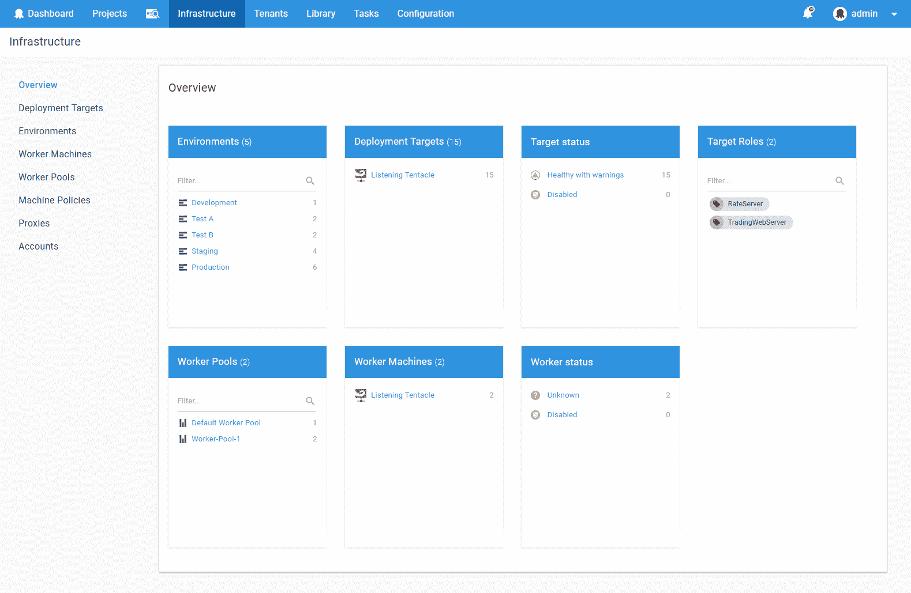
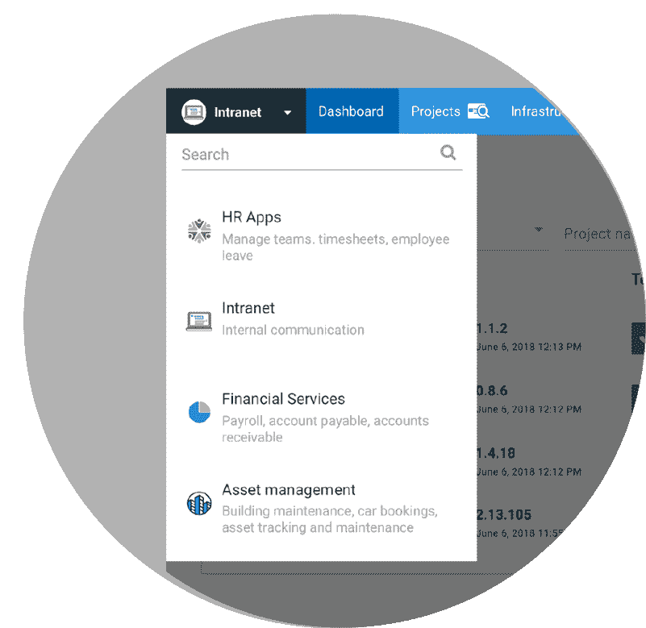
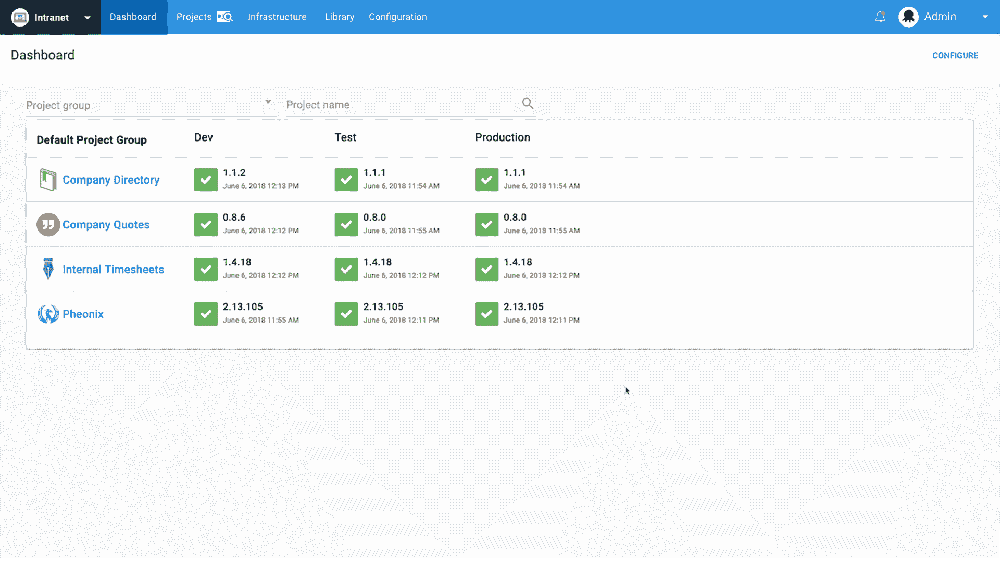

# 八达通 2018.6 六月版-八达通部署

> 原文：<https://octopus.com/blog/octopus-release-2018.6>

本月，Octopus 2018.6 包括两个 UserVoice 社区要求的改进，它还为一些精彩的新功能奠定了基础，这些功能将在未来几个月内推出。请继续阅读完整的细节！

## 在这篇文章中

## 发布之旅

[https://www.youtube.com/embed/tNuYRs_J8cY](https://www.youtube.com/embed/tNuYRs_J8cY)

VIDEO

首先，我们介绍几个较小的用户之声社区从我们的[用户之声网站](https://octopusdeploy.uservoice.com)请求改进。

### 提示变量控制类型

第一个 [UserVoice 建议](https://octopusdeploy.uservoice.com/forums/170787-general/suggestions/6016396-variable-prompt-templates)是一个很好的改进，它允许您为提示变量指定控制类型。以前这是不可用的，因为变量只能是一个文本输入，但现在你也可以使用复选框或列表。

### 敏感输出变量

另一个 [UserVoice 建议](https://octopusdeploy.uservoice.com/forums/170787-general/suggestions/30965434-set-octopusvariable-to-support-issensitive-flag)同样很小但很有价值，你现在可以设置敏感的输出变量。这一更改是保护敏感数据安全的一个极好的补充，当您动态生成密码并在整个部署中使用它们时，这在动态配置场景中非常方便。

## 构建基础-按比例设计

接下来，这个版本为两个新特性奠定了基础，这两个新特性是为拥有大型 Octopus 实例的大型团队和公司设计的。它们旨在帮助我们的客户扩展成千上万个项目、环境和部署。

## Octopus Workers 后端增强

这个月，我们将对一个更广泛的特性进行后端修改，这个特性叫做 Workers，即将推出。这些变化是技术性的和透明的，但是这是一个很好的机会来回顾这个特性。工人可以用来替换和扩展我们的功能，以运行在八达通服务器上的步骤。这是我们在 Octopus 3.0 中引入的东西，它通常用于执行一次性任务，如数据库脚本或其他不需要在特定机器上运行的东西。工作人员在此基础上提高了安全性，这样在部署过程中就不会在 Octopus 服务器上运行自定义脚本。它还可以通过将部署步骤从您的 Octopus 服务器转移到一组工作人员上来提高性能，让 Octopus 服务器来协调部署。在我们发布这项伟大的新功能时，我们将讨论许多其他好处。

注意:这个特性是可选的。您可以让一切保持原样，您的部署将继续工作。*我们毕竟称章鱼服务器为“内置工人”！*工人是一个可选的特性，您可以根据需要添加到您的部署中。

## 八达通空间后端增强

 

我们还包括了另一个重要特性的初始后端更改，这个特性叫做 Spaces，也即将推出。Spaces 允许你在 Octopus 中为你的团队创建你自己的自定义世界。因此，您只能看到您的项目、环境和机器。这对于拥有数百名使用 Octopus 的开发人员、测试人员和管理人员的大公司或者拥有大量项目和环境的小型团队来说是非常有益的。可能很难找到对你来说重要的细节，但这随着空间而变化，这很快就会发生。

## 许可变更

*总结:如果你已经在愉快地使用 Octopus Deploy，对你来说没有什么应该改变！此更改仅影响在 2018 年 3 月 31 日之后安装了 Octopus Deploy 并计划使用免费社区版的客户。*

回到今年 2 月，我们[宣布我们将不再支持新安装的 Octopus Deploy 的免费社区版](https://octopus.com/blog/removing-free-tier)。从 Octopus 2018.6 开始，我们将在产品本身中执行该决定:

*   如果您在 2018 年 3 月 31 日**之前已经在使用 Octopus Deploy**，对您来说没有任何变化。
*   如果你已经有了 Octopus Deploy 的商业许可，那么对你来说什么都没有改变。
*   如果你已经在使用免费的社区版，不要担心，它会继续工作！是的，您可以使用现有的社区版本限制升级到新版本的 Octopus Deploy。
*   如果您在 2018 年 3 月 31 日**之前开始试用 Octopus Deploy，那么对您来说没有任何变化。您的试用版将自动降级为免费社区版。**
*   如果您在 2018 年 3 月 31 日**之后开始试用 Octopus Deploy，您需要在试用结束后购买商业许可证。别担心，我们已经推出了一些[非常实惠的商业许可证](https://octopus.com/pricing)。**

如果您有任何疑问，请随时[联系我们](https://octopus.com/support)。

## 重大变化

随着工人的基础进入，我们正在删除允许单个触手取代内置工人的`Octopus.Server.exe external-worker`命令。如果您已经将触手作为外部工作者使用，我们将自动将其作为默认工作者池中的第一个工作者进行迁移。了解 Octopus Deploy 2018.6 及更新版本中的[管理外部工作人员](https://octopus.com/docs/administration/workers/external-workers)。

此外，因为像部署目标一样，可以对工作人员进行健康检查，所以健康检查和升级任务的一个参数已被调整。如果使用 UI，什么都不会改变。如果您通过带有参数的 API 插入任务，例如来自客户端库的`...ExecuteHealthCheck(environmentId: "Environments-21")`，什么都不会改变。但是，如果您创建不带参数的健康检查或升级任务，这意味着针对所有部署目标和所有工作人员。将`restrictTo: "DeploymentTargets"`用于所有部署目标，将`restrictTo: "Workers"`用于所有工人。

除此之外，在这个版本中没有任何突破性的变化，所以你可以升级无忧！

## 升级

此版本包含对我们的机器表的一些优化，这可能需要一些时间，这取决于您有多少台机器，所以请确保您有时间来完成这一点。

否则，我们升级 Octopus Deploy 的标准[步骤适用。更多信息请参见](https://octopus.com/docs/administration/upgrading)[发布说明](https://octopus.com/downloads/compare?to=2018.6.0)。

## 包裹

这个月到此为止。欢迎给我们留下评论，让我们知道你的想法！前进并展开！