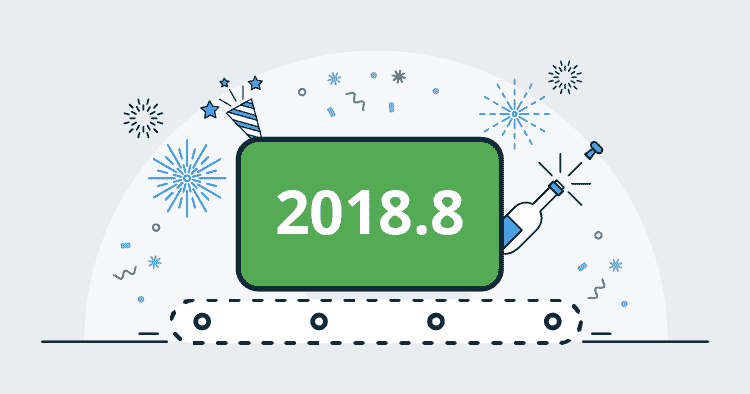
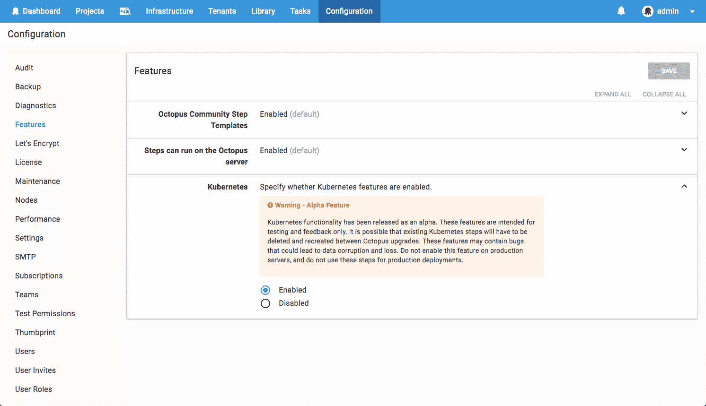
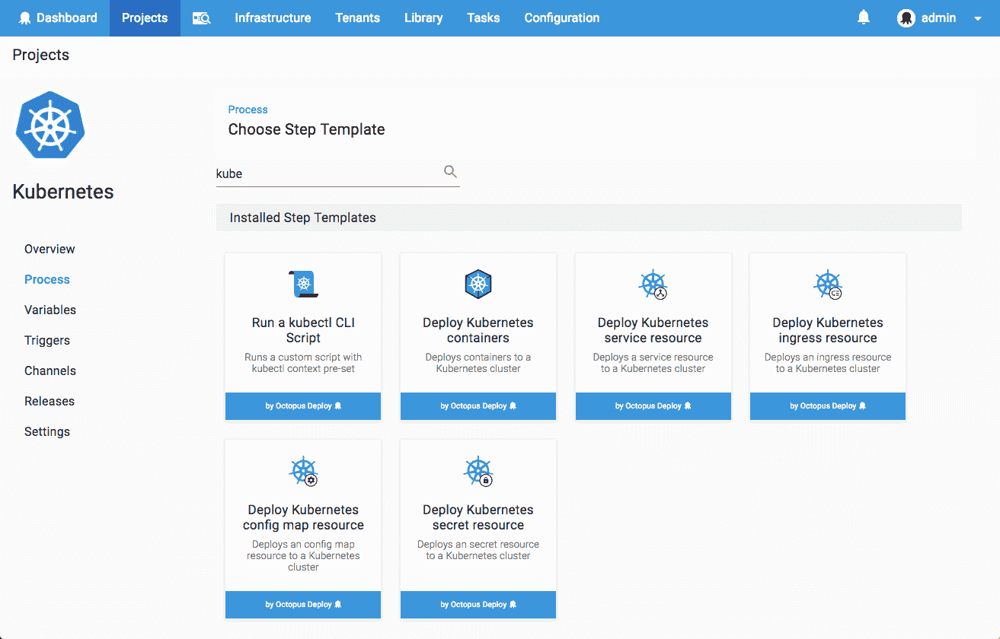
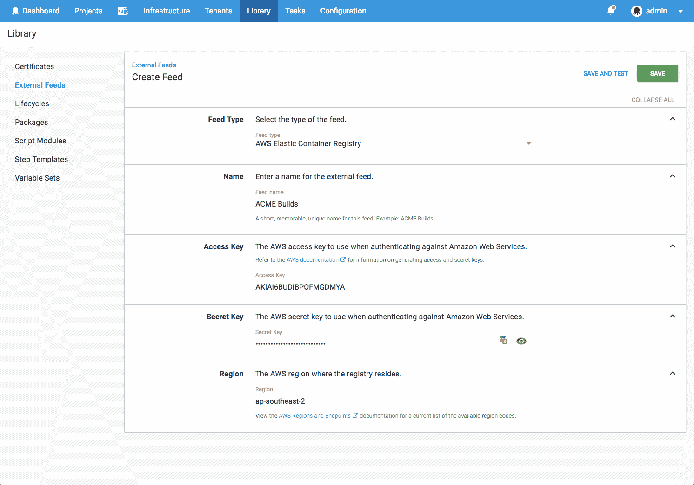

# Octopus 2018.8 版本- Octopus 部署

> 原文：<https://octopus.com/blog/octopus-release-2018.8>

## 在这篇文章中

## 发布之旅

[https://www.youtube.com/embed/luv-qSbla_k](https://www.youtube.com/embed/luv-qSbla_k)

VIDEO

## 脚本步骤包++

在 Octopus 2018.8 中，脚本步骤家族(*运行一个脚本*、*运行一个 Azure PowerShell 脚本*、*运行一个 AWS CLI 脚本*)获得了一些新的超能力。

我们正在使从脚本步骤消费包变得更容易和更强大。现在可以添加多个包引用，并且可以有选择地提取每个包。也可以引用容器图像。我们还增加了对变量替换的支持，因此包含在被引用的包中的任何文件都可以被更新。

我们有一整篇关于这些增强功能的文章，请阅读。

## 库伯内特阿尔法

我们非常高兴能在 Octopus 中包含 Kubernetes 支持的初稿！这个功能是在一个特性标志后面发布的，它的设计是为了让我们能够收到一些真实用户的反馈。虽然我们目前不建议将它用于生产工作负载，但我们鼓励任何感兴趣的人看一看，非常欢迎所有的反馈。

## AWS ECR 进料

添加了新的`AWS Elastic Container Registry`进给类型。这使得配置 AWS 凭证以从 ECR 访问容器图像变得更加方便。

## 升级

像往常一样，升级 Octopus Deploy 的步骤适用。更多信息请参见[发布说明](https://octopus.com/downloads/compare?to=2018.8.0)。