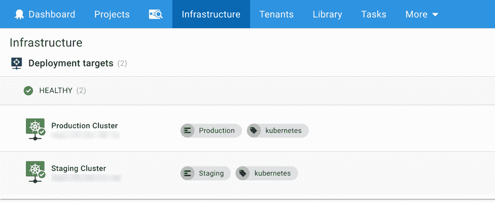
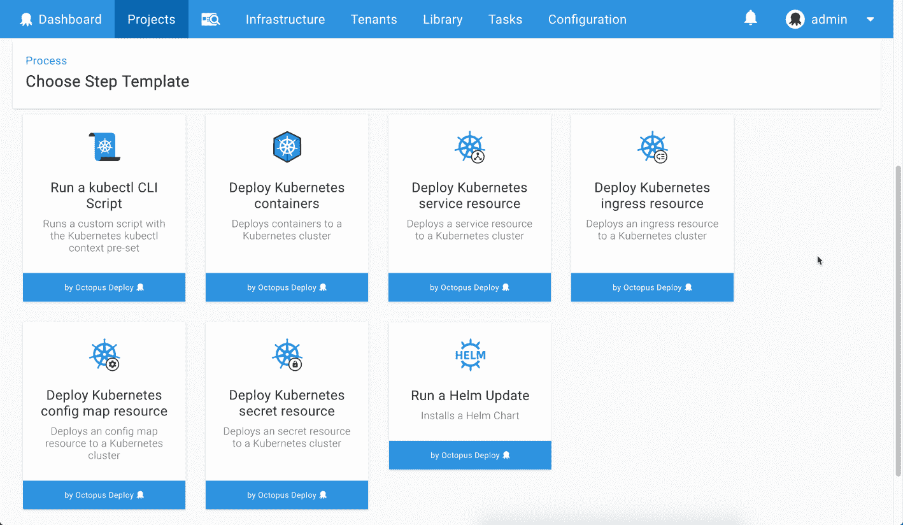

# Kubernetes 部署变得简单- Octopus 部署 2018.9 - Octopus 部署

> 原文：<https://octopus.com/blog/octopus-release-2018.9>

[https://www.youtube.com/embed/FZ8U5OuDyOw](https://www.youtube.com/embed/FZ8U5OuDyOw)

VIDEO

## Kubernetes 部署变得简单

Octopus Deploy 很荣幸能够为 Kubernetes deployments 提供一流的支持。我们的目标是让 Kubernetes 易于团队采用并将其项目迁移到这个流行的平台上。

Kubernetes(或 K8s)是一个灵活、强大的平台，用于以可靠和可伸缩的方式运行应用程序和服务。伴随着这种能力而来的是巨大的复杂性，学习配置选项和部署 YAML 可能会非常困难。

我们采取平衡功能和易用性的方法，为您提供两全其美的服务。这表现为对 Kubernetes 集群的基础设施支持和丰富的部署步骤，以简化您的部署过程。团队可以选择合适的平衡，从零 YAML 配置到完全控制`kubectl`和部署 YAML。

## 在这篇文章中

## Kubernetes 的基础设施

Octopus Deploy 现在支持添加 Kubernetes 集群作为部署目标和相关的配置选项。我们还增加了对舵图馈送的支持。

## Kubernetes 的部署流程

Octopus Deploy 附带了许多新的部署步骤模板，使团队能够将 Docker 容器部署到 Kubernetes，直接使用`kubectl`执行脚本，以及一个 Helm 更新步骤。

## 离线拖放工件

[离线包投递目标](https://octopus.com/docs/infrastructure/offline-package-drop)现在可以配置为将包作为 Octopus 工件持久化。

离线包丢弃目标以前只能将包持久化到文件系统目录中，这不适合 Octopus Cloud 实例。人工制品非常适合这一点；部署包作为一个 zip 文件持久存储在 Octopus 中。

## 更新的云 SDK

我们已经更新了 Octopus 附带的所有云依赖项:

*   Azure PowerShell 模块从`5.7.0`升级到`6.8.1`。此更新修复了 Azure PowerShell 的`5.7.0`版本的一些已知问题。
*   Azure CLI 从`2.0.42`升级到`2.0.45`。
*   AWS PowerShell 模块从`3.3.225.1`升级到`3.3.343.0`。
*   AWS CLI 从`1.16.6`升级到`1.16.15`。
*   Terraform CLI 从`0.11.5`升级到`0.11.81`。
*   Terraform AzureRm 插件版本`1.16.0`。
*   Terraform AWS 插件版本`1.39.0`。

## 重大变化

该版本包括 Azure PowerShell 模块对`6.8.1`的重大改进，以修复先前`5.7.0`捆绑版本的[已知问题](https://github.com/OctopusDeploy/Issues/issues/4574)。请参见 [Azure PowerShell 发行说明](https://docs.microsoft.com/en-us/powershell/azure/release-notes-azureps?view=azurermps-6.11.0)了解更多信息。

## 升级

升级 Octopus Deploy 的步骤照常适用。更多信息请参见[发布说明](https://octopus.com/downloads/compare?to=2018.9.0)。自主托管的 Octopus 客户现在可以[下载](https://octopus.com/downloads/2018.9.0)最新版本。对于章鱼云，你将在下周他们的维护窗口期间开始接收最新的 bits。

这个月到此为止。欢迎给我们留下评论，让我们知道你的想法！前进并展开！