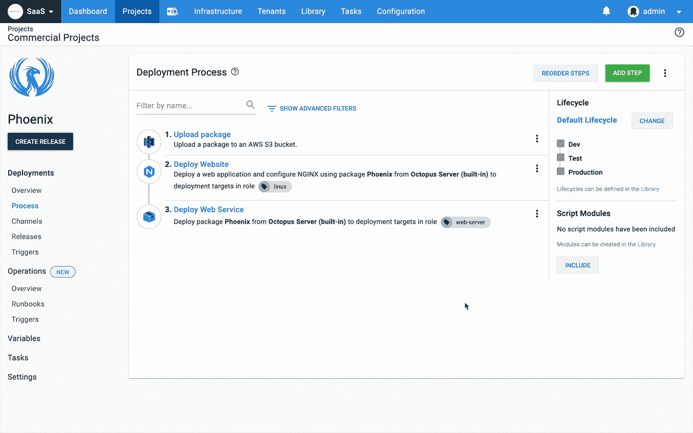

# 八达通部署 2019.11:操作手册 RTW -八达通部署

> 原文：<https://octopus.com/blog/octopus-release-2019.11>

**Octopus Deploy 2019.11** 现已推出，该版本引入了我们的运营手册功能和其他众多由客户反馈驱动的小改进。

我们在 Octopus 2019.10 中发布了对 Runbooks 的早期访问，我们写了关于 T2 为什么团队应该关心他们的文章。我们很高兴地告诉大家，Runbooks 已经达到了发布到网络(RTW)的状态。这意味着我们已经取消了早期访问功能切换，并且我们很自豪地发布了一个完整的解决方案来帮助团队自动化他们的运营任务。

## 在这篇文章中

## 运营操作手册

我们一流的 Operations Runbook 平台可自动执行日常维护和紧急操作任务，包括基础设施配置、数据库管理以及网站故障转移和恢复。

我们的运营手册功能现已准备好投入生产，包括以下内容:

*   对于配置了部署流程的任何人来说，这是一个熟悉的配置流程。
*   按需或按计划(每夜、工作日、每月一次等)直接针对基础设施执行操作手册的能力。)根据您团队的需求。
*   Runbooks 可以用提示变量参数化。
*   您可以对您的操作手册进行更改，并且只有在经过安全测试后才能发布。
*   运行手册由 Octopus 管理和执行，因此这意味着有一个完整的审计跟踪，可以在以后进行审查，从而很容易看到发生了什么，什么时候发生的，为什么发生的，以及是否需要更改。
*   您可以授予整个团队执行 run book 的权限，而无需为团队中的每个人分配 run book 将要执行的基础架构的权限。

[了解更多信息](https://octopus.com/docs/deployment-process/operations-runbooks)

## 由客户反馈推动的改进

我们的团队根据客户反馈和支持请求不断添加更新和错误修复。我们想在此版本中重点介绍一些变化:

*   **更简单的 Octopus 仪表盘配置**，更清晰的了解什么是过滤。
*   **增加了对测试 Azure DevOps 问题跟踪器连通性的支持**。在配置生成服务器集成和工作项跟踪时，此更改会有所帮助。
*   **如果用户只有 1 个空间**并且没有添加更多空间的权限，空间选择将不再可见。
*   增加了升级触手子集的支持。这适用于环境或工作者池中的触角/工作者组，而不是所有部署目标。
*   增加了对**重新部署之前成功部署**的支持，因此更容易回滚其他版本。
*   **Swagger API 文档更加准确**，使得团队更容易与 Octopus API 集成。
*   **提高了租户页面的性能**。当客户有成百上千的租户时，租户页面现在呈现得更快了。
*   **提高了可支持性**。我们改进了自动部署和动态基础设施供应的日志记录，以帮助团队了解如果出现问题会发生什么。

## 重大变化

作为这个版本的一部分，Octopus API 已经改变了 Octopus 的版本。8.0.0 之前的客户端无法在版本低于 2019.11.0 的 Octopus 服务器上创建计划触发器。

## 升级

像往常一样，升级 Octopus Deploy 的步骤[适用。更多信息请参见](https://octopus.com/docs/administration/upgrading)[发布说明](https://octopus.com/downloads/compare?to=2019.11.0)。自主托管的 Octopus 客户现在可以[下载](https://octopus.com/downloads/2019.11.0)最新版本。对于 Octopus Cloud，您将在维护窗口期间很快开始接收最新的 bits。

## 包裹

这个版本是我们 2019 年的最终版本，我们期待 2020 年。请关注我们的[路线图](https://octopus.com/roadmap)，我们会定期更新。

愉快的部署！