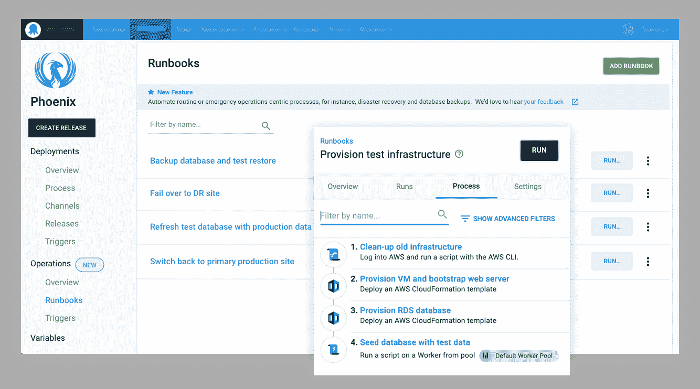

# 八达通服务器 2019.12 与长期支持(LTS) -八达通部署

> 原文：<https://octopus.com/blog/octopus-release-2019.12-lts>

Octopus Deploy `2019.12 LTS`现在可用于运行 Octopus Deploy 自托管的团队，我们向这些客户推荐这个版本。我们的[长期支持(LTS)计划](https://octopus.com/docs/administration/upgrading/long-term-support)包括提供六个月支持的版本，包括关键错误修复和安全补丁。LTS 版本不包括在此版本之后发布的任何新功能、次要增强功能或次要错误修复；这些都将被纳入下一个 LTS 版本。

[立即下载](https://octopus.com/downloads)

下表显示了我们当前的 LTS 版本。不再支持 Octopus 2019.6，我们建议该版本的客户升级到较新的版本。

| 释放；排放；发布 | 长期支持 |
| --- | --- |
| 章鱼 2019.12 | 是 |
| 章鱼 2019.9 | 是 |
| 八达通 2019.6 | 期满 |

请继续阅读，了解此版本中的内容以及任何重大变化。

## 在这篇文章中

## 运营操作手册

我们的 runbook 平台旨在帮助团队自动化日常维护和紧急操作任务，如基础架构供应、数据库管理以及网站故障转移和恢复。

此 LTS 版本包括对操作手册的支持，其中包括:

*   对于配置了部署流程的任何人来说，这是一个熟悉的配置流程。
*   按需或按计划(每夜、工作日、每月一次等)直接针对基础设施执行操作手册的能力。)根据您团队的需求。
*   Runbooks 可以用提示变量参数化。
*   您可以放心地对您的操作手册进行更改，并且只有在经过安全测试后才能发布。
*   运行手册由 Octopus 管理和执行，因此这意味着有一个完整的审计跟踪，可以在以后进行审查，从而很容易看到发生了什么，什么时候发生的，为什么发生的，以及是否需要更改。
*   您可以授予整个团队执行 run book 的权限，而无需为团队中的每个人分配 run book 将要执行的基础架构的权限。

[了解更多信息](https://octopus.com/docs/deployment-process/operations-runbooks)

## Jenkins 插件

【T2 

此版本还包括我们的官方 Octopus Deploy Jenkins 插件，该插件已经发布，现在可以从 Jenkins 插件库中安装或更新(如果您当前正在运行社区插件)。这个插件建立在由 Brian Adriance 和其他贡献者维护的奇妙的社区插件之上。

在此版本中，您现在可以将 Jenkins 构建与 Octopus 部署集成，包括以下任务:

构建步骤:

*   包装应用
*   将包裹推送给八达通
*   将构建信息推送到 Octopus

生成后操作:

*   创建发布
*   部署发布

它还让您更好地了解您的 CI/CD 管道，并且它可以帮助您改进您的发布的交流。

注意:这个版本的插件不支持 Jenkins Pipelines，但是我们已经注意到了。

[了解更多信息](https://octopus.com/blog/octopus-jenkins-plugin)

## PowerShell 核心支持

我们增加了 PowerShell 核心支持，使团队能够使用微软的现代自动化框架编写跨平台脚本。

在 Windows 平台上，Octopus 将默认使用 Windows PowerShell，如果需要，可以选择使用 PowerShell Core。您可以通过为支持自定义脚本的步骤配置 PowerShell edition 来对此进行自定义。

在 Linux 平台上，如果安装了 PowerShell Core，Octopus 将自动执行 PowerShell 脚本。

[了解更多信息](https://octopus.com/docs/deployment-examples/custom-scripts/powershell-core)

## 改进的构建信息和工作项跟踪

Octopus 2019.4 引入了构建信息和工作项跟踪。这是一个很受欢迎的特性，但是我们收到反馈说包元数据功能很难找到和理解。因此，我们已经在 Octopus 库中将这一功能提升为名为**构建信息**的顶级功能，使其更易于访问和理解。我们已经更新了我们的构建服务器插件套件，以反映名称的变化。

我们还添加了部署变更模板来补充现有的发行说明模板，使团队能够定制显示以满足他们的需求。

[了解更多](https://octopus.com/docs/packaging-applications/build-servers/build-information)

## 其他改进

我们的团队根据客户反馈和支持请求不断添加更新和错误修复。我们想在此版本中重点介绍一些变化:

*   **更简单的基于包的步骤模板**，更容易用包创建步骤模板，并让团队根据这些参数进行绑定。
*   **更简单的 Octopus 仪表盘配置**，更清晰的了解什么被过滤。
*   **增加了对测试 Azure DevOps 问题跟踪器连接性的支持**。在配置生成服务器集成和工作项跟踪时，此更改会有所帮助。
*   **如果用户只有一个空间**并且没有添加更多空间的权限，则空间选择不再可见。
*   增加了升级触手子集的支持。这适用于环境或工作者池中的触角/工作者组，而不是所有部署目标。
*   增加了对**重新部署之前成功部署**的支持，因此更容易回滚到之前的版本。
*   **Swagger API 文档更加准确**，使得团队更容易与 Octopus API 集成。
*   **提高了租户页面的性能**。当客户有数百或数千个租户时，租户页面现在呈现得更快。
*   **提高了保障性**。我们改进了自动部署和动态基础设施供应的日志记录，以帮助团队了解如果出现问题会发生什么。

## 重大变化

此版本包括以下突破性变化:

**PowerShell 内核**

PowerShell 核心支持引入了一项更改，即针对非 Windows 目标运行 PowerShell 脚本不再静默忽略`.ps1`文件。Octopus 现在将尝试在部署目标上执行`.ps1`文件。如果 PowerShell Core 安装在这些目标上，这可能会改变您的部署行为。如果 PowerShell 核心未安装在这些目标上，部署将会失败。

**建造信息**

我们的构建信息变更涉及到从 API 到数据库的资源重命名。这通常是向后兼容的；然而，任何使用我们的 GitHub 问题跟踪器的人都需要确保他们升级他们的章鱼服务器，如果他们升级他们的 [Azure DevOps 扩展](https://marketplace.visualstudio.com/items?itemName=octopusdeploy.octopus-deploy-build-release-tasks)、 [TeamCity 插件](https://plugins.jetbrains.com/plugin/9038-octopus-deploy-integration)或 [Bamboo 插件](https://marketplace.atlassian.com/apps/1217235/octopus-deploy-bamboo-add-on)。

**Octopus API 和 Octopus。客户端**

作为这个版本的一部分，Octopus API 已经改变了 Octopus 的版本。8.0.0 之前的客户端无法在版本低于 2019.11.0 的 Octopus 服务器上创建计划触发器。

## 包扎

八达通服务器 2019.12 现已推出，你可以依赖它。长期部署愉快！