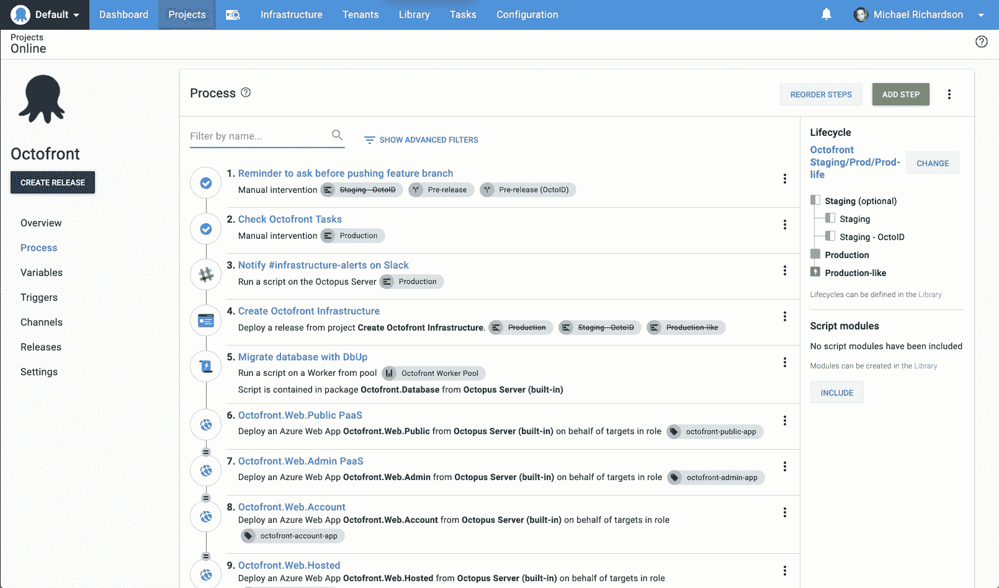
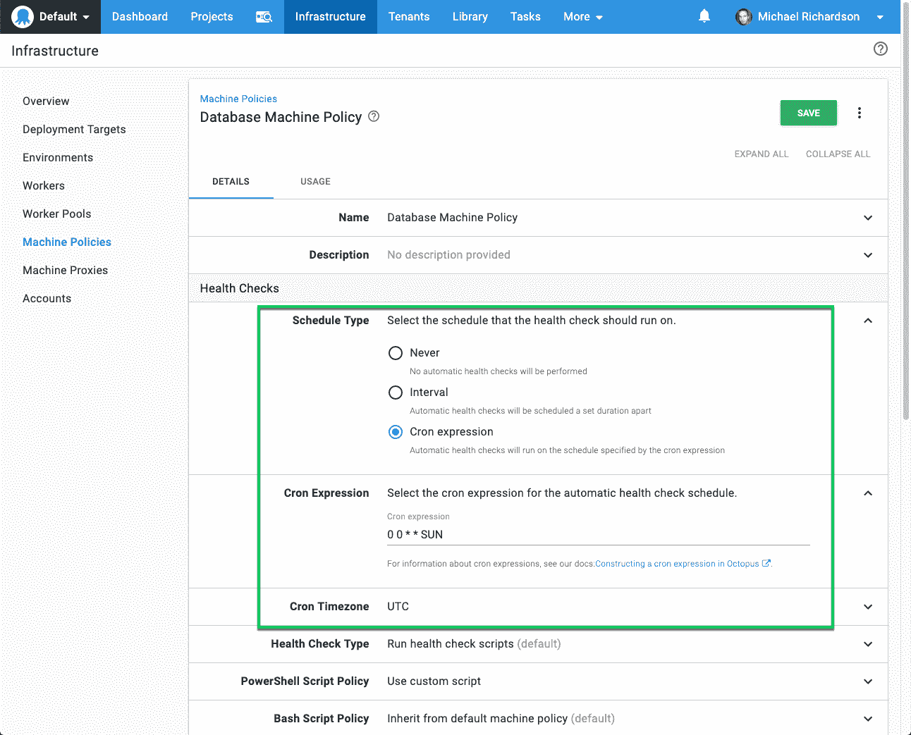
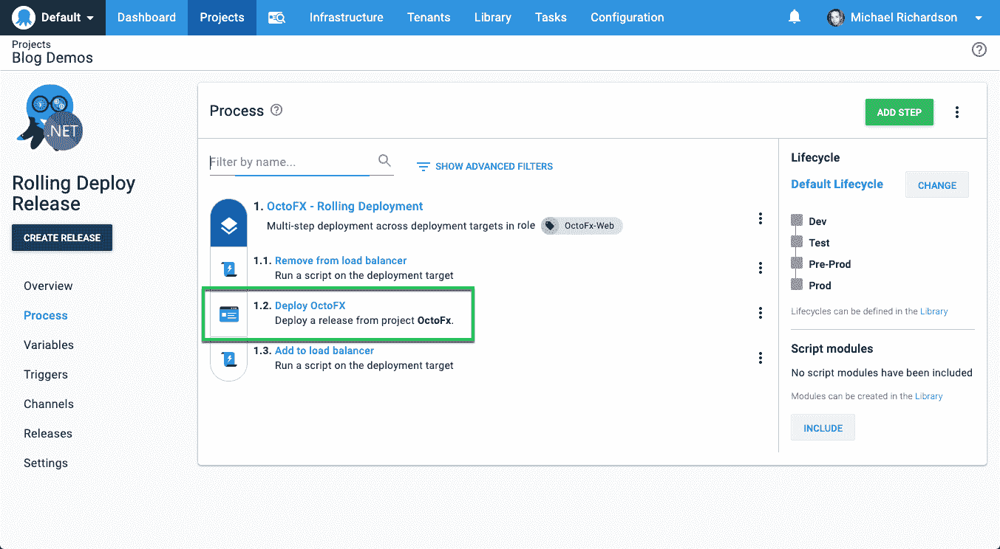
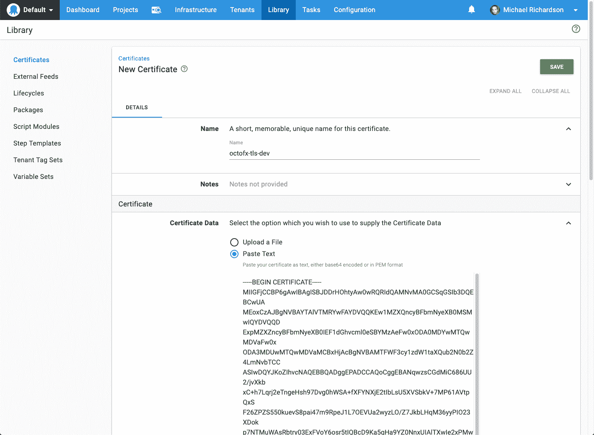

# Octopus Deploy 2019.8 -简化的部署流程编辑器、租户克隆等...-章鱼部署

> 原文：<https://octopus.com/blog/octopus-release-2019.8>

[](#)

Octopus Deploy 2019.8 现已推出。

最明显的变化是对部署流程编辑器的改进，但还有许多其他增强，所有这些都来自用户请求。希望在这个版本中有适合每个人的东西。

## 简化的部署流程编辑器

2019.8 在部署流程的各个步骤之间导航时带来了更好的体验:

[](#)

此更新提供了两个主要优势:

*   可见性:您现在可以在编辑一个步骤时看到整个过程。这在引用脚本或变量中的其他步骤名称时特别有用。
*   可用性:在部署步骤之间跳跃以前可能是痛苦的，特别是对于有许多步骤的过程。这一改变有望节省一些宝贵的时间(并减少鼠标的磨损)。

这代表了我们的部署流程编辑器改进的第一次迭代，我们希望您在评论中提供反馈。

## 克隆租户

说到节省鼠标点击，现在可以克隆租户了。创建一个新的租户、应用相关的标记、将它链接到适当的项目和环境，以及输入变量值可能会很繁琐，但是您现在可以通过克隆一个现有的租户来跳过这个过程。

[](#)

## 更多运行状况检查计划选项

以前，您只能在计算机策略中配置运行状况检查的时间间隔。Octopus 2019.8 带来了提供 cron 表达式或配置健康检查不运行的能力。

[](#)

## 覆盖所有 Kubernetes 步骤类型中可用的名称空间

虽然*升级 Helm Chart* 步骤允许指定名称空间，但是其他 Kubernetes 步骤总是使用 Kubernetes 部署目标的名称空间。从 Octopus 2019.8 开始，所有 Kubernetes 步骤类型都可以通过直接在步骤上指定目标名称空间来覆盖目标名称空间。

[](#)

## 滚动部署现在可以包括部署发布步骤

[滚动部署](https://octopus.com/docs/deployment-patterns/rolling-deployments)现在可以包括[部署发布步骤](https://octopus.com/docs/deployment-process/projects/coordinating-multiple-projects/deploy-release-step#rolling-deployments)。以前，滚动部署排除了这种步骤类型，但是正如你们中的许多人所指出的，在某些情况下这是有意义的。

[](#)

## 新的变量筛选表达式

我们添加了一些新的[变量过滤器](https://octopus.com/docs/deployment-process/variables/variable-filters)来帮助切片和切块变量值:

*   `Trim`
*   `Substring`
*   `Truncate`
*   `UriEscape`
*   `UriDataEscape`

例如，给定一个值为`Octopus Deploy`的变量`Application`

```
#{ Application | Substring 7} 
```

将评估为`Octopus`

## 复制并粘贴以添加证书

以前，将证书上载至八达通证书库需要选择证书作为档案。当 base64 或 PEM 表示位于您的剪贴板上时，这一要求很不方便。

现在，在存储证书时，可以将其直接粘贴到门户中。

[](#)

## 升级

和往常一样，请按照[升级 Octopus Deploy](https://octopus.com/docs/administration/upgrading) 的正常步骤操作。更多信息请参见[发行说明](https://octopus.com/downloads/compare?to=2019.8.0)。

*   自托管八达通客户通过安装[八达通服务器 2019.8](https://octopus.com/downloads) ，今天就可以开始使用这些功能。注意`2019.8`是没有[长期支持](https://octopus.com/docs/administration/upgrading/long-term-support)的快速通道发布。该功能集将包含在 2019 年第三季度末的下一次[LTS](https://octopus.com/docs/administration/upgrading/long-term-support)Octopus 发布中。

*   Octopus Cloud 客户将在其维护窗口的大约 2 周内开始接收最新的 bits。

## 包裹

这个月到此为止。欢迎给我们留下评论，让我们知道你的想法。

愉快的部署！