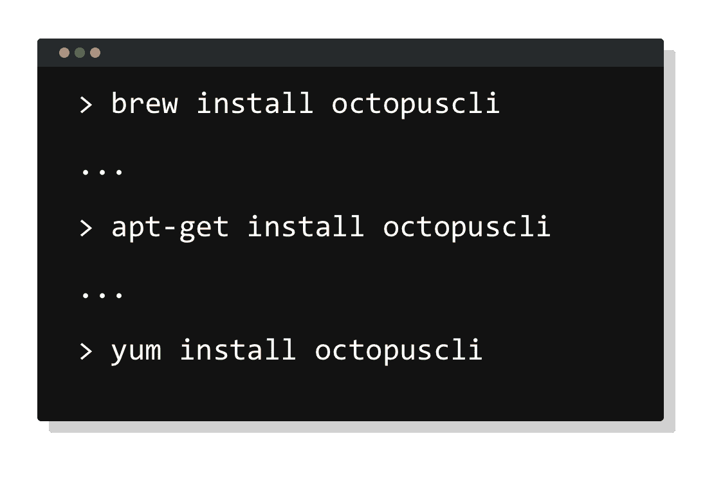
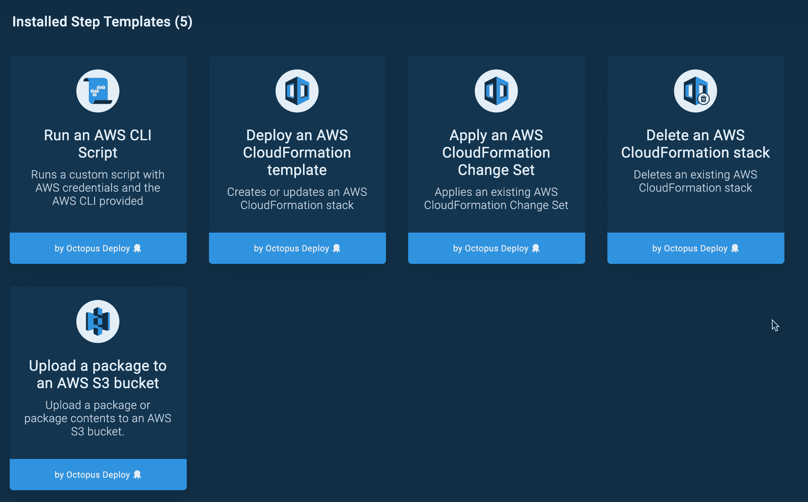
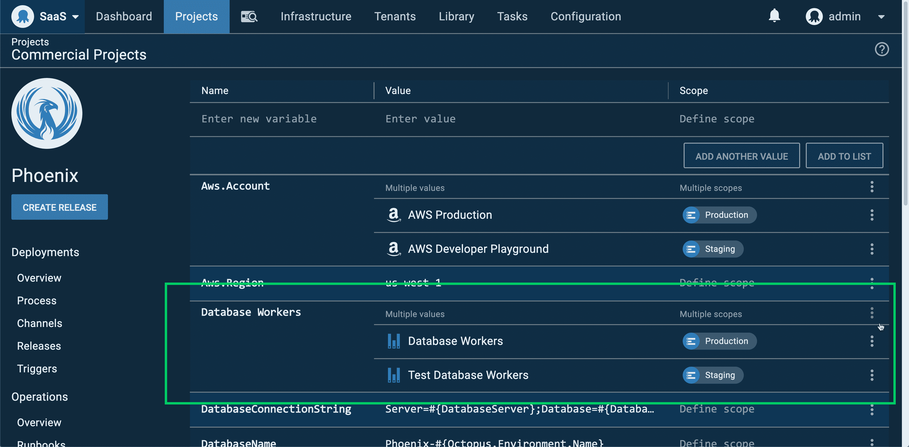

# 章鱼 2020.1:黑暗模式和更好的 Linux 支持-章鱼部署

> 原文：<https://octopus.com/blog/octopus-release-2020-1>

[https://www.youtube.com/embed/xJqjn4s2VCI](https://www.youtube.com/embed/xJqjn4s2VCI)

VIDEO

我们很自豪地推出 Octopus 2020.1，这是我们今年的第一个版本，有一些很好的更新和好处。

此版本是 2020 年六个版本中的第一个版本，包括 6 个月的长期支持。下表显示了我们当前提供长期支持的版本。

| 释放；排放；发布 | 长期支持 |
| --- | --- |
| 八达通 2020.1 | 是 |
| 章鱼 2019.12 | 是 |
| 章鱼 2019.9 | 是 |
| 八达通 2019.6 | 期满 |

请继续阅读，了解更多更新信息。

## 黑暗模式

[https://www.youtube.com/embed/ZMM8BowrUjQ](https://www.youtube.com/embed/ZMM8BowrUjQ)

VIDEO

开发人员和运营人员喜欢黑暗模式，我很高兴地分享 Octopus 现在支持黑暗模式。这是一个很酷的功能，但它也更容易对眼睛，有助于减少眼睛疲劳，看起来很棒。😎

Octopus 支持检测您的操作系统是否运行黑暗模式，并且可以自动切换。我强烈建议打开它进行试驾。

## Octopus 和 Octopus CLI 现在在 Linux 和 macOS 上更加得心应手

Octopus 的目标是为多个平台提供世界级的支持，包括 Windows 机器、Linux 机器和流行的云服务。这个版本包括两个变化，让 Octopus 在 Linux 和 macOS 上感觉更自在。

### Octopus CLI 可通过家酿、APT 和 YUM 获得

Octopus CLI，以前称为`octo.exe`，是一个方便而强大的工具，它使团队能够从命令行与 Octopus 进行交互。现在可以通过以下平台和软件包库快速轻松地进行安装:

*   巧克力 homebrew apt yum docker
*   新增加的是 Homebrew、APT 和 YUM，这样使用 macOS 和 Linux 的团队可以以更自然的方式利用这一点。
*   [看看吧](https://octopus.com/downloads/octopuscli)
*   AWS 和 Azure 部署可以在 Windows 和 Linux 机器上工作
*   

Octopus 包括许多流行的 step 模板，可以部署到 AWS 和 Azure 云基础设施。这些步骤现在可以在 Windows 和 Linux 目标/工作者上无缝地执行。此外，我们的 Kubernetes 步骤现在还可以在 Windows 和 Linux 目标/工作者上使用 Octopus 中的 AWS 和 Azure 帐户进行身份验证。

这一改进很小，但意义重大，可以确保团队能够在其选择的平台上执行云部署和操作手册。

### 注意:Azure Web Apps、云服务和 Service Fabric 步骤仍然是仅 Windows。

了解更多信息:

特定于环境和租户的工作人员池

工作人员使团队能够将部署工作从 Octopus 服务器转移到池中运行的其他机器上。您可以创建一个专门的工作人员池，用于多个项目和团队的特定部署工作。常见的例子有数据库部署和云服务部署。

在 Octopus 2020.1 中，我们增加了对工人池变量的支持，从而能够按环境或租户来确定工人池的范围。例如，您可以有一个专门用于开发和测试环境部署的数据库部署工作池，以及一个专门用于生产环境部署的更大的池。

## 这一更新是一个受欢迎的客户要求，我们很高兴能运送它。

[了解更多](https://octopus.com/docs/projects/variables/worker-pool-variables)

重大变化

这个版本包括两个突破性的变化。

**[Octopus Server 最低要求](https://octopus.com/blog/raising-minimum-requirements-for-octopus-server)**——我们将运行 Octopus Server 的最低要求提高到 Windows Server 2012 R2 和 SQL Server 2017。

**[库变量集权限变更](https://octopus.com/blog/libraryvariableset-permission-changes)**——你现在可以将存储在库变量集中的变量限定到环境和租户，给你细粒度的访问控制和更一致的权限。

## 还需要注意的是，Octopus 服务器已经被移植到。NET Core 3.1，因此它不再需要。要安装的. NET Framework。

升级

1.  章鱼云用户已经在运行这个版本，自托管的章鱼客户现在就可以[下载](https://octopus.com/downloads/2020.1.0)最新版本。
2.  像往常一样，升级 Octopus Deploy 的步骤[适用。更多信息请参见](https://octopus.com/docs/administration/upgrading)[发行说明](https://octopus.com/downloads/compare?to=2020.1.0)。

章鱼 2020.2 里会有什么？

## 查看我们的[公共路线图](https://octopus.com/roadmap)看看接下来会发生什么。我们即将开始开发一些令人难以置信的新功能，包括深度 git 集成、将管道解锁为代码。

结论

Octopus 2020.1 包括黑暗模式、跨平台 Azure 和 AWS step 模板、Homebrew、APT 和 YUM 包存储库上的 Octopus CLI 以及新的 worker pool 变量。这一版本是今年的一个良好开端，我们正在努力继续推出一款优秀的产品。

## 欢迎给我们留下评论，让我们知道你的想法！愉快的部署！

相关职位

## 结论

Octopus 2020.1 包括黑暗模式、跨平台 Azure 和 AWS step 模板、Homebrew、APT 和 YUM 包存储库上的 Octopus CLI 以及新的 worker pool 变量。这一版本是今年的一个良好开端，我们正在努力继续推出一款优秀的产品。

欢迎给我们留下评论，让我们知道你的想法！愉快的部署！

## 相关职位