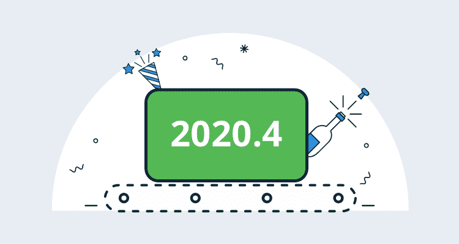
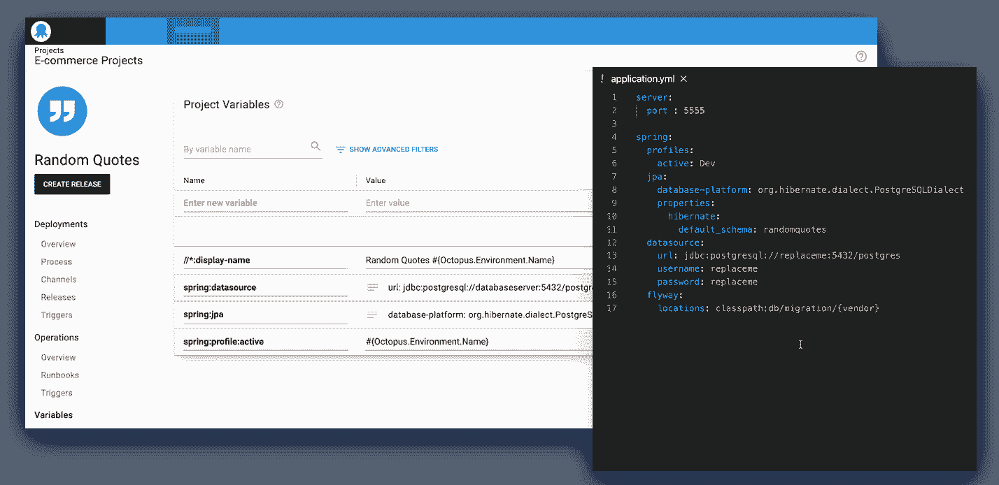
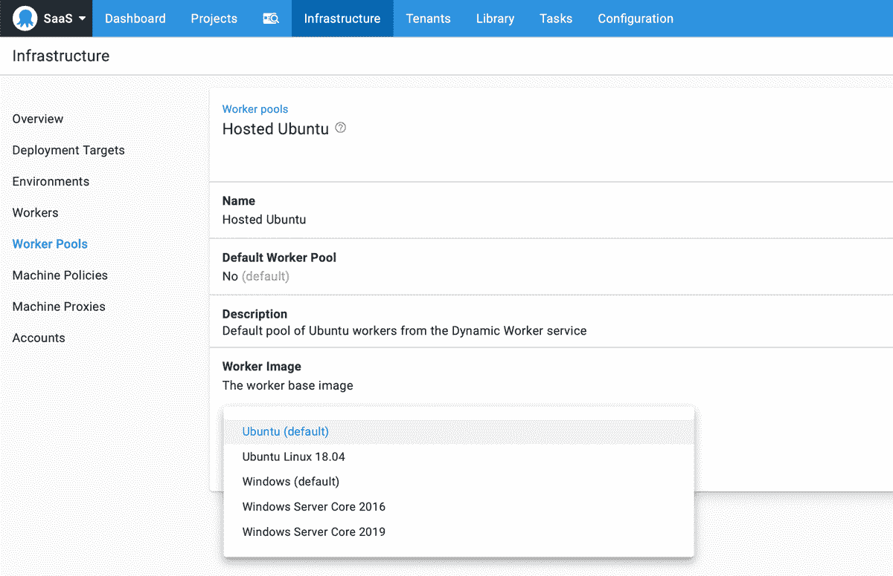
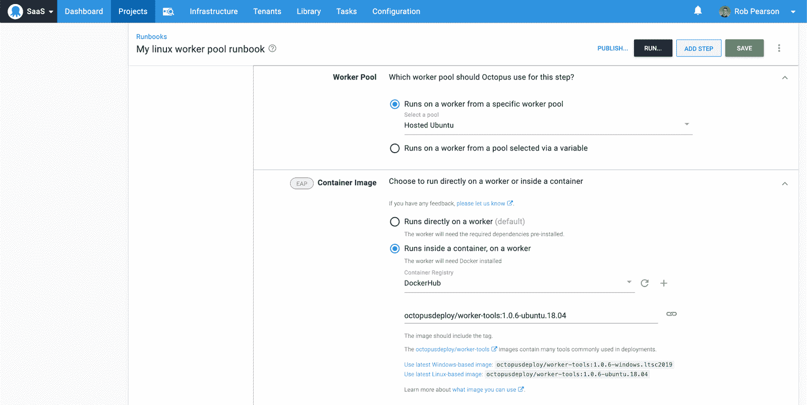

# 八达通 2020.4 现已推出-八达通部署

> 原文：<https://octopus.com/blog/octopus-release-2020-4>

我很高兴地告诉大家，我们已经推出了 Octopus 2020.4。这个版本集合了一些已经开发了一段时间的特性。总之，它们使团队更容易在 Windows 和 Linux 上部署和维护用 Java、NodeJS、Python、Ruby 等编写的 web 应用程序和服务。

*   **[更好的 Java、NodeJS、Ruby 等配置文件更新](/blog/octopus-release-2020-4#variables)** :是对我们的 JSON 配置变量替换支持的更新，使其更加有用。它现在支持 JSON、YAML、XML 和 Java 属性文件。对于许多平台来说，这是一个巨大的进步，但对于用 Java 构建应用程序的团队来说，这尤其有价值。

*   **[章鱼云:内置 Windows 和 Linux 的工人池，更简单的依赖管理](/blog/octopus-release-2020-4#cross-platform-worker-pools)** 。Octopus Cloud 提供动态工作器来针对您的服务和基础设施执行脚本。此更新增加了对现代 Windows 和 Linux 操作系统映像的更好的跨平台支持。所有工作映像都支持执行容器，这使您可以独立地执行部署工作，而无需管理依赖项和容器。

该版本是 2020 年六个版本中的第四个版本，包括六个月的长期支持。下表显示了我们长期支持的当前版本:

| 释放；排放；发布 | 长期支持 | LTS 结束日期 |
| --- | --- | --- |
| 八达通 2020.4 | 是 | 2021-03-21 |
| 八达通 2020.3 | 是 | 2021-01-20 |
| 章鱼 2020.2 | 是 | 2020-09-30 |
| 八达通 2020.1 | 期满 | 2020-08-24 |

请继续阅读，了解更多更新信息。

## 针对 Java、NodeJS、Ruby 等的更好的配置文件更新

Octopus 最强大的特性之一是，当您将应用程序升级到生产环境时，它可以自动更新您的配置文件。过去，它支持许多微软配置文件格式，主要是微软特定的 XML 转换和。NET 配置文件，以及一些通用方法，如 JSON 支持和令牌替换。这太棒了。但是，如果没有使用 XML 或 JSON 文件，就需要在配置文件中插入和维护标记。

在此版本中，我们引入了结构化变量替换，它支持几乎所有现代配置文件格式，包括:

*   YAML
*   JSON
*   可扩展标记语言
*   Java 属性文件

对于其他配置文件格式，我们的令牌替换支持，通过*替换文件中的变量*特性，已经覆盖了您。

用我们的结构化变量替换来更新配置文件的好处是，它是自动的和基于约定的。配置一次，Octopus 会自动更新配置设置，使其名称与您的项目变量相匹配。这个特性的神奇之处在于，您可以将您的变量扩展到环境中，因此将版本部署到开发、测试、试运行和生产环境中是可重复且可靠的。

这个更新使得为 Java 应用程序配置自动化部署变得更加容易，比如 Spring web apps 和 services、用 Python 编写的 web 应用程序、NodeJS 服务、Ruby on Rails web 应用程序等等。

[了解更多](/blog/spring-environment-configuration)

## Octopus Cloud:内置的 Windows 和 Linux 工作池，以及更简单的依赖管理

Octopus 2020.4 现在包括内置的工人池，具有运行现代 Windows 和 Linux 映像的动态工人，包括对执行容器的完全支持。

Workers 使您能够在池中运行的机器上运行 DevOps 自动化工作，用于特定目的，如执行脚本和部署到 Kubernetes，与 Azure 或 AWS 等云平台交互，以及数据库管理。您可以创建一个专门的员工库，供多个项目和团队使用。它们是扩展您的部署和操作手册的绝佳工具。

更多信息参见[我们的文档](https://octopus.com/docs/infrastructure/workers)。

## 内置的 Windows 和 Linux 工作池

Octopus Cloud 提供内置的工作池，允许您针对您的服务和基础架构执行脚本，而无需管理您自己的虚拟机或其他计算资源。这简化了针对云平台、数据库或 Kubernetes 集群执行自动化脚本、部署或 runbook 的能力。

在 Octopus 2020.4 中，我们通过提供运行现代 Windows 和 Linux 操作系统的内置工人池，改进了对动态工人的跨平台支持:

*   Windows 2019
*   Ubuntu 18.04

章鱼云推出时对 Windows 2016 的支持仍然可用，我们现在的重点是支持更现代的操作系统向前发展。

工作线程是虚拟机，使用基本工具进行引导，包括:

*   码头工人
*   尝试
*   PowerShell 核心
*   计算机编程语言
*   Octopus CLI

如果您需要额外的工具，您可以将它们作为脚本的一部分进行安装，或者使用您自己的机器构建您自己的客户工人池。

[了解更多信息](/blog/octopus-cloud-built-in-linux-worker-pools)

## 工人的执行容器

【T2 

通过这次更新，我们的 workers 执行容器特性现在对每个人都可用。这个特性允许您在隔离的容器中对 workers 执行自动化工作，并减少管理自动化工具和依赖项的需要。

以前，您需要确保您的工人池中的机器(包括动态工人)拥有自动化流程所需的必要工具，并且您需要维护它们的操作系统和工具版本。如果不同的团队需要不同版本的特定工具，而这些工具又不能同时安装，那么这种方法也会有问题。Octopus 捆绑了一些工具，但让它们保持最新仍然是一个挑战。

工人的执行容器使这变得更容易。

*   **隔离并快速执行部署工作**。Octopus 使用 Docker 在容器的上下文中执行您的脚本或其他部署工作。该方法在完全隔离的情况下提供快速有效的执行。
*   **简化的依赖关系管理**使用预构建的 Octopus 工具容器映像。现在，确保您使用部署所需的工具的正确版本所需的摩擦少得多。

Octopus Deploy 现在支持使用 Octopus 服务器和 Octopus Cloud 托管的本地执行容器。我们发布并维护了一组官方容器映像，这些映像是用通用工具引导的，也可以扩展和定制这些映像来满足您团队的需求。

[了解更多信息](/blog/execution-containers)

## 重大变化

这个版本不包括任何突破性的变化。

## 升级

章鱼云用户已经在运行这个版本，自托管的章鱼客户现在就可以[下载](https://octopus.com/downloads/2020.4.0)最新版本。

像往常一样，升级 Octopus Deploy 的[步骤适用。更多信息请参见](https://octopus.com/docs/administration/upgrading)[发布说明](https://octopus.com/downloads/compare?to=2020.4.0)。

## 章鱼 2020.5 里会有什么？

查看我们的[公共路线图](https://octopus.com/roadmap)看看接下来会有什么，并注册更新。也就是说，我们计划以代码早期访问预览(EAP)的形式发布我们的配置，请继续关注更多相关信息。

## 结论

Octopus 2020.4 现已全面上市，它包括改进的配置文件更新，对 Octopus Cloud 更好的跨平台支持，包括对工人执行容器的支持。我们希望你喜欢它！

欢迎发表评论，让我们知道你的想法！愉快的部署！

## 相关职位