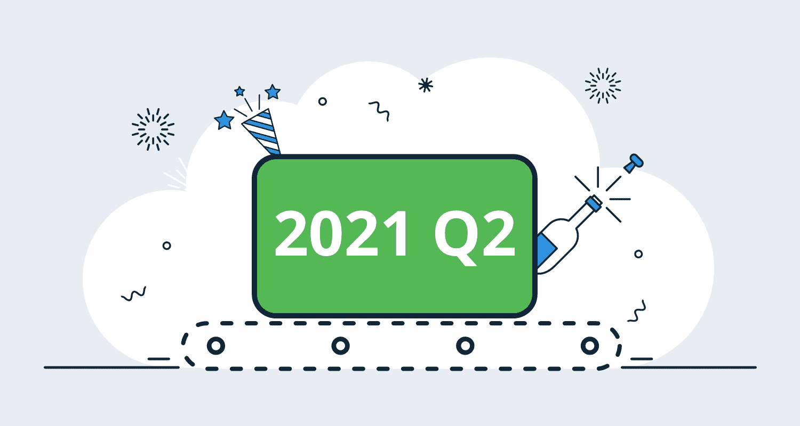
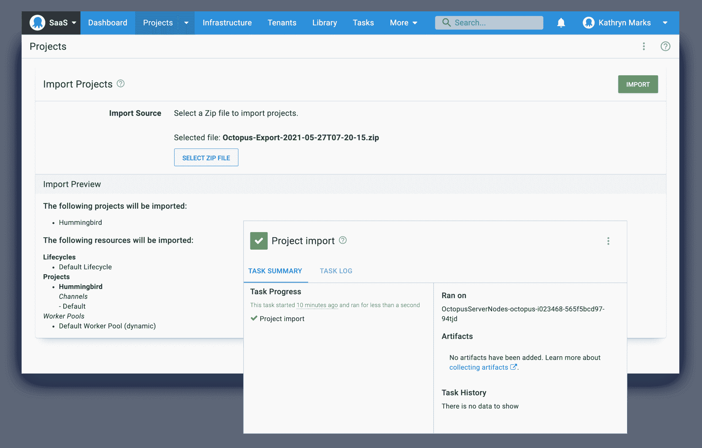
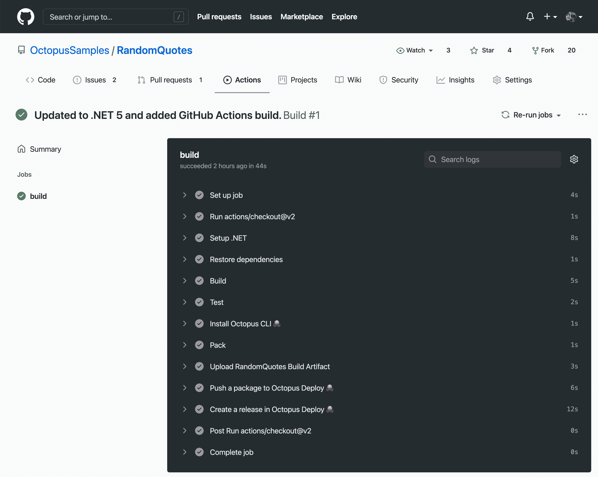
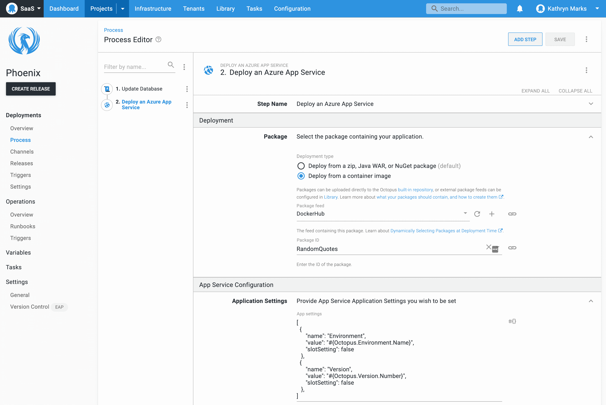

# 八达通 2021 Q2:通过八达通部署迁移到云

> 原文：<https://octopus.com/blog/octopus-release-2021-q2>

Octopus 2021 Q2 版现已推出，可提供更好的云体验。使用此版本，您可以:

*   通过自助导出/导入将 Octopus 项目迁移到 Octopus Cloud。
*   将 Octopus 与 GitHub Actions 和 HashiCorp 的 Terraform 更容易地集成。
*   使用我们改进的 Azure 应用服务步骤部署您的 Azure web 应用。
*   随着需求的增长扩展 Octopus 云:
    *   运行更多并发自动化任务。
    *   利用一流的存储持久保存更多构建和自动化工件。
*   在没有 root 或管理员权限的情况下配置触手代理。

我们的[公开路线图](https://octopus.com/roadmap)概述了今年晚些时候将进行的更多云改进，包括与谷歌云平台(GCP)的集成。

## 包括在 Q2 版本中

*   章鱼服务器 2021.1 ( [发布说明](https://octopus.com/downloads/whatsnew/2021.1))
*   触手 6.1.670
*   Octopus 部署 0.7.36 的平台提供程序

## 长期支持

下表显示了具有长期支持的 Octopus 服务器版本。

| 释放；排放；发布 | 长期支持 |
| --- | --- |
| 八达通 2021.1 | 是 |
| 八达通 2020.6 | 是 |
| 章鱼 2020.5 | 期满 |

## 发布之旅

[https://www.youtube.com/embed/mQIeG3CwhP4](https://www.youtube.com/embed/mQIeG3CwhP4)

VIDEO

## 带有导出/导入项目的自助迁移(早期访问)

[导出/导入项目功能](https://octopus.com/blog/exporting-projects)允许您将项目从一个空间移动到另一个空间。我们给它起了个绰号叫“便当计划”,因为我们的目标是为你的章鱼数据做一个便携的容器。

我们设计 Bento 时考虑了云迁移，以简化将现有项目从内部迁移到 Octopus 云的流程。

项目导出/导入可用于:

*   将项目从自托管的 Octopus 服务器移动到 Octopus Cloud。
*   将多项目空间拆分为多个空间。
*   在同一实例或另一个实例中，将项目从一个空间移动到另一个空间。

该功能处于早期访问，因此可能会有一些粗糙的边缘，但我们已经设计了在出现问题或错误的情况下中止而不进行更改的过程。我们希望您能尝试便当并提供反馈。

在我们的文档中了解更多关于导出和导入项目的信息。

## GitHub 操作

本季度，我们加入了 [GitHub 技术合作伙伴](https://partner.github.com/technology-partners)计划，并成为了 [GitHub 市场](https://github.com/marketplace?type=actions&verification=verified_creator&query=OctopusDeploy)的认证创建者。

我们引入了对 GitHub 动作的本地支持，因此您可以将您的 GitHub 构建和其他自动化流程与您的 Octopus 工作流集成。

到目前为止，我们已经为 Octopus Deploy 发布了四个官方 GitHub 动作，还会有更多。从 GitHub，您现在可以:

在我们的帖子[中了解如何开始发布针对 Octopus Deploy](https://octopus.com/blog/github-actions-for-octopus-deploy) 的 GitHub 操作。

随着时间的推移，我们期待为您带来更多的 GitHub 行动。

## Terraform 集成的改进

今年一月，我们推出了我们的官方平台提供商。

从那时起，我们对提供者本身和 Octopus Deploy 中内置的相关步骤进行了渐进式改进。我们也成为了哈希公司的技术合作伙伴。

了解更多关于[开始使用用于 Octopus Deploy 的 Terraform provider 的信息](https://octopus.com/blog/octopusdeploy-terraform-provider)或阅读[快速入门指南](https://registry.terraform.io/providers/OctopusDeployLabs/octopusdeploy/latest/docs)。

## Azure 应用服务部署

Azure App Service 现在支持很多不同类型的应用(比如。NET、Java 和 Node.js)以及部署和配置它们的各种方法。

我们给 Octopus 增加了一个新的步骤，所以你可以利用这些功能。

**部署 Azure 应用服务**步骤:

*   除了包(zip、NuGet 和 Java war 文件)之外，还部署容器映像。
*   跨平台运行，因此它适用于在 Linux 上自托管 Octopus 服务器的客户。
*   将应用部署到 Linux 应用服务计划，无需晦涩的配置设置。
*   配置 Azure 应用设置和连接字符串。
*   执行配置文件转换。

我们向在 [Clear Measure](https://clearmeasure.com/) 的朋友们致敬，感谢他们帮助我们开发 Azure 应用服务部署的这些改进。

在我们的帖子[中了解如何开始改进 Azure 应用服务部署](https://octopus.com/blog/azure-app-service-step)。

## 章鱼云的改进

我们改进了 Octopus Cloud 的计算和存储能力，因此它可以随您扩展。付费计划的客户将享受以下优惠:

*   同类最佳的 CI/CD 文件存储。您可以存储高达 1 TB 的包、工件和任务日志。
*   随着业务规模的扩大，运行更多并发自动化任务的能力。

所有付费客户都将获得该版本增加的存储空间。

我们还在编写迁移指南，以支持您的云计算之旅。本系列的第一个指南[描述了如何将 ASP.NET web 应用从 IIS 内部迁移到 Azure 应用服务。](https://octopus.com/blog/iis-to-azure-app-service)

## 注册触手代理

触手代理现在与高安全性、低信任环境更加兼容。

从触手版本 6.1.648，您可以通过 Octopus CLI 配置触手代理，而无需 root 或管理员权限。

[create-instance](https://octopus.com/docs/octopus-rest-api/tentacle.exe-command-line/create-instance) 命令现在可以在当前工作目录下创建触手配置文件，而不需要访问共享注册表。触手实例的后续命令，如 [configure](https://octopus.com/docs/octopus-rest-api/tentacle.exe-command-line/configure) ，直接从该位置运行，无需提升权限。

你可以在我们的文档中了解更多关于[无根实例创建](https://octopus.com/docs/infrastructure/deployment-targets/windows-targets/automating-tentacle-installation#rootless-instance-creation)的信息。

## 重大变化

这个版本包括一个突破性的变化。

### 更改为支持 Windows Docker 图像

我们已经弃用了 **Octopus Server** 和 **Octopus CLI** 的 Windows Docker 镜像，因为客户接受度很低，微软不再支持我们发布的操作系统版本(Windows [1809](https://docs.microsoft.com/en-us/windows/release-health/status-windows-10-1809-and-windows-server-2019) 、 [1903](https://docs.microsoft.com/en-us/lifecycle/announcements/windows-10-1903-end-of-servicing) 和 [1909](https://docs.microsoft.com/en-us/windows/release-health/status-windows-10-1909) )。

我们鼓励客户使用 Linux Docker 映像。Octopus Server 和 Octopus CLI 的现有 Windows 映像将仍然可以从我们的 [Docker Hub 存储库](https://hub.docker.com/r/octopusdeploy/octopusdeploy)中获得，但那些标记为`latest`的映像将不再适用于 Windows。关于从 Windows 容器迁移到 Octopus Server Linux 容器的指南，请参见我们的文档。

Octopus CLI 可作为 exe、. NET 核心全局工具或通过 chocolatey 获得。请参考我们的[下载页面](https://octopus.com/downloads/octopuscli)。

我们将继续发布**触手**的 Windows Docker 图片。一旦我们将触手的映像更新到 Windows 2019 和 Windows 20H2，我们将废弃现有的 Windows 1809/1903/1909 容器。

## 升级或开始

章鱼云用户已经在运行这个版本，自托管章鱼客户现在可以[下载最新版本](https://octopus.com/downloads/2021.1.0)。

我们鼓励你回顾一下升级 Octopus 服务器的[步骤。更多信息请参见](https://octopus.com/docs/administration/upgrading)[发行说明](https://octopus.com/downloads/compare?to=2021.1.0)。

### 开始您的云之旅

如果您以前从未使用过 Octopus Cloud，[注册一个支持 10 个部署目标的免费帐户](https://octopus.com/start)，或者[向我们的销售团队发送电子邮件](mailto:sales@octopus.com)观看演示并了解更多信息。

## 未来的版本中会有什么？

我们正在投资 Octopus Cloud，以支持您的云迁移计划。Q2 版本是持续努力的基础，旨在:

*   提供更流畅的云迁移体验。
*   提高章鱼云的可扩展性和能力。
*   在 Octopus 和 CI/CD 工具之间建立新的和改进的集成。

查看我们的[公共路线图](https://octopus.com/roadmap)，了解最新消息并注册更新。

## 结论

章鱼 2021 Q2 提供更好的云体验。

现在，您可以导出/导入项目，随着需求的增长扩展 Octopus 云，利用 Azure 应用服务功能，并更轻松地将 Octopus 与 GitHub Actions 和 Terraform 集成。

请在这里或我们的[社区 Slack](https://octopus.com/slack) 发表评论，让我们知道您的想法。

## 观看网络研讨会

[https://www.youtube.com/embed/Dm4vOwuo9GI](https://www.youtube.com/embed/Dm4vOwuo9GI)

VIDEO

我们定期举办网络研讨会。请参见[网络研讨会页面](https://octopus.com/events)了解过去的网络研讨会和即将举办的网络研讨会的详细信息。

愉快的部署！