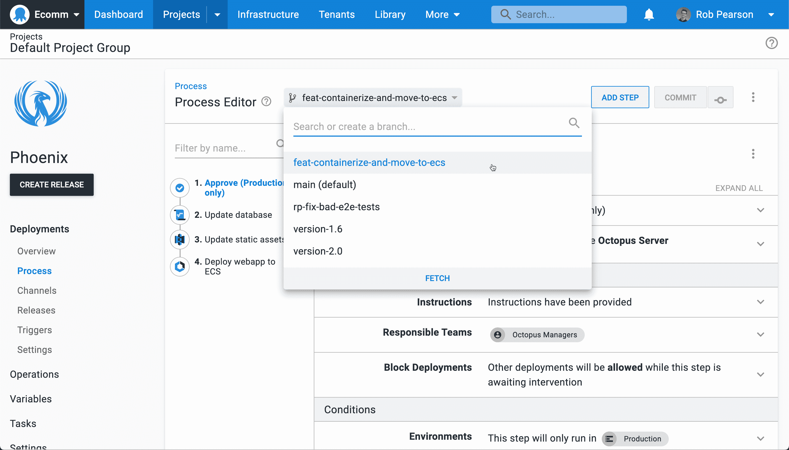
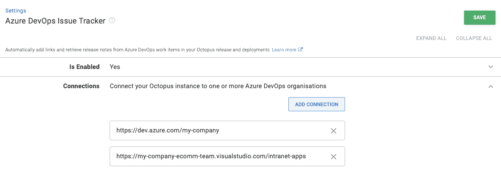
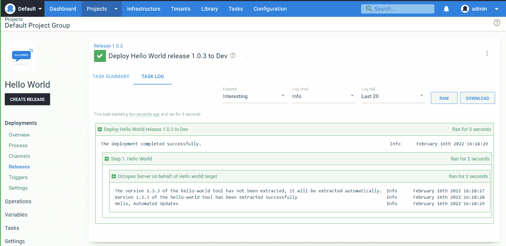

# 章鱼 2022 Q1:配置为部署代码-章鱼部署

> 原文：<https://octopus.com/blog/octopus-release-2022-q1>

章鱼 2022 Q1 版现已发售。

我们很高兴分享这种配置作为代码(配置作为代码)部署是普遍可用的。您可以创建受版本控制的项目，并在应用程序代码旁边的 Git repo 中查看您的部署过程，并一起发展它们。

我们相信我们不折不扣的解决方案是最好的“代码”实现之一。Octopus 中的 Config as 代码提供了 Git(分支、提交和历史)的能力和 Octopus UI 的可用性。Octopus Cloud 上提供了 Config as 代码，可供我们的自助客户下载。

此版本还包括其他值得注意的更新:

*   带有 Octopus 配置语言(OCL)语法突出显示、代码片段和导航树的 Visual Studio 代码扩展
*   更新了 Terraform 提供程序，支持版本控制项目
*   新集成:
    *   Buildkite 插件(早期访问)允许您的构建代理创建和部署版本，推送构建信息，并作为管道的一部分运行 runbooks
    *   通过集成，您可以将 Octopus 连接到其他 DevOps 工具，无需代码自动化
    *   Octopus 现在支持连接到多个组织
    *   用最新的 Log4j 安全补丁更新了 [TeamCity](https://www.jetbrains.com/teamcity/) 插件
*   使用我们的下一代步骤包框架构建的自动步骤更新和步骤发现
*   Octopus Deploy 收购了 Dist 技术

## 包括在 Q1 版本中

*   章鱼服务器 2022.1 ( [发布说明](https://octopus.com/downloads/whatsnew/2022.1))
*   Octopus 为 Visual Studio 部署代码 0.0.17
*   Azure DevOps 插件 5.0.57
*   用于 Octopus Deploy 6.1.12 的团队城市插件
*   触手 6.1.1320
*   Octopus 部署 0.7.69 的 Terraform 提供程序

## 长期支持

下表显示了具有长期支持的 Octopus 服务器版本。

| 释放；排放；发布 | 长期支持 |
| --- | --- |
| 八达通 2022.1 | 是 |
| 八达通 2021.3 | 是 |
| 章鱼 2021.2 | 期满 |

## 配置为代码演示

[https://www.youtube.com/embed/tHdAsY_7CqA](https://www.youtube.com/embed/tHdAsY_7CqA)

VIDEO

## 配置为 Octopus 中的代码

[](#)

当您为项目启用 Config as Code 时，您可以像往常一样继续使用 Octopus UI，或者您可以在您喜欢的编辑器中编辑文本文件。在你效率最高的地方工作。

配置为代码一直是我们的客户的最大要求之一。在 2021 年 12 月发布[早期访问预览版后，您的反馈使我们能够在正式发布前进一步调整它。](https://octopus.com/blog/config-as-code-eap)

我们设计了我们的解决方案来[避免关键的反模式](https://octopus.com/blog/shaping-config-as-code#anti-patterns)，包括错误的配置文件格式、作为简单数据库的 Git，以及如果您选择将 Config 作为代码支持，则完全禁用 UI。

## 将配置用作代码的客户

[Stack Overflow](https://stackoverflow.com) 和 [Recruit Wizard](https://recruitwizard.com.au) 已经在早期访问中使用 Config 作为代码，并分享了关于它如何改进他们的开发工作流程的反馈。

> 它使我们能够将配置代码作为标准。构建管道在软件回购中。部署管道在软件报告中。我们可以做一次公关，我可以改变软件，改变它的构建和部署方式。

- Chris Hunt，StackOverflow 的员工现场可靠性工程师

[阅读更多](https://i.octopus.com/case-studies/stack-overflow-case-study-2022.pdf)关于 Stack Overflow 如何使用 Octopus Deploy 和 Config 作为代码。

> 将配置分支为代码允许我们在修改代码的同时修改部署过程。这是一个绝对的游戏改变者，尤其是当我们在团队中加入越来越多的工程师时。

-本·麦克弗森，招聘向导的首席技术官

[阅读更多](https://i.octopus.com/case-studies/recruit-wizard-case-study-2022.pdf)关于招聘向导如何使用 Octopus Deploy 和 Config 作为代码。

## 为什么使用配置作为代码？

### 对代码和部署进行分支

[](#)

分支是 Git 的超能力，我们公开这种能力。使用 Config 作为代码，您可以:

*   在 Octopus UI 或您喜欢的 Git 客户端中切换分支，或者创建新的分支
*   在分支上提交对部署流程的更改
*   当您更改您的部署过程时，添加(可选)提交消息，以便其他人了解它为什么更改
*   从您的分支创建发布，并部署以测试您的更改，以支持您的部署过程的许多版本
*   安全地发展您的部署，无需担心破坏其他团队的部署
*   如果出现问题，回滚到部署过程的前一个版本

### 审阅、批准和合并

[](#)

在部署到生产环境之前，检查、批准和合并您的分支。让更多人关注变化总是一件好事。

拉请求、受保护的分支和代码所有者启用了一组新的工作流来提高您的发布的质量和安全性。减少不良部署造成的停机时间，并提高发布的质量。

### 审计和可追溯性

[](#)

提交历史改进了对部署过程的变更的可追溯性。知道什么改变了，什么时候，由谁改变的，最重要的是为什么。

不再需要通过搜索审计日志来找出配置更改的原因。Git 历史和差异提供了清晰的可追溯性，并讲述了完整的故事。Octopus 甚至在 Git 历史中记录提交者的详细信息。

### 共享 Git 凭据

[](#)

从单个视图中重用和管理受版本控制的项目的 Git 凭证，从而更容易更新令牌并查看它们的使用情况。

### 跨团队扩展您的部署

从分支创建发布，并独立于其他分支部署您的更改。这允许您支持部署过程的多个版本。您可以安全地发展您的部署，而不用担心破坏其他团队的部署。如果出现问题，您还可以回滚到部署过程的前一个版本。

* * *

虽然 Config as Code 的第一个版本只包括部署过程，但我们正在努力增加对版本控制变量和 runbooks 的支持。我们还想更新 OCL 模式，使其更便于手工编辑。

阅读我们的文档来学习如何创建你的第一个版本控制项目。

## 具有 OCL 突出显示、代码片段和导航树的 Visual Studio 代码插件

[](#)

[Octopus Deploy for Visual Studio Code](https://marketplace.visualstudio.com/items?itemName=octopusdeploy.vscode-octopusdeploy)是一个免费的扩展，使得使用 Octopus 配置语言(OCL)文件更加容易。功能包括:

*   语法突出显示
*   步骤和操作的代码片段
*   在文件中导航节点的集成树视图

在更新和错误修复之后，我们的 VS 代码扩展现在已经可以投入生产了。

[安装 Octopus Deploy for Visual Studio 代码](https://marketplace.visualstudio.com/items?itemName=octopusdeploy.vscode-octopusdeploy)。

## Terraform Provider 支持配置为代码

我们在 2021 年初推出了我们的[平台提供商](https://registry.terraform.io/providers/OctopusDeployLabs/octopusdeploy/)，它越来越受欢迎。我们的提供商有超过 400，000 次安装，来自 Octopus 社区的贡献也在增长，用户通过 GitHub 问题报告错误，并通过 pull 请求提交更改。

在这个版本中，我们添加了对在 HCL 中配置版本控制项目的支持。有了对 Config as Code 的支持，我们添加了 Git 持久性设置，指定了默认的分支、URL、凭证等等。这允许您在配置 Octopus 实例时使用 Config as 代码特性，比如分支。

以下示例突出显示了最新的更新:

```
terraform {
  required_providers {
    octopusdeploy = { ... }
  }
}

resource "octopusdeploy_project_vcs" "test-project-123" {
  name                              = "test-project-name"
  lifecycle_id                      = octopusdeploy_lifecycle.test-lifecycle.id
  project_group_id                  = octopusdeploy_project_group.test-project-group.id
  space_id                          = var.space_id

  git_persistence_settings {
    # base_path
    # default_branch
    url = var.github_url

    credentials {
      password = var.github_pat
      username = var.github_username
    }
  }
}

resource "octopusdeploy_project" "test-project-321" {
  name                              = "test-project-name"
  lifecycle_id                      = octopusdeploy_lifecycle.test-lifecycle.id
  project_group_id                  = octopusdeploy_project_group.test-project-group.id
  space_id                          = var.space_id
}

resource "octopusdeploy_deployment_process" "test-deployment-process-main" {
  branch     = "main"
  project_id = octopusdeploy_project.test-project.id

  step {
    name         = "Hello Main Branch"
    target_roles = ["role 1"]

    run_script_action {
      script_body = "Hello from the main branch!"
      name        = "This is from the action."
    }
  }
}

resource "octopusdeploy_deployment_process" "test-deployment-process-main" {
  branch     = "secondary"
  project_id = octopusdeploy_project.test-project.id

  step {
    name         = "Hello Secondary Branch"
    target_roles = ["role 1"]

    run_script_action {
      script_body = "Hello from a different branch!"
      name        = "This is from the action."
    }
  }
} 
```

[了解关于 Octopus Deploy Terraform provider 的更多信息](https://registry.terraform.io/providers/OctopusDeployLabs/octopusdeploy/)。

## 新集成

### Buildkite 插件(早期访问)

[](#)

章鱼部署现在与 [Buildkite](https://buildkite.com/) 整合。我们新的 Buildkite 插件允许您的构建代理创建和部署版本，推送构建信息，并作为管道的一部分运行 runbooks。

通过我们的 Buildkite 插件的集成代表了我们最初的设计和发布。我们计划构建额外的插件，并通过 Bash 脚本提供集成来消除对 Octopus CLI 的依赖。

[了解更多关于我们的 Buildkite 插件的信息](https://octopus.com/blog/introducing-buildkite-integration)。

### 与 Opsera 的无代码 DevOps 集成

【T2 

我们与 Opsera 合作，提供与 Octopus Deploy 的集成。您可以将 Octopus 与 Opsera 支持的 95+平台集成，作为其无代码 DevOps 编排平台的一部分。

自动化您的 CI/CD 渠道是一项挑战，尤其是在使用不同的解决方案时。Opsera 提供自助服务平台，帮助您实现 CI/CD 渠道的自动化。您可以通过可视化界面来创建具有统一洞察力的声明性管道。

启用后，Opsera 的集成通过其管道 UI 提供对 Octopus Deploy 中定义的资源的访问，如通道、环境、生命周期、项目、空间和租户。

[阅读我们的公告博客文章](https://octopus.com/blog/opsera-integration-with-octopus-deploy)以了解关于 Opsera 与 Octopus 集成的更多信息。

您还可以通过参加 2022 年 4 月 12 日(星期二)的免费网络研讨会[了解更多信息。](https://www.opsera.io/events/opsera-and-octopus-integration)

### 将 Octopus 连接到您的所有 Azure DevOps 组织

[](#)

如果您的公司有多个 Azure DevOps 组织，您现在可以将 Octopus 连接到所有这些组织。当我们构建将构建信息与包相关联的功能时，我们没有计划让客户访问多个 Azure DevOps 组织。我们只添加了对关联单个 Azure DevOps 组织的支持。

在此版本中，我们解决了这一限制，您可以选择配置多个 Azure DevOps 组织 URL。这一更新意味着 Octopus 可以显示来自多个 Azure DevOps 组织的工作项，作为发布创建的一部分或在查看包元数据时。

要在 Octopus 中配置多个 URL，请前往**配置➜设置➜ Azure DevOps 问题跟踪器**。

[了解更多关于使用 Octopus 扩展的信息](https://octopus.com/docs/packaging-applications/build-servers/tfs-azure-devops/using-octopus-extension)。

### 团队城市八达通部署集成更新

我们更新了我们的[团队城市插件](https://plugins.jetbrains.com/plugin/9038-octopus-deploy-integration)，使用最新版本的 [Log4j](https://logging.apache.org/log4j/) 来解决最新的安全漏洞。

## 自动化步骤更新和发现

[](#)

我们一直在悄悄地为构建新的自动化步骤开发下一代框架，我们称之为步骤包框架。我们用新的框架构建了我们的 [Amazon ECS 部署支持](https://octopus.com/docs/deployments/aws/ecs)，并且我们将继续增强它。

在这个版本中，我们使用我们的新框架为内置步骤引入了一个更新服务。这使得无需升级 Octopus 服务器或 Octopus 云实例就能更容易地获得更新和错误修复。Octopus 还可以通过这项新服务发现和下载新的步骤。同样，这允许您在不升级 Octopus 服务器的情况下添加新的 Octopus 步骤。

上面的屏幕截图显示了一个示例“Hello world”步骤的升级过程。

## 八达通部署收购区

Octopus 收购了 [Dist](https://www.dist.cloud/) ，这是一个快速可靠的容器和 Java 工件存储库。Octopus 内置了各种包格式的包存储库，但它不支持容器图像。我们正在探索 Dist 团队的技术和专业知识如何帮助我们为低延迟、安全和集成的容器注册添加这一功能。

[在 Paul Stovell 的博客文章](https://octopus.com/blog/octopus-acquires-dist)中了解更多信息。

## 重大变化

此版本包含一个突破性的变化:

**配置为代码 API URLs 重命名**

我们对相关链接集合中的一些 Config as Code API URLs 和 key 做了一些小的修改。这些更改只会影响受版本控制的项目，并且只有在您直接使用 URL 时才会引起问题。

在 [GitHub 问题](https://github.com/OctopusDeploy/Issues/issues/7376)中了解更多关于这一变化的信息。

## 升级或开始

章鱼云用户已经在运行这个版本了。自托管八达通客户可以从我们的网站下载最新版本。

[下载章鱼 2022.1](https://octopus.com/downloads/)

我们鼓励你回顾一下升级 Octopus 服务器的[步骤。更多信息请参见](https://octopus.com/docs/administration/upgrading)[发行说明](https://octopus.com/downloads/whatsnew/2022.1)。

如果你以前从未使用过 Octopus，[注册](https://octopus.com/start)免费试用，或者[给我们的销售团队](mailto:sales@octopus.com)发电子邮件观看演示并了解更多信息。

## 未来的版本中会有什么？

查看我们的[公共路线图](https://octopus.com/roadmap)以了解最新消息并注册更新。

## 结论

Octopus 2022 Q1 提供了 Octopus 中 Config as 代码的第一个里程碑，以及我们的 Visual Studio 代码插件的生产就绪版本，具有 OCL 突出显示、代码片段和导航树。这个版本还包括大量新的和更新的集成。

我们期待看到我们的客户使用版本控制项目。我们将继续向我们的配置代码解决方案添加更多功能。

我们欢迎您提出任何问题或意见。你可以在下面留下反馈，或者加入我们的[章鱼社区 Slack](https://octopus.com/slack) 的讨论。

我们还邀请您观看我们的[免费网络研讨会，介绍 Octopus](https://octopus.com/events/introducing-config-as-code-in-octopus) 中作为代码的配置。

愉快的(版本控制的)部署！