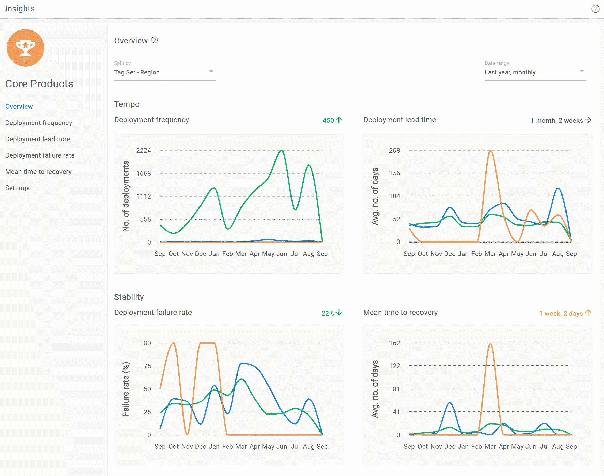

# Octopus 2022 Q3:安全、可靠、可审计的管道——Octopus 部署

> 原文：<https://octopus.com/blog/octopus-release-2022-q3>

Octopus 2022 第三季度发布现已推出。

这个版本增加了对版本控制项目的版本控制变量的支持，以便更完整地实现我们在三月份发布的的 [Config as Code 解决方案。](https://octopus.com/blog/octopus-release-2022-q1)

我们还有许多其他新功能，可以帮助您构建安全、可靠、可审计的“As Code”CI/CD 管道。其中包括与我们的 ServiceNow 和吉拉服务管理集成的 ITSM 变更管理，以及内置的 DevOps 报告。

随着组织不断现代化，安全可靠地审计 CI/CD 管道变得越来越重要。您需要监控和保护您的部署，并且您的团队需要使用工具进行可靠的扩展，以便在发布从部署到测试和生产的过程中进行协作。

此版本值得注意的更新包括:

*   作为版本控制项目的代码版本控制变量
*   ITSM -立即为服务进行无摩擦的管理变革
*   吉拉服务管理-高效的变更管理批准(早期访问)
*   DevOps Insights - DORA insights 用于量化价值和改进(早期访问)
*   针对 Octopus Deploy v2 的 GitHub 操作
*   更简单的云目标发现设置

这些功能共同支持您部署的协作、可扩展性和安全性。

2022 年第三季度版本在 Octopus Cloud 上提供，可供我们的自助客户下载。

## 包括在第 3 季度发行版中

*   章鱼服务器 2022.3 ( [发布说明](https://octopus.com/downloads/whatsnew/2022.3))
*   触手 6.2.50
*   插件和工具
    *   为团队城市 6.1.14 部署 Octopus
    *   Octopus 为 Visual Studio 部署代码 0.1.4
    *   用于 Octopus Deploy 0.8.1 的 Terraform Provider
    *   Octopus Deploy for 吉拉服务管理 1.0.9-AC(现已向吉拉服务管理云客户提供)
    *   章鱼为竹子部署 2.4.5

## 长期支持

下表显示了具有长期支持的 Octopus 服务器版本。

| 释放；排放；发布 | 长期支持 |
| --- | --- |
| 八达通 2022.3 | 是 |
| 八达通 2022.2 | 是 |
| 八达通 2022.1 | 期满 |

## 配置为代码-版本控制您的部署过程和配置

Octopus 2022 Q3 建立在我们的 [2022 Q1 版本](https://octopus.com/blog/octopus-release-2022-q1)的基础上，增加了版本控制变量，以进一步改善您的开发工作流程。您可以在部署流程和应用程序代码的同时改进配置变量和基础设施设置。

通过版本控制的部署流程和变量，Octopus 提供了安全、可靠、可审计的“As Code”部署管道。这使您的团队能够按照公司的法规要求和合规性政策开展工作，从而使审计过程更加顺畅。

【T2 

*   **可追踪的端到端 CI/CD“As Code”管道** - Octopus 为各种 CI 服务器提供内置插件，便于集成。您可以将 Octopus 与支持构建定义作为代码的 CI 服务器配对，为您提供对软件开发过程变更的完全可追溯性。对构建和部署管道的更改可以通过相同的拉请求审查和批准过程，从而提高管道的稳定性和可靠性。
*   **一致的流程和批准**——通过使用拉式请求工作流来审查和批准变更，提高代码质量并满足合规性要求。一致的过程有助于高质量的发布，并且您可以强制执行策略，以便未批准的变更不会被合并。
*   **可追踪的变更集**——通过结合使用拉请求差异和详细的审计日志，清晰地了解变更集。Octopus 对发生的所有事情都有完整的审计记录，包括详细的日志和过滤器。查看谁在何时更改了什么，以帮助解决版本问题。使用源代码控制提交和 Git 差异捕获更多细节，向您显示对流程和配置设置所做的确切更改。
*   **灾难恢复**——备份和恢复 Git 中的用户管道。如果需要，回滚更改可以更容易地从发布中断中恢复。

### 配置为代码演示

[https://www.youtube.com/embed/lRLKt6b4uxE](https://www.youtube.com/embed/lRLKt6b4uxE)

VIDEO

### 客户受益于配置即代码

我们有数百个客户在 Octopus 中使用 Config 作为代码，包括 StackOverflow 和 Recruit Wizard。

> Config as Code 允许我们为我们所做的每一种改变创建我们想要的工作流。它为版本控制部署带来了最有价值的部分，也就是它允许用户拥有的迭代过程(通过分支)。
> 
> *Chris Hunt，员工现场可靠性工程师-堆栈溢出*

> 将配置分支为代码允许我们在修改代码的同时修改部署过程。这是一个绝对的游戏改变者，尤其是当我们在团队中加入越来越多的工程师时。
> 
> *首席技术官——招聘向导本·麦克弗森*

## ServiceNow 轻松改变管理

【T2 

ServiceNow 集成将 Octopus 部署链接到 ServiceNow 变更请求，并自动创建预填充的正常变更请求。

您获得了开箱即用的改进的可跟踪性，并且您可以向审计人员证明每个受控的部署都有一个变更请求。这确保您的 CI/CD 和发布管理流程符合公司政策和法规。

### 我们的 ServiceNow 支持包括哪些内容？

*   简单的工作流程配置，因此很容易将 Octopus 与 ServiceNow 集成。
*   将部署链接到现有的更改请求，以便您可以手动将部署与更改请求相关联。
*   在部署时自动创建普通的变更请求。Octopus 暂停部署，直到批准完成。
*   创建变更请求后，使用 Octopus 自动完成变更请求阶段之间的转换，在 ServiceNow 中留下部署记录。
*   使用变更模板自动创建标准变更请求，以减少手动工作并控制要填充的信息。
*   确保现有变更请求遵循“变更窗口”,以便在指定的时间窗口之前不会执行部署。
*   向变更请求添加工作注释，其中包含有关部署开始和完成时间以及部署是否成功的信息。
*   查看和导出受控部署的审核日志，以便轻松实现合规性和部署后协调。

了解有关我们的 [ServiceNow 集成](https://octopus.com/docs/approvals/service-now)的更多信息。

## 借助吉拉服务管理实现高效的变更管理审批(提前访问预览)

基于我们的 ITSM 变更管理支持，我们的吉拉服务管理集成作为早期访问预览版(EAP)提供。这种集成将 Octopus 部署与吉拉服务管理变更请求联系起来，使大规模管理部署管道变得更加容易。它减少了手动填写变更请求的需要，从而加快了流程并减少了错误。

了解有关我们的[吉拉服务管理集成](https://octopus.com/docs/approvals/jira-service-management)的更多信息。

### 我们的吉拉服务管理支持包括什么？

*   简单的工作流程配置，因此可以直接将 Octopus 与吉拉服务管理集成。
*   将部署链接到现有的更改请求，以手动将部署与更改请求相关联。
*   在部署时自动创建“变更请求”请求。Octopus 暂停部署，直到相应的批准完成。
*   查看和导出受控部署的审核日志，以便轻松实现合规性和部署后协调。
*   提高了开箱即用的可追溯性，以确保您的 CI/CD 和发布管理流程符合公司政策和法规。

如果您的团队使用吉拉服务管理变更管理，我们希望您能尝试一下并提供您的反馈。

[注册吉拉服务管理 EAP。](https://octopusdeploy.typeform.com/jsm-eap)

## DevOps 洞察:更好的可见性和可操作的 DORA 指标(早期访问预览)

Octopus 中的 DevOps Insights(早期访问)通过展示基于 [4 个关键 DORA 指标](https://octopus.com/docs/insights)的见解，让您更好地了解贵公司的 DevOps 绩效。这些指标有助于您确定开发运维绩效的结果，并深入了解需要改进的地方。

*   更好地了解您的项目和团队的绩效。
*   消除“直觉”，使用数据推动改进，并确定新流程是否有效。
*   随着时间的推移审查和收集数据，以突出更快提供更大价值的途径。
*   通过数据和协作帮助引入变革，以形成业务案例。
*   分享成功，从失败中学习，不断改进。

DevOps Insights 有两个级别:

*   项目级洞察:对所有客户可用
*   空间级洞察:面向企业客户

项目级洞察作为每个项目中的一个新标签，可供所有客户开箱即用。如果你已经是一个用户，Octopus 有它需要的所有数据来帮助你发现基于你的部署历史的丰富见解。

了解如何在我们的文档中使用[项目级见解。](https://octopus.com/docs/insights)

### 跨项目和团队的洞察力，具有空间级别的洞察力

【T2 

此版本包括针对企业客户的更多见解。空间层面的见解:

*   在您的空间中汇总数据，以便您可以跨项目比较指标，确定哪些有效，哪些无效
*   为更好的决策提供信息:发现问题，跟踪改进，庆祝成功
*   根据数据显示的实际情况，帮助您量化 DevOps 性能

进一步了解[空间层次洞察力如何帮助您的团队做出更好的决策](https://octopus.com/docs/insights)。

### DevOps Insights Alpha 计划的客户反馈

一些客户参与了我们的 DevOps Insights Alpha 计划，我们感谢他们的宝贵时间和反馈。他们帮助成千上万的其他客户设计了这个功能。

> 我们使用了 DevOps Insights Alpha 程序，发现它非常有用。这些见解为我们的团队提供了易于获取的具体数据，有助于验证我们的假设并做出决策。它们提供了与决策者分享的证据，并使管理者一眼就能找到他们需要的信息。
> 
> *Leslie Brody，IMO 首席现场可靠性工程师*

## 针对 Octopus Deploy v2 的 GitHub 操作

我们更新了 Octopus Deploy 的 GitHub 操作:

此版本还带来了许多更新，包括:

*   通过基于 SemVer 的标签提高了主要更新、次要更新和补丁更新的可用性
*   更简单的输入，合理的默认值和每个动作更少的输入参数
*   利用环境变量作为动作的输入参数
*   增加了对敏感值环境变量的支持(如 API 键)
*   通过降价运行生成的作业摘要(见下文)

### 工作摘要

作业摘要是使用定制的 GitHub 风格的 Markdown 生成的，我们通过 Create Release 和 Push Package GitHub 操作发出这个 Markdown。

像这样的动作输出以前仅限于日志和注释，很难对大量信息进行聚合和分组。该功能增强了用户体验。

### 推送构建信息

这个版本引入了一个新的 GitHub 动作:[推送构建信息](https://github.com/marketplace/actions/push-build-information-to-octopus-deploy)。这个 GitHub 动作允许您向 Octopus 提供详细的提交、构建和发布跟踪信息，这些信息可以作为发行说明出现。

您可以使用该特性与每个生产部署的利益相关者共享发行说明。当试图隔离特定版本中引入的 bug 时，您还可以跟踪从部署到构建和提交的链接。

了解有关[构建信息和问题跟踪](https://octopus.com/docs/packaging-applications/build-servers/build-information)的更多信息。

## 更简单的云目标发现设置

我们简化了云连接的配置，因此您可以部署到 Azure、AWS 和 Google Cloud。现在，您可以直接在部署流程编辑器中配置云连接。这意味着您可以通过更少的点击来配置和选择适当的云帐户设置。配置完成后，您也会收到通知。

了解有关如何[配置云连接](https://octopus.com/docs/infrastructure/deployment-targets/cloud-target-discovery)的更多信息。

## 重大变化

此版本包含 3 个突破性的变化:

### 创建和查看发布时对外部提要的请求减少

过去，Octopus 在创建发布时会执行包搜索来检索发布日期。这可能导致在检索此信息时发布创建被阻止，从而导致延迟。

我们做了一些小的改动，以减少在创建和查看发布时对外部提要的请求数量。

在 [GitHub 问题](https://github.com/OctopusDeploy/Issues/issues/7673)中了解更多关于这一变化的信息。

### 更新 OCL，通过 slugs 而不是名称来引用共享资源

当 Config as Code 启动时，Git 项目使用它们的名称引用共享资源。这也意味着来自 Git 项目的 API 响应包括名称而不是 id。

我们不再使用名字，而是将 slugs 引入 OCL，并将 id 带回 Git 项目的 API。

有了这个改变，Git 项目可以使用它们唯一的 slug 而不是它们的名字来引用来自 OCL 的共享资源。

当通过 API 返回结果时，Octopus Server 会将这些 slugs 转换为资源 id，允许(大多数)脚本在数据库和 Git 项目之间重用，而无需考虑名称和 id。

在 [GitHub 问题](https://github.com/OctopusDeploy/Issues/issues/7645)中了解更多关于这一变化的信息。

### 受更新的 ServiceNow 批准缓存影响的现有变更控制部署

ServiceNow 审批缓存已更新，每个人都可以使用该功能。如果您当前正在使用 Octopus ServiceNow 集成，并且在升级到 2022.3 时部署正在等待批准，则它们将无法退出“排队”状态，也不会运行。升级后，需要手动终止并重新启动现有的变更控制部署。

或者，请确保在安装升级之前，所有现有的受更改控制的部署都已执行完毕。

在 [GitHub 问题](https://github.com/OctopusDeploy/Issues/issues/7760)中了解更多关于这一变化的信息。

## 升级或开始

章鱼云用户已经在运行这个版本了。自托管八达通客户可以从我们的网站下载最新版本。

[下载章鱼 2022.3](https://octopus.com/downloads/)

我们鼓励您回顾升级 Octopus 服务器的[步骤。更多信息请参见](https://octopus.com/docs/administration/upgrading)[发行说明](https://octopus.com/downloads/whatsnew/2022.3)。

如果您以前没有使用过 Octopus，[注册](https://octopus.com/start)免费试用，或者[发送电子邮件给我们的销售团队](mailto:sales@octopus.com)观看演示并了解更多信息。

## 未来的版本中会有什么？

查看我们的[公共路线图](https://octopus.com/roadmap)以了解最新消息并注册更新。

## 结论

Octopus 2022 Q3 提供了支持安全、可靠和可审计的“As code”CI/CD 管道的新功能。Octopus 2022 Q3 建立在我们 Q1 版本的基础上，增加了版本控制变量。这个版本还包括许多支持现代 DevOps 团队的附加特性。

我们将继续为我们的配置代码解决方案添加更多功能，并期待看到更多添加了变量的版本控制项目。

愉快的部署！